# Instalación y paso a paso de motores de base de datos

## Página web del docente

Escribo aquí la dirección de la página web del docente:

https://tecnogua.com/academic/site/bd/introduccion/

## Entorno de trabajo

A diferencia de la guía del docente, que trabajo sobre WSL2, yo realicé toda la instalación sobre una máquina virtual con Ubuntu Desktop/Server, creada en VirtualBox, con Docker instalado directamente dentro de esa VM. Esto cambia algunos detalles puntuales que dejo aclarados desde ya:

* No existe una ruta tipo `/mnt/d/...` (esa es exclusiva de WSL para acceder al disco de Windows). Mis carpetas de backups las creo dentro de la propia VM, en `~/ia-lab/backups/`.
* La tarjeta de red de la VM terminó configurada en modo **NAT con redirección de puertos (Port Forwarding)** en VirtualBox, tras un incidente con el modo Bridged que detallo en el registro más abajo.
* El resto del procedimiento (Docker, Docker Compose, `docker-compose.yml`, `.env`, `README.md`, backups) es igual que en WSL, porque en ambos casos es Ubuntu corriendo Docker.
* Para evitar escribir todos los comandos a mano dentro de la consola de VirtualBox, trabajo conectado a la VM por **SSH** desde una terminal de Windows (PowerShell), lo que permite copiar y pegar los comandos normalmente.

**Evidencia (imagen):**

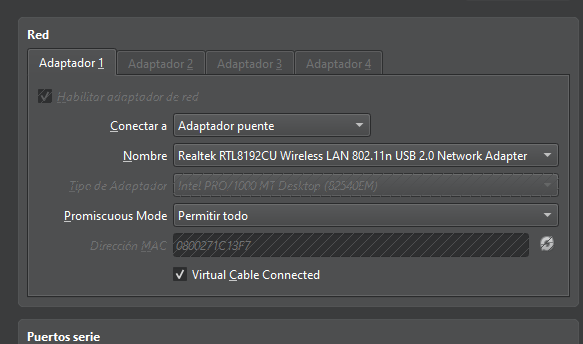

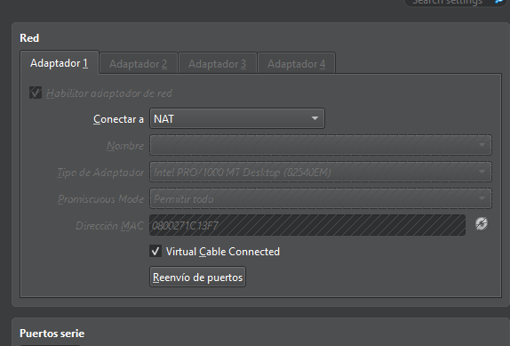

**Registro:**

Instalé **Ubuntu 26.04 LTS** en la máquina virtual, asignándole **2 GB de RAM y 2 núcleos** de CPU.

Inicialmente intenté configurar el Adaptador 1 en modo **Bridged**: primero apuntando a mi tarjeta Ethernet ("TP-Link Gigabit PCI Express Adapter"), pero como mi equipo se conecta a internet por WiFi, la VM no lograba obtener IP por DHCP (timeout de conexión). Cambié el campo "Nombre" del adaptador puente a mi tarjeta WiFi real y activé el Modo Promiscuo en "Permitir todo"; también tuve que resolver un conflicto entre `systemd-networkd` y `NetworkManager` dentro de Ubuntu (ambos intentaban gestionar la interfaz `enp0s3` al mismo tiempo, impidiendo que cualquiera de los dos completara el DHCP). Tras enmascarar `systemd-networkd` y reconectar la interfaz con `nmcli device connect enp0s3`, la VM obtuvo la IP `192.168.0.20/24` y pude conectarme por SSH desde Windows sin problema.

Sin embargo, tiempo después el SSH dejó de responder (`Unknown error` / `PING: error en la transmisión`). Al revisar con `ipconfig` en Windows, descubrí que **mi propio adaptador WiFi había perdido su dirección IPv4** y el cliente DHCP de Windows reportaba un conflicto ("dirección IP que ya está en uso en la red"). Intentar liberar/renovar la IP y deshabilitar/habilitar el adaptador no lo resolvió; el WiFi quedó en estado "medios desconectados". Tuve que reconectarme manualmente a la red WiFi desde Windows para recuperar internet.

Concluí que el modo Bridged combinado con Modo Promiscuo es inestable sobre mi chip WiFi (comportamiento conocido: varios adaptadores WiFi no soportan bien el modo promiscuo que requiere el puente, y pueden afectar la propia conexión del host). Para no arriesgar mi conexión a internet cada vez que trabajo en la VM, cambié la estrategia de red a **NAT con Port Forwarding**: dejé el Adaptador 1 en NAT (modo que nunca tocó mi WiFi) y agregué reglas de redirección de puertos en VirtualBox (Configuración → Red → Adaptador 1 → Avanzadas → Reenvío de puertos) para SSH (`2222→22`) y para cada motor de base de datos (`3306`, `5432`, `1433`, `1521`). Desde entonces me conecto por SSH con `ssh -p 2222 vboxuser@127.0.0.1` y, más adelante, DBeaver se conectará a `127.0.0.1` con el puerto correspondiente a cada motor en vez de a una IP de la VM.

## Requisitos previos

Siguiendo la guía del docente, verifico primero si Docker ya está instalado en la VM:

```bash
sudo systemctl is-active docker
docker compose version
docker --version
```

**Evidencia (imagen):**

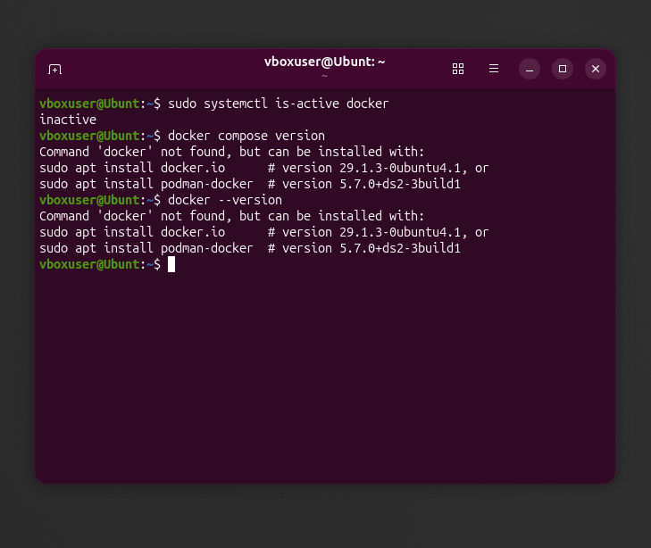

**Registro:**

Docker no está instalado en la VM: `systemctl is-active docker` devolvió `inactive`, y tanto `docker compose version` como `docker --version` respondieron que el comando `docker` no existe. Por lo tanto, sigo con la instalación desde cero según la guía del docente.

### Instalar Docker y Compose

```bash
sudo apt update
sudo apt-get update
sudo apt-get install ca-certificates curl
sudo install -m 0755 -d /etc/apt/keyrings
sudo curl -fsSL https://download.docker.com/linux/ubuntu/gpg -o /etc/apt/keyrings/docker.asc
sudo chmod a+r /etc/apt/keyrings/docker.asc

echo \
  "deb [arch=$(dpkg --print-architecture) signed-by=/etc/apt/keyrings/docker.asc] https://download.docker.com/linux/ubuntu \
  $(. /etc/os-release && echo "${UBUNTU_CODENAME:-$VERSION_CODENAME}") stable" | \
  sudo tee /etc/apt/sources.list.d/docker.list > /dev/null
sudo apt-get update
```

**Evidencia (imagen):**

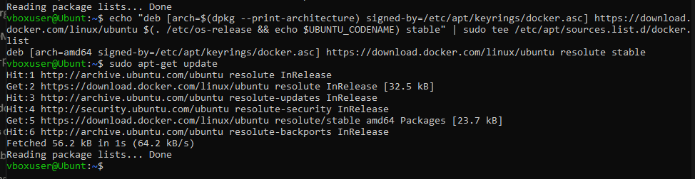

**Registro:**

Al pegar el comando `echo` multilínea original por SSH, el terminal interpretó mal los saltos de línea y las comillas (apareció el error `Command 'q' not found` y el archivo se creó como `/dev/nul` con "Permission denied"). Lo resolví reescribiendo el mismo comando en una sola línea, lo cual pegó correctamente por SSH. Contrario a lo que esperaba, Docker sí cuenta con repositorio publicado para el codename de Ubuntu 26.04 (`resolute`): `sudo apt-get update` descargó sin errores `resolute InRelease` y `resolute/stable amd64 Packages` desde `download.docker.com`, por lo que no fue necesario ningún workaround apuntando a una versión anterior de Ubuntu.

### Instalar Docker Compose y verificar

```bash
sudo systemctl stop unattended-upgrades
sudo apt install docker-compose-plugin
sudo docker --version
sudo docker compose version
```

**Evidencia (imagen):**

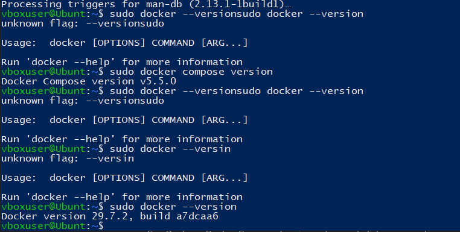

**Registro:**

Al ejecutar `sudo apt install docker-compose-plugin`, solo se instaló el **plugin de Compose** (`docker-compose-plugin` y su dependencia `docker-buildx-plugin`), pero no el motor de Docker en sí. Al verificar con `sudo docker --version`, el sistema respondió `command not found`, porque nunca se había instalado el paquete `docker-ce` (el motor completo) — la guía del docente asume que Docker ya viene instalado de una instalación previa, cosa que no era mi caso al partir de una VM nueva.

Para corregirlo, instalé el motor completo:

```bash
sudo apt-get install docker-ce docker-ce-cli containerd.io docker-buildx-plugin docker-compose-plugin
```

Tras esto, la verificación fue exitosa:

* `sudo docker --version` → `Docker version 29.7.2, build a7dcaa6`
* `sudo docker compose version` → `Docker Compose version v5.5.0`

Con Docker y Docker Compose funcionando, quedo lista para continuar con la creación de la estructura de carpetas del proyecto.

## Paso 1: Crear carpetas
 
Siguiendo la guía del docente, creo las carpetas de los cuatro motores de base de datos:
 
```bash
mkdir -p ~/ia-lab/services/motores-bd/{mysql,postgres,mssql,oracle}
mkdir -p ~/ia-lab/data/{mysql,postgres,mssql,oracle}
mkdir -p ~/ia-lab/backups
cd ~/ia-lab
tree
```
 
**Evidencia (imagen):**
 
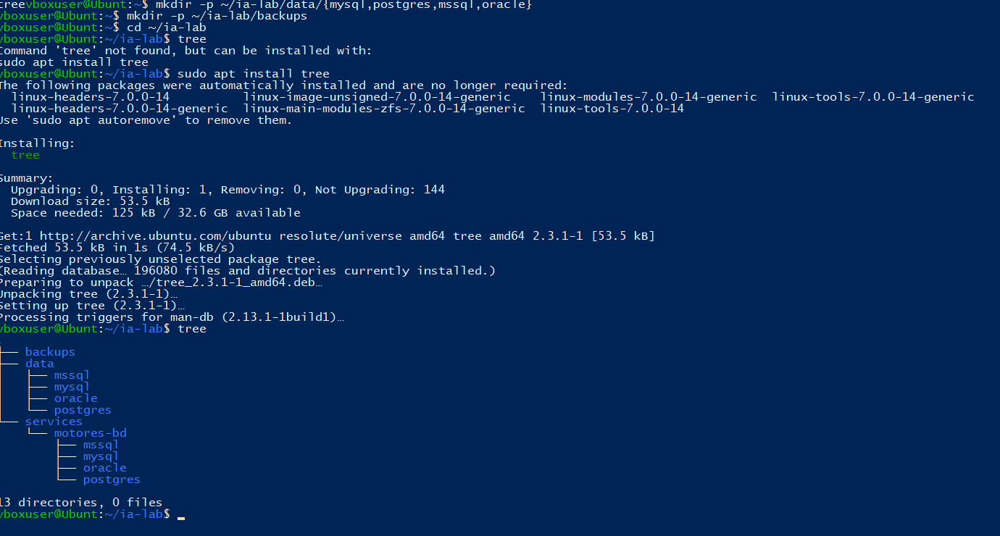
 
**Registro:**
 
El comando `tree` no estaba instalado (`command not found`), así que lo instalé con `sudo apt install tree`. Al ejecutarlo de nuevo, confirmé que la estructura quedó creada correctamente: `~/ia-lab/backups/`, `~/ia-lab/data/{mssql,mysql,oracle,postgres}` y `~/ia-lab/services/motores-bd/{mssql,mysql,oracle,postgres}` — un total de 13 directorios, 0 archivos, tal como se esperaba.
 
 ## Paso 2: Crear la red Docker compartida
 
```bash
docker network inspect ia-lab-network >/dev/null 2>&1 || docker network create ia-lab-network
docker network ls | grep ia-lab
```
 
**Evidencia (imagen):**
 
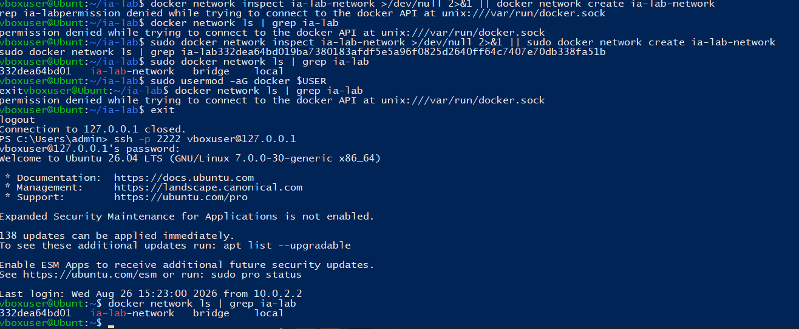
 
**Registro:**
 
Al ejecutar el comando sin `sudo`, obtuve el error `permission denied while trying to connect to the docker API at unix:///var/run/docker.sock`, porque mi usuario `vboxuser` todavía no pertenecía al grupo `docker` (recién instalado el motor). Lo resolví agregando mi usuario a ese grupo:
 
```bash
sudo usermod -aG docker $USER
```
 
Cerré sesión SSH y volví a conectarme para que el cambio de grupo tomara efecto. Tras esto, `docker network ls | grep ia-lab` confirmó la creación de la red `ia-lab-network`, tipo `bridge`, ámbito `local`, sin necesidad de `sudo`.

# Instalación de Base de Datos
 
Para los cuatro motores utilizo mi proyecto final asignado: **05. HornoRaíz - Producción y venta de panadería**, con la base de datos `hornoraiz`.
 
A partir de esta sección sigo un registro propio en vez de la guía genérica del docente, porque su documento ya resuelve varios problemas prácticos (formato YAML, backups, autenticación remota) que la guía original no contempla.
 
## 1. MySQL
 
### 1.1 Crear el archivo `docker-compose.yml`
 
```bash
cat > ~/ia-lab/services/motores-bd/mysql/docker-compose.yml << 'EOF'
services:
  mysql:
    image: mysql:8.0
    container_name: mysql-server
    restart: unless-stopped
    env_file:
      - .env
    ports:
      - "3306:3306"
    volumes:
      - ../../../data/mysql:/var/lib/mysql
      - ../../../backups:/backups
    command: >
      --character-set-server=utf8mb4
      --collation-server=utf8mb4_unicode_ci
      --bind-address=0.0.0.0
    networks:
      - ia-lab-network
    healthcheck:
      test: ["CMD", "mysqladmin", "ping", "-h", "localhost"]
      interval: 10s
      timeout: 5s
      retries: 5
      start_period: 30s
 
networks:
  ia-lab-network:
    external: true
EOF
```
 
Siguiendo el registro, habilito UFW y permito el puerto `3306`:
 
```bash
sudo ufw allow 3306/tcp
sudo ufw enable
sudo ufw status
```
 
**Evidencia (imagen):**
 
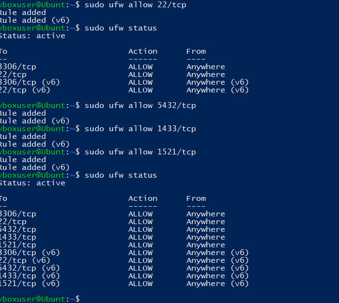
 
**Registro:**
 
Creé el archivo `docker-compose.yml` de MySQL y habilité UFW. En mi VM sí venía instalado y solo tuve que habilitarlo y permitir el puerto `3306`.
 
Al hacerlo, caí en cuenta de un riesgo importante que él no enfrentó: como me conecto a la VM por SSH, activar UFW sin haber permitido antes el puerto `22` pudo haberme dejado sin acceso remoto a la VM. Agregué esa regla de inmediato:
 
```bash
sudo ufw allow 22/tcp
```
 
Y de una vez permití los puertos de los otros tres motores que usaré más adelante, para no repetir el riesgo:
 
```bash
sudo ufw allow 5432/tcp
sudo ufw allow 1433/tcp
sudo ufw allow 1521/tcp
sudo ufw status
```
 
La verificación final mostró los cinco puertos (`22`, `3306`, `5432`, `1433`, `1521`) permitidos para IPv4 e IPv6.
 
> Nota: como mi VM usa NAT con Port Forwarding (no Bridged), UFW dentro de la VM es una capa de seguridad adicional, no la que controla el acceso remoto real — eso ya lo gestiona VirtualBox. Aun así la configuro por buena práctica

### 1.2 Crear el archivo `.env`
 
````bash
cat > ~/ia-lab/services/motores-bd/mysql/.env << 'EOF'
TZ=America/Bogota
MYSQL_ROOT_PASSWORD=1704
MYSQL_DATABASE=hornoraiz
EOF
````
 
**Evidencia (imagen):**
 
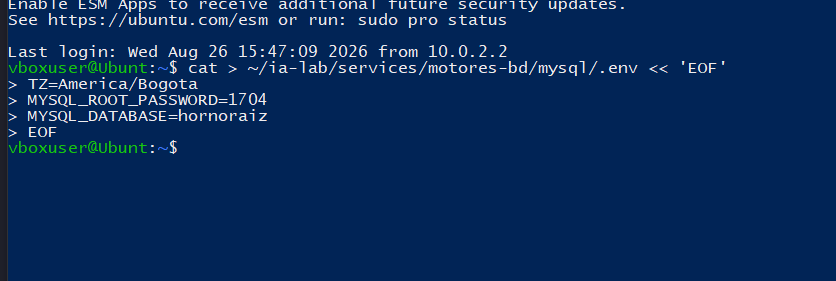
 
**Registro:**
 
Creé correctamente el archivo `.env` con la zona horaria `America/Bogota`, la contraseña `1704` y la base de datos `hornoraiz`, correspondiente a mi proyecto final asignado: **HornoRaíz - Producción y venta de panadería**.
 
### 1.3 Crear `README.md`
 
````bash
cat > ~/ia-lab/services/motores-bd/mysql/README.md << 'EOF'
# MySQL 8.0 - Motor de Base de Datos
 
> **Acceso remoto habilitado.** Puerto expuesto en `0.0.0.0:3306`.
> **Usuario por defecto:** `root`
> **Base de datos inicial:** `hornoraiz`
> **Password:** `1704`
 
---
 
## Conectar desde la VM (local)
 
```bash
sudo docker exec -it mysql-server mysql -u root -p
# Password: 1704
```
EOF
````
 
````bash
cat ~/ia-lab/services/motores-bd/mysql/README.md
````
 
**Evidencia (imagen):**
 
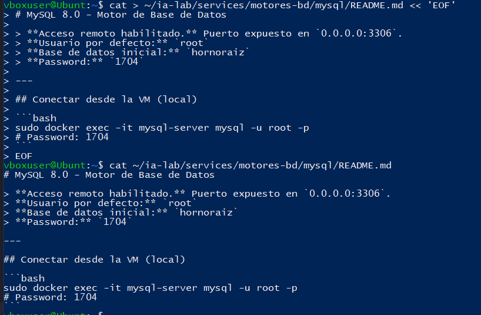
 
**Registro:**
 
Creé el archivo `README.md` de MySQL y comprobé su contenido con `cat`. El archivo documenta el puerto `3306`, el usuario `root`, la base de datos `hornoraiz` y la forma de conectarme localmente desde la VM.
 
### 1.4 Levantar MySQL
 
````bash
cd ~/ia-lab/services/motores-bd/mysql
sudo docker compose up -d
sudo docker ps | grep mysql-server
sudo docker logs mysql-server --tail 20
````
 
**Evidencia (imagen):**
 
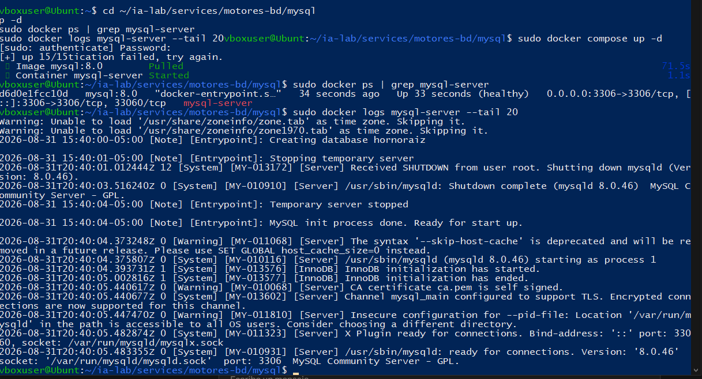
 
**Registro:**
 
A diferencia del compañero, quien tuvo que corregir un error de tabulaciones en el YAML, mi archivo `docker-compose.yml` levantó correctamente a la primera (`[+] up 15/15`, `Container mysql-server Started`) — probablemente porque lo generé con `cat > archivo << 'EOF'`, que preserva los espacios de indentación tal cual se escriben, sin riesgo de tabulaciones accidentales. `docker ps` confirmó el contenedor `mysql-server` como `Up 33 seconds (healthy)`, con el puerto publicado en `0.0.0.0:3306->3306/tcp`. Los logs mostraron que el entrypoint creó automáticamente la base de datos `hornoraiz` y que el servidor terminó de iniciar correctamente: `ready for connections. Version: '8.0.46' MySQL Community Server - GPL`.

### 1.5 Conectar localmente y crear las tablas del proyecto
 
````bash
sudo docker exec -it mysql-server mysql -u root -p
````
 
````sql
SHOW DATABASES;
USE hornoraiz;
````
 
Las 10 entidades listadas en la especificación de **HornoRaíz** no detallan todas las llaves foráneas necesarias para materializar las relaciones descritas, así que tuve que inferir algunas columnas:
 
- **Receta** → agregué `producto_id` (relación Producto 1:N Receta).
- **LoteProduccion** → agregué `receta_id` (relación Receta 1:N LoteProduccion).
- **MovimientoInsumo** → agregué `insumo_id` (obligatorio) y `lote_produccion_id` (opcional), por depender de ambas entidades.
- **Promocion N:M Producto** → agregué la tabla puente `promocion_producto` (no listada como entidad propia, igual que `receta_insumo` resuelve la relación N:M de Receta-Insumo).
- **Venta.cliente_id** → columna simple sin FK, ya que el proyecto no define una entidad `Cliente`.
Con esto, el modelo quedó en 11 tablas (10 entidades de negocio + la tabla puente `promocion_producto`):
 
````sql
CREATE TABLE producto (
  id INT PRIMARY KEY AUTO_INCREMENT,
  sku VARCHAR(50) NOT NULL UNIQUE,
  nombre VARCHAR(100) NOT NULL,
  descripcion VARCHAR(255),
  precio DECIMAL(10, 2) NOT NULL,
  is_active BOOLEAN NOT NULL DEFAULT TRUE
);
 
CREATE TABLE insumo (
  id INT PRIMARY KEY AUTO_INCREMENT,
  codigo VARCHAR(50) NOT NULL UNIQUE,
  nombre VARCHAR(100) NOT NULL,
  unidad_medida VARCHAR(30) NOT NULL,
  stock_minimo DECIMAL(10, 2) NOT NULL DEFAULT 0,
  is_active BOOLEAN NOT NULL DEFAULT TRUE
);
 
CREATE TABLE receta (
  id INT PRIMARY KEY AUTO_INCREMENT,
  producto_id INT NOT NULL,
  nombre VARCHAR(100) NOT NULL,
  descripcion VARCHAR(255),
  is_active BOOLEAN NOT NULL DEFAULT TRUE,
  created_at TIMESTAMP DEFAULT CURRENT_TIMESTAMP,
  updated_at TIMESTAMP DEFAULT CURRENT_TIMESTAMP ON UPDATE CURRENT_TIMESTAMP,
  FOREIGN KEY (producto_id) REFERENCES producto(id)
);
 
CREATE TABLE receta_insumo (
  id INT PRIMARY KEY AUTO_INCREMENT,
  principal_id INT NOT NULL,
  relacionado_id INT NOT NULL,
  datos_relacion VARCHAR(255),
  is_active BOOLEAN NOT NULL DEFAULT TRUE,
  FOREIGN KEY (principal_id) REFERENCES receta(id),
  FOREIGN KEY (relacionado_id) REFERENCES insumo(id)
);
 
CREATE TABLE lote_produccion (
  id INT PRIMARY KEY AUTO_INCREMENT,
  receta_id INT NOT NULL,
  nombre VARCHAR(100) NOT NULL,
  descripcion VARCHAR(255),
  is_active BOOLEAN NOT NULL DEFAULT TRUE,
  created_at TIMESTAMP DEFAULT CURRENT_TIMESTAMP,
  updated_at TIMESTAMP DEFAULT CURRENT_TIMESTAMP ON UPDATE CURRENT_TIMESTAMP,
  FOREIGN KEY (receta_id) REFERENCES receta(id)
);
 
CREATE TABLE movimiento_insumo (
  id INT PRIMARY KEY AUTO_INCREMENT,
  lote_produccion_id INT,
  insumo_id INT NOT NULL,
  tipo VARCHAR(50) NOT NULL,
  fecha DATETIME NOT NULL,
  cantidad DECIMAL(10, 2) NOT NULL,
  observaciones TEXT,
  estado VARCHAR(30) NOT NULL,
  FOREIGN KEY (lote_produccion_id) REFERENCES lote_produccion(id),
  FOREIGN KEY (insumo_id) REFERENCES insumo(id)
);
 
CREATE TABLE venta (
  id INT PRIMARY KEY AUTO_INCREMENT,
  cliente_id INT,
  fecha DATETIME NOT NULL,
  subtotal DECIMAL(10, 2) NOT NULL,
  impuestos DECIMAL(10, 2) NOT NULL DEFAULT 0,
  total DECIMAL(10, 2) NOT NULL,
  estado VARCHAR(30) NOT NULL
);
 
CREATE TABLE venta_detalle (
  id INT PRIMARY KEY AUTO_INCREMENT,
  cabecera_id INT NOT NULL,
  item_id INT NOT NULL,
  cantidad DECIMAL(10, 2) NOT NULL,
  valor_unitario DECIMAL(10, 2) NOT NULL,
  total DECIMAL(10, 2) NOT NULL,
  observaciones TEXT,
  FOREIGN KEY (cabecera_id) REFERENCES venta(id),
  FOREIGN KEY (item_id) REFERENCES producto(id)
);
 
CREATE TABLE pago (
  id INT PRIMARY KEY AUTO_INCREMENT,
  referencia_tipo VARCHAR(50) NOT NULL,
  referencia_id INT NOT NULL,
  metodo VARCHAR(50) NOT NULL,
  monto DECIMAL(10, 2) NOT NULL,
  fecha DATETIME NOT NULL,
  estado VARCHAR(30) NOT NULL
);
 
CREATE TABLE promocion (
  id INT PRIMARY KEY AUTO_INCREMENT,
  nombre VARCHAR(100) NOT NULL,
  descripcion VARCHAR(255),
  is_active BOOLEAN NOT NULL DEFAULT TRUE,
  created_at TIMESTAMP DEFAULT CURRENT_TIMESTAMP,
  updated_at TIMESTAMP DEFAULT CURRENT_TIMESTAMP ON UPDATE CURRENT_TIMESTAMP
);
 
CREATE TABLE promocion_producto (
  id INT PRIMARY KEY AUTO_INCREMENT,
  promocion_id INT NOT NULL,
  producto_id INT NOT NULL,
  is_active BOOLEAN NOT NULL DEFAULT TRUE,
  FOREIGN KEY (promocion_id) REFERENCES promocion(id),
  FOREIGN KEY (producto_id) REFERENCES producto(id)
);
````
 
````sql
SHOW TABLES;
````
 
**Evidencia (imagen):**
 
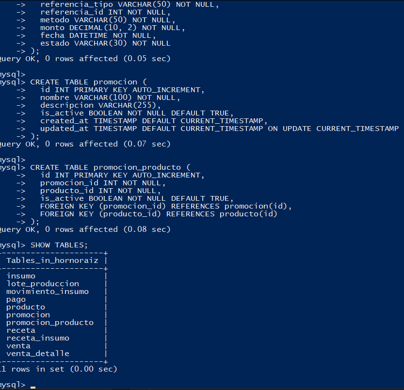
 
**Registro:**
 
Me conecté localmente al motor de MySQL, seleccioné la base de datos `hornoraiz` y creé las 11 tablas del proyecto (`producto`, `insumo`, `receta`, `receta_insumo`, `lote_produccion`, `movimiento_insumo`, `venta`, `venta_detalle`, `pago`, `promocion`, `promocion_producto`), incluyendo las columnas de llave foránea que tuve que inferir para completar las relaciones descritas en la especificación. `SHOW TABLES` confirmó las 11 tablas creadas correctamente.
 
 ### 1.6 Crear un usuario propio con acceso remoto
 
````sql
CREATE USER 'admin'@'%' IDENTIFIED BY '1704';
GRANT ALL PRIVILEGES ON hornoraiz.* TO 'admin'@'%';
FLUSH PRIVILEGES;
````
 
**Evidencia (imagen):**
 
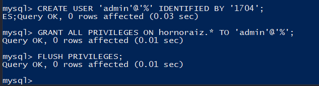
 
**Registro:**
 
Creé el usuario `admin` con acceso desde cualquier host (`%`) y le otorgué privilegios completos sobre la base de datos `hornoraiz`. Los tres comandos se ejecutaron sin errores.

### 1.7 Conectar remotamente desde DBeaver
 
Como mi VM usa NAT con Port Forwarding, la conexión desde Windows es a `127.0.0.1` (no a la IP interna de la VM), usando el puerto `3306` redirigido:
 
- **Motor:** MySQL
- **Host:** `127.0.0.1`
- **Port:** `3306`
- **Database:** `hornoraiz`
- **Username:** `admin`
- **Password:** `1704`
**Evidencia (imagen):**
 
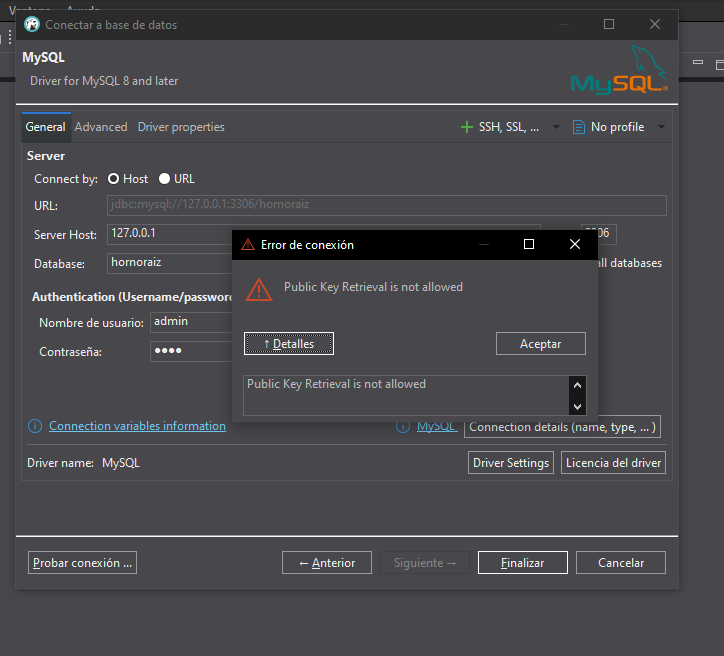
 
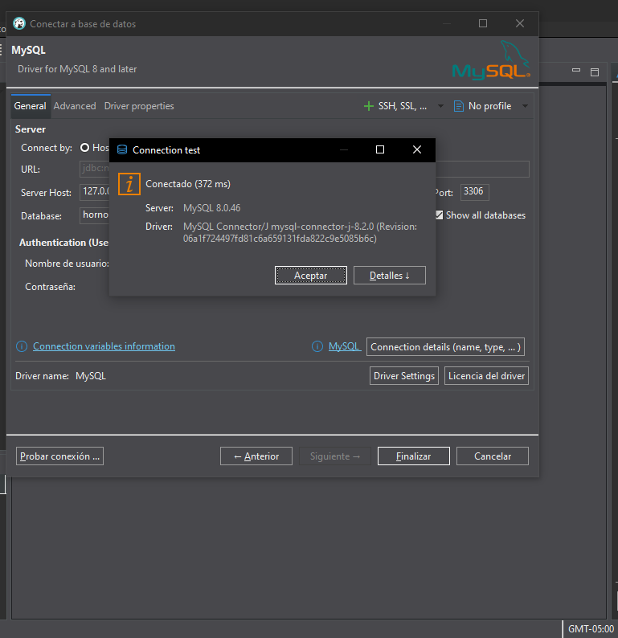
 
**Registro:**
 
El primer intento de conexión falló con el error `Public Key Retrieval is not allowed`, porque MySQL 8 usa por defecto el método de autenticación `caching_sha2_password`, que el driver de DBeaver no maneja sin configuración adicional. Lo resolví cambiando el método de autenticación del usuario `admin` a `mysql_native_password`:
 
````bash
sudo docker exec -it mysql-server mysql -u root -p -e "ALTER USER 'admin'@'%' IDENTIFIED WITH mysql_native_password BY '1704'; FLUSH PRIVILEGES;"
````
 
Al reintentar la conexión en DBeaver, el resultado fue exitoso: `Conectado (372 ms)`, confirmando MySQL `8.0.46` a través de `127.0.0.1:3306` (redirigido por NAT hacia el puerto `3306` de la VM).

### 1.8 Backup de la base de datos
 
````bash
sudo docker exec mysql-server mysqldump -u root -p1704 hornoraiz > ~/ia-lab/backups/backup_hornoraiz_$(date +%Y%m%d).sql
ls -lh ~/ia-lab/backups/backup_hornoraiz_$(date +%Y%m%d).sql
````
 
**Evidencia (imagen):**
 
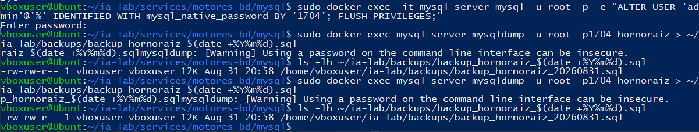
 
**Registro:**
 
Al no cruzar el límite WSL↔Windows (mi VM es Linux nativo), la redirección de Bash funcionó sin ningún error de permisos, a diferencia del registro del compañero. El backup `backup_hornoraiz_20260831.sql` (12K) se generó correctamente en `~/ia-lab/backups/`.
 
Con esto queda completada la instalación, configuración y verificación del motor **MySQL** para el proyecto HornoRaíz: contenedor funcionando, base de datos y tablas creadas, usuario remoto configurado, conexión verificada desde DBeaver, y backup generado.
 
 ## 2. PostgreSQL
 
### 2.1 Crear `docker-compose.yml`
 
````bash
cat > ~/ia-lab/services/motores-bd/postgres/docker-compose.yml << 'EOF'
services:
  postgres:
    image: postgres:17
    container_name: postgres-server
    restart: unless-stopped
    env_file:
      - .env
    ports:
      - "5432:5432"
    volumes:
      - ../../../data/postgres:/var/lib/postgresql/data
      - ../../../backups:/backups
    command:
      - postgres
      - -c
      - "listen_addresses=*"
    networks:
      - ia-lab-network
    healthcheck:
      test: ["CMD-SHELL", "pg_isready -U $$POSTGRES_USER -d $$POSTGRES_DB"]
      interval: 10s
      timeout: 5s
      retries: 5
      start_period: 20s
 
networks:
  ia-lab-network:
    external: true
EOF
````
 
**Evidencia (imagen):**
 
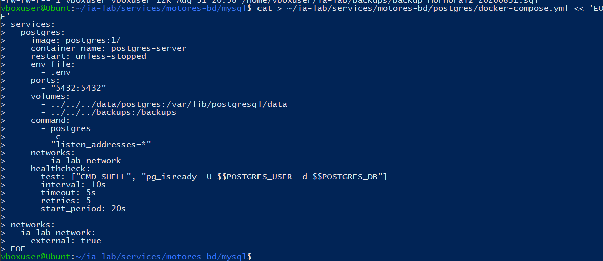
 
**Registro:**
 
Creé el archivo `docker-compose.yml` de PostgreSQL con la imagen `postgres:17`, el puerto `5432`, almacenamiento persistente y la carpeta de backups compartida. El puerto `5432/tcp` ya estaba permitido en UFW desde la configuración inicial (sección de MySQL), así que no fue necesario repetir ese paso.

### 2.2 Crear el archivo `.env`
 
````bash
cat > ~/ia-lab/services/motores-bd/postgres/.env << 'EOF'
TZ=America/Bogota
POSTGRES_USER=postgres
POSTGRES_PASSWORD=1704
POSTGRES_DB=hornoraiz
EOF
````
 
**Evidencia (imagen):**
 
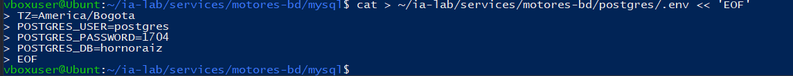
 
**Registro:**
 
Creé el archivo `.env` de PostgreSQL con el usuario `postgres`, la contraseña `1704` y la base de datos `hornoraiz`.
 
 ### 2.3 Crear `README.md`
 
````bash
cat > ~/ia-lab/services/motores-bd/postgres/README.md << 'EOF'
# PostgreSQL 17 - Motor de Base de Datos
 
> **Acceso remoto habilitado.** Puerto expuesto en `0.0.0.0:5432`.
> **Usuario por defecto:** `postgres`
> **Base de datos inicial:** `hornoraiz`
> **Password:** `1704`
 
---
 
## Conectar desde la VM (local)
 
```bash
sudo docker exec -it postgres-server psql -U postgres -d hornoraiz
# Password: 1704
```
EOF
````
 
````bash
cat ~/ia-lab/services/motores-bd/postgres/README.md
````
 
**Evidencia (imagen):**
 
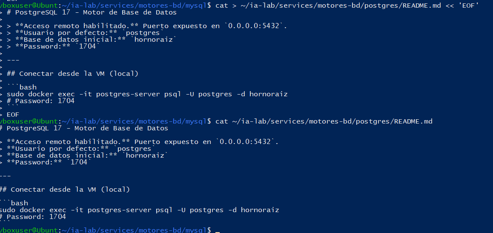
 
**Registro:**
 
Creé el archivo `README.md` de PostgreSQL y comprobé su contenido con `cat`. Documenta el puerto `5432`, el usuario `postgres`, la base de datos `hornoraiz` y el comando de conexión local.

### 2.4 Levantar PostgreSQL
 
````bash
cd ~/ia-lab/services/motores-bd/postgres
sudo docker compose up -d
sudo docker ps | grep postgres-server
sudo docker logs postgres-server --tail 20
````
 
**Evidencia (imagen):**
 
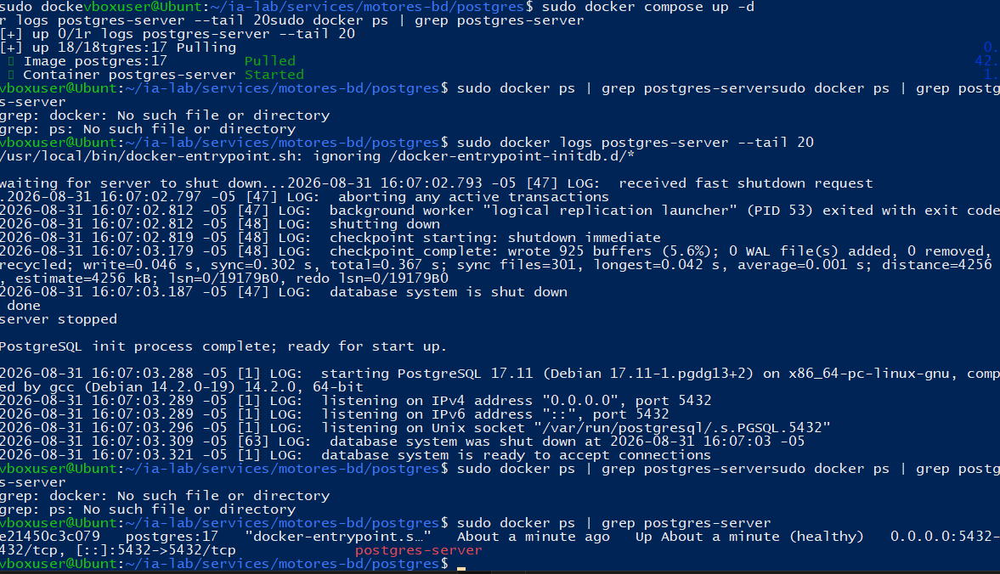
 
**Registro:**
 
Al igual que con MySQL, el archivo `docker-compose.yml` levantó correctamente a la primera (`[+] up 18/18`), sin el error de indentación YAML que enfrentó el compañero. Los logs confirmaron `database system is ready to accept connections`, escuchando en el puerto `5432` para IPv4 y IPv6. `docker ps` mostró el contenedor `postgres-server` como `Up About a minute (healthy)`, con el puerto publicado en `0.0.0.0:5432->5432/tcp`.

### 2.5 Conectar localmente y crear las tablas del proyecto
 
````bash
sudo docker exec -it postgres-server psql -U postgres -d hornoraiz
````
 
Usé la misma inferencia de llaves foráneas aplicada en MySQL (ver sección 1.5), adaptada a sintaxis PostgreSQL (`SERIAL`, `REFERENCES` inline):
 
````sql
CREATE TABLE producto (
  id SERIAL PRIMARY KEY,
  sku VARCHAR(50) NOT NULL UNIQUE,
  nombre VARCHAR(100) NOT NULL,
  descripcion VARCHAR(255),
  precio NUMERIC(10, 2) NOT NULL,
  is_active BOOLEAN NOT NULL DEFAULT TRUE
);
 
CREATE TABLE insumo (
  id SERIAL PRIMARY KEY,
  codigo VARCHAR(50) NOT NULL UNIQUE,
  nombre VARCHAR(100) NOT NULL,
  unidad_medida VARCHAR(30) NOT NULL,
  stock_minimo NUMERIC(10, 2) NOT NULL DEFAULT 0,
  is_active BOOLEAN NOT NULL DEFAULT TRUE
);
 
CREATE TABLE receta (
  id SERIAL PRIMARY KEY,
  producto_id INT NOT NULL REFERENCES producto(id),
  nombre VARCHAR(100) NOT NULL,
  descripcion VARCHAR(255),
  is_active BOOLEAN NOT NULL DEFAULT TRUE,
  created_at TIMESTAMP DEFAULT CURRENT_TIMESTAMP,
  updated_at TIMESTAMP DEFAULT CURRENT_TIMESTAMP
);
 
CREATE TABLE receta_insumo (
  id SERIAL PRIMARY KEY,
  principal_id INT NOT NULL REFERENCES receta(id),
  relacionado_id INT NOT NULL REFERENCES insumo(id),
  datos_relacion VARCHAR(255),
  is_active BOOLEAN NOT NULL DEFAULT TRUE
);
 
CREATE TABLE lote_produccion (
  id SERIAL PRIMARY KEY,
  receta_id INT NOT NULL REFERENCES receta(id),
  nombre VARCHAR(100) NOT NULL,
  descripcion VARCHAR(255),
  is_active BOOLEAN NOT NULL DEFAULT TRUE,
  created_at TIMESTAMP DEFAULT CURRENT_TIMESTAMP,
  updated_at TIMESTAMP DEFAULT CURRENT_TIMESTAMP
);
 
CREATE TABLE movimiento_insumo (
  id SERIAL PRIMARY KEY,
  lote_produccion_id INT REFERENCES lote_produccion(id),
  insumo_id INT NOT NULL REFERENCES insumo(id),
  tipo VARCHAR(50) NOT NULL,
  fecha TIMESTAMP NOT NULL,
  cantidad NUMERIC(10, 2) NOT NULL,
  observaciones TEXT,
  estado VARCHAR(30) NOT NULL
);
 
CREATE TABLE venta (
  id SERIAL PRIMARY KEY,
  cliente_id INT,
  fecha TIMESTAMP NOT NULL,
  subtotal NUMERIC(10, 2) NOT NULL,
  impuestos NUMERIC(10, 2) NOT NULL DEFAULT 0,
  total NUMERIC(10, 2) NOT NULL,
  estado VARCHAR(30) NOT NULL
);
 
CREATE TABLE venta_detalle (
  id SERIAL PRIMARY KEY,
  cabecera_id INT NOT NULL REFERENCES venta(id),
  item_id INT NOT NULL REFERENCES producto(id),
  cantidad NUMERIC(10, 2) NOT NULL,
  valor_unitario NUMERIC(10, 2) NOT NULL,
  total NUMERIC(10, 2) NOT NULL,
  observaciones TEXT
);
 
CREATE TABLE pago (
  id SERIAL PRIMARY KEY,
  referencia_tipo VARCHAR(50) NOT NULL,
  referencia_id INT NOT NULL,
  metodo VARCHAR(50) NOT NULL,
  monto NUMERIC(10, 2) NOT NULL,
  fecha TIMESTAMP NOT NULL,
  estado VARCHAR(30) NOT NULL
);
 
CREATE TABLE promocion (
  id SERIAL PRIMARY KEY,
  nombre VARCHAR(100) NOT NULL,
  descripcion VARCHAR(255),
  is_active BOOLEAN NOT NULL DEFAULT TRUE,
  created_at TIMESTAMP DEFAULT CURRENT_TIMESTAMP,
  updated_at TIMESTAMP DEFAULT CURRENT_TIMESTAMP
);
 
CREATE TABLE promocion_producto (
  id SERIAL PRIMARY KEY,
  promocion_id INT NOT NULL REFERENCES promocion(id),
  producto_id INT NOT NULL REFERENCES producto(id),
  is_active BOOLEAN NOT NULL DEFAULT TRUE
);
````
 
````sql
\dt
````
 
**Evidencia (imagen):**
 
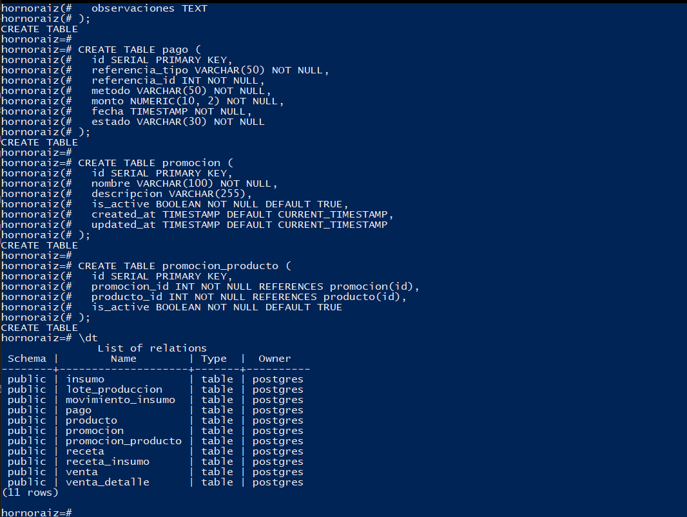
 
**Registro:**
 
Me conecté localmente a PostgreSQL, seleccioné `hornoraiz` y creé las mismas 11 tablas del modelo (adaptando la sintaxis: `SERIAL` en vez de `AUTO_INCREMENT`, `REFERENCES` inline en vez de `FOREIGN KEY` al final). `\dt` confirmó las 11 tablas, todas en el esquema `public` bajo el propietario `postgres`.
 
 ### 2.6 Crear un usuario propio con acceso remoto
 
````sql
CREATE USER admin WITH PASSWORD '1704';
ALTER USER admin WITH SUPERUSER;
\du
````
 
**Evidencia (imagen):**
 
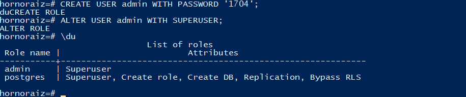
 
**Registro:**
 
Creé el usuario `admin` y le otorgué el rol `SUPERUSER`. La verificación con `\du` confirmó al usuario `admin` con el atributo `Superuser`, junto al usuario `postgres` que ya traía privilegios de superusuario, creación de rol/BD, replicación y bypass de RLS por defecto.
 
 ### 2.7 Conectar remotamente desde DBeaver
 
- **Motor:** PostgreSQL
- **Host:** `127.0.0.1`
- **Port:** `5432`
- **Database:** `hornoraiz`
- **Username:** `admin`
- **Password:** `1704`
**Evidencia (imagen):**
 
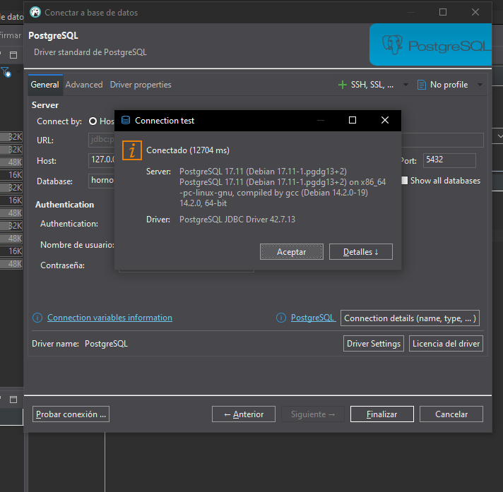
 
**Registro:**
 
A diferencia de MySQL, PostgreSQL no presentó ningún problema de autenticación con el driver de DBeaver. La conexión fue exitosa en el primer intento: `Conectado (12704 ms)`, confirmando PostgreSQL `17.11` a través de `127.0.0.1:5432` (redirigido por NAT).
 
 ### 2.8 Backup de la base de datos
 
````bash
sudo docker exec postgres-server pg_dump -U postgres -d hornoraiz -f /backups/backup_hornoraiz_$(date +%Y%m%d).sql
ls -lh ~/ia-lab/backups/
````
 
**Evidencia (imagen):**
 
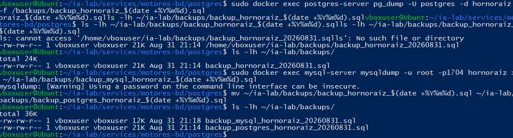
 
**Registro:**
 
Al listar `~/ia-lab/backups/` encontré que solo existía **un** archivo (`backup_hornoraiz_20260831.sql`, 21K) en vez de los dos esperados: el backup de PostgreSQL había sobrescrito al de MySQL, porque ambos usaban exactamente el mismo nombre de archivo (`backup_hornoraiz_$(date +%Y%m%d).sql`), sin diferenciar el motor de origen.
 
Corregí el problema regenerando el backup de MySQL y renombrando el de PostgreSQL para incluir el nombre del motor en el archivo:
 
````bash
sudo docker exec mysql-server mysqldump -u root -p1704 hornoraiz > ~/ia-lab/backups/backup_mysql_hornoraiz_$(date +%Y%m%d).sql
mv ~/ia-lab/backups/backup_hornoraiz_$(date +%Y%m%d).sql ~/ia-lab/backups/backup_postgres_hornoraiz_$(date +%Y%m%d).sql
ls -lh ~/ia-lab/backups/
````
 
Tras esto, `~/ia-lab/backups/` mostró correctamente dos archivos independientes: `backup_mysql_hornoraiz_20260831.sql` (12K) y `backup_postgres_hornoraiz_20260831.sql` (21K). Adopté esta convención (`backup_<motor>_hornoraiz_<fecha>.sql`) para los backups de SQL Server y Oracle en las siguientes secciones, evitando que se sobrescriban entre sí.
Con esto queda completada la instalación, configuración y verificación del motor **PostgreSQL** para el proyecto HornoRaíz.

## 3. MS SQL Server
 
### 3.1 Crear el archivo `docker-compose.yml`
 
````bash
cat > ~/ia-lab/services/motores-bd/mssql/docker-compose.yml << 'EOF'
services:
  mssql:
    image: mcr.microsoft.com/mssql/server:2022-latest
    container_name: mssql-server
    restart: unless-stopped
    user: root
    env_file:
      - .env
    ports:
      - "0.0.0.0:1433:1433"
    volumes:
      - ../../../data/mssql:/var/opt/mssql
      - ../../../backups:/backups
    networks:
      - ia-lab-network
    healthcheck:
      test: ["CMD-SHELL", "/opt/mssql-tools18/bin/sqlcmd -S localhost -U SA -P $$MSSQL_SA_PASSWORD -C -Q 'SELECT 1' || exit 1"]
      interval: 10s
      timeout: 5s
      retries: 10
      start_period: 40s
 
networks:
  ia-lab-network:
    external: true
EOF
````
 
**Evidencia (imagen):**
 
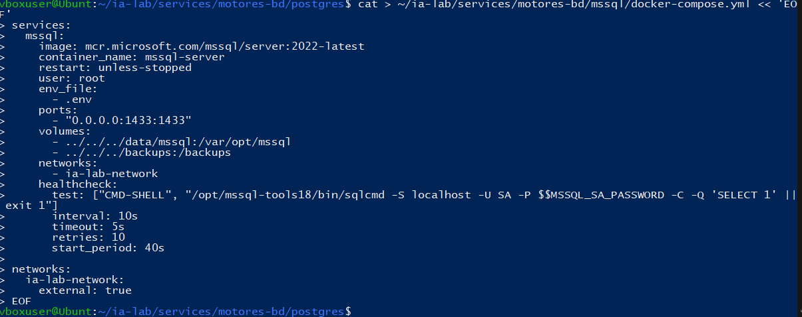
 
**Registro:**
 
Creé el archivo `docker-compose.yml` de SQL Server con la imagen `mcr.microsoft.com/mssql/server:2022-latest`, el puerto `1433`, volúmenes de datos y backups, y el healthcheck con `sqlcmd`. El puerto `1433/tcp` ya estaba permitido en UFW desde la configuración inicial.

### 3.2 Crear el archivo `.env`
 
````bash
cat > ~/ia-lab/services/motores-bd/mssql/.env << 'EOF'
TZ=America/Bogota
ACCEPT_EULA=Y
MSSQL_SA_PASSWORD=Hornoraiz1704!
MSSQL_PID=Developer
EOF
````
 
**Evidencia (imagen):**
 
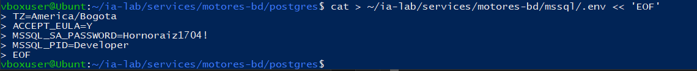
 
**Registro:**
 
SQL Server exige que la contraseña de `SA` cumpla requisitos de complejidad (mayúsculas, minúsculas, números y símbolos), por lo que `1704` sola no es válida. Usé `Hornoraiz1704!` en su lugar. Configuré también la edición `Developer` (gratuita, con todas las funciones de la edición Enterprise para desarrollo).
 
 ### 3.3 Crear `README.md`
 
````bash
cat > ~/ia-lab/services/motores-bd/mssql/README.md << 'EOF'
# SQL Server 2022 - Motor de Base de Datos
 
> **Acceso remoto habilitado.** Puerto expuesto en `0.0.0.0:1433`.
> **Edición (MSSQL_PID):** `Developer`
> **Usuario por defecto:** `SA`
> **Base de datos del proyecto:** `hornoraiz`
> **Password:** `Hornoraiz1704!`
 
---
 
## Conectar desde la VM (local)
 
```bash
sudo docker exec -it mssql-server /opt/mssql-tools18/bin/sqlcmd -S localhost -U SA -P 'Hornoraiz1704!' -C
```
EOF
````
 
````bash
cat ~/ia-lab/services/motores-bd/mssql/README.md
````
 
**Evidencia (imagen):**
 
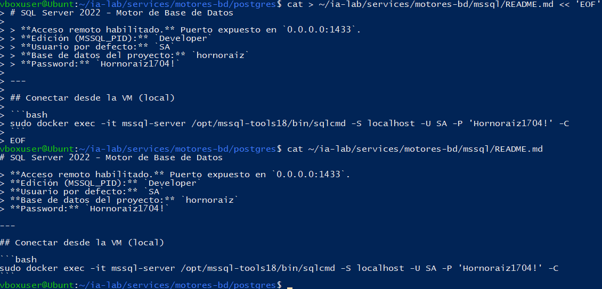
 
**Registro:**
 
Creé el archivo `README.md` de SQL Server y comprobé su contenido con `cat`. Documenta el puerto `1433`, la edición `Developer`, el usuario `SA`, la base de datos `hornoraiz` y el comando de conexión local.

### 3.4 Levantar SQL Server
 
````bash
cd ~/ia-lab/services/motores-bd/mssql
sudo docker compose up -d
sudo docker ps | grep mssql-server
sudo docker logs mssql-server --tail 30
````
 
**Evidencia (imagen):**
 
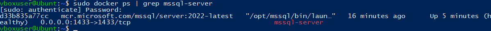
 
**Registro:**
 
Antes de levantar este motor tenía preocupación por la memoria: mi VM cuenta con solo 2 GB de RAM totales, y Microsoft recomienda un mínimo de 2 GB solo para el contenedor de SQL Server. La descarga de la imagen `mcr.microsoft.com/mssql/server:2022-latest` tardó considerablemente (297.9s, es una imagen pesada). Contrario a lo esperado, el contenedor `mssql-server` levantó y se mantuvo estable: `docker ps` lo mostró como `Up 5 minutes (healthy)`, con el puerto publicado en `0.0.0.0:1433->1433/tcp`. Esto confirma que la estrategia de levantar un solo motor a la vez (en vez de los cuatro simultáneamente) es suficiente para trabajar con 2 GB de RAM en esta VM.

### 3.5 Instalar `mssql-tools` en la VM
 
````bash
sudo apt update && sudo apt install -y curl ca-certificates gnupg
sudo rm -f /etc/apt/sources.list.d/mssql-release.list
sudo rm -f /etc/apt/sources.list.d/microsoft-prod.list
cd /tmp
curl -sSL -O https://packages.microsoft.com/config/ubuntu/26.04/packages-microsoft-prod.deb
sudo dpkg -i /tmp/packages-microsoft-prod.deb
sudo apt update
````
 
**Evidencia (imagen):**
 
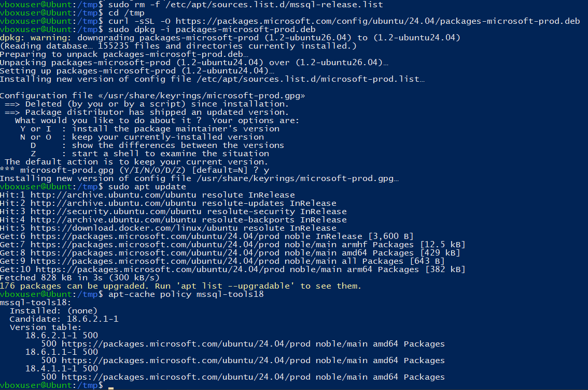
 
**Registro:**
 
La guía original usa la ruta `ubuntu/24.04` para el paquete de configuración de Microsoft, ya que asume una versión anterior de Ubuntu. Probé primero con la ruta específica de mi versión (`ubuntu/26.04`) por si Microsoft ya la tenía publicada, en vez de asumir directamente el workaround. El archivo `packages-microsoft-prod.deb` se descargó correctamente (5.1K, tamaño normal para este paquete de configuración) y, al instalarlo y ejecutar `sudo apt update`, el repositorio de Microsoft para `resolute` (Ubuntu 26.04) respondió sin errores 404 (`Get:5 ... ubuntu/26.04/prod resolute InRelease`), por lo que no fue necesario ningún workaround apuntando a una versión anterior de Ubuntu.
 
Sin embargo, al intentar instalar las herramientas:
 
````bash
sudo ACCEPT_EULA=Y apt install -y mssql-tools18 unixodbc-dev
````
 
Obtuve `Error: Unable to locate package mssql-tools18`. Verifiqué con `apt-cache policy mssql-tools18` y confirmé que, aunque el índice del repositorio `resolute` existe, el paquete específico `mssql-tools18` **no está publicado** todavía para Ubuntu 26.04 — solo el paquete de configuración (`packages-microsoft-prod`) se publicó, pero no las herramientas en sí.
 
Como `mssql-tools18` no depende de nada específico de la versión de Ubuntu (solo de `libc`), reemplacé el repositorio configurado por el de Ubuntu 24.04 (`noble`), que sí publica el paquete:
 
````bash
sudo rm -f /etc/apt/sources.list.d/mssql-release.list
cd /tmp
curl -sSL -O https://packages.microsoft.com/config/ubuntu/24.04/packages-microsoft-prod.deb
sudo dpkg -i packages-microsoft-prod.deb
sudo apt update
apt-cache policy mssql-tools18
````
 
Tras el cambio, `apt-cache policy mssql-tools18` mostró el candidato `18.6.2.1-1` disponible desde `packages.microsoft.com/ubuntu/24.04/prod noble/main`, confirmando que el workaround resolvió el problema.
 
### 3.5.1 Instalar las herramientas

````bash
sudo ACCEPT_EULA=Y apt install -y mssql-tools18 unixodbc-dev
echo 'export PATH="$PATH:/opt/mssql-tools18/bin"' >> ~/.bashrc
source ~/.bashrc
which sqlcmd
````
 
**Evidencia (imagen):**
 
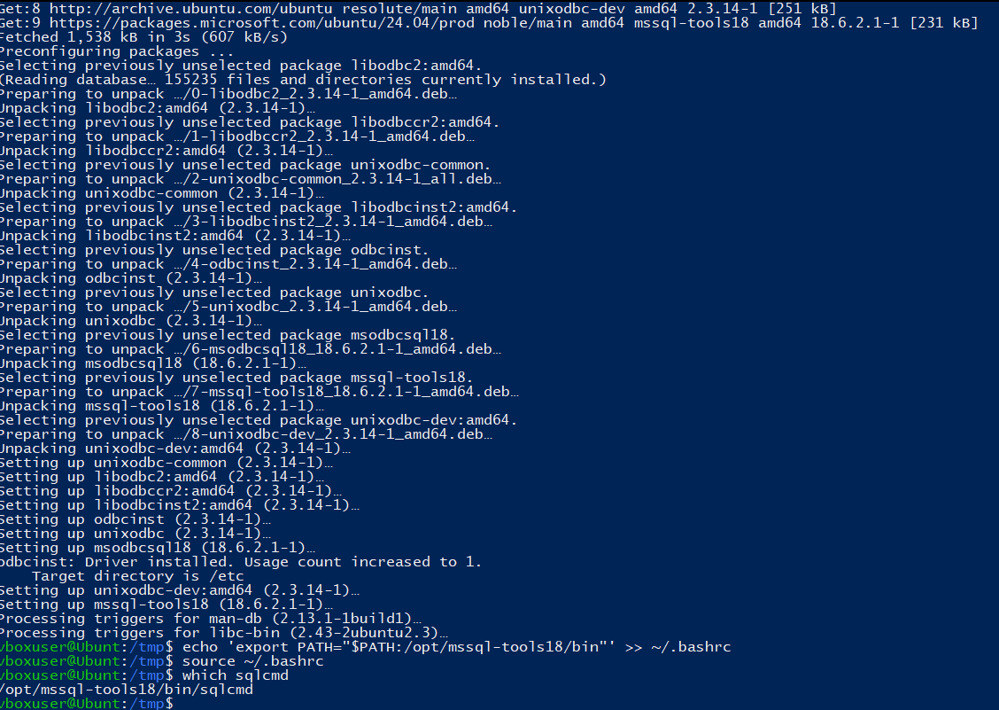
 
**Registro:**
 
Con el repositorio de `noble` (Ubuntu 24.04) configurado, la instalación de `mssql-tools18` (versión `18.6.2.1-1`) y sus dependencias (`unixodbc`, `libodbc2`, `msodbcsql18`, etc.) se completó sin errores. Agregué la ruta al `PATH` en `~/.bashrc` y confirmé con `which sqlcmd` que quedó instalado en `/opt/mssql-tools18/bin/sqlcmd`.

### 3.6 Crear la base de datos y las tablas del proyecto
 
````bash
sudo docker exec -it mssql-server /opt/mssql-tools18/bin/sqlcmd -S localhost -U SA -P 'Hornoraiz1704!' -C -d master
````
 
````sql
CREATE DATABASE hornoraiz;
GO
SELECT name FROM sys.databases;
GO
````
 
**Evidencia (imagen):**
 
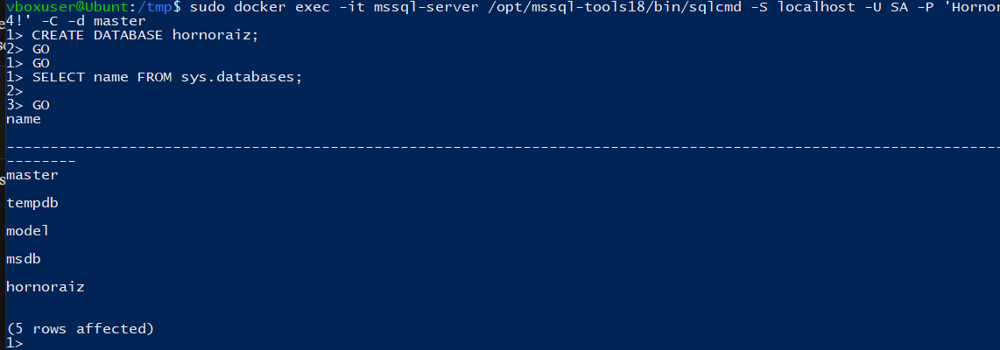
 
**Registro:**
 
Creé la base de datos `hornoraiz` desde `master` y confirmé con `SELECT name FROM sys.databases` que aparece junto a las bases del sistema (`master`, `tempdb`, `model`, `msdb`) — 5 filas en total.

Siguiendo el mismo método que el compañero, guardé el script de las 11 tablas en un archivo `.sql` y lo ejecuté desde Bash contra el contenedor, en vez de pegar todo el código directamente en `sqlcmd`:
 
````bash
nano ~/hornoraiz.sql
````
 
Contenido de `hornoraiz.sql` (mismas 11 tablas y misma inferencia de llaves foráneas usada en MySQL/PostgreSQL, adaptada a sintaxis T-SQL — `IDENTITY(1,1)`, `BIT`, `DATETIME2`, `VARCHAR(MAX)`):
 
````sql
CREATE TABLE producto (
  id INT IDENTITY(1,1) PRIMARY KEY,
  sku VARCHAR(50) NOT NULL UNIQUE,
  nombre VARCHAR(100) NOT NULL,
  descripcion VARCHAR(255),
  precio DECIMAL(10, 2) NOT NULL,
  is_active BIT NOT NULL DEFAULT 1
);
GO
 
CREATE TABLE insumo (
  id INT IDENTITY(1,1) PRIMARY KEY,
  codigo VARCHAR(50) NOT NULL UNIQUE,
  nombre VARCHAR(100) NOT NULL,
  unidad_medida VARCHAR(30) NOT NULL,
  stock_minimo DECIMAL(10, 2) NOT NULL DEFAULT 0,
  is_active BIT NOT NULL DEFAULT 1
);
GO
 
CREATE TABLE receta (
  id INT IDENTITY(1,1) PRIMARY KEY,
  producto_id INT NOT NULL,
  nombre VARCHAR(100) NOT NULL,
  descripcion VARCHAR(255),
  is_active BIT NOT NULL DEFAULT 1,
  created_at DATETIME2 DEFAULT SYSDATETIME(),
  updated_at DATETIME2 DEFAULT SYSDATETIME(),
  FOREIGN KEY (producto_id) REFERENCES producto(id)
);
GO
 
CREATE TABLE receta_insumo (
  id INT IDENTITY(1,1) PRIMARY KEY,
  principal_id INT NOT NULL,
  relacionado_id INT NOT NULL,
  datos_relacion VARCHAR(255),
  is_active BIT NOT NULL DEFAULT 1,
  FOREIGN KEY (principal_id) REFERENCES receta(id),
  FOREIGN KEY (relacionado_id) REFERENCES insumo(id)
);
GO
 
CREATE TABLE lote_produccion (
  id INT IDENTITY(1,1) PRIMARY KEY,
  receta_id INT NOT NULL,
  nombre VARCHAR(100) NOT NULL,
  descripcion VARCHAR(255),
  is_active BIT NOT NULL DEFAULT 1,
  created_at DATETIME2 DEFAULT SYSDATETIME(),
  updated_at DATETIME2 DEFAULT SYSDATETIME(),
  FOREIGN KEY (receta_id) REFERENCES receta(id)
);
GO
 
CREATE TABLE movimiento_insumo (
  id INT IDENTITY(1,1) PRIMARY KEY,
  lote_produccion_id INT,
  insumo_id INT NOT NULL,
  tipo VARCHAR(50) NOT NULL,
  fecha DATETIME2 NOT NULL,
  cantidad DECIMAL(10, 2) NOT NULL,
  observaciones VARCHAR(MAX),
  estado VARCHAR(30) NOT NULL,
  FOREIGN KEY (lote_produccion_id) REFERENCES lote_produccion(id),
  FOREIGN KEY (insumo_id) REFERENCES insumo(id)
);
GO
 
CREATE TABLE venta (
  id INT IDENTITY(1,1) PRIMARY KEY,
  cliente_id INT,
  fecha DATETIME2 NOT NULL,
  subtotal DECIMAL(10, 2) NOT NULL,
  impuestos DECIMAL(10, 2) NOT NULL DEFAULT 0,
  total DECIMAL(10, 2) NOT NULL,
  estado VARCHAR(30) NOT NULL
);
GO
 
CREATE TABLE venta_detalle (
  id INT IDENTITY(1,1) PRIMARY KEY,
  cabecera_id INT NOT NULL,
  item_id INT NOT NULL,
  cantidad DECIMAL(10, 2) NOT NULL,
  valor_unitario DECIMAL(10, 2) NOT NULL,
  total DECIMAL(10, 2) NOT NULL,
  observaciones VARCHAR(MAX),
  FOREIGN KEY (cabecera_id) REFERENCES venta(id),
  FOREIGN KEY (item_id) REFERENCES producto(id)
);
GO
 
CREATE TABLE pago (
  id INT IDENTITY(1,1) PRIMARY KEY,
  referencia_tipo VARCHAR(50) NOT NULL,
  referencia_id INT NOT NULL,
  metodo VARCHAR(50) NOT NULL,
  monto DECIMAL(10, 2) NOT NULL,
  fecha DATETIME2 NOT NULL,
  estado VARCHAR(30) NOT NULL
);
GO
 
CREATE TABLE promocion (
  id INT IDENTITY(1,1) PRIMARY KEY,
  nombre VARCHAR(100) NOT NULL,
  descripcion VARCHAR(255),
  is_active BIT NOT NULL DEFAULT 1,
  created_at DATETIME2 DEFAULT SYSDATETIME(),
  updated_at DATETIME2 DEFAULT SYSDATETIME()
);
GO
 
CREATE TABLE promocion_producto (
  id INT IDENTITY(1,1) PRIMARY KEY,
  promocion_id INT NOT NULL,
  producto_id INT NOT NULL,
  is_active BIT NOT NULL DEFAULT 1,
  FOREIGN KEY (promocion_id) REFERENCES promocion(id),
  FOREIGN KEY (producto_id) REFERENCES producto(id)
);
GO
````
 
Ejecuté el archivo contra la base de datos y verifiqué las tablas creadas:
 
````bash
sudo docker exec -i mssql-server /opt/mssql-tools18/bin/sqlcmd -S localhost -U SA -P 'Hornoraiz1704!' -C -d hornoraiz < ~/hornoraiz.sql
sudo docker exec -it mssql-server /opt/mssql-tools18/bin/sqlcmd -S localhost -U SA -P 'Hornoraiz1704!' -C -d hornoraiz -Q "SELECT name FROM sys.tables;"
````
 
**Evidencia (imagen):**
 
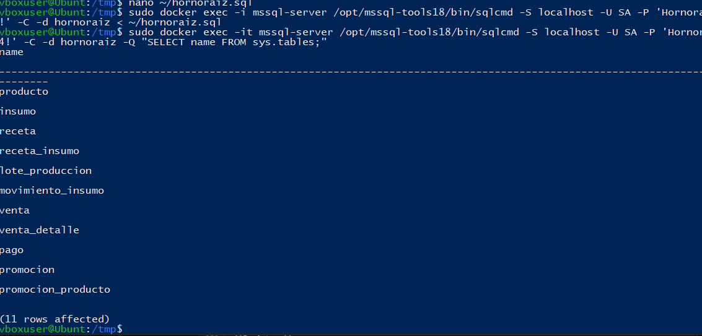
 
**Registro:**
 
El script se ejecutó sin errores contra la base de datos `hornoraiz`. `SELECT name FROM sys.tables` confirmó las 11 tablas creadas, en el orden respetando las dependencias de llave foránea: `producto`, `insumo`, `receta`, `receta_insumo`, `lote_produccion`, `movimiento_insumo`, `venta`, `venta_detalle`, `pago`, `promocion`, `promocion_producto`.

### 3.7 Crear un usuario propio con acceso remoto
 
````bash
sudo docker exec -it mssql-server /opt/mssql-tools18/bin/sqlcmd -S localhost -U SA -P 'Hornoraiz1704!' -C -d master
````
 
````sql
CREATE LOGIN admin WITH PASSWORD = '1704', CHECK_POLICY = OFF;
GO
ALTER SERVER ROLE sysadmin ADD MEMBER admin;
GO
ALTER LOGIN admin ENABLE;
GO
````
 
**Evidencia (imagen):**
 
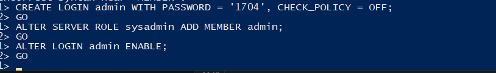
 
**Registro:**
 
Creé el login `admin` con `CHECK_POLICY = OFF` (para poder usar la contraseña simple `1704`, ya que esta opción desactiva la política de complejidad solo para este login, sin afectar los requisitos de la contraseña de `SA`). Le asigné el rol `sysadmin` y lo habilité con `ALTER LOGIN admin ENABLE`. Los tres comandos se ejecutaron sin errores.

### 3.8 Conectar remotamente desde DBeaver
 
- **Motor:** SQL Server
- **Host:** `127.0.0.1`
- **Port:** `1433`
- **Database:** `hornoraiz`
- **Username:** `admin`
- **Password:** `1704`
**Evidencia (imagen):**
 
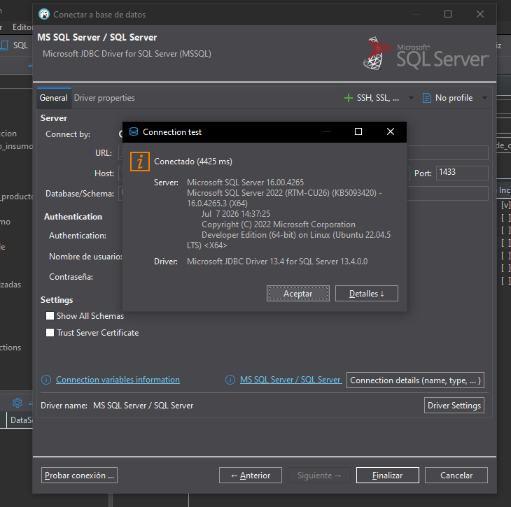
 
**Registro:**
 
La conexión fue exitosa sin necesidad de ajustes adicionales: `Conectado (4425 ms)`, confirmando Microsoft SQL Server 2022 RTM-CU26, Developer Edition, corriendo sobre Ubuntu 22.04 dentro del contenedor, accesible vía `127.0.0.1:1433` (redirigido por NAT).
 
 ### 3.9 Backup de la base de datos
 
````bash
sudo docker exec mssql-server /opt/mssql-tools18/bin/sqlcmd -S localhost -U SA -P 'Hornoraiz1704!' -C -Q "BACKUP DATABASE [hornoraiz] TO DISK = N'/backups/backup_mssql_hornoraiz.bak' WITH INIT"
ls -lh ~/ia-lab/backups/backup_mssql_hornoraiz.bak
````
 
**Evidencia (imagen):**
 
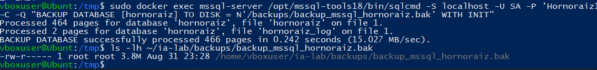
 
**Registro:**
 
Utilicé la convención `backup_<motor>_hornoraiz` desde el inicio de esta sección, para evitar el conflicto de nombres que tuve entre MySQL y PostgreSQL (ver sección 2.8). El backup se procesó correctamente: `BACKUP DATABASE successfully processed 466 pages in 0.242 seconds (15.027 MB/sec)`, generando el archivo `backup_mssql_hornoraiz.bak` (3.8M) en `~/ia-lab/backups/`.
 
Con esto queda completada la instalación, configuración y verificación del motor **SQL Server** para el proyecto HornoRaíz. A pesar de la limitación de 2 GB de RAM en la VM, el motor funcionó correctamente durante toda la sección, confirmando que la estrategia de un solo motor a la vez es viable en este hardware.
 
Antes de continuar con Oracle, subí la memoria de la VM de 2 GB a **3 GB** (con la VM apagada, desde VirtualBox → Configuración → Sistema → Placa base). Al reconectarme, encontré que MySQL, PostgreSQL y SQL Server estaban los tres corriendo simultáneamente (`docker ps` mostró los 3 contenedores activos), dejando solo 918 MiB disponibles según `free -h` — insuficiente para Oracle, el motor más pesado. Los detuve (sin eliminarlos, con `docker compose stop` en vez de `down`, para no perder los datos ya configurados) antes de continuar:
 
````bash
cd ~/ia-lab/services/motores-bd/mysql && sudo docker compose stop
cd ~/ia-lab/services/motores-bd/postgres && sudo docker compose stop
cd ~/ia-lab/services/motores-bd/mssql && sudo docker compose stop
free -h
````
 
Tras detenerlos, `free -h` mostró 2.0 GiB disponibles, suficiente margen para levantar Oracle.
 
## 4. Oracle XE

### 4.1 Crear el archivo `docker-compose.yml`
 
````bash
cat > ~/ia-lab/services/motores-bd/oracle/docker-compose.yml << 'EOF'
services:
  oracle:
    image: gvenzl/oracle-xe:21-slim
    container_name: oracle-server
    restart: unless-stopped
    env_file:
      - .env
    ports:
      - "0.0.0.0:1521:1521"
    volumes:
      - ../../../data/oracle:/opt/oracle/oradata
      - ../../../backups:/backups
    networks:
      - ia-lab-network
    healthcheck:
      test: ["CMD", "healthcheck.sh"]
      interval: 10s
      timeout: 5s
      retries: 10
      start_period: 120s
 
networks:
  ia-lab-network:
    external: true
EOF
````
 
````bash
cat ~/ia-lab/services/motores-bd/oracle/docker-compose.yml
````
 
**Evidencia (imagen):**
 
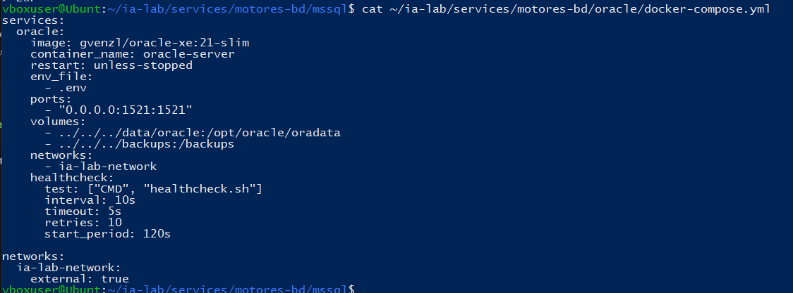
 
**Registro:**
 
Creé el archivo `docker-compose.yml` de Oracle con la imagen `gvenzl/oracle-xe:21-slim`, el puerto `1521`, volúmenes de datos y backups compartidos. Verifiqué el contenido con `cat` para confirmar que el heredoc no introdujo ningún error de formato. El puerto `1521/tcp` ya estaba permitido en UFW desde la configuración inicial. No incluí la clave `command:` en este archivo, ya que en esta imagen sustituiría el entrypoint y el contenedor no arrancaría — el listener de `gvenzl/oracle-xe` ya acepta conexiones remotas por defecto.

### 4.2 Crear el archivo `.env`
 
````bash
cat > ~/ia-lab/services/motores-bd/oracle/.env << 'EOF'
TZ=America/Bogota
ORACLE_PASSWORD=Hornoraiz1704!
ORACLE_DATABASE=hornoraiz
EOF
````
 
**Evidencia (imagen):**
 
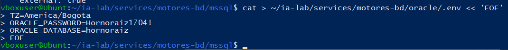
 
**Registro:**
 
Creé el archivo `.env` de Oracle con la zona horaria `America/Bogota`, la contraseña `Hornoraiz1704!` (usé la misma contraseña compleja que en SQL Server, por seguridad, aunque Oracle no la exige tan estrictamente) y el PDB `hornoraiz`. `ORACLE_DATABASE` no es un usuario, es el nombre del PDB (pluggable database) que crea el contenedor; el usuario administrador es `SYSTEM`.

### 4.3 Crear `README.md`
 
````bash
cat > ~/ia-lab/services/motores-bd/oracle/README.md << 'EOF'
# Oracle XE - Motor de Base de Datos
 
> **Acceso remoto habilitado.** Puerto expuesto en `0.0.0.0:1521`.
> **Usuario por defecto:** `SYSTEM`
> **PDB / Service Name:** `hornoraiz`
> **Password:** `Hornoraiz1704!`
 
---
 
## Conectar desde la VM (local)
 
```bash
sudo docker exec -it oracle-server sqlplus 'system/Hornoraiz1704!@//localhost:1521/hornoraiz'
```
EOF
````
 
````bash
cat ~/ia-lab/services/motores-bd/oracle/README.md
````
 
**Evidencia (imagen):**
 
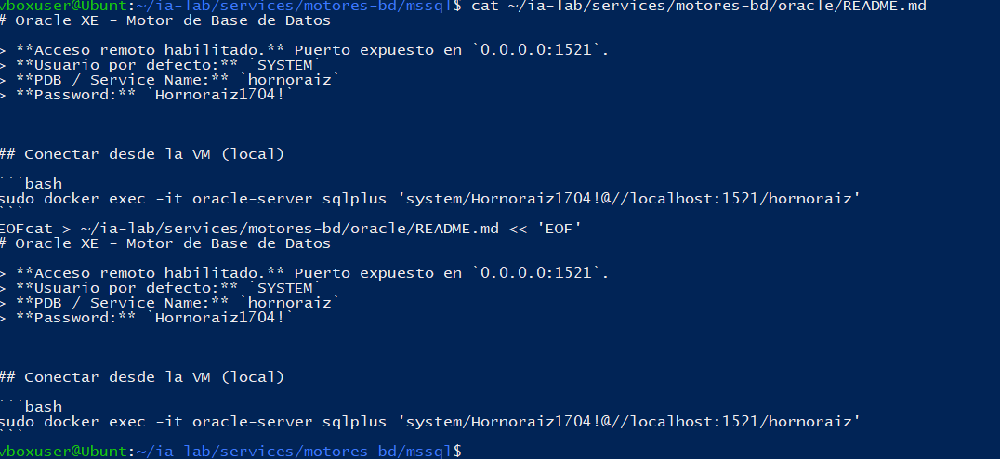
 
**Registro:**
 
Creé el archivo `README.md` de Oracle y comprobé su contenido con `cat`. Documenta el puerto `1521`, el usuario `SYSTEM`, el PDB `hornoraiz` y el comando de conexión local.

### 4.4 Levantar Oracle
 
````bash
cd ~/ia-lab/services/motores-bd/oracle
sudo docker compose up -d
sudo docker ps | grep oracle-server
````
 
**Evidencia (imagen):**
 
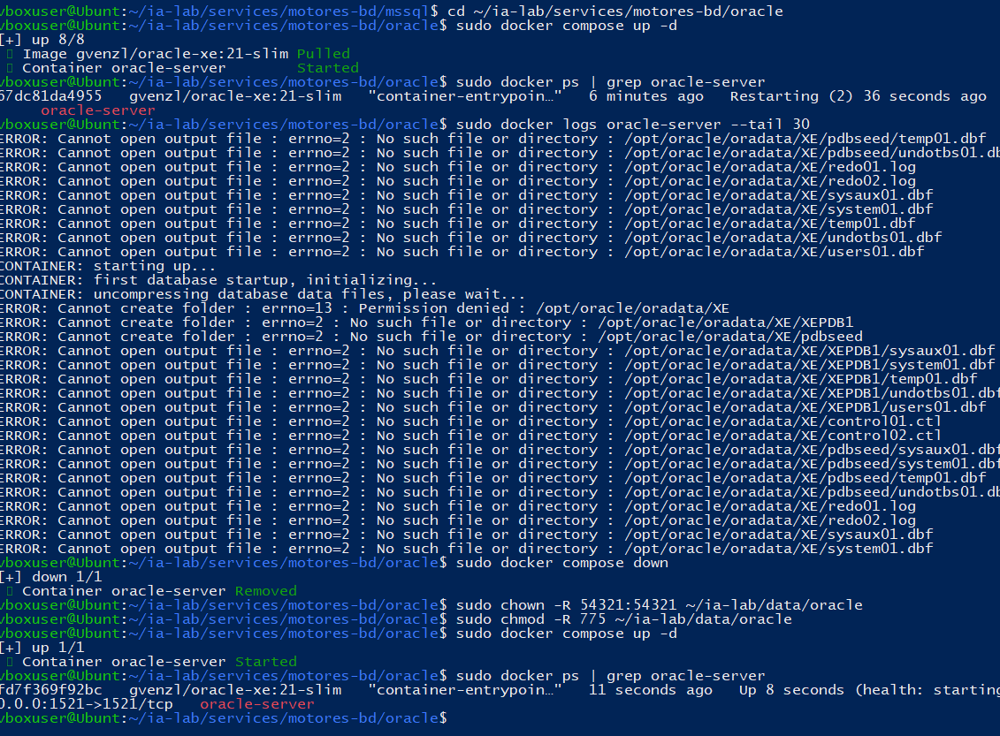
 
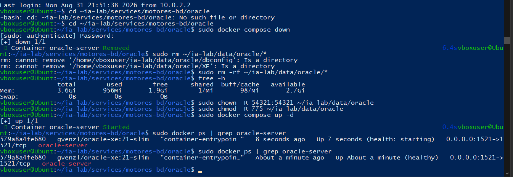
 
**Registro:**
 
Al primer intento, el contenedor quedó en `Restarting (2)`. Los logs mostraron `ERROR: Cannot create folder: errno=13: Permission denied: /opt/oracle/oradata/XE`, el mismo problema que enfrentó el compañero. Lo corregí ajustando el propietario y permisos de la carpeta de datos al UID/GID interno de Oracle:
 
````bash
sudo docker compose down
sudo chown -R 54321:54321 ~/ia-lab/data/oracle
sudo chmod -R 775 ~/ia-lab/data/oracle
sudo docker compose up -d
````
 
Tras esto, el contenedor dejó de reiniciarse, pero quedó estancado en estado `unhealthy` durante varios minutos. Los logs mostraron errores repetidos `unable to spawn jobq slave process` y `Timed out trying to start process MZ00` — un síntoma conocido de Oracle en Docker cuando `/dev/shm` (memoria compartida) es insuficiente, ya que Docker asigna solo 64 MB por defecto. Agregué `shm_size: '1gb'` al `docker-compose.yml`:
 
````yaml
services:
  oracle:
    image: gvenzl/oracle-xe:21-slim
    container_name: oracle-server
    shm_size: '1gb'
    ...
````
 
Al relevantar con este cambio, el contenedor mostró en los logs `DATABASE IS READY TO USE!` y `Pluggable database XEPDB1 opened read write`, pero seguía marcado como `unhealthy`, y un intento de conexión con `sqlplus` falló con `ORA-12152: TNS:unable to send break message`. Esto se debía a que la carpeta de datos había quedado en un estado inconsistente por los arranques fallidos previos (antes de aplicar los permisos y `shm_size` correctos). Además, noté un mensaje `$ORACLE_PASSWORD has been specified but the database is already initialized` — la base ya se había inicializado parcialmente con datos corruptos de un intento anterior.
 
Como no había datos válidos que perder, opté por limpiar completamente la carpeta de datos y reinicializar desde cero:
 
````bash
sudo docker compose down
sudo rm -rf ~/ia-lab/data/oracle/*
sudo chown -R 54321:54321 ~/ia-lab/data/oracle
sudo chmod -R 775 ~/ia-lab/data/oracle
sudo docker compose up -d
````
 
Con la carpeta limpia, los permisos correctos y `shm_size: '1gb'` ya en el archivo, Oracle inicializó correctamente y en menos de un minuto quedó `Up About a minute (healthy)`.
 
Durante este proceso, también noté que el arranque de Oracle hacía sentir lenta la PC física completa (Windows), debido a que la VM tiene 3 GB de RAM asignados sobre un equipo con solo 6 GB totales — cerré aplicaciones en Windows para liberar recursos durante la inicialización.

### 4.5 Conectar localmente y crear el usuario y las tablas del proyecto
 
````bash
sudo docker exec -it oracle-server sqlplus 'system/Hornoraiz1704!@//localhost:1521/hornoraiz'
````
 
**Evidencia (imagen):**
 
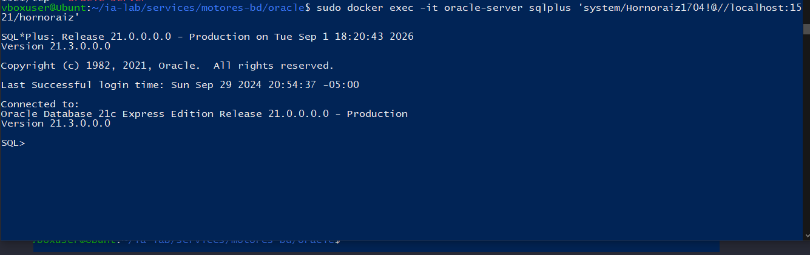
 
**Registro:**
 
Al reinicializar la base desde cero con el `.env` correcto, el PDB efectivamente se creó como `hornoraiz` (no `XEPDB1` como en el intento corrupto anterior). La conexión con `SYSTEM` fue exitosa: `Connected to: Oracle Database 21c Express Edition Release 21.0.0.0.0`.
 
Creé el usuario `admin`, que uso como esquema del proyecto:
 
````sql
CREATE USER admin IDENTIFIED BY "1704" DEFAULT TABLESPACE USERS QUOTA UNLIMITED ON USERS;
GRANT CONNECT, RESOURCE TO admin;
````
 
**Evidencia (imagen):**
 
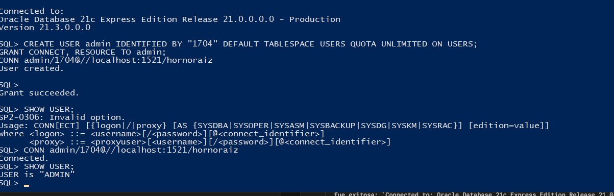
 
**Registro:**
 
Oracle confirmó `User created.` y `Grant succeeded.`. Al pegar varios comandos SQL*Plus juntos (incluyendo `CONN`), el intérprete se confundió y arrojó `SP2-0306: Invalid option` al ejecutar `SHOW USER` inmediatamente después. Lo resolví ejecutando `CONN admin/1704@//localhost:1521/hornoraiz` como comando independiente: respondió `Connected.`, y `SHOW USER` confirmó `USER is "ADMIN"`.
 
Ya dentro del esquema `admin`, creé las 11 tablas del modelo, adaptando la sintaxis de la misma inferencia de llaves foráneas usada en los otros tres motores (`NUMBER GENERATED BY DEFAULT AS IDENTITY` en vez de auto-incremento, `CONSTRAINT ... FOREIGN KEY` con nombre explícito, `VARCHAR2` en vez de `VARCHAR`):
 
````sql
CREATE TABLE producto (
  id NUMBER GENERATED BY DEFAULT AS IDENTITY PRIMARY KEY,
  sku VARCHAR2(50) NOT NULL UNIQUE,
  nombre VARCHAR2(100) NOT NULL,
  descripcion VARCHAR2(255),
  precio NUMBER(10, 2) NOT NULL,
  is_active NUMBER(1) DEFAULT 1 NOT NULL
);
 
CREATE TABLE insumo (
  id NUMBER GENERATED BY DEFAULT AS IDENTITY PRIMARY KEY,
  codigo VARCHAR2(50) NOT NULL UNIQUE,
  nombre VARCHAR2(100) NOT NULL,
  unidad_medida VARCHAR2(30) NOT NULL,
  stock_minimo NUMBER(10, 2) DEFAULT 0 NOT NULL,
  is_active NUMBER(1) DEFAULT 1 NOT NULL
);
 
CREATE TABLE receta (
  id NUMBER GENERATED BY DEFAULT AS IDENTITY PRIMARY KEY,
  producto_id NUMBER NOT NULL,
  nombre VARCHAR2(100) NOT NULL,
  descripcion VARCHAR2(255),
  is_active NUMBER(1) DEFAULT 1 NOT NULL,
  created_at TIMESTAMP DEFAULT CURRENT_TIMESTAMP,
  updated_at TIMESTAMP DEFAULT CURRENT_TIMESTAMP,
  CONSTRAINT fk_receta_producto FOREIGN KEY (producto_id) REFERENCES producto(id)
);
 
CREATE TABLE receta_insumo (
  id NUMBER GENERATED BY DEFAULT AS IDENTITY PRIMARY KEY,
  principal_id NUMBER NOT NULL,
  relacionado_id NUMBER NOT NULL,
  datos_relacion VARCHAR2(255),
  is_active NUMBER(1) DEFAULT 1 NOT NULL,
  CONSTRAINT fk_ri_receta FOREIGN KEY (principal_id) REFERENCES receta(id),
  CONSTRAINT fk_ri_insumo FOREIGN KEY (relacionado_id) REFERENCES insumo(id)
);
 
CREATE TABLE lote_produccion (
  id NUMBER GENERATED BY DEFAULT AS IDENTITY PRIMARY KEY,
  receta_id NUMBER NOT NULL,
  nombre VARCHAR2(100) NOT NULL,
  descripcion VARCHAR2(255),
  is_active NUMBER(1) DEFAULT 1 NOT NULL,
  created_at TIMESTAMP DEFAULT CURRENT_TIMESTAMP,
  updated_at TIMESTAMP DEFAULT CURRENT_TIMESTAMP,
  CONSTRAINT fk_lote_receta FOREIGN KEY (receta_id) REFERENCES receta(id)
);
 
CREATE TABLE movimiento_insumo (
  id NUMBER GENERATED BY DEFAULT AS IDENTITY PRIMARY KEY,
  lote_produccion_id NUMBER,
  insumo_id NUMBER NOT NULL,
  tipo VARCHAR2(50) NOT NULL,
  fecha TIMESTAMP NOT NULL,
  cantidad NUMBER(10, 2) NOT NULL,
  observaciones VARCHAR2(1000),
  estado VARCHAR2(30) NOT NULL,
  CONSTRAINT fk_mi_lote FOREIGN KEY (lote_produccion_id) REFERENCES lote_produccion(id),
  CONSTRAINT fk_mi_insumo FOREIGN KEY (insumo_id) REFERENCES insumo(id)
);
 
CREATE TABLE venta (
  id NUMBER GENERATED BY DEFAULT AS IDENTITY PRIMARY KEY,
  cliente_id NUMBER,
  fecha TIMESTAMP NOT NULL,
  subtotal NUMBER(10, 2) NOT NULL,
  impuestos NUMBER(10, 2) DEFAULT 0 NOT NULL,
  total NUMBER(10, 2) NOT NULL,
  estado VARCHAR2(30) NOT NULL
);
 
CREATE TABLE venta_detalle (
  id NUMBER GENERATED BY DEFAULT AS IDENTITY PRIMARY KEY,
  cabecera_id NUMBER NOT NULL,
  item_id NUMBER NOT NULL,
  cantidad NUMBER(10, 2) NOT NULL,
  valor_unitario NUMBER(10, 2) NOT NULL,
  total NUMBER(10, 2) NOT NULL,
  observaciones VARCHAR2(1000),
  CONSTRAINT fk_vd_venta FOREIGN KEY (cabecera_id) REFERENCES venta(id),
  CONSTRAINT fk_vd_producto FOREIGN KEY (item_id) REFERENCES producto(id)
);
 
CREATE TABLE pago (
  id NUMBER GENERATED BY DEFAULT AS IDENTITY PRIMARY KEY,
  referencia_tipo VARCHAR2(50) NOT NULL,
  referencia_id NUMBER NOT NULL,
  metodo VARCHAR2(50) NOT NULL,
  monto NUMBER(10, 2) NOT NULL,
  fecha TIMESTAMP NOT NULL,
  estado VARCHAR2(30) NOT NULL
);
 
CREATE TABLE promocion (
  id NUMBER GENERATED BY DEFAULT AS IDENTITY PRIMARY KEY,
  nombre VARCHAR2(100) NOT NULL,
  descripcion VARCHAR2(255),
  is_active NUMBER(1) DEFAULT 1 NOT NULL,
  created_at TIMESTAMP DEFAULT CURRENT_TIMESTAMP,
  updated_at TIMESTAMP DEFAULT CURRENT_TIMESTAMP
);
 
CREATE TABLE promocion_producto (
  id NUMBER GENERATED BY DEFAULT AS IDENTITY PRIMARY KEY,
  promocion_id NUMBER NOT NULL,
  producto_id NUMBER NOT NULL,
  is_active NUMBER(1) DEFAULT 1 NOT NULL,
  CONSTRAINT fk_pp_promocion FOREIGN KEY (promocion_id) REFERENCES promocion(id),
  CONSTRAINT fk_pp_producto FOREIGN KEY (producto_id) REFERENCES producto(id)
);
````
 
````sql
SELECT owner, table_name FROM all_tables WHERE owner = 'ADMIN' ORDER BY table_name;
````
 
**Evidencia (imagen):**
 
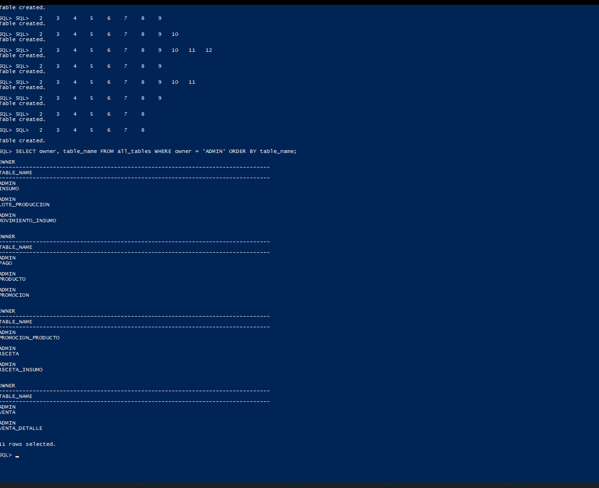
 
**Registro:**
 
Las 11 instrucciones `CREATE TABLE` se ejecutaron sin errores (`Table created.` en cada una). La consulta a `all_tables` filtrando por el propietario `ADMIN` confirmó las 11 tablas: `INSUMO`, `LOTE_PRODUCCION`, `MOVIMIENTO_INSUMO`, `PAGO`, `PRODUCTO`, `PROMOCION`, `PROMOCION_PRODUCTO`, `RECETA`, `RECETA_INSUMO`, `VENTA`, `VENTA_DETALLE` — `11 rows selected`.

### 4.6 Conectar remotamente desde DBeaver
 
- **Motor:** Oracle
- **Host:** `127.0.0.1`
- **Port:** `1521`
- **Database (Service Name):** `hornoraiz`
- **Username:** `admin`
- **Password:** `1704`
- **Role:** `Normal`
**Evidencia (imagen):**
 
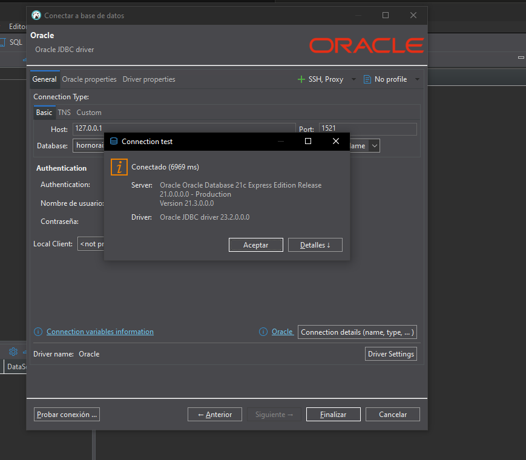
 
**Registro:**
 
La conexión fue exitosa: `Conectado (6969 ms)`, confirmando Oracle Database 21c Express Edition Release 21.0.0.0.0 a través de `127.0.0.1:1521` (redirigido por NAT), usando el driver JDBC de Oracle 23.2.0.0.

### 4.7 Backup de la base de datos

```bash
sudo docker exec oracle-server expdp 'system/Hornoraiz1704!@//localhost:1521/hornoraiz' directory=DATA_PUMP_DIR dumpfile=backup_oracle_hornoraiz.dmp logfile=backup_oracle_hornoraiz.log
```

**Evidencia (imagen):**

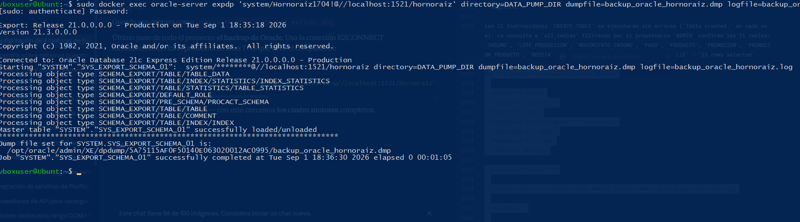

**Registro:**

Usé la conexión EZCONNECT (`system/Hornoraiz1704!@//localhost:1521/hornoraiz`) directamente en vez de un alias TNS, evitando así el error `ORA-12154` que enfrentó el compañero en su primer intento. El proceso `expdp` procesó correctamente los objetos del esquema (`TABLE_DATA`, `INDEX_STATISTICS`, `TABLE_STATISTICS`, etc.) y completó el job exitosamente: `Job "SYSTEM"."SYS_EXPORT_SCHEMA_01" successfully completed`, generando `backup_oracle_hornoraiz.dmp` dentro del directorio `DATA_PUMP_DIR` del contenedor.

Con esto queda completada la instalación, configuración y verificación del motor **Oracle XE** para el proyecto HornoRaíz — el más exigente de los cuatro en cuanto a recursos, requiriendo tanto la corrección de permisos de la carpeta de datos como el ajuste de memoria compartida (`shm_size`) y una reinicialización completa tras un primer intento con datos corruptos.

# Conclusión

Durante el desarrollo de este taller instalé, configuré y verifiqué satisfactoriamente los cuatro motores de bases de datos solicitados (MySQL, PostgreSQL, MS SQL Server y Oracle XE) sobre una máquina virtual de VirtualBox con Ubuntu 26.04 y Docker, en vez de WSL2 como usaron el docente y el resto de mis compañeros. En cada motor creé la base de datos `hornoraiz` correspondiente a mi proyecto final asignado (**HornoRaíz - Producción y venta de panadería**), configuré los contenedores Docker, revisé los registros de ejecución, habilité el acceso remoto y comprobé las conexiones locales y remotas mediante DBeaver, además de generar el backup correspondiente en cada caso.

El proceso me permitió resolver diferentes situaciones técnicas específicas de trabajar en VirtualBox en vez de WSL2: la configuración de red (un intento fallido con Bridged sobre WiFi que me dejó sin conexión al host, resuelto migrando a NAT con Port Forwarding), la instalación de Docker desde cero (a diferencia del compañero, que ya lo tenía preinstalado), la falta temporal de paquetes específicos (`mssql-tools18`) para una versión de Ubuntu demasiado reciente, y sobre todo los problemas de memoria de Oracle en un equipo con recursos limitados (permisos de la carpeta de datos, memoria compartida insuficiente, y una reinicialización completa tras un estado de datos corrupto). También creé y verifiqué las 11 tablas del proyecto **HornoRaíz**, infiniendo las llaves foráneas necesarias para completar las relaciones descritas en la especificación del proyecto, manteniendo el mismo modelo en los cuatro motores con la sintaxis correspondiente a cada uno.

Este informe de trazabilidad reúne los comandos utilizados, las configuraciones aplicadas, los problemas encontrados, las soluciones implementadas y las evidencias obtenidas durante el proceso.

## Firma

**Javier Barros**
Estudiante de Ingeniería de Sistemas
Facultad de Ingeniería
Universidad de La Guajira
Rol: estudiante y responsable de la instalación, configuración y verificación de los cuatro motores
Tutor designado por: Docente Uniguajira, Ing. Jaider Quintero M.
Fecha del informe de trazabilidad: *1 de Septiembre del 2026.*