# Consultas Avanzadas — HornoRaíz

## 1. MySQL

### 1.1 Renombramiento de tablas a inglés (normativa del profesor)

Como requisito para esta tarea, el profesor exige que las tablas estén nombradas en plural y en inglés. Se ejecutó el siguiente script en el editor SQL de DBeaver, sobre la base `hornoraiz` en MySQL, renombrando las 10 tablas del modelo:

```sql
RENAME TABLE
  producto TO products,
  insumo TO supplies,
  receta TO recipes,
  receta_insumo TO recipe_supplies,
  lote_produccion TO production_batches,
  movimiento_insumo TO supply_movements,
  venta TO sales,
  venta_detalle TO sale_details,
  pago TO payments,
  promocion TO promotions;

SHOW TABLES;
```

**Evidencia (imagen):**

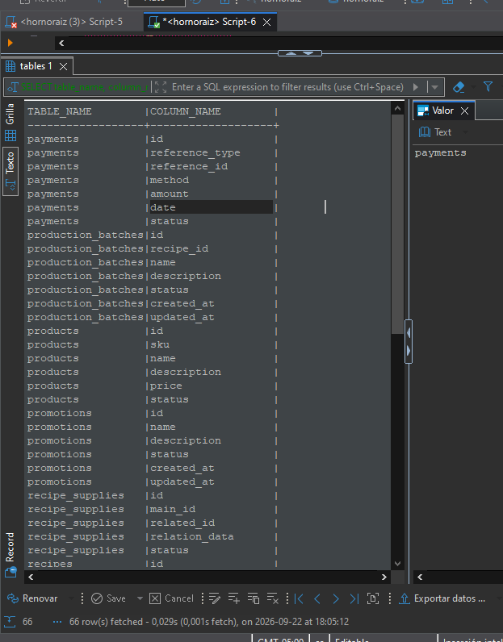

**Resultado:** `SHOW TABLES` confirmó las 10 tablas con sus nuevos nombres en plural e inglés (`products`, `supplies`, `recipes`, `recipe_supplies`, `production_batches`, `supply_movements`, `sales`, `sale_details`, `payments`, `promotions`), sin pérdida de datos ni de las relaciones de Foreign Key existentes, ya que `RENAME TABLE` en MySQL preserva automáticamente las restricciones y los índices asociados.

### 1.2 Renombramiento de columnas a inglés

Con las 10 tablas ya renombradas (Sección 1.1), se renombraron sus columnas siguiendo el mismo criterio de idioma. Además del renombrado de nombres propios de columna (`nombre → name`, `descripcion → description`, `fecha → date`, `cantidad → quantity`, `estado`/`is_active → status`, etc.), se aplicó una convención adicional: la columna booleana `is_active`, presente en `products`, `supplies`, `recipes`, `recipe_supplies`, `production_batches` y `promotions`, se renombró también a `status`, unificando su nombre con la columna `status` de flujo de negocio ya existente en `sales`, `payments` y `supply_movements` (renombrada desde `estado`).

```sql
ALTER TABLE products
  RENAME COLUMN nombre TO name,
  RENAME COLUMN descripcion TO description,
  RENAME COLUMN precio TO price;

ALTER TABLE supplies
  RENAME COLUMN codigo TO code,
  RENAME COLUMN nombre TO name,
  RENAME COLUMN unidad_medida TO unit_of_measure,
  RENAME COLUMN stock_minimo TO min_stock;

ALTER TABLE recipes
  RENAME COLUMN producto_id TO product_id,
  RENAME COLUMN nombre TO name,
  RENAME COLUMN descripcion TO description;

ALTER TABLE recipe_supplies
  RENAME COLUMN principal_id TO main_id,
  RENAME COLUMN relacionado_id TO related_id,
  RENAME COLUMN datos_relacion TO relation_data;

ALTER TABLE production_batches
  RENAME COLUMN receta_id TO recipe_id,
  RENAME COLUMN nombre TO name,
  RENAME COLUMN descripcion TO description;

ALTER TABLE supply_movements
  RENAME COLUMN lote_produccion_id TO production_batch_id,
  RENAME COLUMN insumo_id TO supply_id,
  RENAME COLUMN tipo TO type,
  RENAME COLUMN fecha TO date,
  RENAME COLUMN cantidad TO quantity,
  RENAME COLUMN observaciones TO notes,
  RENAME COLUMN estado TO status;

ALTER TABLE sales
  RENAME COLUMN cliente_id TO client_id,
  RENAME COLUMN fecha TO date,
  RENAME COLUMN impuestos TO taxes,
  RENAME COLUMN estado TO status;

ALTER TABLE sale_details
  RENAME COLUMN cabecera_id TO header_id,
  RENAME COLUMN cantidad TO quantity,
  RENAME COLUMN valor_unitario TO unit_price,
  RENAME COLUMN observaciones TO notes;

ALTER TABLE payments
  RENAME COLUMN referencia_tipo TO reference_type,
  RENAME COLUMN referencia_id TO reference_id,
  RENAME COLUMN metodo TO method,
  RENAME COLUMN monto TO amount,
  RENAME COLUMN fecha TO date,
  RENAME COLUMN estado TO status;

ALTER TABLE promotions
  RENAME COLUMN nombre TO name,
  RENAME COLUMN descripcion TO description;

ALTER TABLE products RENAME COLUMN is_active TO status;
ALTER TABLE supplies RENAME COLUMN is_active TO status;
ALTER TABLE recipes RENAME COLUMN is_active TO status;
ALTER TABLE recipe_supplies RENAME COLUMN is_active TO status;
ALTER TABLE production_batches RENAME COLUMN is_active TO status;
ALTER TABLE promotions RENAME COLUMN is_active TO status;
```

**Evidencia (imagen):**


**Resultado:** se verificaron los nombres finales mediante consulta a `INFORMATION_SCHEMA.COLUMNS`, confirmando que las 10 tablas quedaron con sus columnas en inglés. Se documenta como advertencia para las consultas siguientes: la columna `status` no tiene un tipo ni dominio de valores uniforme entre tablas — es booleano (`0`/`1`, ex `is_active`) en `products`, `supplies`, `recipes`, `recipe_supplies`, `production_batches` y `promotions`, pero es texto de estado de flujo de negocio (ex `estado`) en `sales`, `payments` y `supply_movements`. Cualquier consulta que filtre o compare por `status` debe considerar esta diferencia según la tabla involucrada.

**Nota adicional:** `sale_details` no tiene columna `status` — no existía `is_active` ni `estado` en su definición original, y esa ausencia se mantuvo sin cambios.

### 1.3 Carga de datos — tabla `products`

Se generaron 100 registros de prueba para la tabla `products`, en un archivo CSV separado por `;`, con las columnas `id`, `sku`, `name`, `description`, `price`, `status`, correspondientes al esquema ya renombrado en la Sección 1.2.

**Evidencia (imagen):**

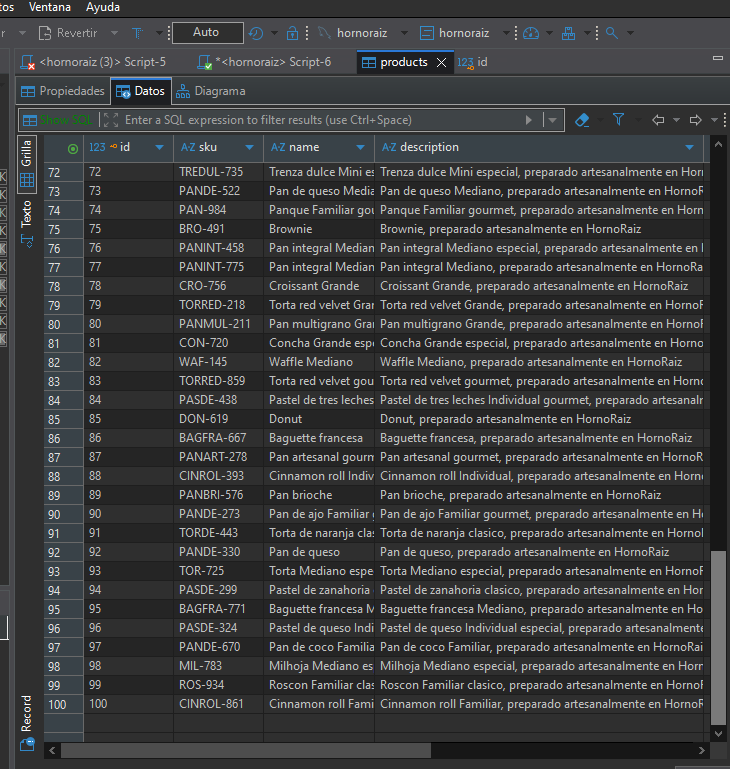

**Resultado:** se importaron los 100 registros en la tabla `products` sin errores, configurando el delimitador `;` en el asistente de importación de DBeaver.

### 1.4 Carga de datos — tabla `supplies`

Se generaron 100 registros de prueba para la tabla `supplies`, en un archivo CSV separado por `;`, con las columnas `id`, `code`, `name`, `unit_of_measure`, `min_stock`, `status`.

**Evidencia (imagen):**

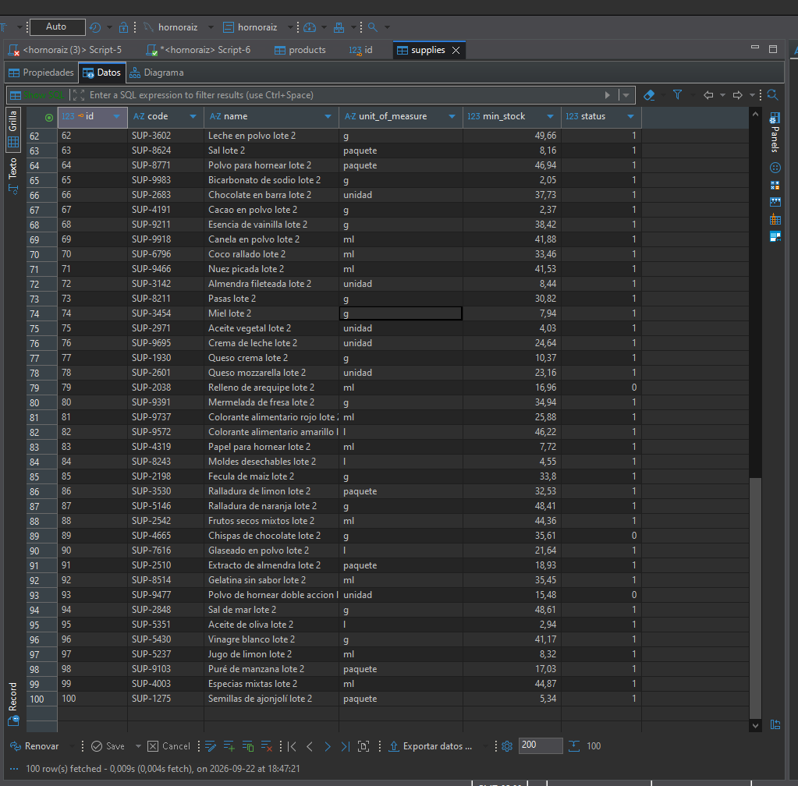

**Resultado:** se importaron los 100 registros en la tabla `supplies` sin errores, configurando el delimitador `;` en el asistente de importación de DBeaver.

### 1.5 Carga de datos — tabla `recipes`

Se generaron 100 registros de prueba para la tabla `recipes`, en un archivo CSV separado por `;`, con las columnas `id`, `product_id`, `name`, `description`, `status`, `created_at`, `updated_at`. Los valores de `product_id` se generaron dentro del rango 1-100, referenciando los productos ya cargados en la Sección 1.3, respetando la Foreign Key hacia `products`.

**Resultado:** se importaron los 100 registros en la tabla `recipes` sin errores. Se incluyeron 20 productos con una segunda receta asociada, reflejando la relación `Producto 1:N Receta` de la narrativa del proyecto (donde una sola versión de receta puede estar vigente por producto); estas recetas alternativas se marcaron con `status = 0` para simular versiones no vigentes.

**Evidencia (imagen):**

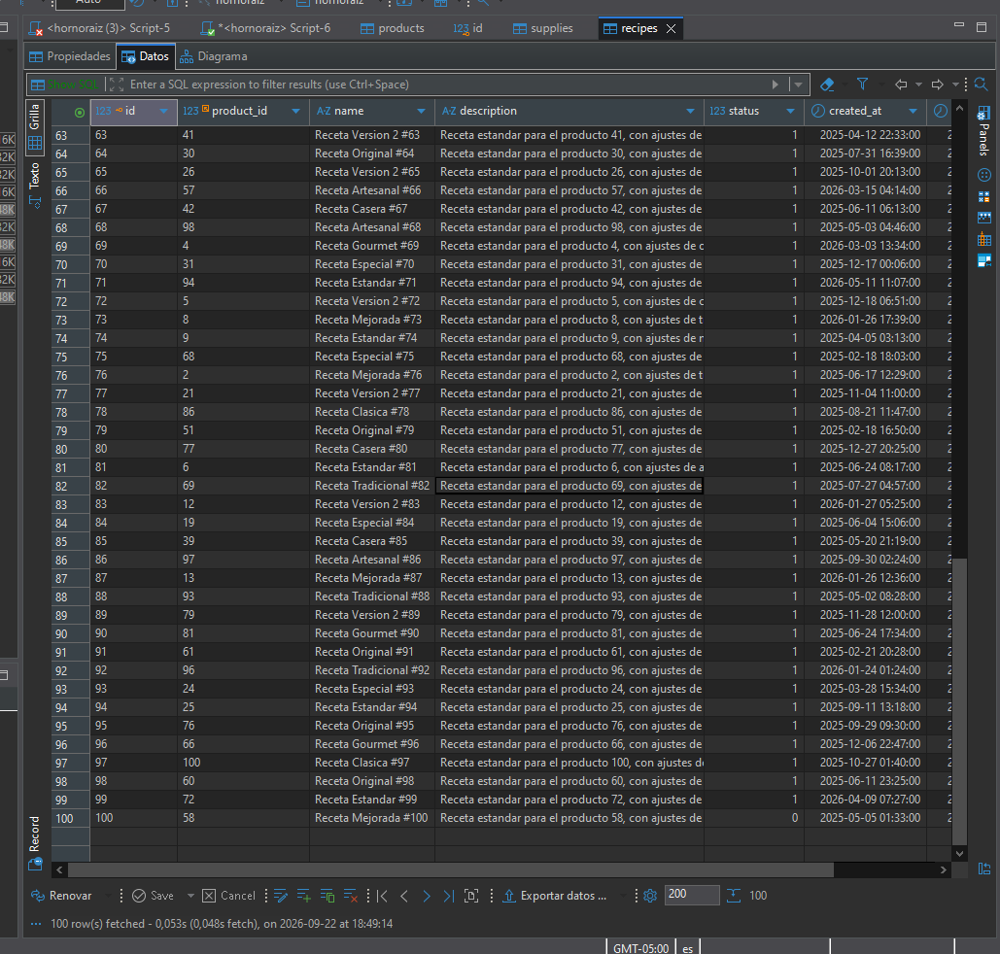

### 1.6 Carga de datos — tabla `recipe_supplies`

Se generaron 100 registros de prueba para la tabla `recipe_supplies`, en un archivo CSV separado por `;`, con las columnas `id`, `main_id`, `related_id`, `relation_data`, `status`. Los valores de `main_id` referencian `recipes(id)` y `related_id` referencian `supplies(id)`, ambos en el rango 1-100, sin pares repetidos, resolviendo la relación N:M entre `recipes` y `supplies`.

**Resultado:** se importaron los 100 registros sin errores. La columna `relation_data` se generó como texto libre combinando cantidad y unidad de medida (ej. `"6.93 l"`), dado que su tipo no define una estructura fija.

**Evidencia (imagen):**

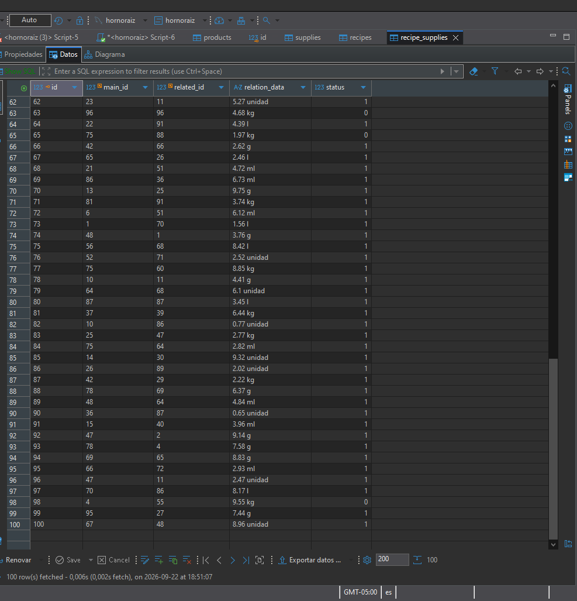

### 1.7 Carga de datos — tabla `production_batches`

Se generaron 100 registros de prueba para la tabla `production_batches`, en un archivo CSV separado por `;`, con las columnas `id`, `recipe_id`, `name`, `description`, `status`, `created_at`, `updated_at`. Los valores de `recipe_id` se generaron dentro del rango 1-100, referenciando las recetas ya cargadas en la Sección 1.5, respetando la Foreign Key hacia `recipes`.

**Resultado:** se importaron los 100 registros sin errores. Se usó una distribución de `status` con 85% activo / 15% inactivo, para dar variedad a las consultas de filtrado posteriores.

**Evidencia (imagen):**

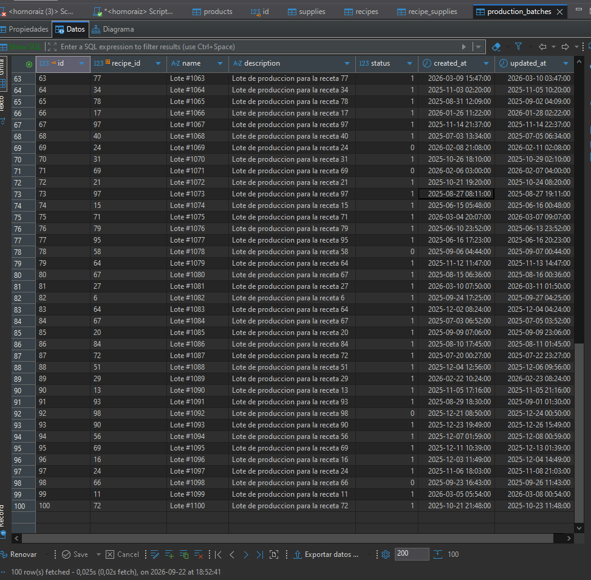

### 1.8 Carga de datos — tabla `supply_movements`

Se generaron 100 registros de prueba para la tabla `supply_movements`, en un archivo CSV separado por `;`, con las columnas `id`, `production_batch_id`, `supply_id`, `type`, `date`, `quantity`, `notes`, `status`. `supply_id` se generó siempre dentro del rango 1-100 (obligatorio), mientras que `production_batch_id` se dejó vacío en aproximadamente el 30% de las filas, reflejando su carácter nullable — movimientos sin lote de producción asociado, como compras directas o mermas de bodega.

**Resultado:** se importaron los 100 registros sin errores, verificando que las celdas vacías de `production_batch_id` se interpretaran como `NULL` en el asistente de importación. Los valores de `type` (`IN`, `OUT`, `ADJUSTMENT`) y `status` (`completed`, `pending`, `cancelled`) son texto de flujo de negocio, distinto del `status` booleano usado en `products`, `supplies`, `recipes`, `recipe_supplies`, `production_batches` y `promotions` (ver nota de la Sección 1.2).

**Evidencia (imagen):**

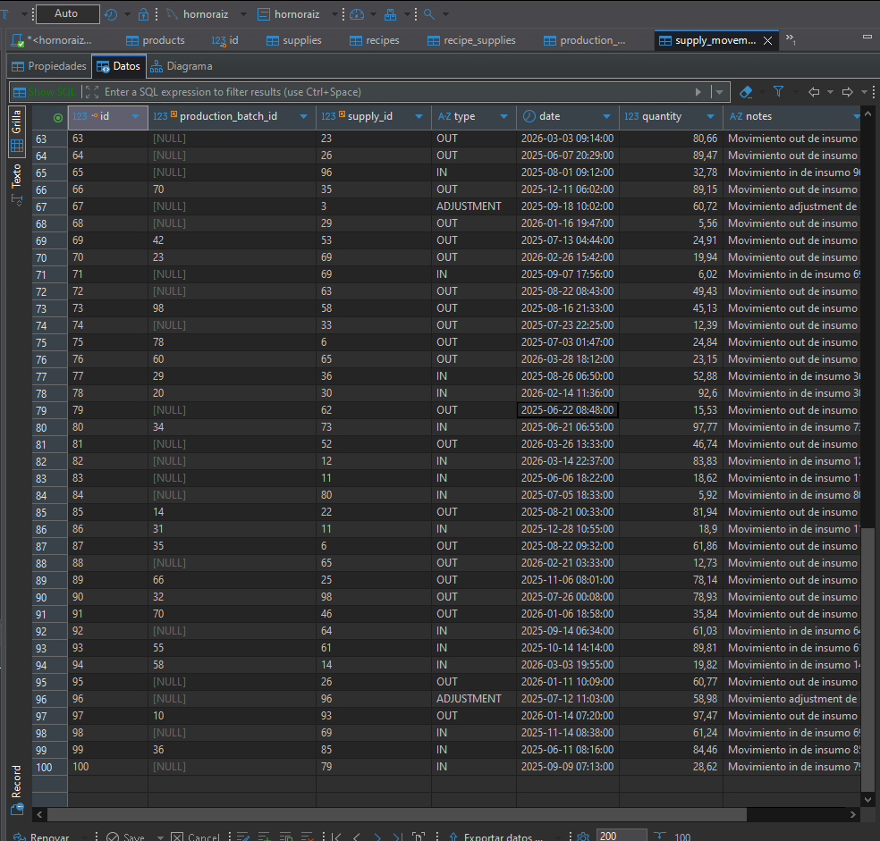

### 1.9 Carga de datos — tabla `sales`

Se generaron 100 registros de prueba para la tabla `sales`, en un archivo CSV separado por `;`, con las columnas `id`, `client_id`, `date`, `subtotal`, `taxes`, `total`, `status`. `client_id` se dejó vacío en aproximadamente el 40% de las filas, simulando ventas de mostrador sin cliente registrado — consistente con la ausencia de Foreign Key para esta columna, ya documentada en el modelo original. `taxes` se calculó como el 19% del `subtotal`, y `total` como la suma de ambos, para mantener consistencia numérica entre las tres columnas.

**Resultado:** se importaron los 100 registros sin errores. `status` (`paid`, `pending`, `cancelled`) es texto de flujo de negocio, distinto del `status` booleano usado en otras tablas del modelo (ver nota de la Sección 1.2).

**Evidencia (imagen):**

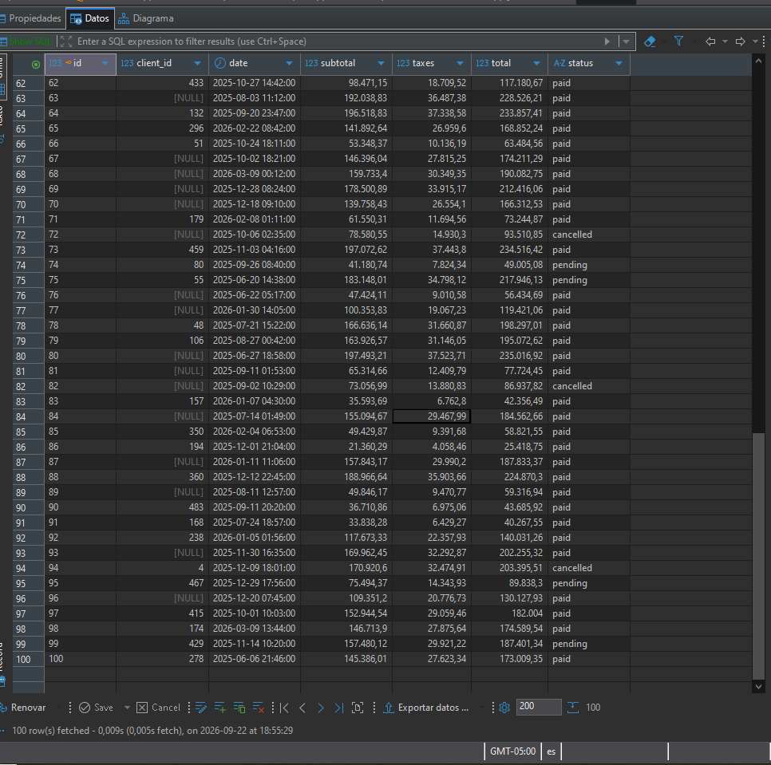

### 1.10 Carga de datos — tabla `sale_details`

Se generaron 100 registros de prueba para la tabla `sale_details`, en un archivo CSV separado por `;`, con las columnas `id`, `header_id`, `item_id`, `quantity`, `unit_price`, `total`, `notes`. `header_id` referencia `sales(id)` e `item_id` referencia `products(id)`, ambos en el rango 1-100. `total` se calculó como `quantity × unit_price`, garantizando consistencia interna en cada fila.

**Resultado:** se importaron los 100 registros sin errores.

**Nota:** `header_id` se generó de forma independiente al `subtotal` registrado en `sales` (Sección 1.9); la suma de `total` por `header_id` no necesariamente coincide con el `subtotal` de la venta correspondiente, al tratarse de dos conjuntos de datos generados por separado para fines de prueba.

**Evidencia (imagen):**

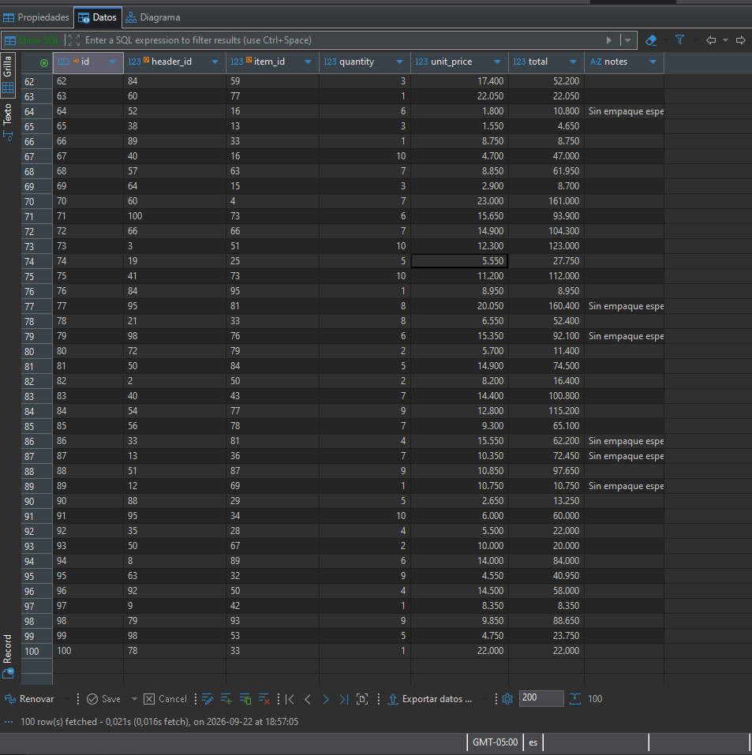

### 1.11 Carga de datos — tabla `payments`

Se generaron 100 registros de prueba para la tabla `payments`, en un archivo CSV separado por `;`, con las columnas `id`, `reference_type`, `reference_id`, `method`, `amount`, `date`, `status`. Todos los registros se generaron con `reference_type = 'sale'` y `reference_id` en el rango 1-100, asociando cada pago a una venta de la tabla `sales` (Sección 1.9) por convención de datos, dado que esta columna es polimórfica y no está resguardada por una Foreign Key.

**Resultado:** se importaron los 100 registros sin errores.

**Evidencia (imagen):**

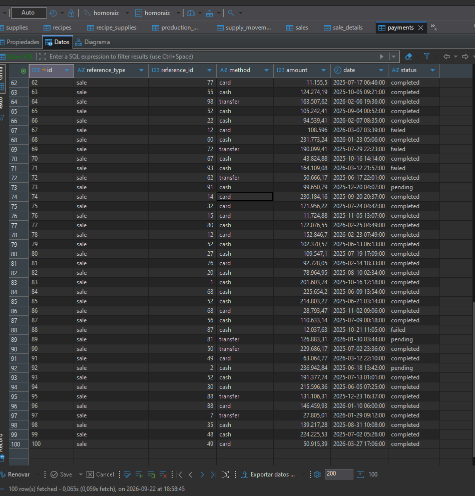

### 1.12 Carga de datos — tabla `promotions`

Se generaron 100 registros de prueba para la tabla `promotions`, en un archivo CSV separado por `;`, con las columnas `id`, `name`, `description`, `status`, `created_at`, `updated_at`. Sin Foreign Key ni tabla puente hacia `products`, respetando la decisión ya documentada para la relación `Promotion N:M Product`.

**Resultado:** se importaron los 100 registros sin errores. Se usó una distribución de `status` con 70% activo / 30% inactivo, simulando promociones ya vencidas para dar variedad a las consultas de filtrado.

**Evidencia (imagen):**

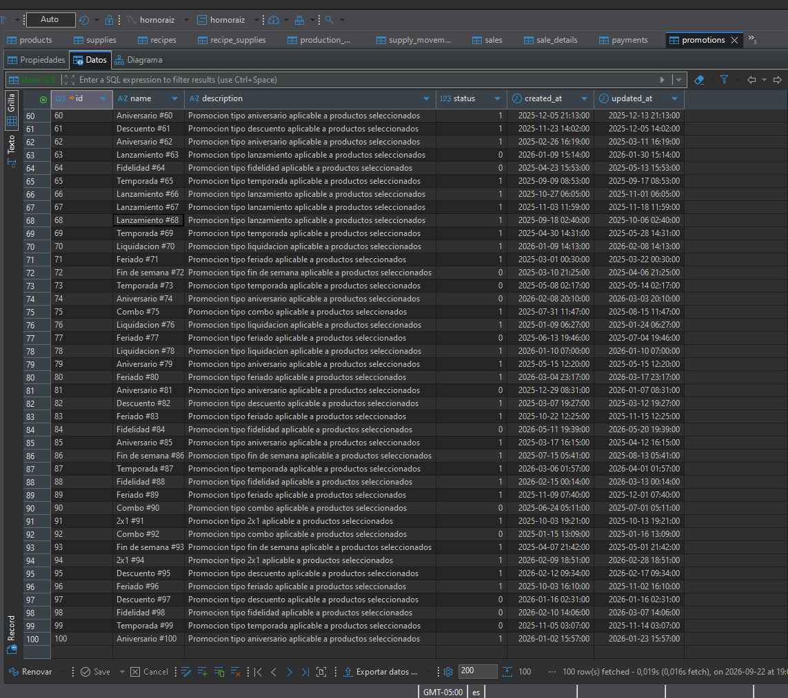

### 1.13 Consultas avanzadas en MySQL

#### 1.13.1 Mostrar algunos de los registros de la tabla `products`

```sql
SELECT sku, name, price, status FROM products;
```

**Evidencia (imagen):**

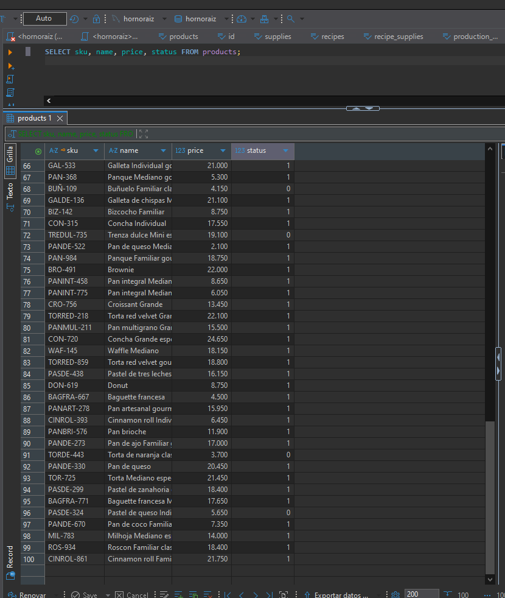

**Resultado:** la consulta devolvió los 100 registros de `products` con sus columnas `sku`, `name`, `price` y `status`, confirmando la carga de datos realizada en la Sección 1.3.

#### 1.13.2 Mostrar de forma ordenada (DESC) las ventas desde su comienzo

```sql
SELECT id, date, subtotal, status FROM sales ORDER BY date DESC;
```

**Evidencia (imagen):**

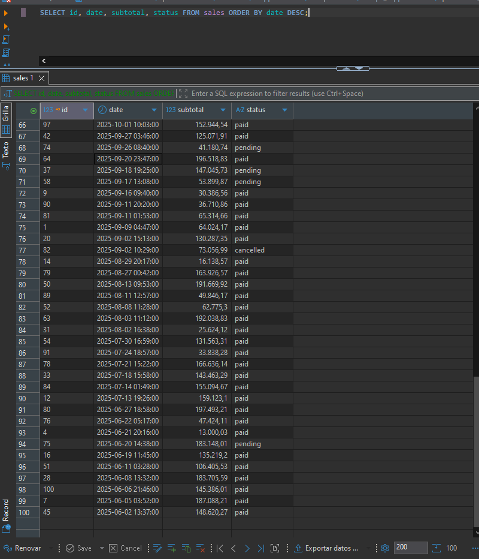

**Resultado:** la consulta devolvió los 100 registros de `sales` ordenados de la fecha más reciente (2026-03-27) a la más antigua (2025-06-02), confirmando que `ORDER BY date DESC` funciona correctamente sobre los datos cargados en la Sección 1.9.

#### 1.13.3 Consultas a múltiples tablas mediante WHERE

```sql
SELECT *
FROM sale_details SD, sales S
WHERE S.id = SD.header_id;
```

**Evidencia (imagen):**

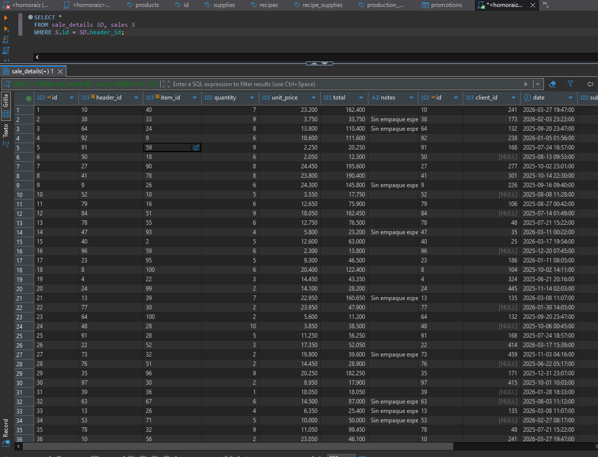

**Resultado:** la consulta devolvió los 100 registros de `sale_details` combinados con su venta correspondiente en `sales`, mediante la condición `S.id = SD.header_id` en la cláusula WHERE.

#### 1.13.4 Consultas a múltiples tablas mediante JOIN

```sql
SELECT S.date, S.status, SD.*
FROM sales AS S
JOIN sale_details AS SD ON (S.id = SD.header_id);
```

**Evidencia (imagen):**

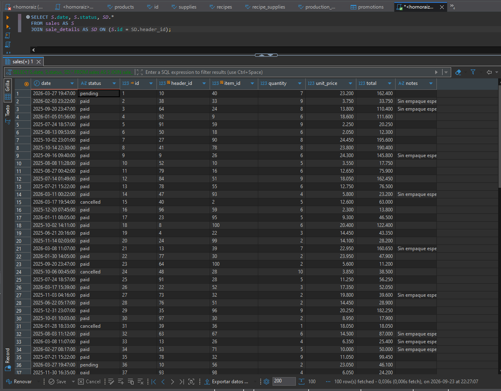

**Resultado:** la consulta devolvió los 100 registros combinando `sales` y `sale_details` mediante `JOIN ... ON`, con el mismo resultado que la Sección 1.13.3 (forma WHERE), confirmando que ambas sintaxis son equivalentes para esta relación.

#### 1.13.5 Condiciones en las consultas / filtros

Para las condiciones se utiliza la cláusula WHERE. Se realiza la misma consulta de la Sección 1.13.3/1.13.4, filtrando por un estado específico de `sales.status`.

```sql
SELECT *
FROM sale_details SD, sales S
WHERE S.id = SD.header_id AND S.status = 'paid';
```

**Evidencia (imagen):**

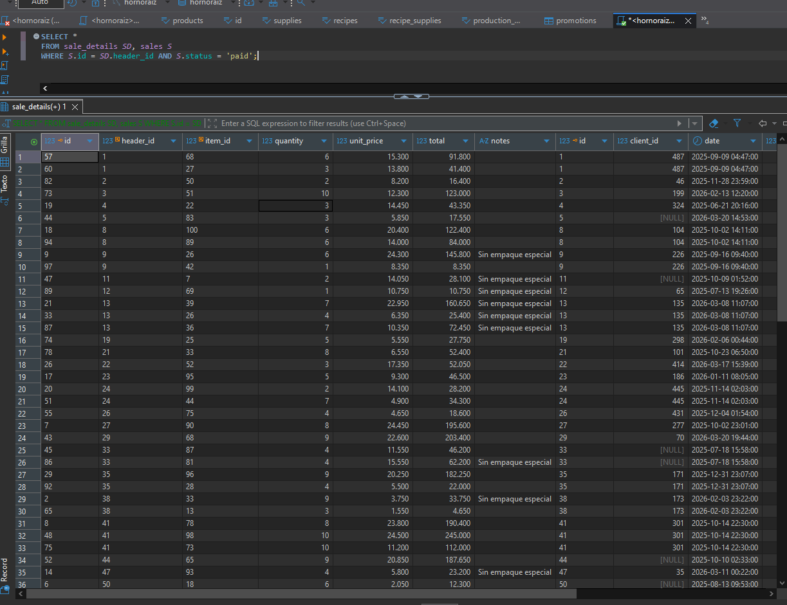

**Resultado:** la consulta devolvió 82 registros con `status = 'paid'`, filtrando del total de 100 combinaciones `sale_details`/`sales`.

```sql
SELECT S.date, S.status, SD.*
FROM sales AS S
JOIN sale_details AS SD ON (S.id = SD.header_id)
WHERE S.status = 'cancelled';
```

**Evidencia (imagen):**

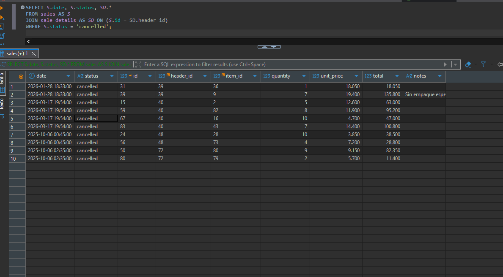

**Resultado:** la consulta devolvió 10 registros con `status = 'cancelled'`, usando la forma JOIN en vez de WHERE para la relación entre tablas.

#### 1.13.6 Consultas con filtros condicional LIKE

```sql
SELECT * FROM products AS P WHERE P.name LIKE 'Pan%';
```

**Evidencia (imagen):**

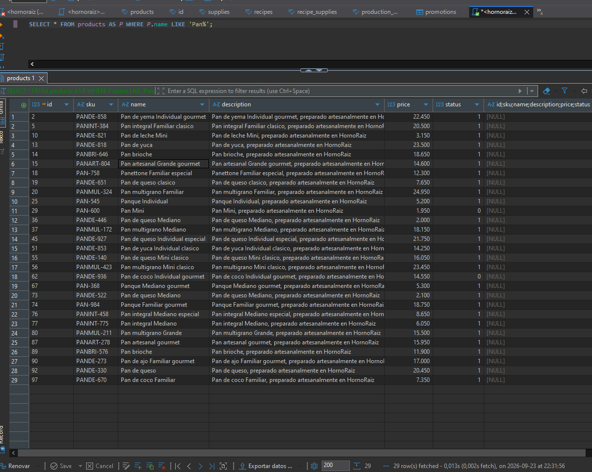

**Resultado:** la consulta devolvió 28 registros cuyo `name` comienza con "Pan" (Pan de yema, Pan integral, Pan de leche, Panettone, etc.), aplicando el operador `LIKE` con comodín al final del patrón.

**Mostrar los productos cuya descripción contenga la palabra "chocolate":**

```sql
SELECT * FROM products AS P WHERE P.description LIKE CONCAT('%','chocolate','%');
```

**Evidencia (imagen):**

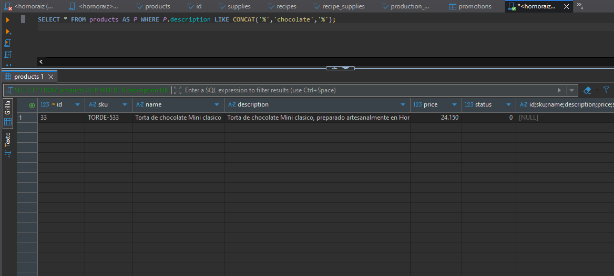

**Resultado:** la consulta devolvió 1 registro (`Torta de chocolate Mini clasico`), usando `CONCAT` para construir el patrón `%chocolate%` y localizar la coincidencia dentro de la descripción, sin importar su posición en el texto.

#### 1.13.7 Consultas con filtros condicionales BETWEEN

```sql
SELECT P.name, P.sku, SD.quantity, SD.total, S.date, PAY.method
FROM products P
JOIN sale_details SD ON P.id = SD.item_id
JOIN sales S ON SD.header_id = S.id
JOIN payments PAY ON PAY.reference_id = S.id AND PAY.reference_type = 'sale'
WHERE PAY.date BETWEEN '2025-06-01 00:00:00' AND '2026-03-30 23:59:59'
ORDER BY PAY.date ASC;
```

**Evidencia (imagen):**

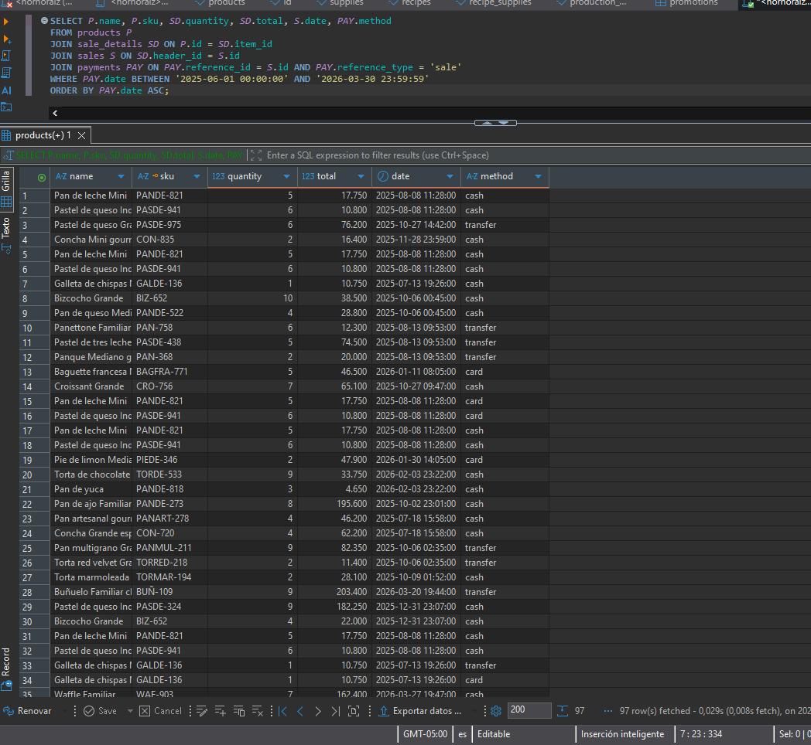

**Resultado:** la consulta combina `products`, `sale_details`, `sales` y `payments` en una cadena de 4 tablas, filtrando por `PAY.date` dentro del rango especificado. Se observan filas repetidas para una misma venta cuando esta tiene múltiples `sale_details` y múltiples `payments` asociados (por ejemplo, "Pan de leche Mini" y "Pastel de queso Individual" aparecen juntos varias veces): esto es el resultado esperado de un JOIN entre dos relaciones 1:N sobre la misma venta, no una duplicación de datos.

#### 1.13.8 Consultas con agrupamiento GROUP BY

**Forma 1 (rango de fechas, con AVG):**
```sql
SELECT S.id, S.date, SUM(PAY.amount) AS total_paid, COUNT(PAY.id) AS payment_count, AVG(PAY.amount) AS avg_payment
FROM sales S
JOIN payments PAY ON PAY.reference_id = S.id AND PAY.reference_type = 'sale'
WHERE PAY.date BETWEEN '2025-06-01 00:00:00' AND '2026-03-30 23:59:59'
GROUP BY S.id, S.date
ORDER BY total_paid DESC;
```

**Evidencia (imagen):**

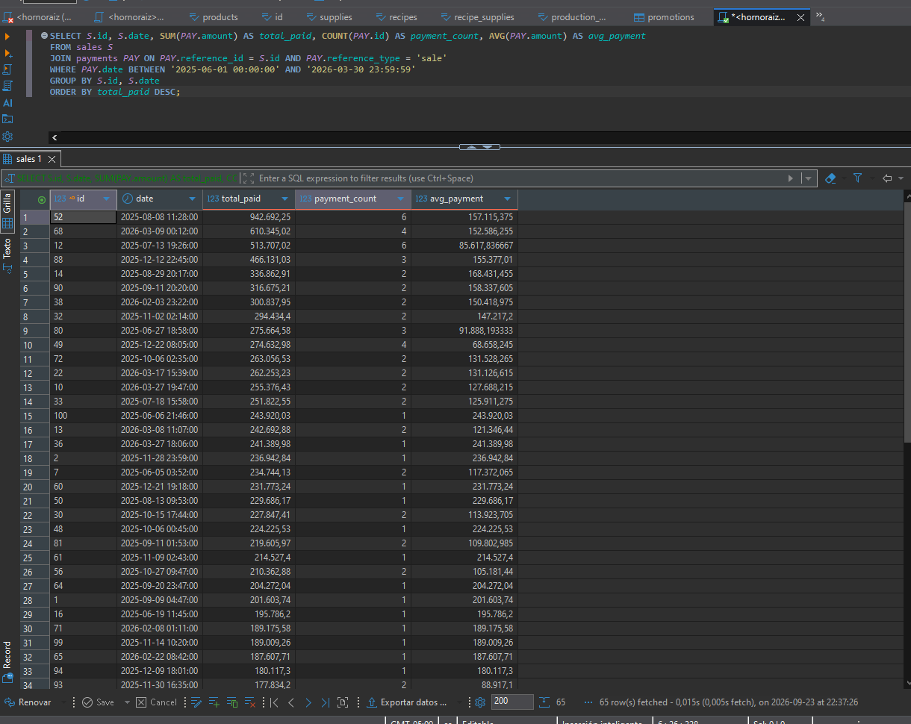

**Resultado:** 62 ventas agrupadas, con el total pagado por cada una (hasta 6 pagos por venta), su cantidad de pagos y el promedio, dentro del rango de fechas indicado. La venta 52 encabeza con $942.692,25 en 6 pagos.

**Forma 2 (filtro por status y method):**
```sql
SELECT S.id, S.date, SUM(PAY.amount) AS total_paid, COUNT(PAY.id) AS payment_count
FROM sales S
JOIN payments PAY ON PAY.reference_id = S.id AND PAY.reference_type = 'sale'
WHERE PAY.status = 'completed' AND PAY.method = 'card'
GROUP BY S.id, S.date
ORDER BY total_paid DESC;
```

**Evidencia (imagen):**

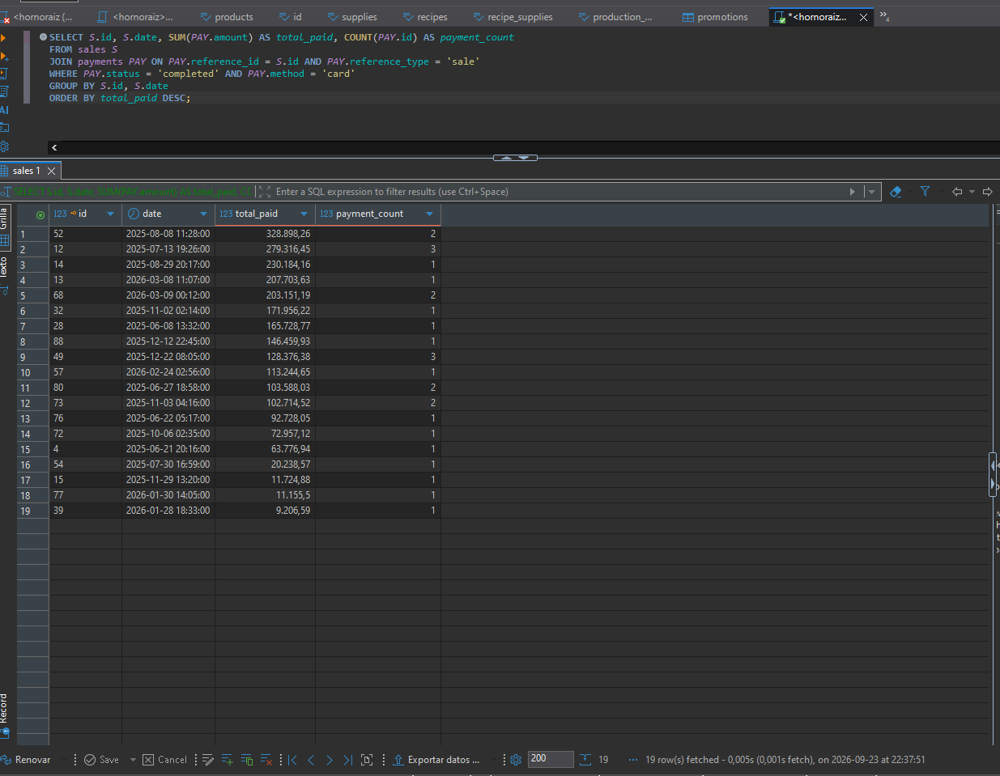

**Resultado:** 19 ventas cumplen la condición `status = 'completed' AND method = 'card'`, encabezadas por la venta 52 con $328.898,26 en 2 pagos.

**Con HAVING:**
```sql
SELECT S.id, S.date, SUM(PAY.amount) AS total_paid, COUNT(PAY.id) AS payment_count
FROM sales S
JOIN payments PAY ON PAY.reference_id = S.id AND PAY.reference_type = 'sale'
GROUP BY S.id, S.date
HAVING SUM(PAY.amount) >= 100000
ORDER BY total_paid DESC;
```

**Evidencia (imagen):**

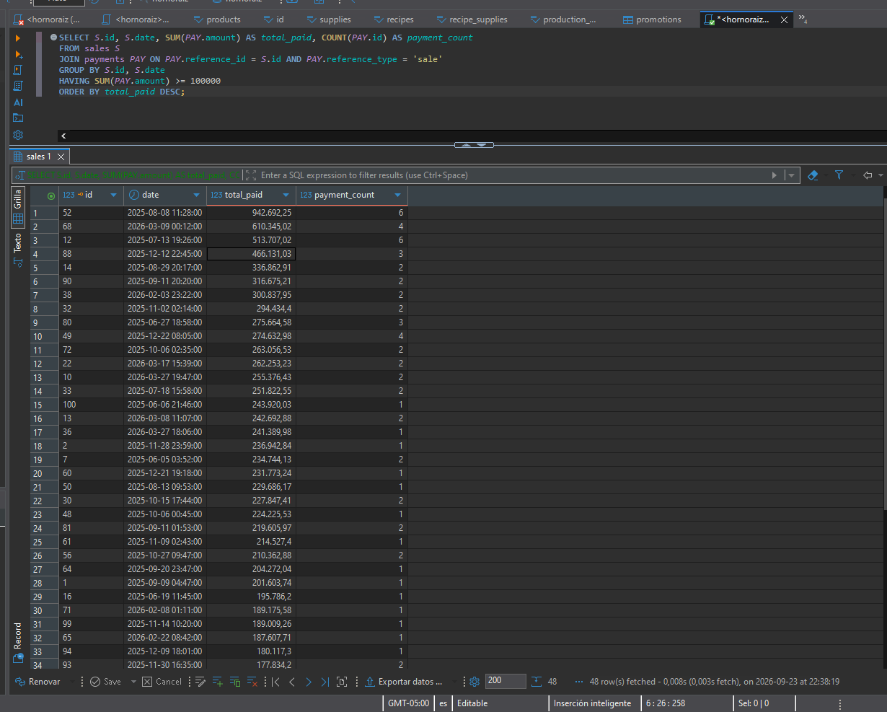

**Resultado:** 47 ventas cumplen la condición `SUM(PAY.amount) >= 100000`, encabezadas por la venta 52 con $942.692,25 en 6 pagos. El conjunto es un subconjunto de la Forma 1 (Sección 1.13.8), filtrado por el umbral establecido en `HAVING`.

#### 1.13.9 Subconsultas y teoría de conjuntos

Mostrar los productos que no han sido vendidos (sin registro en `sale_details`/`sales`) dentro de un rango de fechas específico.

**Forma 1 (subconsulta con NOT IN):**
```sql
SELECT * FROM products AS P
WHERE P.id NOT IN (
  SELECT SD.item_id FROM sale_details SD
  JOIN sales S ON SD.header_id = S.id
  WHERE S.date BETWEEN '2025-06-01' AND '2026-03-30'
);
```

**Evidencia (imagen):**

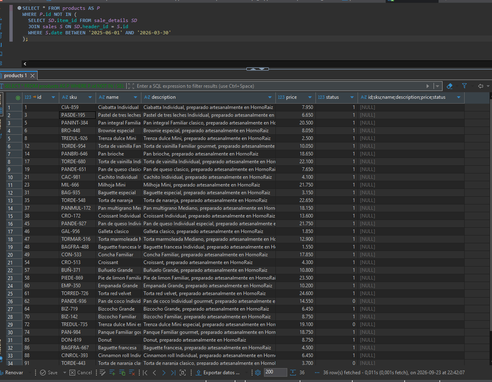

**Resultado:** 35 productos sin ventas registradas en el rango de fechas indicado.

**Forma 2 (LEFT JOIN con IS NULL):**
```sql
SELECT * FROM products AS P
LEFT JOIN sale_details AS SD ON (P.id = SD.item_id)
LEFT JOIN sales AS S ON (SD.header_id = S.id AND S.date BETWEEN '2025-06-01' AND '2026-03-30')
WHERE S.id IS NULL;
```

**Evidencia (imagen):**

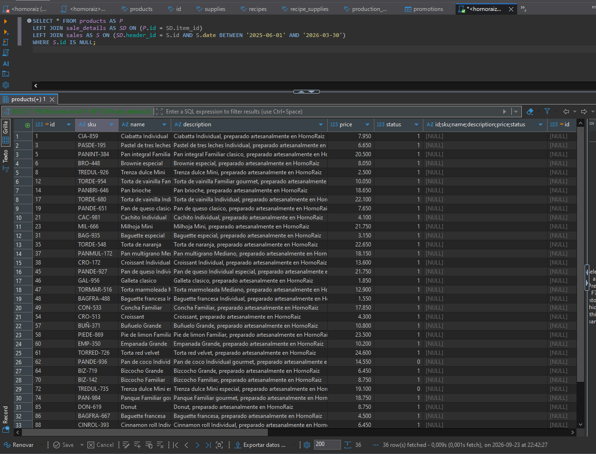

**Resultado:** mismos 35 productos que la Forma 1, confirmando la equivalencia entre ambas formas de expresar la teoría de conjuntos (diferencia entre `products` y los productos presentes en `sale_details`/`sales` dentro del rango).

## 2. PostgreSQL

### 2.1 Renombramiento de tablas

Siguiendo la misma normativa aplicada en MySQL (Sección 1.1), se renombraron las tablas de la base `hornoraiz` en PostgreSQL a plural e inglés. A diferencia de MySQL, PostgreSQL no soporta `RENAME TABLE` para múltiples tablas en una sola sentencia; cada tabla requiere su propio `ALTER TABLE ... RENAME TO`.

```sql
ALTER TABLE producto RENAME TO products;
ALTER TABLE insumo RENAME TO supplies;
ALTER TABLE receta RENAME TO recipes;
ALTER TABLE receta_insumo RENAME TO recipe_supplies;
ALTER TABLE lote_produccion RENAME TO production_batches;
ALTER TABLE movimiento_insumo RENAME TO supply_movements;
ALTER TABLE venta RENAME TO sales;
ALTER TABLE venta_detalle RENAME TO sale_details;
ALTER TABLE pago RENAME TO payments;
ALTER TABLE promocion RENAME TO promotions;
```

**Evidencia (imagen):**

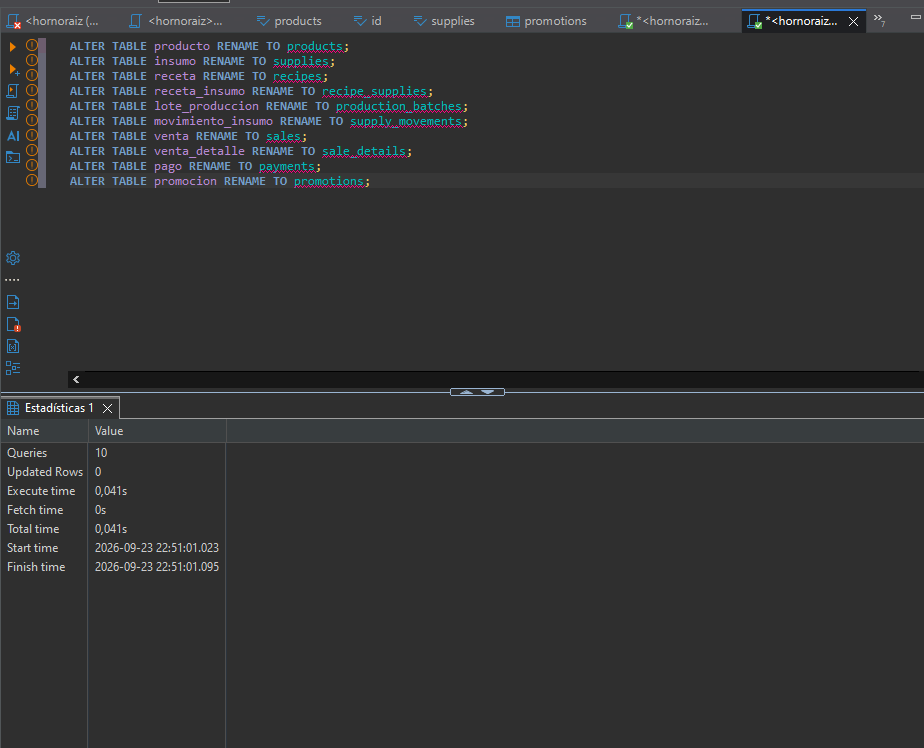

**Resultado:** las 10 tablas quedaron renombradas a plural e inglés, sin pérdida de datos ni de las relaciones de Foreign Key existentes.

### 2.2 Renombramiento de columnas

Al igual que con las tablas, PostgreSQL exige una sentencia `ALTER TABLE` independiente por cada `RENAME COLUMN` — no admite agrupar varias columnas en una sola sentencia como sí permite MySQL.

```sql
ALTER TABLE products RENAME COLUMN nombre TO name;
ALTER TABLE products RENAME COLUMN descripcion TO description;
ALTER TABLE products RENAME COLUMN precio TO price;
ALTER TABLE products RENAME COLUMN is_active TO status;

ALTER TABLE supplies RENAME COLUMN codigo TO code;
ALTER TABLE supplies RENAME COLUMN nombre TO name;
ALTER TABLE supplies RENAME COLUMN unidad_medida TO unit_of_measure;
ALTER TABLE supplies RENAME COLUMN stock_minimo TO min_stock;
ALTER TABLE supplies RENAME COLUMN is_active TO status;

ALTER TABLE recipes RENAME COLUMN producto_id TO product_id;
ALTER TABLE recipes RENAME COLUMN nombre TO name;
ALTER TABLE recipes RENAME COLUMN descripcion TO description;
ALTER TABLE recipes RENAME COLUMN is_active TO status;

ALTER TABLE recipe_supplies RENAME COLUMN principal_id TO main_id;
ALTER TABLE recipe_supplies RENAME COLUMN relacionado_id TO related_id;
ALTER TABLE recipe_supplies RENAME COLUMN datos_relacion TO relation_data;
ALTER TABLE recipe_supplies RENAME COLUMN is_active TO status;

ALTER TABLE production_batches RENAME COLUMN receta_id TO recipe_id;
ALTER TABLE production_batches RENAME COLUMN nombre TO name;
ALTER TABLE production_batches RENAME COLUMN descripcion TO description;
ALTER TABLE production_batches RENAME COLUMN is_active TO status;

ALTER TABLE supply_movements RENAME COLUMN lote_produccion_id TO production_batch_id;
ALTER TABLE supply_movements RENAME COLUMN insumo_id TO supply_id;
ALTER TABLE supply_movements RENAME COLUMN tipo TO type;
ALTER TABLE supply_movements RENAME COLUMN fecha TO date;
ALTER TABLE supply_movements RENAME COLUMN cantidad TO quantity;
ALTER TABLE supply_movements RENAME COLUMN observaciones TO notes;
ALTER TABLE supply_movements RENAME COLUMN estado TO status;

ALTER TABLE sales RENAME COLUMN cliente_id TO client_id;
ALTER TABLE sales RENAME COLUMN fecha TO date;
ALTER TABLE sales RENAME COLUMN impuestos TO taxes;
ALTER TABLE sales RENAME COLUMN estado TO status;

ALTER TABLE sale_details RENAME COLUMN cabecera_id TO header_id;
ALTER TABLE sale_details RENAME COLUMN cantidad TO quantity;
ALTER TABLE sale_details RENAME COLUMN valor_unitario TO unit_price;
ALTER TABLE sale_details RENAME COLUMN observaciones TO notes;

ALTER TABLE payments RENAME COLUMN referencia_tipo TO reference_type;
ALTER TABLE payments RENAME COLUMN referencia_id TO reference_id;
ALTER TABLE payments RENAME COLUMN metodo TO method;
ALTER TABLE payments RENAME COLUMN monto TO amount;
ALTER TABLE payments RENAME COLUMN fecha TO date;
ALTER TABLE payments RENAME COLUMN estado TO status;

ALTER TABLE promotions RENAME COLUMN nombre TO name;
ALTER TABLE promotions RENAME COLUMN descripcion TO description;
ALTER TABLE promotions RENAME COLUMN is_active TO status;
```

**Evidencia (imagen):**

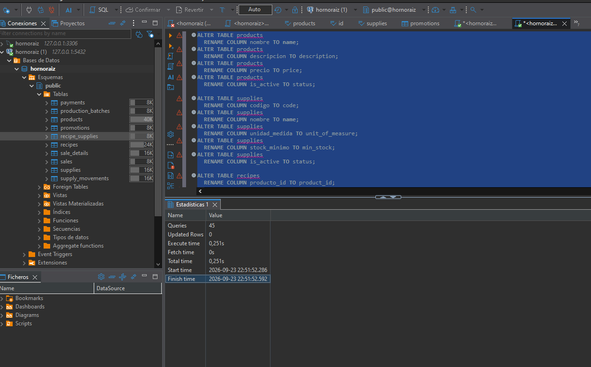

**Resultado:** se verificaron los nombres finales mediante consulta a `information_schema.columns`. Aplica la misma advertencia documentada para MySQL (Sección 1.2): `status` no tiene un dominio de valores uniforme entre tablas — es booleano (`0`/`1`, ex `is_active`) en `products`, `supplies`, `recipes`, `recipe_supplies`, `production_batches` y `promotions`, y texto de flujo de negocio (ex `estado`) en `sales`, `payments` y `supply_movements`.

### 2.3 Carga de datos — tabla `products`

Se importó el mismo archivo `products.csv` generado para MySQL (100 registros, separado por `;`), sin necesidad de regenerarlo.

**Evidencia (imagen):**

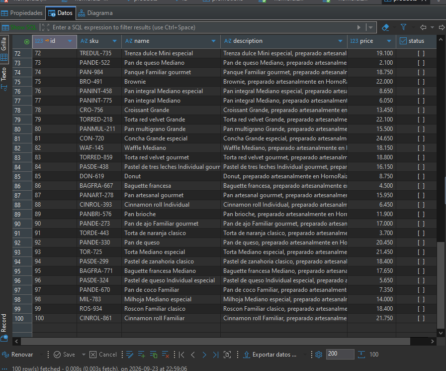

**Resultado:** se importaron los 100 registros en la tabla `products` sin errores.

### 2.4 Carga de datos — tabla `supplies`

**Evidencia (imagen):**

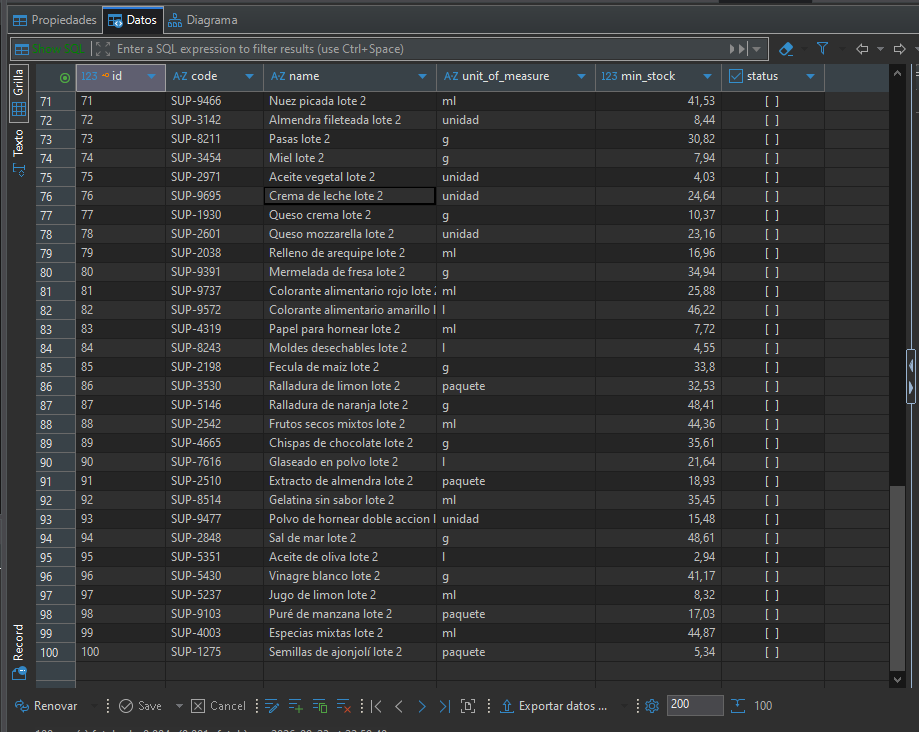

**Resultado:** se importaron los 100 registros en la tabla `supplies` sin errores.

### 2.5 Carga de datos — tabla `recipes`

**Evidencia (imagen):**

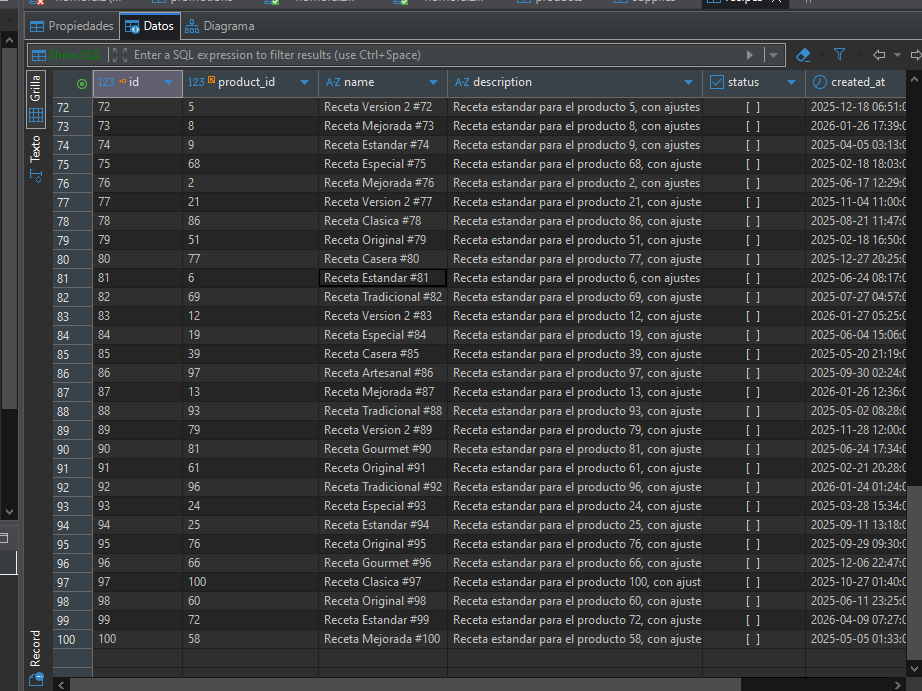

**Resultado:** se importaron los 100 registros en la tabla `recipes` sin errores, respetando la Foreign Key hacia `products`.

### 2.6 Carga de datos — tabla `recipe_supplies`

**Evidencia (imagen):**

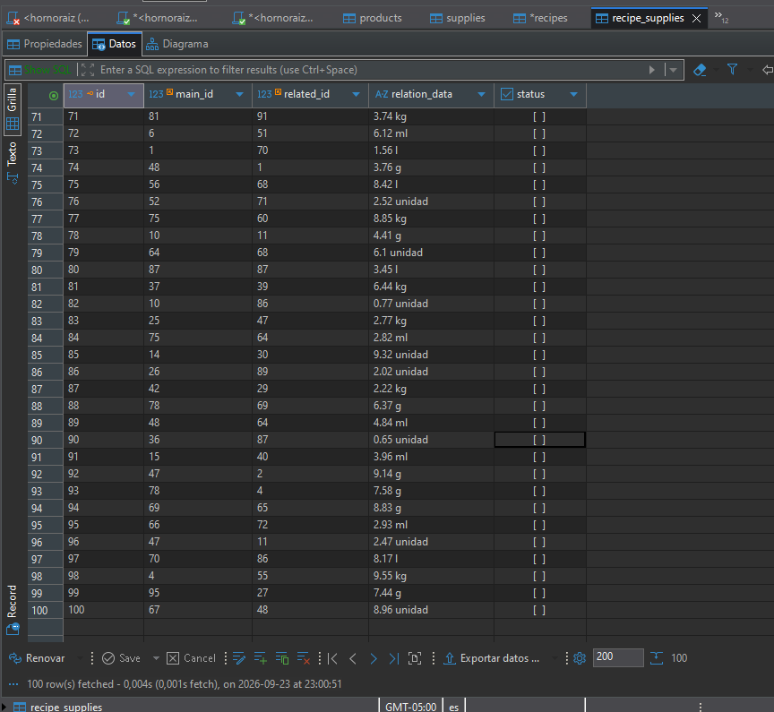

**Resultado:** se importaron los 100 registros en la tabla `recipe_supplies` sin errores, respetando las Foreign Keys hacia `recipes` e `supplies`.

### 2.7 Carga de datos — tabla `production_batches`

**Evidencia (imagen):**

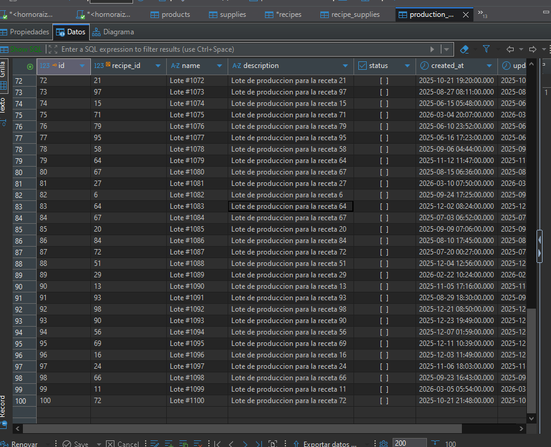

**Resultado:** se importaron los 100 registros en la tabla `production_batches` sin errores, respetando la Foreign Key hacia `recipes`.

### 2.8 Carga de datos — tabla `supply_movements`

**Evidencia (imagen):**

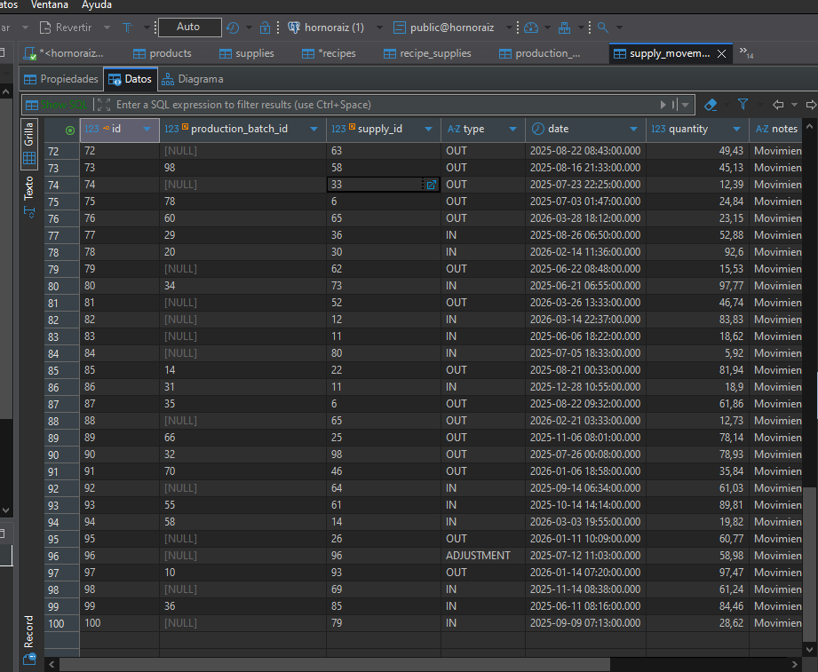

**Resultado:** se importaron los 100 registros en la tabla `supply_movements` sin errores, con `production_batch_id` nullable importado correctamente como `NULL` en las filas vacías del CSV.

### 2.9 Carga de datos — tabla `sales`

**Evidencia (imagen):**

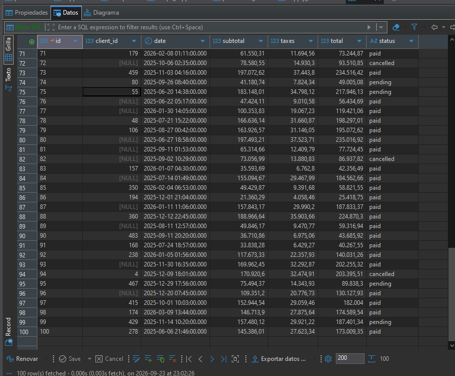

**Resultado:** se importaron los 100 registros en la tabla `sales` sin errores.

### 2.10 Carga de datos — tabla `sale_details`

**Evidencia (imagen):**

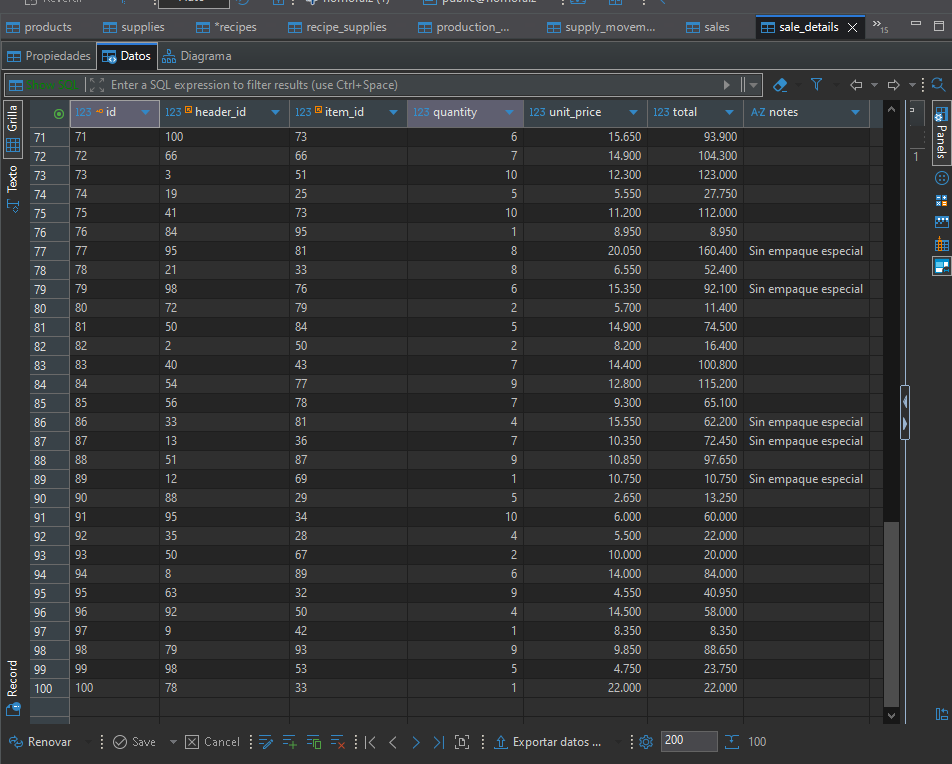

**Resultado:** se importaron los 100 registros en la tabla `sale_details` sin errores, respetando las Foreign Keys hacia `sales` y `products`.

### 2.11 Carga de datos — tabla `payments`

**Evidencia (imagen):**

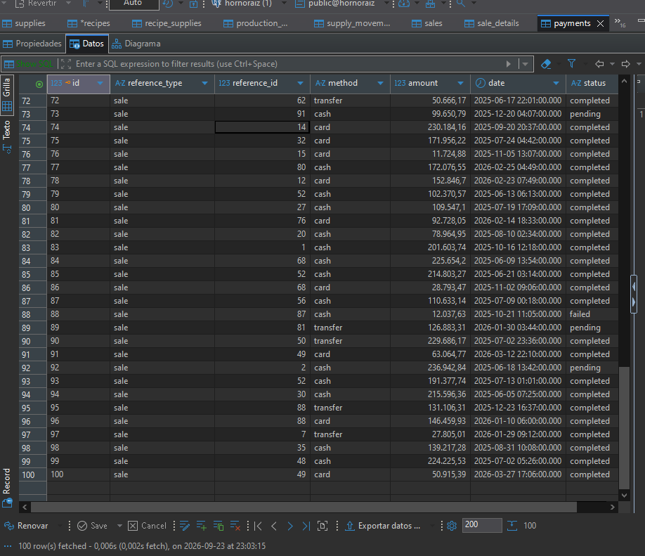

**Resultado:** se importaron los 100 registros en la tabla `payments` sin errores.

### 2.12 Carga de datos — tabla `promotions`

**Evidencia (imagen):**

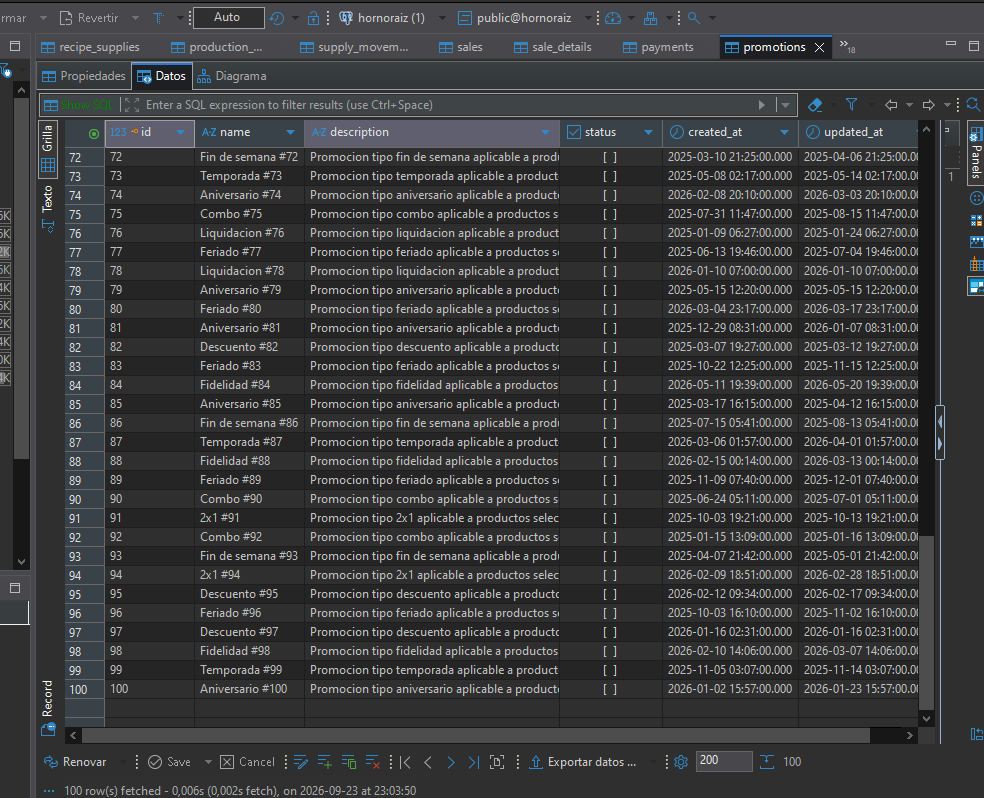

**Resultado:** se importaron los 100 registros en la tabla `promotions` sin errores.

### 2.13 Incidente: conversión incorrecta de `status` (boolean) al importar por asistente gráfico

Al importar los 6 archivos CSV correspondientes a tablas con columna `status` de tipo `boolean` (`products`, `supplies`, `recipes`, `recipe_supplies`, `production_batches`, `promotions`) mediante el asistente gráfico de DBeaver (Secciones 2.3 a 2.12), todos los registros quedaron con `status = false`, independientemente del valor `1`/`0` original en el CSV, sin que el asistente reportara ningún error.

**Diagnóstico:**

```sql
SELECT 'products' t, COUNT(*) FILTER (WHERE status) AS activos, COUNT(*) FILTER (WHERE NOT status) AS inactivos FROM products
UNION ALL SELECT 'supplies', COUNT(*) FILTER (WHERE status), COUNT(*) FILTER (WHERE NOT status) FROM supplies
UNION ALL SELECT 'recipes', COUNT(*) FILTER (WHERE status), COUNT(*) FILTER (WHERE NOT status) FROM recipes
UNION ALL SELECT 'recipe_supplies', COUNT(*) FILTER (WHERE status), COUNT(*) FILTER (WHERE NOT status) FROM recipe_supplies
UNION ALL SELECT 'production_batches', COUNT(*) FILTER (WHERE status), COUNT(*) FILTER (WHERE NOT status) FROM production_batches
UNION ALL SELECT 'promotions', COUNT(*) FILTER (WHERE status), COUNT(*) FILTER (WHERE NOT status) FROM promotions;
```

confirmó `activos = 0` en las 6 tablas, evidenciando que el driver del asistente gráfico no convirtió correctamente los valores de texto `'1'`/`'0'` del CSV al tipo `boolean` nativo de PostgreSQL.

**Solución:** se truncaron las 6 tablas afectadas (y `sale_details`, `supply_movements`, vaciadas en cascada por sus Foreign Keys) y se reimportaron mediante `\copy` desde el cliente `psql`, conectado directamente al contenedor Docker de PostgreSQL (`postgres-server`, puerto `5432`), en vez del asistente gráfico:

```sql
TRUNCATE TABLE recipe_supplies, production_batches, recipes, supplies, promotions, products RESTART IDENTITY CASCADE;
```

```\copy products FROM '/home/vboxuser/products.csv' WITH (FORMAT csv, DELIMITER ';', HEADER true)
\copy supplies FROM '/home/vboxuser/supplies.csv' WITH (FORMAT csv, DELIMITER ';', HEADER true)
\copy recipes FROM '/home/vboxuser/recipes.csv' WITH (FORMAT csv, DELIMITER ';', HEADER true)
\copy recipe_supplies FROM '/home/vboxuser/recipe_supplies.csv' WITH (FORMAT csv, DELIMITER ';', HEADER true)
\copy production_batches FROM '/home/vboxuser/production_batches.csv' WITH (FORMAT csv, DELIMITER ';', HEADER true)
\copy sale_details FROM '/home/vboxuser/sale_details.csv' WITH (FORMAT csv, DELIMITER ';', HEADER true)
\copy promotions FROM '/home/vboxuser/promotions.csv' WITH (FORMAT csv, DELIMITER ';', HEADER true)
```

**Evidencia (imagen):**

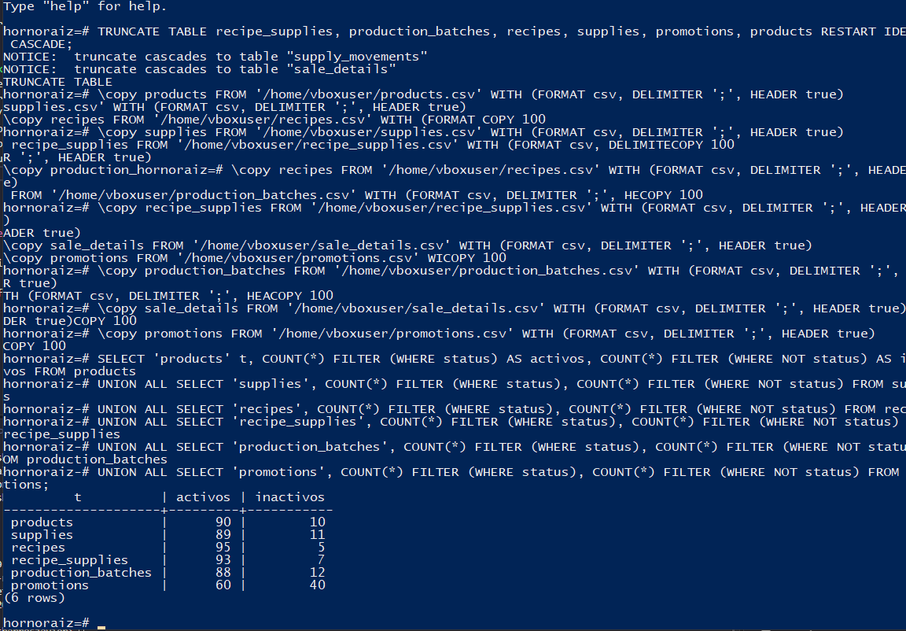

**Resultado:** tras la reimportación por `\copy`, la conversión de `status` se realizó correctamente, obteniendo proporciones reales de activos/inactivos en las 6 tablas (`products`: 90/10, `supplies`: 89/11, `recipes`: 95/5, `recipe_supplies`: 93/7, `production_batches`: 88/12, `promotions`: 60/40), a diferencia del `0/100` uniforme que arrojó el asistente gráfico.

#### 2.14.1 Mostrar algunos de los registros de la tabla `products`

```sql
SELECT sku, name, price, status FROM products;
```

**Evidencia (imagen):**

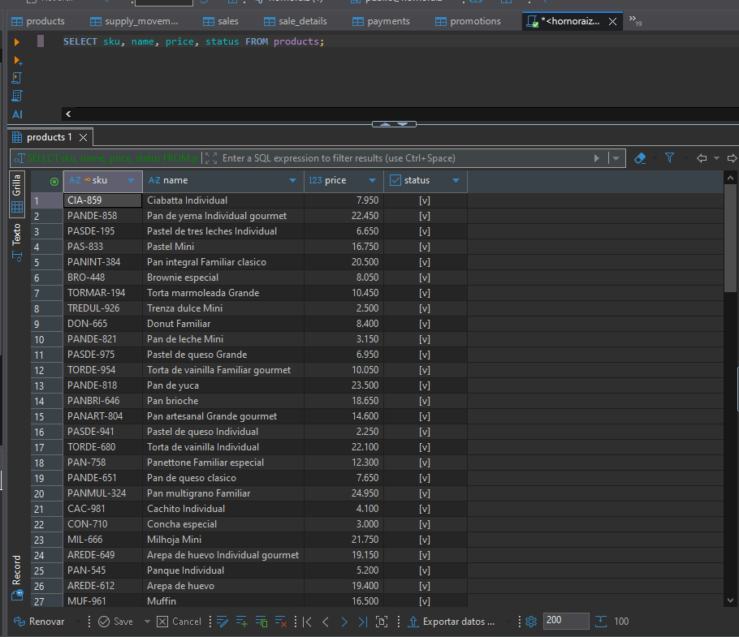

**Resultado:** la consulta devolvió los 100 registros de `products` con `status` en formato `true`/`false` (tipo nativo `boolean` de PostgreSQL, a diferencia de `1`/`0` en MySQL), coincidiendo con los mismos productos activos/inactivos verificados tras la corrección de la Sección 2.13.

#### 2.14.2 Mostrar de forma ordenada (DESC) las ventas desde su comienzo

```sql
SELECT id, date, subtotal, status FROM sales ORDER BY date DESC;
```

**Evidencia (imagen):**

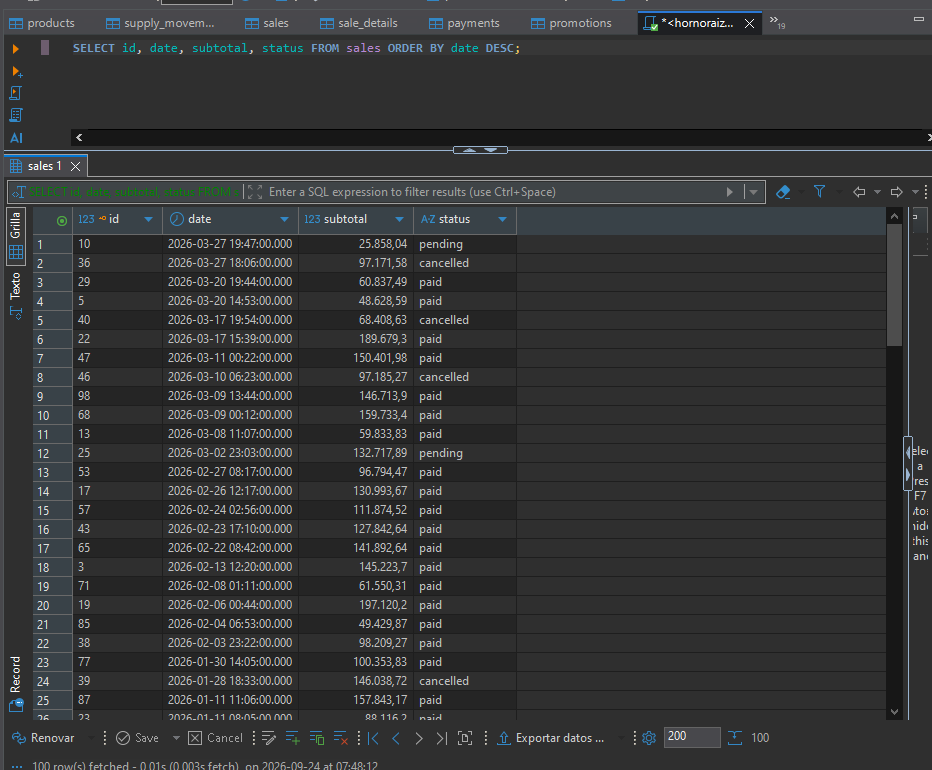

**Resultado:** la consulta devolvió los 100 registros de `sales` ordenados de la fecha más reciente (2026-03-27) a la más antigua (2025-06-02), mismos valores y orden que en MySQL (Sección 1.13.2). La columna `date` se muestra con precisión de milisegundos (`.000`), propia del tipo `timestamp` de PostgreSQL.

#### 2.14.3 Consultas a múltiples tablas mediante WHERE

```sql
SELECT *
FROM sale_details SD, sales S
WHERE S.id = SD.header_id;
```

**Evidencia (imagen):**

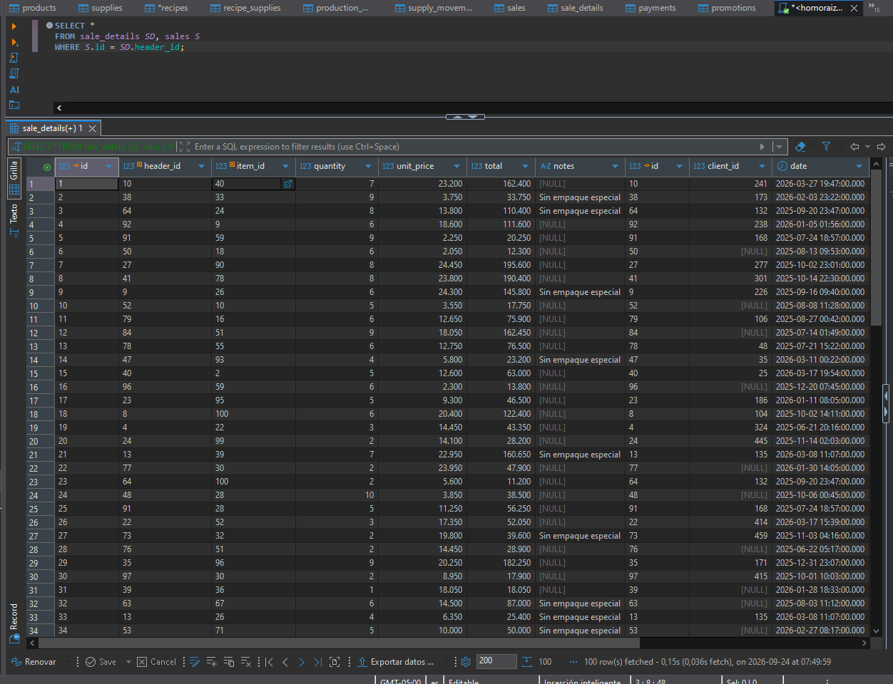

**Resultado:** la consulta devolvió los 100 registros de `sale_details` combinados con su venta correspondiente en `sales`, mismos resultados que en MySQL (Sección 1.13.3).

#### 2.14.4 Consultas a múltiples tablas mediante JOIN

```sql
SELECT S.date, S.status, SD.*
FROM sales AS S
JOIN sale_details AS SD ON (S.id = SD.header_id);
```

**Evidencia (imagen):**

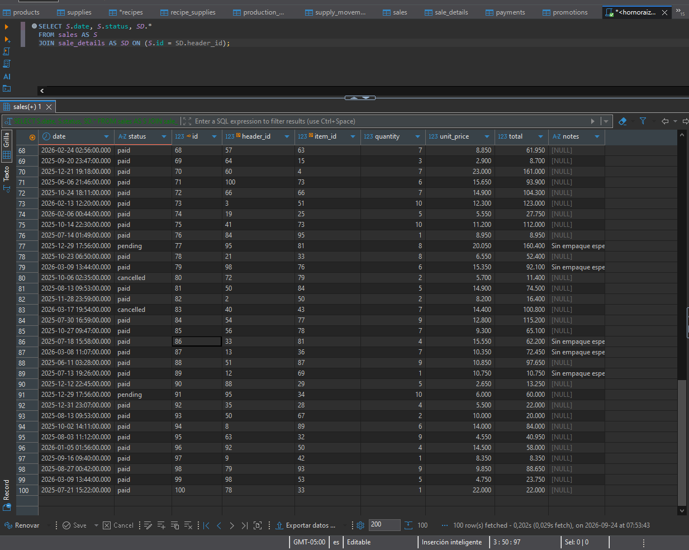

**Resultado:** la consulta devolvió los 100 registros combinando `sales` y `sale_details` mediante `JOIN ... ON`, con el mismo resultado que la Sección 2.14.3 (forma WHERE) y que MySQL (Sección 1.13.4).

#### 2.14.5 Condiciones en las consultas / filtros

```sql
SELECT *
FROM sale_details SD, sales S
WHERE S.id = SD.header_id AND S.status = 'paid';
```

**Evidencia (imagen):**

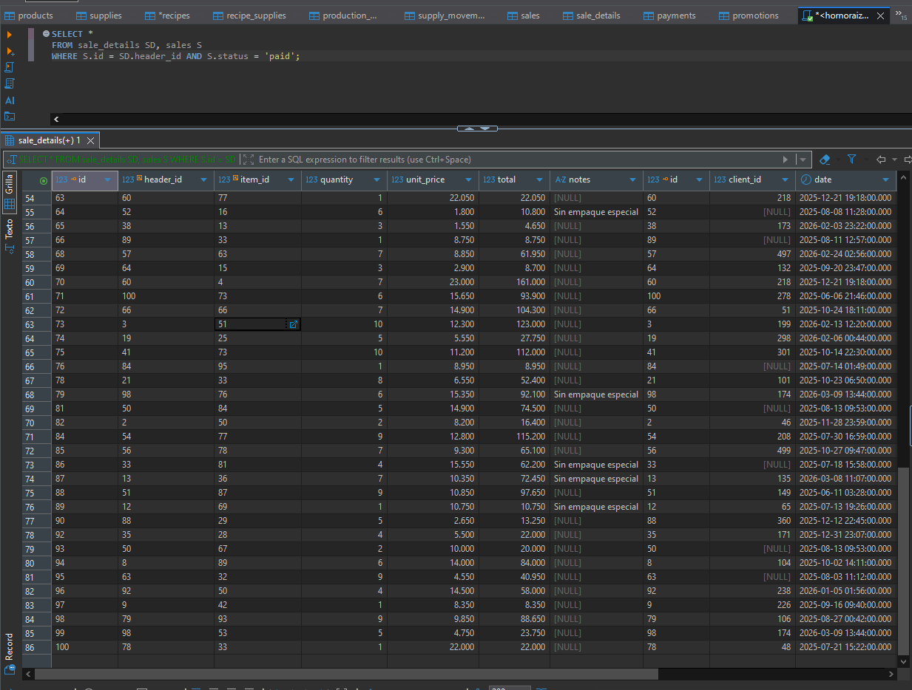

**Resultado:** la consulta devolvió 82 registros con `status = 'paid'`, mismo resultado que en MySQL (Sección 1.13.5).

```sql
SELECT S.date, S.status, SD.*
FROM sales AS S
JOIN sale_details AS SD ON (S.id = SD.header_id)
WHERE S.status = 'cancelled';
```

**Evidencia (imagen):**

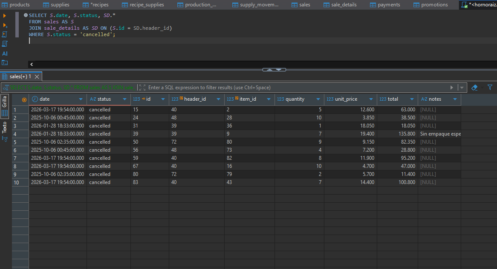

**Resultado:** la consulta devolvió 10 registros con `status = 'cancelled'`, mismo resultado que en MySQL (Sección 1.13.5).

#### 2.14.6 Consultas con filtros condicional LIKE

```sql
SELECT * FROM products AS P WHERE P.name LIKE 'Pan%';
```

**Evidencia (imagen):**

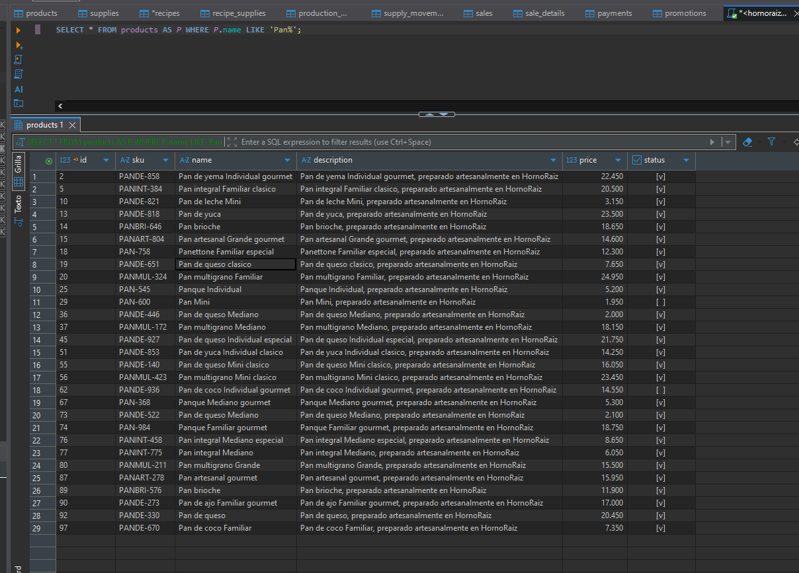

**Resultado:** la consulta devolvió 28 registros cuyo `name` comienza con "Pan", mismo resultado que en MySQL (Sección 1.13.6).

**Mostrar los productos cuya descripción contenga la palabra "chocolate":**

```sql
SELECT * FROM products AS P WHERE P.description LIKE CONCAT('%','chocolate','%');
```

**Evidencia (imagen):**

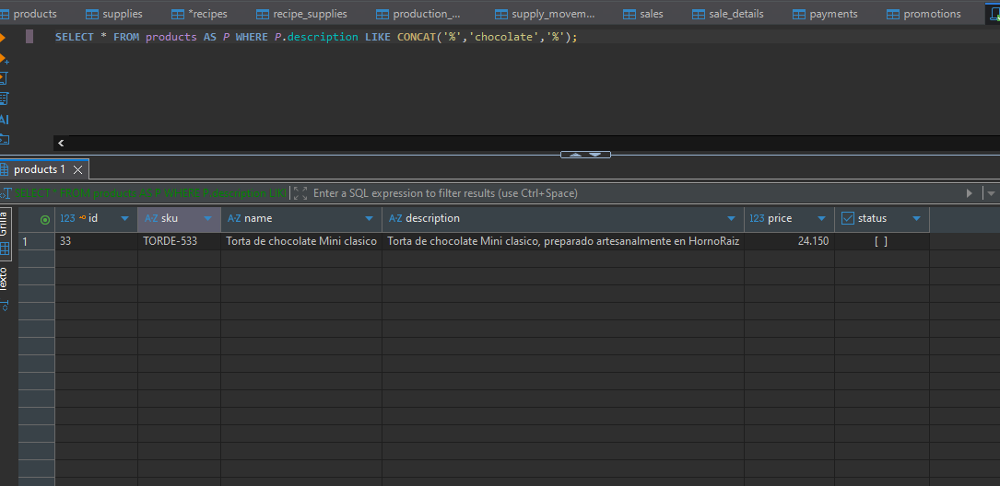

**Resultado:** la consulta devolvió 1 registro (`Torta de chocolate Mini clasico`), mismo resultado que en MySQL.

**Combinación (status = cancelled y name LIKE 'Pan%'):**

```sql
SELECT S.date, S.status, P.name
FROM sales AS S
JOIN sale_details AS SD ON (S.id = SD.header_id)
JOIN products AS P ON (P.id = SD.item_id)
WHERE S.status = 'cancelled' AND P.name LIKE 'Pan%';
```

**Evidencia (imagen):**

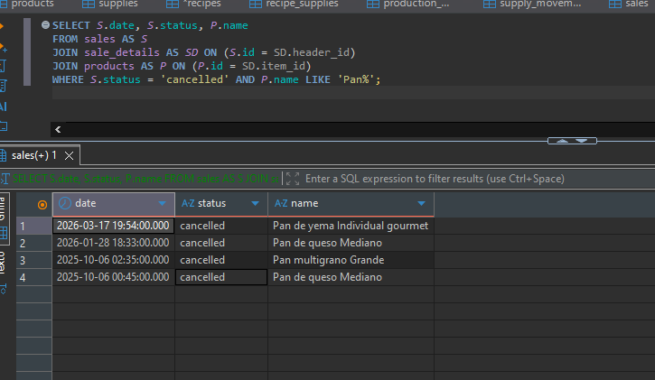

**Resultado:** la consulta devolvió 4 registros, coincidiendo con productos cuyo nombre empieza con "Pan" dentro de las ventas canceladas de la Sección 2.14.5.

#### 2.14.7 Consultas con filtros condicionales BETWEEN

```sql
SELECT P.name, P.sku, SD.quantity, SD.total, S.date, PAY.method
FROM products P
JOIN sale_details SD ON P.id = SD.item_id
JOIN sales S ON SD.header_id = S.id
JOIN payments PAY ON PAY.reference_id = S.id AND PAY.reference_type = 'sale'
WHERE PAY.date BETWEEN '2025-06-01 00:00:00' AND '2026-03-30 23:59:59'
ORDER BY PAY.date ASC;
```

**Evidencia (imagen):**

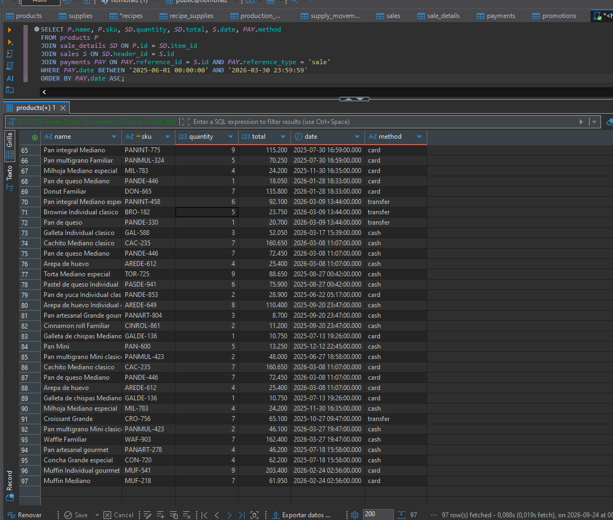

**Resultado:** la consulta combina `products`, `sale_details`, `sales` y `payments` en una cadena de 4 tablas, con el mismo resultado que en MySQL (Sección 1.13.7): filas repetidas por venta cuando existen múltiples `sale_details` y múltiples `payments` asociados, mismo fenómeno esperado del JOIN entre dos relaciones 1:N.


#### 2.14.8 Consultas con agrupamiento GROUP BY

**Forma 1 (rango de fechas, con AVG):**
```sql
SELECT S.id, S.date, SUM(PAY.amount) AS total_paid, COUNT(PAY.id) AS payment_count, AVG(PAY.amount) AS avg_payment
FROM sales S
JOIN payments PAY ON PAY.reference_id = S.id AND PAY.reference_type = 'sale'
WHERE PAY.date BETWEEN '2025-06-01 00:00:00' AND '2026-03-30 23:59:59'
GROUP BY S.id, S.date
ORDER BY total_paid DESC;
```

**Evidencia (imagen):**

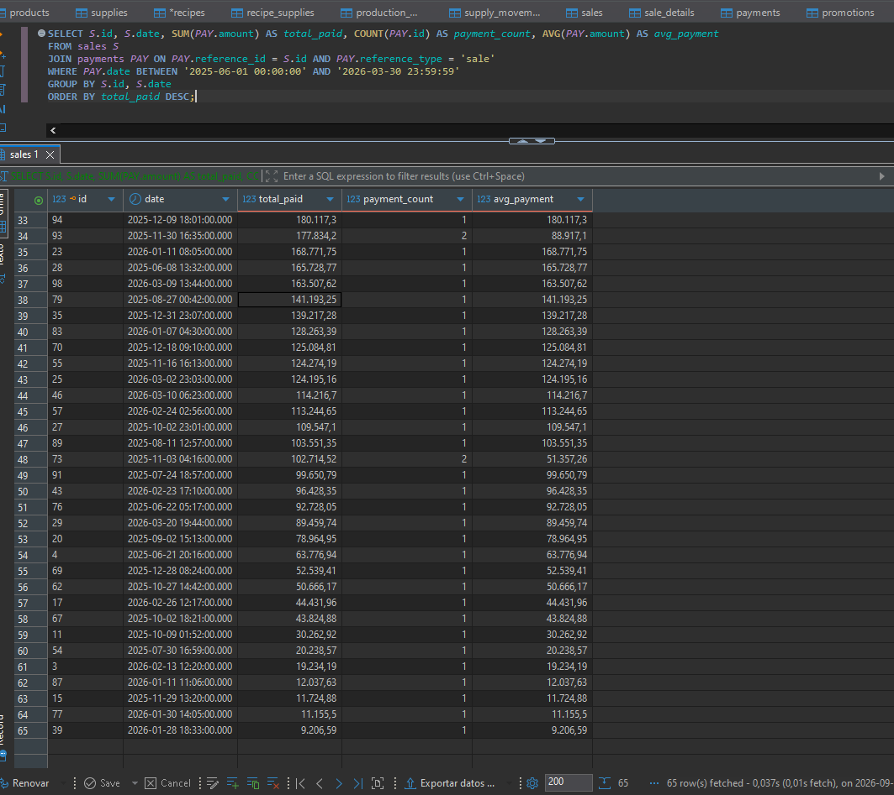

**Resultado:** 62 ventas agrupadas, mismo resultado que en MySQL (Sección 1.13.8), encabezadas por la venta 52 con $942.692,25 en 6 pagos. La columna `avg_payment` muestra mayor precisión decimal (`157115.375000000000`) que MySQL, comportamiento propio de `NUMERIC`/`AVG` en PostgreSQL.

**Forma 2 (filtro por status y method):**
```sql
SELECT S.id, S.date, SUM(PAY.amount) AS total_paid, COUNT(PAY.id) AS payment_count
FROM sales S
JOIN payments PAY ON PAY.reference_id = S.id AND PAY.reference_type = 'sale'
WHERE PAY.status = 'completed' AND PAY.method = 'card'
GROUP BY S.id, S.date
ORDER BY total_paid DESC;
```

**Evidencia (imagen):**

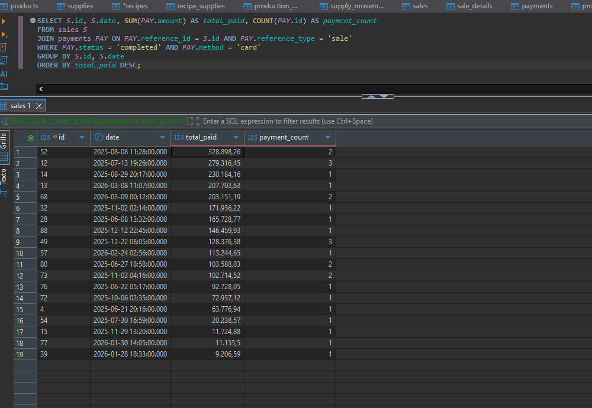

**Resultado:** 19 ventas, mismo resultado que en MySQL, encabezadas por la venta 52 con $328.898,26 en 2 pagos.

**Con HAVING:**
```sql
SELECT S.id, S.date, SUM(PAY.amount) AS total_paid, COUNT(PAY.id) AS payment_count
FROM sales S
JOIN payments PAY ON PAY.reference_id = S.id AND PAY.reference_type = 'sale'
GROUP BY S.id, S.date
HAVING SUM(PAY.amount) >= 100000
ORDER BY total_paid DESC;
```

**Evidencia (imagen):**

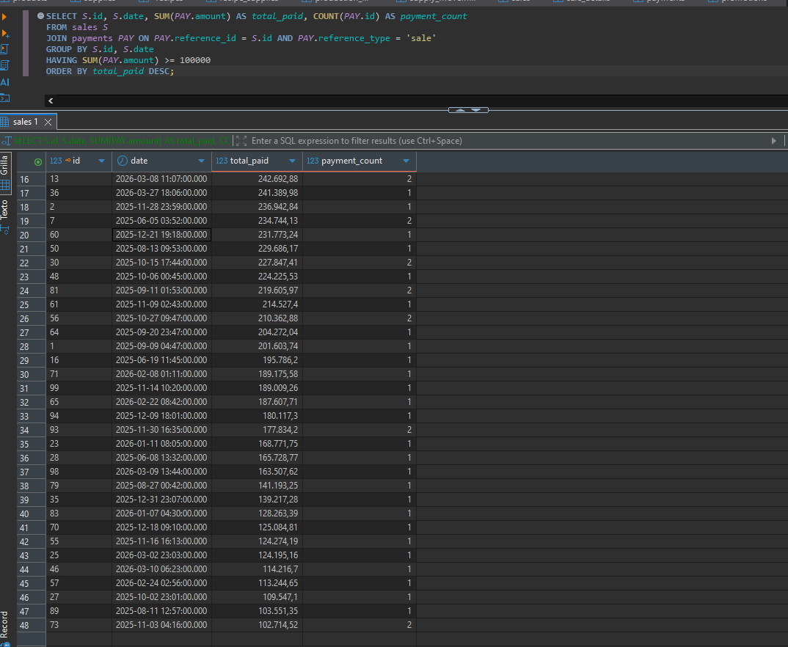

**Resultado:** 47 ventas, mismo resultado que en MySQL, encabezadas por la venta 52 con $942.692,25 en 6 pagos.

#### 2.14.9 Subconsultas y teoría de conjuntos

Mostrar los productos que no han sido vendidos (sin registro en `sale_details`/`sales`) dentro de un rango de fechas específico.

**Forma 1 (subconsulta con NOT IN):**
```sql
SELECT * FROM products AS P
WHERE P.id NOT IN (
  SELECT SD.item_id FROM sale_details SD
  JOIN sales S ON SD.header_id = S.id
  WHERE S.date BETWEEN '2025-06-01' AND '2026-03-30'
);
```

**Evidencia (imagen):**

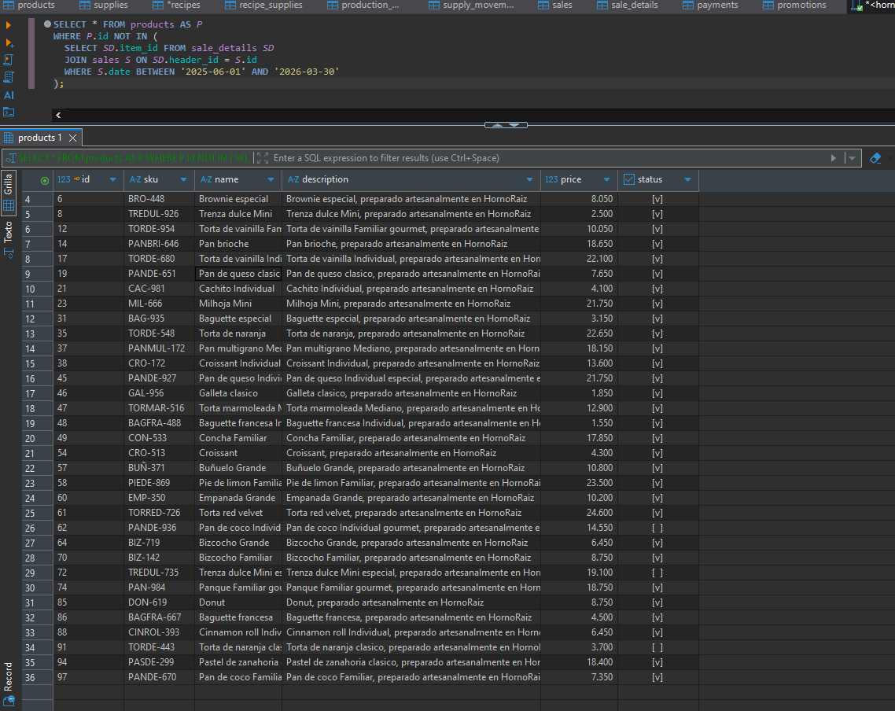

**Resultado:** 35 productos sin ventas registradas en el rango de fechas indicado, mismo resultado que en MySQL (Sección 1.13.9).

**Forma 2 (LEFT JOIN con IS NULL):**
```sql
SELECT * FROM products AS P
LEFT JOIN sale_details AS SD ON (P.id = SD.item_id)
LEFT JOIN sales AS S ON (SD.header_id = S.id AND S.date BETWEEN '2025-06-01' AND '2026-03-30')
WHERE S.id IS NULL;
```

**Evidencia (imagen):**

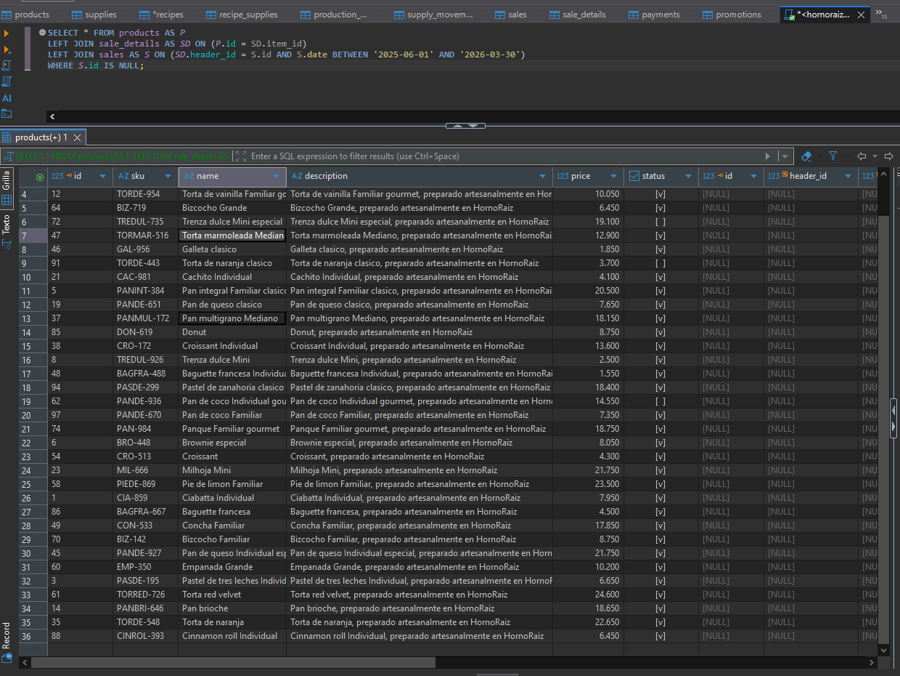

**Resultado:** mismos 35 productos que la Forma 1, confirmando la equivalencia entre ambas formas de expresar la teoría de conjuntos, tal como en MySQL.

## 3. SQL Server

### 3.1 Renombramiento de tablas

Siguiendo la misma normativa aplicada en MySQL (Sección 1.1) y PostgreSQL (Sección 2.1), se renombraron las tablas de la base `hornoraiz` en SQL Server a plural e inglés. T-SQL no soporta `RENAME TABLE` ni `ALTER TABLE ... RENAME TO` — el renombrado se realiza mediante el procedimiento almacenado del sistema `sp_rename`.

```sql
EXEC sp_rename 'producto', 'products';
EXEC sp_rename 'insumo', 'supplies';
EXEC sp_rename 'receta', 'recipes';
EXEC sp_rename 'receta_insumo', 'recipe_supplies';
EXEC sp_rename 'lote_produccion', 'production_batches';
EXEC sp_rename 'movimiento_insumo', 'supply_movements';
EXEC sp_rename 'venta', 'sales';
EXEC sp_rename 'venta_detalle', 'sale_details';
EXEC sp_rename 'pago', 'payments';
EXEC sp_rename 'promocion', 'promotions';
```

**Evidencia (imagen):**

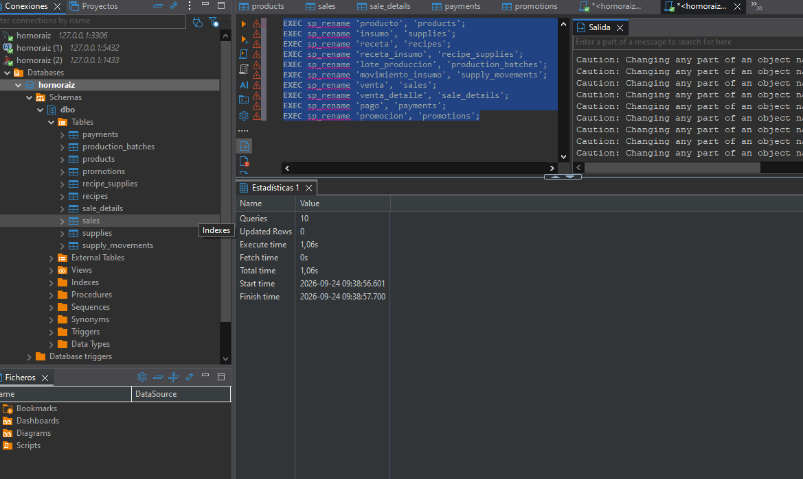

**Resultado:** las 10 tablas quedaron renombradas a plural e inglés, sin pérdida de datos ni de las relaciones de Foreign Key existentes. `sp_rename` mostró la advertencia informativa estándar sobre el cambio de nombre de objetos, sin afectar el resultado.

### 3.2 Renombramiento de columnas

Al igual que las tablas, las columnas se renombraron con `sp_rename`, indicando `'tabla.columna_vieja'` como objeto y `'COLUMN'` como tipo, ya que este procedimiento también renombra otros tipos de objetos (índices, restricciones) y requiere esa distinción explícita.

```sql
EXEC sp_rename 'products.nombre', 'name', 'COLUMN';
EXEC sp_rename 'products.descripcion', 'description', 'COLUMN';
EXEC sp_rename 'products.precio', 'price', 'COLUMN';
EXEC sp_rename 'products.is_active', 'status', 'COLUMN';

EXEC sp_rename 'supplies.codigo', 'code', 'COLUMN';
EXEC sp_rename 'supplies.nombre', 'name', 'COLUMN';
EXEC sp_rename 'supplies.unidad_medida', 'unit_of_measure', 'COLUMN';
EXEC sp_rename 'supplies.stock_minimo', 'min_stock', 'COLUMN';
EXEC sp_rename 'supplies.is_active', 'status', 'COLUMN';

EXEC sp_rename 'recipes.producto_id', 'product_id', 'COLUMN';
EXEC sp_rename 'recipes.nombre', 'name', 'COLUMN';
EXEC sp_rename 'recipes.descripcion', 'description', 'COLUMN';
EXEC sp_rename 'recipes.is_active', 'status', 'COLUMN';

EXEC sp_rename 'recipe_supplies.principal_id', 'main_id', 'COLUMN';
EXEC sp_rename 'recipe_supplies.relacionado_id', 'related_id', 'COLUMN';
EXEC sp_rename 'recipe_supplies.datos_relacion', 'relation_data', 'COLUMN';
EXEC sp_rename 'recipe_supplies.is_active', 'status', 'COLUMN';

EXEC sp_rename 'production_batches.receta_id', 'recipe_id', 'COLUMN';
EXEC sp_rename 'production_batches.nombre', 'name', 'COLUMN';
EXEC sp_rename 'production_batches.descripcion', 'description', 'COLUMN';
EXEC sp_rename 'production_batches.is_active', 'status', 'COLUMN';

EXEC sp_rename 'supply_movements.lote_produccion_id', 'production_batch_id', 'COLUMN';
EXEC sp_rename 'supply_movements.insumo_id', 'supply_id', 'COLUMN';
EXEC sp_rename 'supply_movements.tipo', 'type', 'COLUMN';
EXEC sp_rename 'supply_movements.fecha', 'date', 'COLUMN';
EXEC sp_rename 'supply_movements.cantidad', 'quantity', 'COLUMN';
EXEC sp_rename 'supply_movements.observaciones', 'notes', 'COLUMN';
EXEC sp_rename 'supply_movements.estado', 'status', 'COLUMN';

EXEC sp_rename 'sales.cliente_id', 'client_id', 'COLUMN';
EXEC sp_rename 'sales.fecha', 'date', 'COLUMN';
EXEC sp_rename 'sales.impuestos', 'taxes', 'COLUMN';
EXEC sp_rename 'sales.estado', 'status', 'COLUMN';

EXEC sp_rename 'sale_details.cabecera_id', 'header_id', 'COLUMN';
EXEC sp_rename 'sale_details.cantidad', 'quantity', 'COLUMN';
EXEC sp_rename 'sale_details.valor_unitario', 'unit_price', 'COLUMN';
EXEC sp_rename 'sale_details.observaciones', 'notes', 'COLUMN';

EXEC sp_rename 'payments.referencia_tipo', 'reference_type', 'COLUMN';
EXEC sp_rename 'payments.referencia_id', 'reference_id', 'COLUMN';
EXEC sp_rename 'payments.metodo', 'method', 'COLUMN';
EXEC sp_rename 'payments.monto', 'amount', 'COLUMN';
EXEC sp_rename 'payments.fecha', 'date', 'COLUMN';
EXEC sp_rename 'payments.estado', 'status', 'COLUMN';

EXEC sp_rename 'promotions.nombre', 'name', 'COLUMN';
EXEC sp_rename 'promotions.descripcion', 'description', 'COLUMN';
EXEC sp_rename 'promotions.is_active', 'status', 'COLUMN';
```

**Evidencia (imagen):**

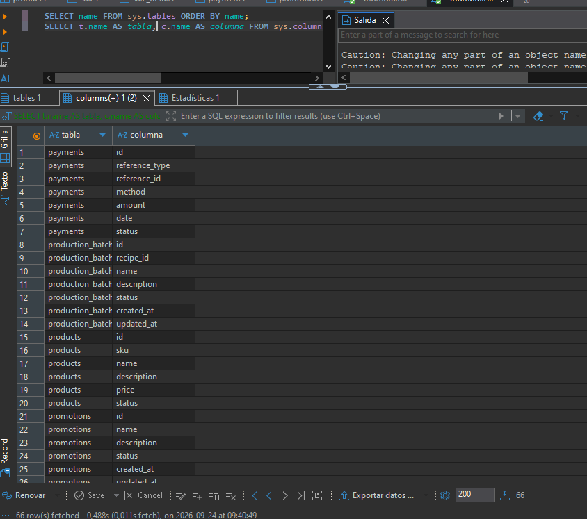

**Resultado:** se verificaron los nombres finales mediante consulta a `sys.columns` unida con `sys.tables`, confirmando que las 10 tablas quedaron con sus columnas en inglés, idénticas a MySQL y PostgreSQL. Aplica la misma advertencia documentada en las Secciones 1.2/2.2: `status` no tiene un dominio de valores uniforme entre tablas.

### 3.4 Carga de datos — tabla `products`

Se importó el mismo archivo `products.csv` generado para MySQL (100 registros, separado por `;`), sin necesidad de regenerarlo.

**Evidencia (imagen):**

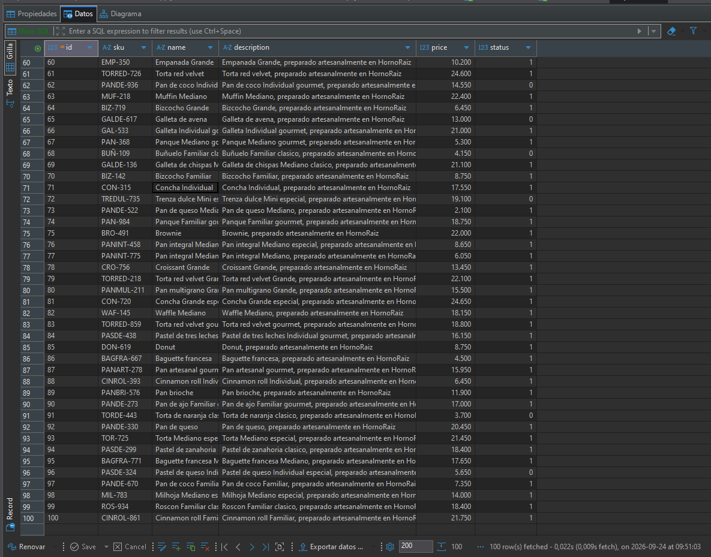

**Resultado:** se importaron los 100 registros en la tabla `products` sin errores.

### 3.5 Carga de datos — tabla `supplies`

**Evidencia (imagen):**

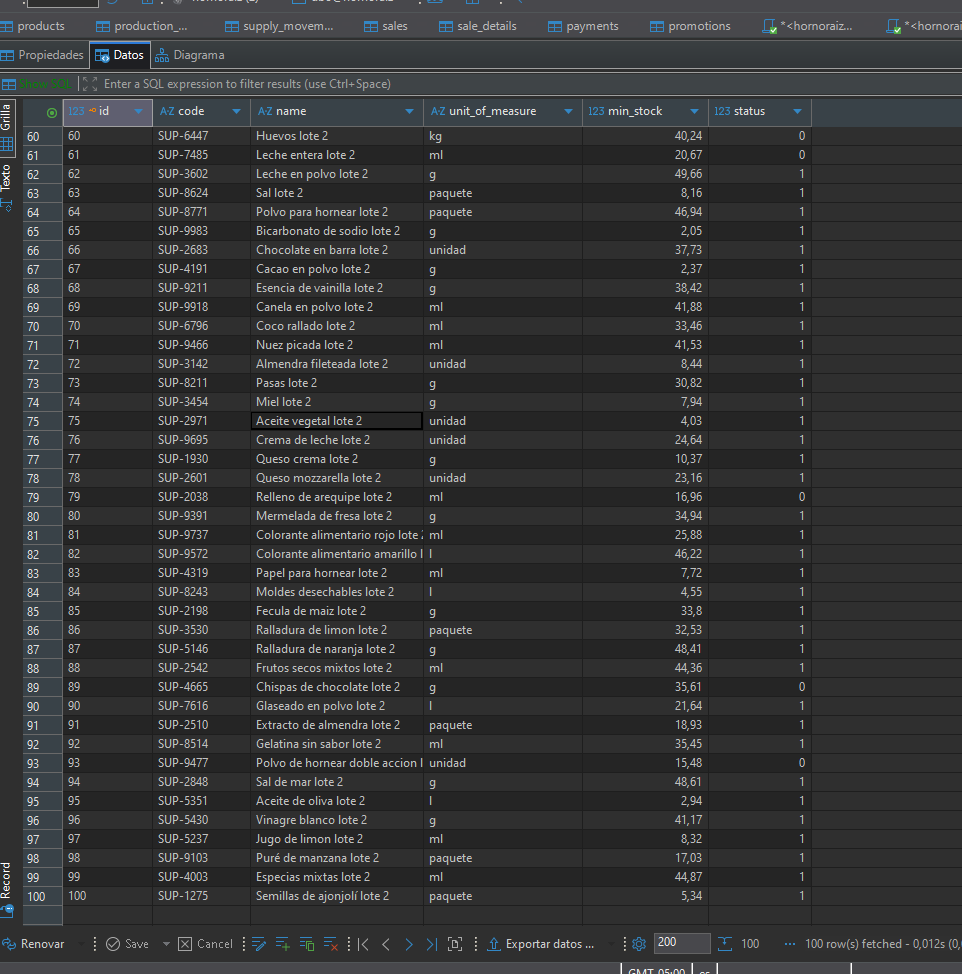

**Resultado:** se importaron los 100 registros en la tabla `supplies` sin errores.

### 3.6 Carga de datos — tabla `recipes`

**Evidencia (imagen):**

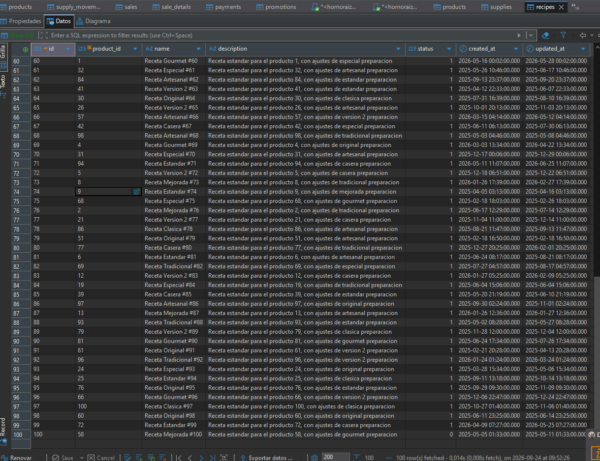

**Resultado:** se importaron los 100 registros en la tabla `recipes` sin errores, respetando la Foreign Key hacia `products`.

### 3.7 Carga de datos — tabla `recipe_supplies`

**Evidencia (imagen):**

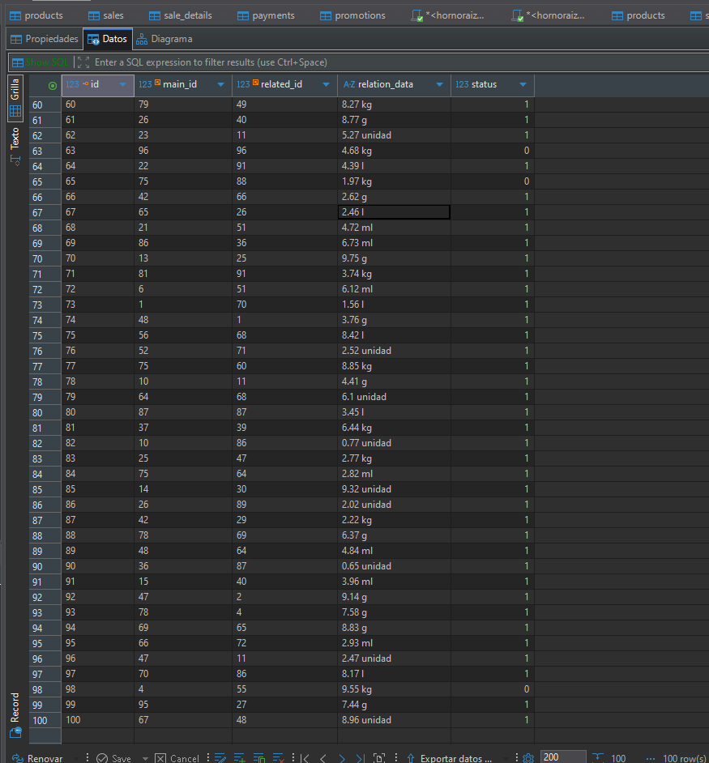

**Resultado:** se importaron los 100 registros en la tabla `recipe_supplies` sin errores, respetando las Foreign Keys hacia `recipes` e `supplies`.

### 3.8 Carga de datos — tabla `production_batches`

**Evidencia (imagen):**

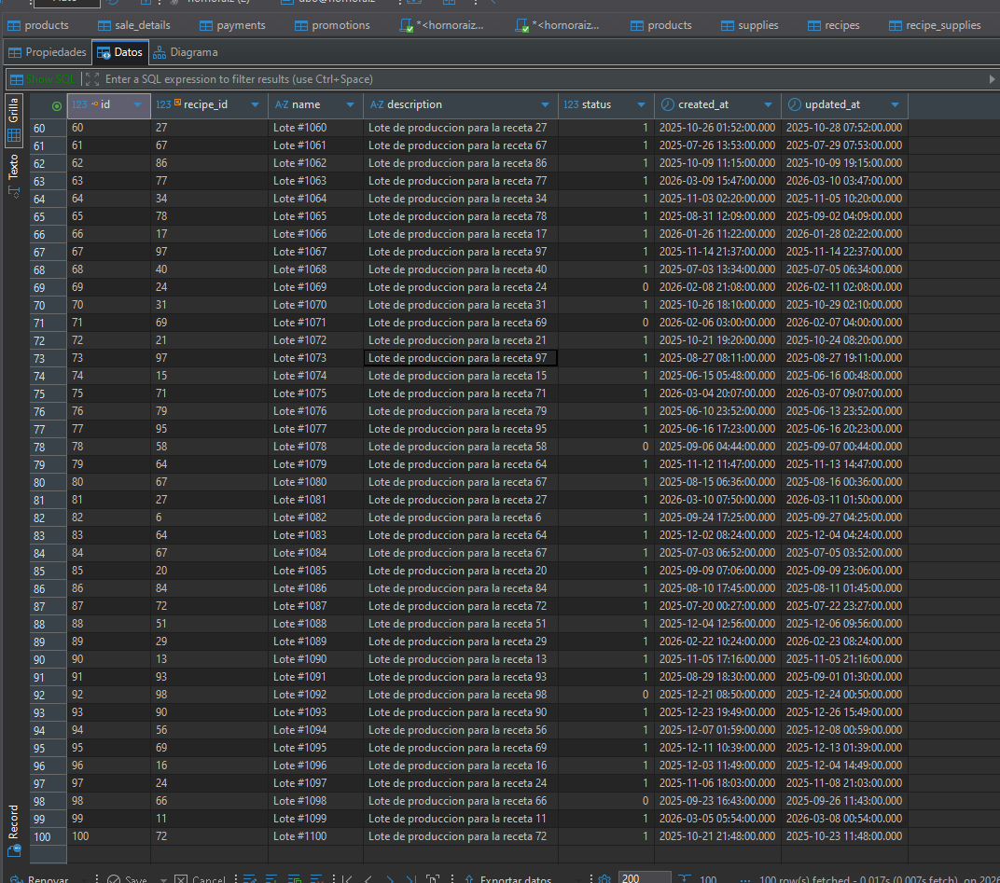

**Resultado:** se importaron los 100 registros en la tabla `production_batches` sin errores, respetando la Foreign Key hacia `recipes`.

### 3.9 Carga de datos — tabla `supply_movements`

**Evidencia (imagen):**

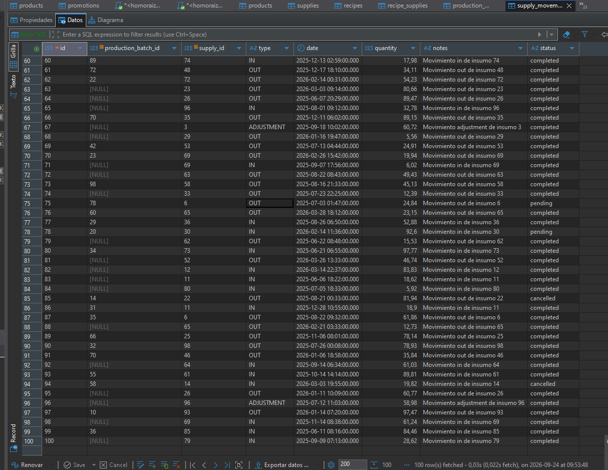

**Resultado:** se importaron los 100 registros en la tabla `supply_movements` sin errores, con `production_batch_id` nullable importado correctamente como `NULL` en las filas vacías del CSV.

### 3.10 Carga de datos — tabla `sales`

**Evidencia (imagen):**

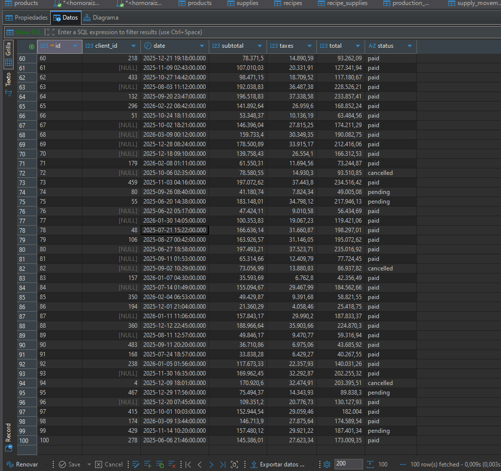

**Resultado:** se importaron los 100 registros en la tabla `sales` sin errores.

### 3.11 Carga de datos — tabla `sale_details`

**Evidencia (imagen):**

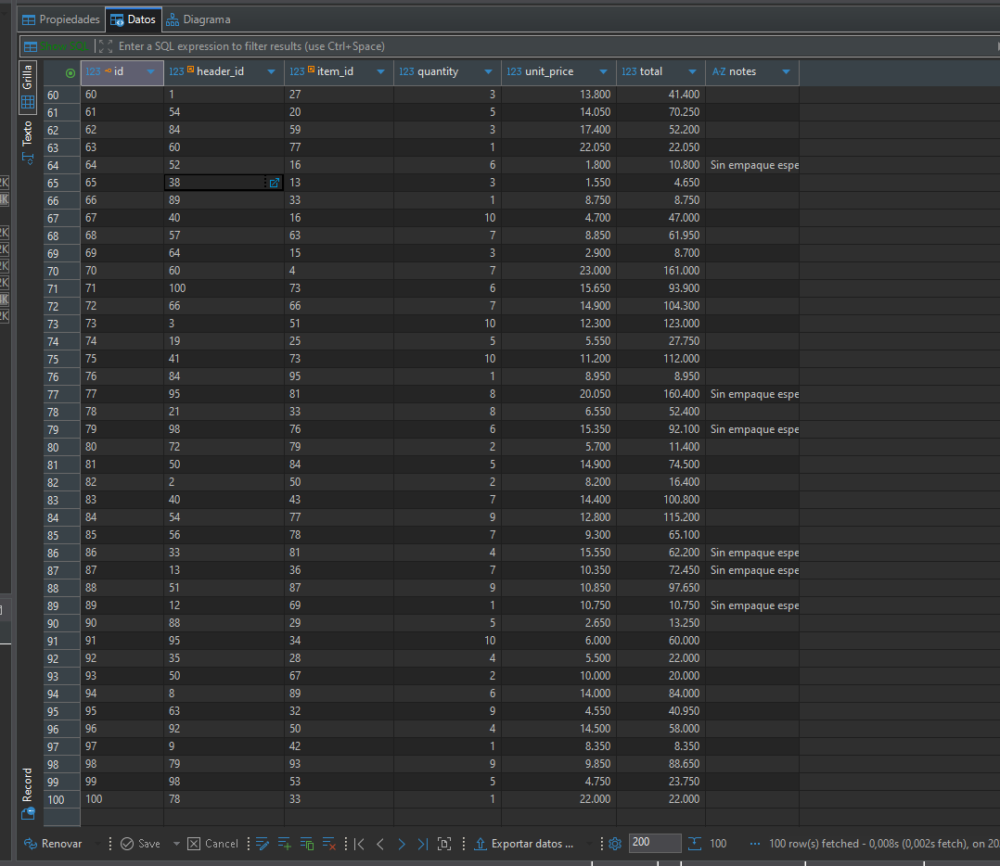

**Resultado:** se importaron los 100 registros en la tabla `sale_details` sin errores, respetando las Foreign Keys hacia `sales` y `products`.

### 3.12 Carga de datos — tabla `payments`

**Evidencia (imagen):**

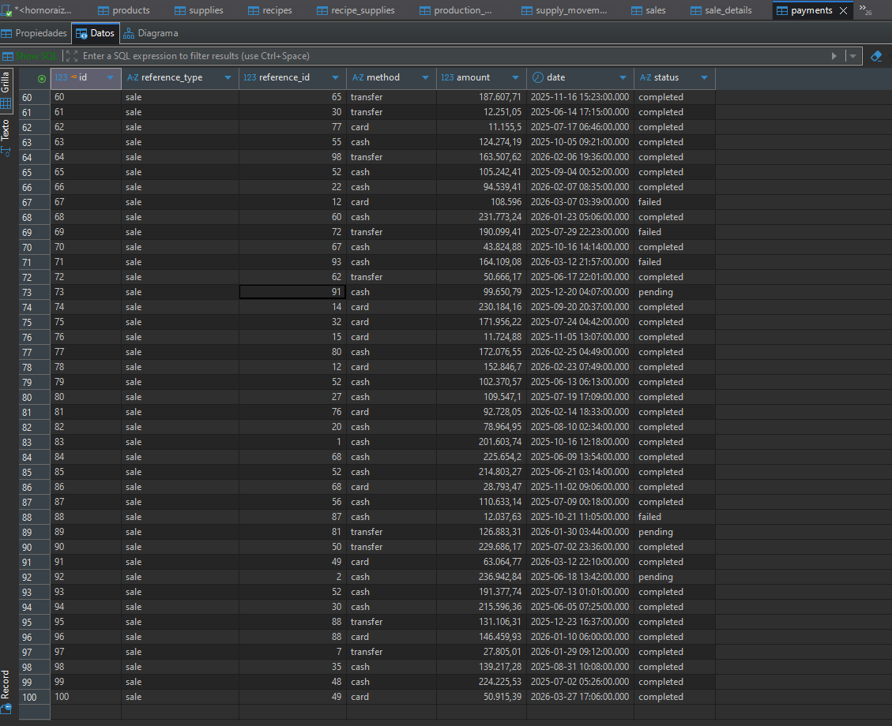

**Resultado:** se importaron los 100 registros en la tabla `payments` sin errores.

### 3.13 Carga de datos — tabla `promotions`

**Evidencia (imagen):**

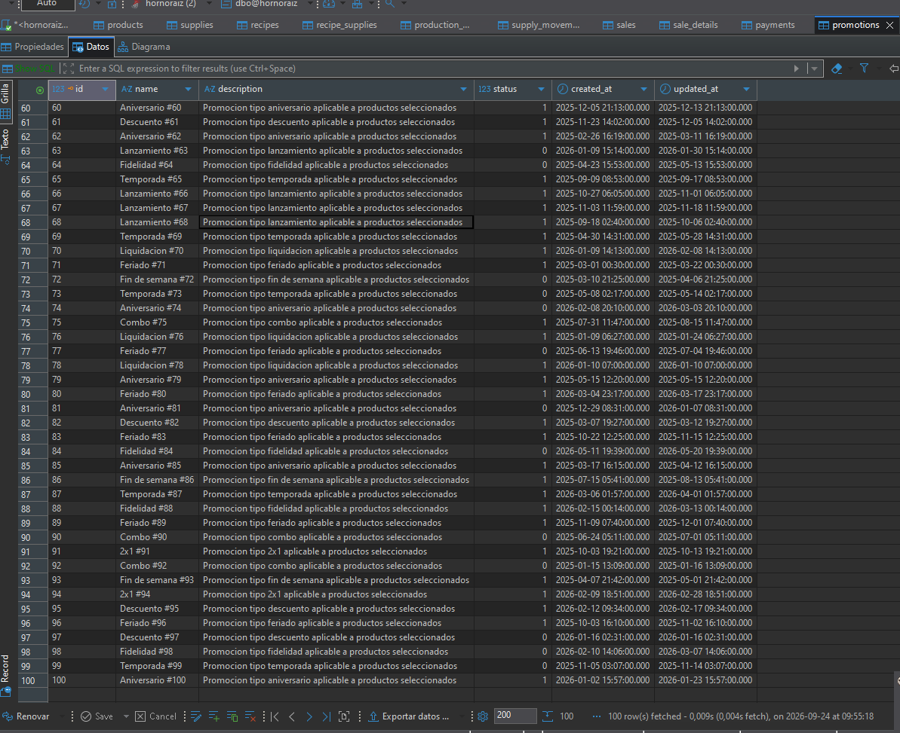

**Resultado:** se importaron los 100 registros en la tabla `promotions` sin errores.

### 3.14 Verificación de la conversión de `status` (tipo `BIT`)

```sql
SELECT 'products' t, SUM(CASE WHEN status=1 THEN 1 ELSE 0 END) AS activos, SUM(CASE WHEN status=0 THEN 1 ELSE 0 END) AS inactivos FROM products
UNION ALL SELECT 'supplies', SUM(CASE WHEN status=1 THEN 1 ELSE 0 END), SUM(CASE WHEN status=0 THEN 1 ELSE 0 END) FROM supplies
UNION ALL SELECT 'recipes', SUM(CASE WHEN status=1 THEN 1 ELSE 0 END), SUM(CASE WHEN status=0 THEN 1 ELSE 0 END) FROM recipes
UNION ALL SELECT 'recipe_supplies', SUM(CASE WHEN status=1 THEN 1 ELSE 0 END), SUM(CASE WHEN status=0 THEN 1 ELSE 0 END) FROM recipe_supplies
UNION ALL SELECT 'production_batches', SUM(CASE WHEN status=1 THEN 1 ELSE 0 END), SUM(CASE WHEN status=0 THEN 1 ELSE 0 END) FROM production_batches
UNION ALL SELECT 'promotions', SUM(CASE WHEN status=1 THEN 1 ELSE 0 END), SUM(CASE WHEN status=0 THEN 1 ELSE 0 END) FROM promotions;
```

**Evidencia (imagen):**

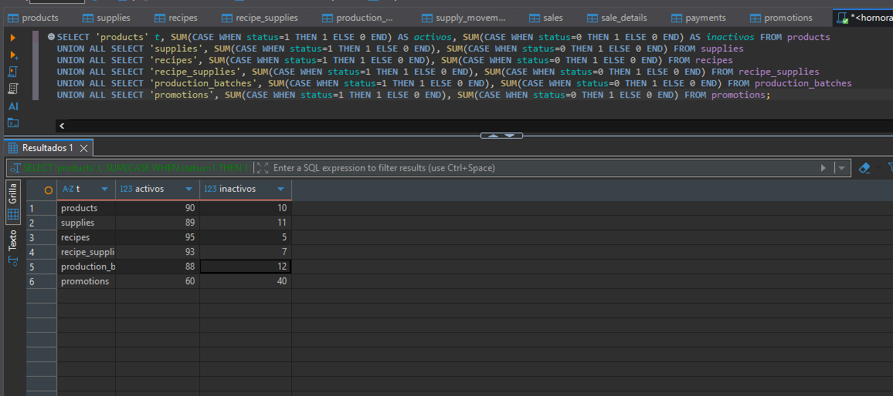

**Resultado:** a diferencia de PostgreSQL (Sección 2.13), el asistente gráfico de DBeaver sí convirtió correctamente los valores `1`/`0` del CSV al tipo `BIT` nativo de SQL Server en las 6 tablas booleanas, sin necesidad de recurrir a una vía alterna de importación. Proporciones obtenidas: `products` 90/10, `supplies` 89/11, `recipes` 95/5, `recipe_supplies` 93/7, `production_batches` 88/12, `promotions` 60/40 — idénticas a MySQL y a la corrección final de PostgreSQL.

#### 3.15.1 Mostrar algunos de los registros de la tabla `products`

```sql
SELECT sku, name, price, status FROM products;
```

**Evidencia (imagen):**

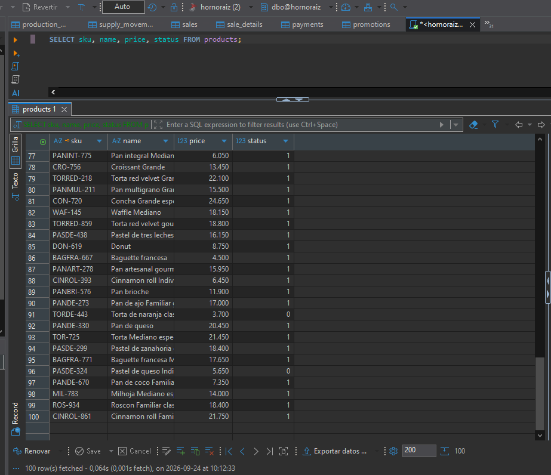

**Resultado:** la consulta devolvió los 100 registros de `products`, mismo resultado que en MySQL (Sección 1.13.1) y PostgreSQL (Sección 2.14.1).