# Consultas Avanzadas — HornoRaíz

## 1. MySQL

### 1.1 Renombramiento de tablas a inglés (normativa del profesor)

Como requisito para esta tarea, el profesor exige que las tablas estén nombradas en plural y en inglés. Se ejecutó el siguiente script en el editor SQL de DBeaver, sobre la base `hornoraiz` en MySQL, renombrando las 10 tablas del modelo:

```sql
RENAME TABLE
  producto TO products,
  insumo TO supplies,
  receta TO recipes,
  receta_insumo TO recipe_supplies,
  lote_produccion TO production_batches,
  movimiento_insumo TO supply_movements,
  venta TO sales,
  venta_detalle TO sale_details,
  pago TO payments,
  promocion TO promotions;

SHOW TABLES;
```

**Evidencia (imagen):**


**Resultado:** `SHOW TABLES` confirmó las 10 tablas con sus nuevos nombres en plural e inglés (`products`, `supplies`, `recipes`, `recipe_supplies`, `production_batches`, `supply_movements`, `sales`, `sale_details`, `payments`, `promotions`), sin pérdida de datos ni de las relaciones de Foreign Key existentes, ya que `RENAME TABLE` en MySQL preserva automáticamente las restricciones y los índices asociados.

### 1.2 Renombramiento de columnas a inglés

Con las 10 tablas ya renombradas (Sección 1.1), se renombraron sus columnas siguiendo el mismo criterio de idioma. Además del renombrado de nombres propios de columna (`nombre → name`, `descripcion → description`, `fecha → date`, `cantidad → quantity`, `estado`/`is_active → status`, etc.), se aplicó una convención adicional: la columna booleana `is_active`, presente en `products`, `supplies`, `recipes`, `recipe_supplies`, `production_batches` y `promotions`, se renombró también a `status`, unificando su nombre con la columna `status` de flujo de negocio ya existente en `sales`, `payments` y `supply_movements` (renombrada desde `estado`).

```sql
ALTER TABLE products
  RENAME COLUMN nombre TO name,
  RENAME COLUMN descripcion TO description,
  RENAME COLUMN precio TO price;

ALTER TABLE supplies
  RENAME COLUMN codigo TO code,
  RENAME COLUMN nombre TO name,
  RENAME COLUMN unidad_medida TO unit_of_measure,
  RENAME COLUMN stock_minimo TO min_stock;

ALTER TABLE recipes
  RENAME COLUMN producto_id TO product_id,
  RENAME COLUMN nombre TO name,
  RENAME COLUMN descripcion TO description;

ALTER TABLE recipe_supplies
  RENAME COLUMN principal_id TO main_id,
  RENAME COLUMN relacionado_id TO related_id,
  RENAME COLUMN datos_relacion TO relation_data;

ALTER TABLE production_batches
  RENAME COLUMN receta_id TO recipe_id,
  RENAME COLUMN nombre TO name,
  RENAME COLUMN descripcion TO description;

ALTER TABLE supply_movements
  RENAME COLUMN lote_produccion_id TO production_batch_id,
  RENAME COLUMN insumo_id TO supply_id,
  RENAME COLUMN tipo TO type,
  RENAME COLUMN fecha TO date,
  RENAME COLUMN cantidad TO quantity,
  RENAME COLUMN observaciones TO notes,
  RENAME COLUMN estado TO status;

ALTER TABLE sales
  RENAME COLUMN cliente_id TO client_id,
  RENAME COLUMN fecha TO date,
  RENAME COLUMN impuestos TO taxes,
  RENAME COLUMN estado TO status;

ALTER TABLE sale_details
  RENAME COLUMN cabecera_id TO header_id,
  RENAME COLUMN cantidad TO quantity,
  RENAME COLUMN valor_unitario TO unit_price,
  RENAME COLUMN observaciones TO notes;

ALTER TABLE payments
  RENAME COLUMN referencia_tipo TO reference_type,
  RENAME COLUMN referencia_id TO reference_id,
  RENAME COLUMN metodo TO method,
  RENAME COLUMN monto TO amount,
  RENAME COLUMN fecha TO date,
  RENAME COLUMN estado TO status;

ALTER TABLE promotions
  RENAME COLUMN nombre TO name,
  RENAME COLUMN descripcion TO description;

ALTER TABLE products RENAME COLUMN is_active TO status;
ALTER TABLE supplies RENAME COLUMN is_active TO status;
ALTER TABLE recipes RENAME COLUMN is_active TO status;
ALTER TABLE recipe_supplies RENAME COLUMN is_active TO status;
ALTER TABLE production_batches RENAME COLUMN is_active TO status;
ALTER TABLE promotions RENAME COLUMN is_active TO status;
```

**Evidencia (imagen):**

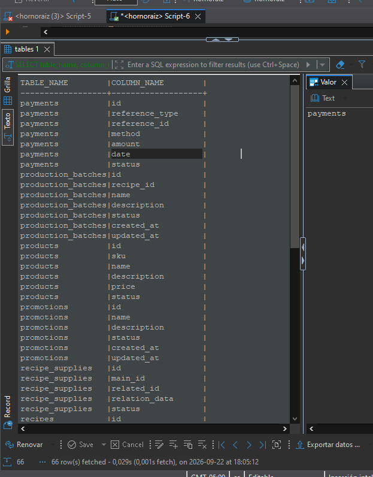

**Resultado:** se verificaron los nombres finales mediante consulta a `INFORMATION_SCHEMA.COLUMNS`, confirmando que las 10 tablas quedaron con sus columnas en inglés. Se documenta como advertencia para las consultas siguientes: la columna `status` no tiene un tipo ni dominio de valores uniforme entre tablas — es booleano (`0`/`1`, ex `is_active`) en `products`, `supplies`, `recipes`, `recipe_supplies`, `production_batches` y `promotions`, pero es texto de estado de flujo de negocio (ex `estado`) en `sales`, `payments` y `supply_movements`. Cualquier consulta que filtre o compare por `status` debe considerar esta diferencia según la tabla involucrada.

**Nota adicional:** `sale_details` no tiene columna `status` — no existía `is_active` ni `estado` en su definición original, y esa ausencia se mantuvo sin cambios.

### 1.3 Carga de datos — tabla `products`

Se generaron 100 registros de prueba para la tabla `products`, en un archivo CSV separado por `;`, con las columnas `id`, `sku`, `name`, `description`, `price`, `status`, correspondientes al esquema ya renombrado en la Sección 1.2.

**Evidencia (imagen):**

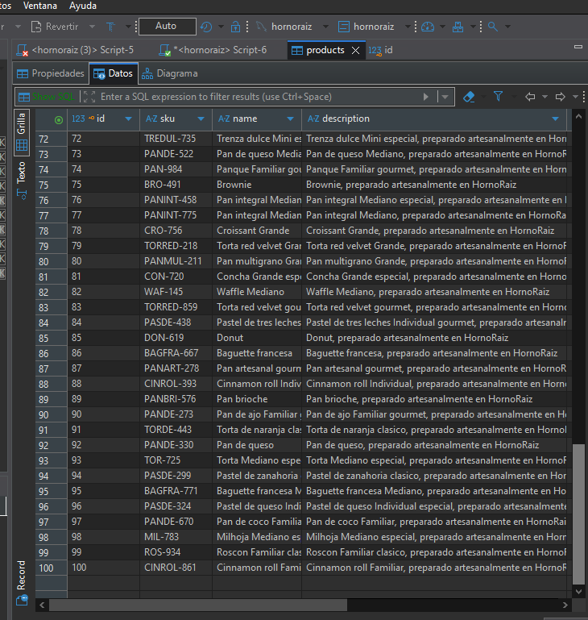

**Resultado:** se importaron los 100 registros en la tabla `products` sin errores, configurando el delimitador `;` en el asistente de importación de DBeaver.

### 1.4 Carga de datos — tabla `supplies`

Se generaron 100 registros de prueba para la tabla `supplies`, en un archivo CSV separado por `;`, con las columnas `id`, `code`, `name`, `unit_of_measure`, `min_stock`, `status`.

**Evidencia (imagen):**

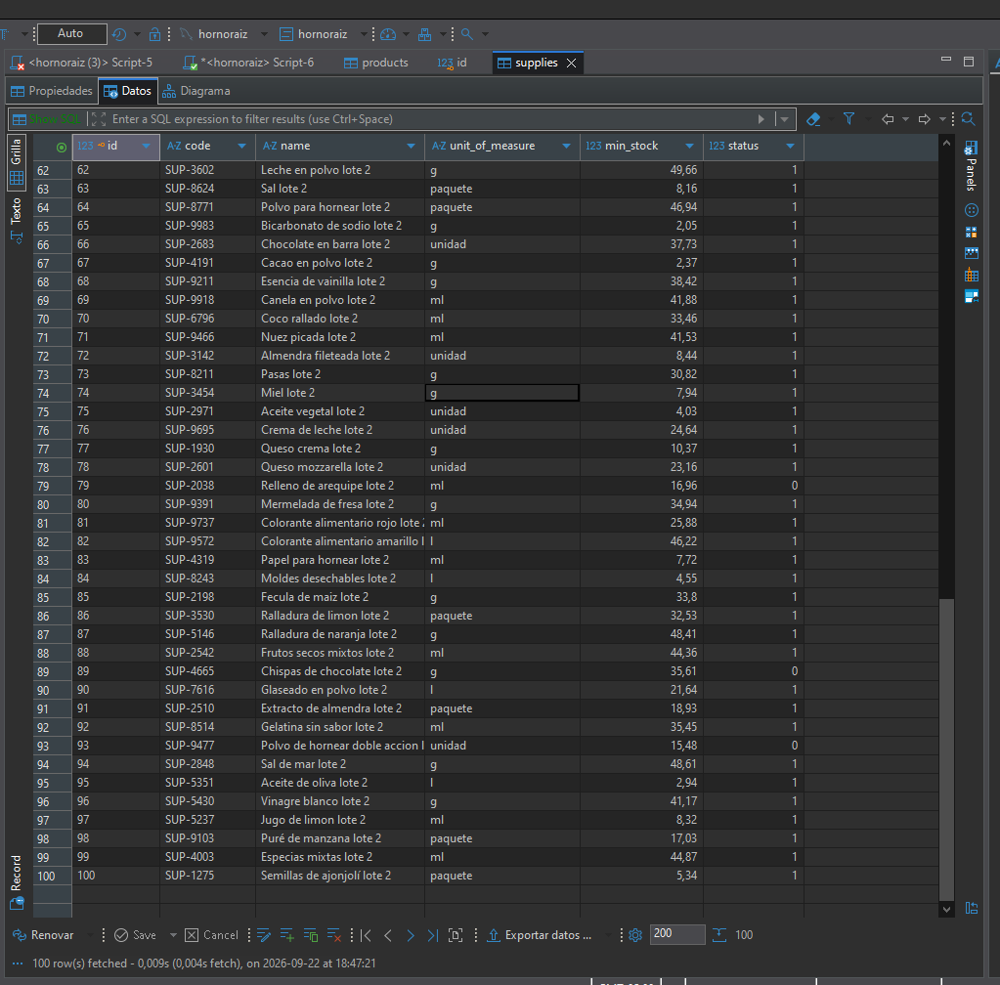

**Resultado:** se importaron los 100 registros en la tabla `supplies` sin errores, configurando el delimitador `;` en el asistente de importación de DBeaver.

### 1.5 Carga de datos — tabla `recipes`

Se generaron 100 registros de prueba para la tabla `recipes`, en un archivo CSV separado por `;`, con las columnas `id`, `product_id`, `name`, `description`, `status`, `created_at`, `updated_at`. Los valores de `product_id` se generaron dentro del rango 1-100, referenciando los productos ya cargados en la Sección 1.3, respetando la Foreign Key hacia `products`.

**Resultado:** se importaron los 100 registros en la tabla `recipes` sin errores. Se incluyeron 20 productos con una segunda receta asociada, reflejando la relación `Producto 1:N Receta` de la narrativa del proyecto (donde una sola versión de receta puede estar vigente por producto); estas recetas alternativas se marcaron con `status = 0` para simular versiones no vigentes.

**Evidencia (imagen):**

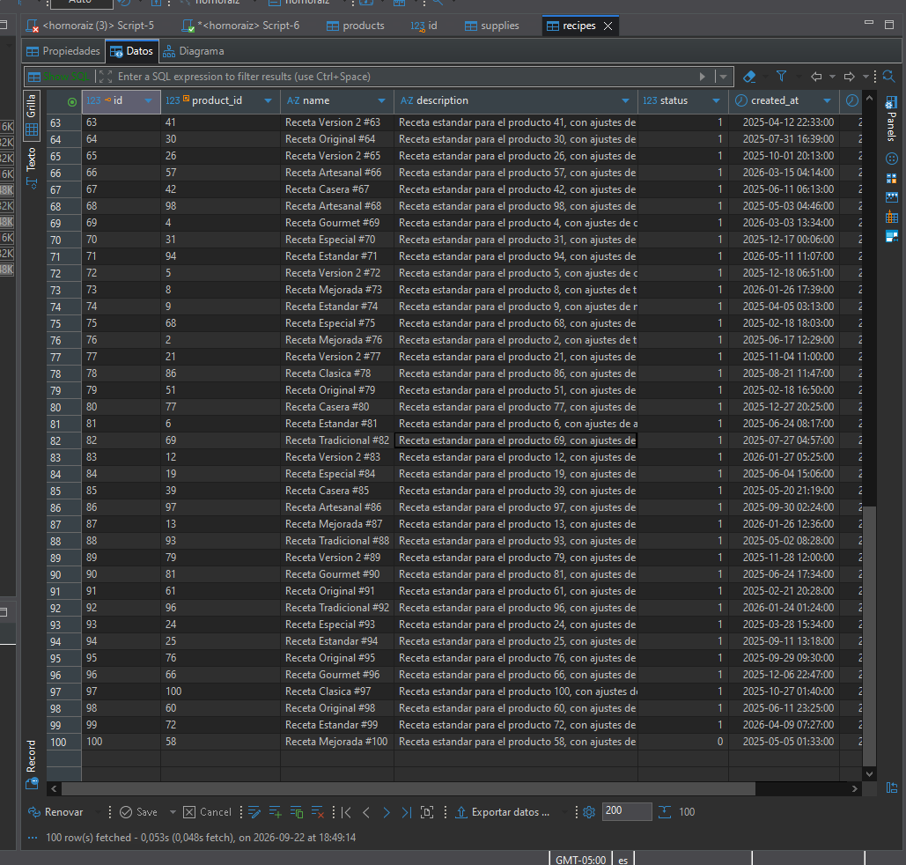

### 1.6 Carga de datos — tabla `recipe_supplies`

Se generaron 100 registros de prueba para la tabla `recipe_supplies`, en un archivo CSV separado por `;`, con las columnas `id`, `main_id`, `related_id`, `relation_data`, `status`. Los valores de `main_id` referencian `recipes(id)` y `related_id` referencian `supplies(id)`, ambos en el rango 1-100, sin pares repetidos, resolviendo la relación N:M entre `recipes` y `supplies`.

**Resultado:** se importaron los 100 registros sin errores. La columna `relation_data` se generó como texto libre combinando cantidad y unidad de medida (ej. `"6.93 l"`), dado que su tipo no define una estructura fija.

**Evidencia (imagen):**

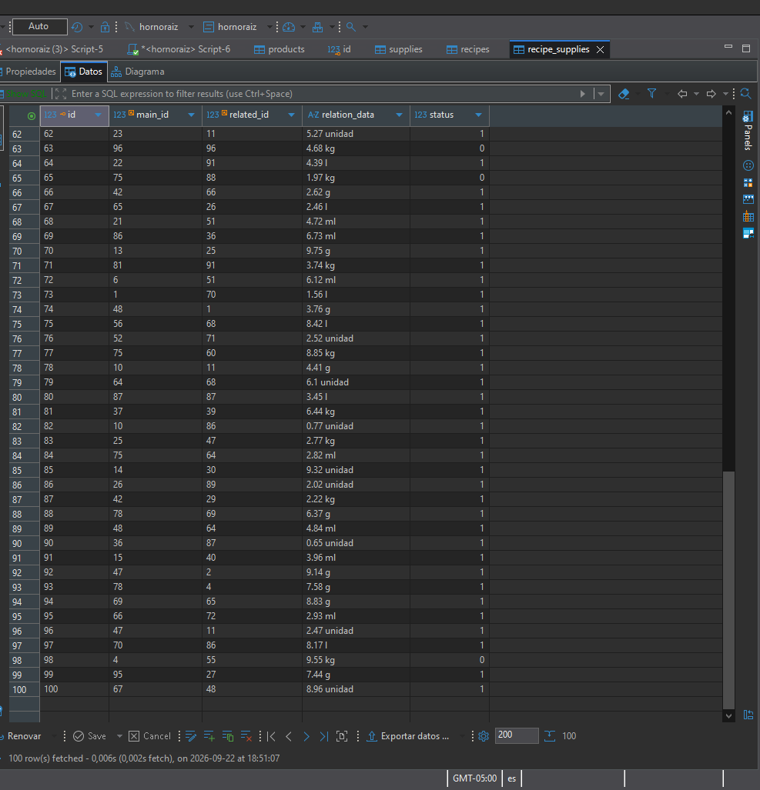

### 1.7 Carga de datos — tabla `production_batches`

Se generaron 100 registros de prueba para la tabla `production_batches`, en un archivo CSV separado por `;`, con las columnas `id`, `recipe_id`, `name`, `description`, `status`, `created_at`, `updated_at`. Los valores de `recipe_id` se generaron dentro del rango 1-100, referenciando las recetas ya cargadas en la Sección 1.5, respetando la Foreign Key hacia `recipes`.

**Resultado:** se importaron los 100 registros sin errores. Se usó una distribución de `status` con 85% activo / 15% inactivo, para dar variedad a las consultas de filtrado posteriores.

**Evidencia (imagen):**

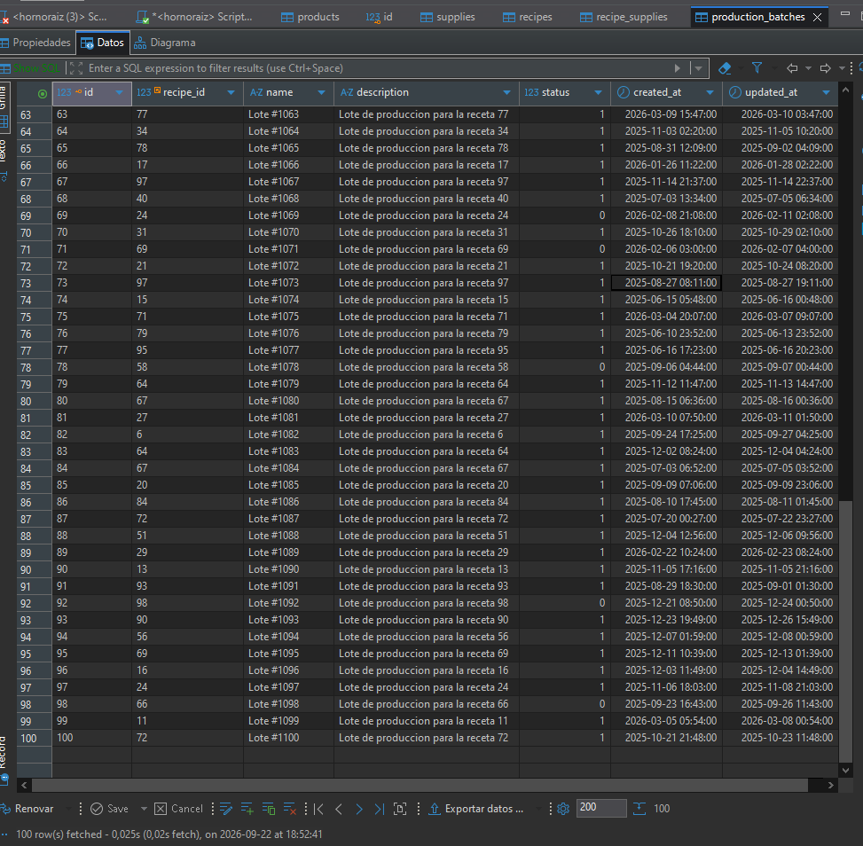

### 1.8 Carga de datos — tabla `supply_movements`

Se generaron 100 registros de prueba para la tabla `supply_movements`, en un archivo CSV separado por `;`, con las columnas `id`, `production_batch_id`, `supply_id`, `type`, `date`, `quantity`, `notes`, `status`. `supply_id` se generó siempre dentro del rango 1-100 (obligatorio), mientras que `production_batch_id` se dejó vacío en aproximadamente el 30% de las filas, reflejando su carácter nullable — movimientos sin lote de producción asociado, como compras directas o mermas de bodega.

**Resultado:** se importaron los 100 registros sin errores, verificando que las celdas vacías de `production_batch_id` se interpretaran como `NULL` en el asistente de importación. Los valores de `type` (`IN`, `OUT`, `ADJUSTMENT`) y `status` (`completed`, `pending`, `cancelled`) son texto de flujo de negocio, distinto del `status` booleano usado en `products`, `supplies`, `recipes`, `recipe_supplies`, `production_batches` y `promotions` (ver nota de la Sección 1.2).

**Evidencia (imagen):**

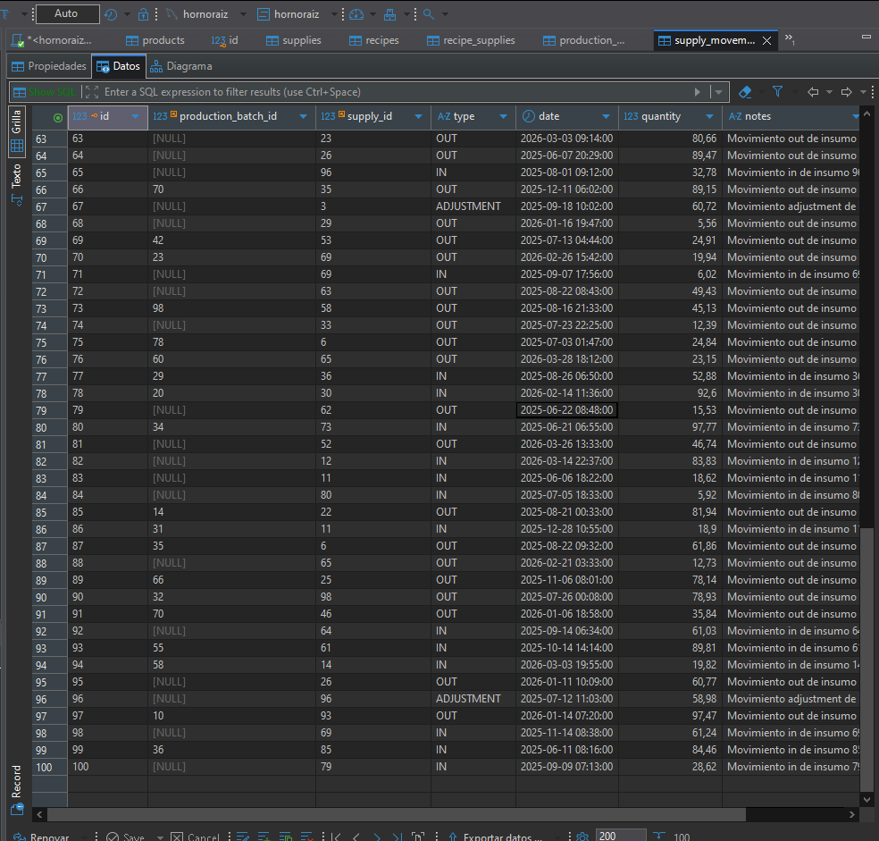

### 1.9 Carga de datos — tabla `sales`

Se generaron 100 registros de prueba para la tabla `sales`, en un archivo CSV separado por `;`, con las columnas `id`, `client_id`, `date`, `subtotal`, `taxes`, `total`, `status`. `client_id` se dejó vacío en aproximadamente el 40% de las filas, simulando ventas de mostrador sin cliente registrado — consistente con la ausencia de Foreign Key para esta columna, ya documentada en el modelo original. `taxes` se calculó como el 19% del `subtotal`, y `total` como la suma de ambos, para mantener consistencia numérica entre las tres columnas.

**Resultado:** se importaron los 100 registros sin errores. `status` (`paid`, `pending`, `cancelled`) es texto de flujo de negocio, distinto del `status` booleano usado en otras tablas del modelo (ver nota de la Sección 1.2).

**Evidencia (imagen):**

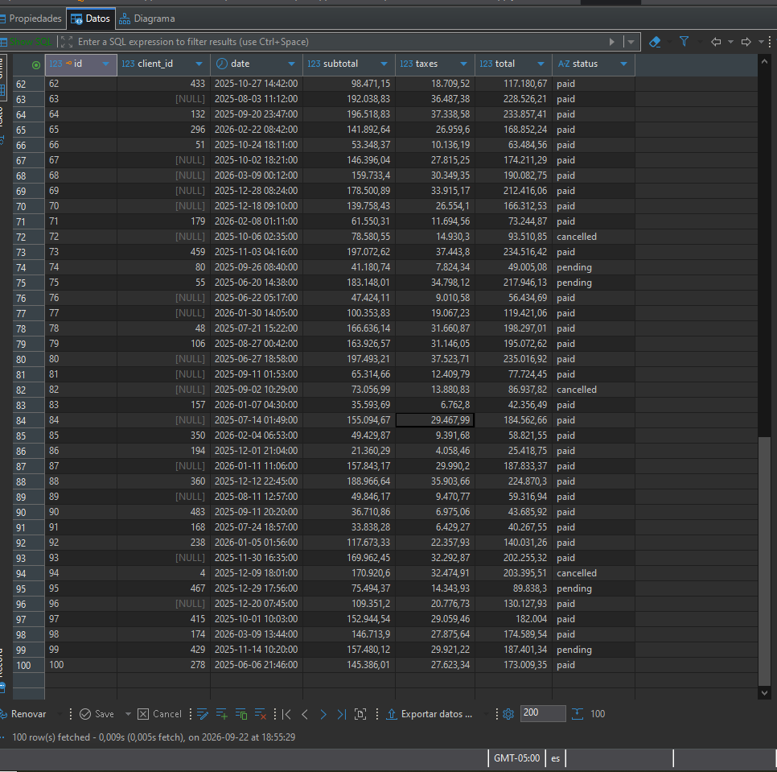

### 1.10 Carga de datos — tabla `sale_details`

Se generaron 100 registros de prueba para la tabla `sale_details`, en un archivo CSV separado por `;`, con las columnas `id`, `header_id`, `item_id`, `quantity`, `unit_price`, `total`, `notes`. `header_id` referencia `sales(id)` e `item_id` referencia `products(id)`, ambos en el rango 1-100. `total` se calculó como `quantity × unit_price`, garantizando consistencia interna en cada fila.

**Resultado:** se importaron los 100 registros sin errores.

**Nota:** `header_id` se generó de forma independiente al `subtotal` registrado en `sales` (Sección 1.9); la suma de `total` por `header_id` no necesariamente coincide con el `subtotal` de la venta correspondiente, al tratarse de dos conjuntos de datos generados por separado para fines de prueba.

**Evidencia (imagen):**

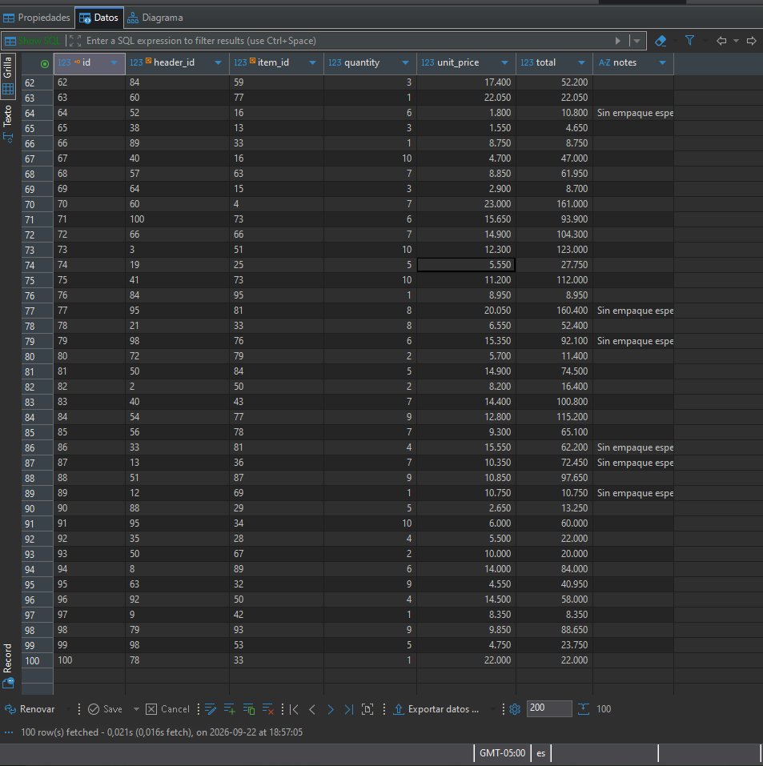

### 1.11 Carga de datos — tabla `payments`

Se generaron 100 registros de prueba para la tabla `payments`, en un archivo CSV separado por `;`, con las columnas `id`, `reference_type`, `reference_id`, `method`, `amount`, `date`, `status`. Todos los registros se generaron con `reference_type = 'sale'` y `reference_id` en el rango 1-100, asociando cada pago a una venta de la tabla `sales` (Sección 1.9) por convención de datos, dado que esta columna es polimórfica y no está resguardada por una Foreign Key.

**Resultado:** se importaron los 100 registros sin errores.

**Evidencia (imagen):**

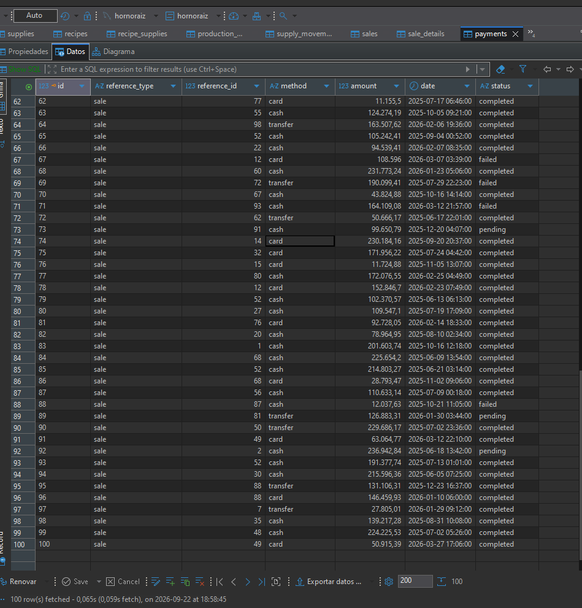

### 1.12 Carga de datos — tabla `promotions`

Se generaron 100 registros de prueba para la tabla `promotions`, en un archivo CSV separado por `;`, con las columnas `id`, `name`, `description`, `status`, `created_at`, `updated_at`. Sin Foreign Key ni tabla puente hacia `products`, respetando la decisión ya documentada para la relación `Promotion N:M Product`.

**Resultado:** se importaron los 100 registros sin errores. Se usó una distribución de `status` con 70% activo / 30% inactivo, simulando promociones ya vencidas para dar variedad a las consultas de filtrado.

**Evidencia (imagen):**

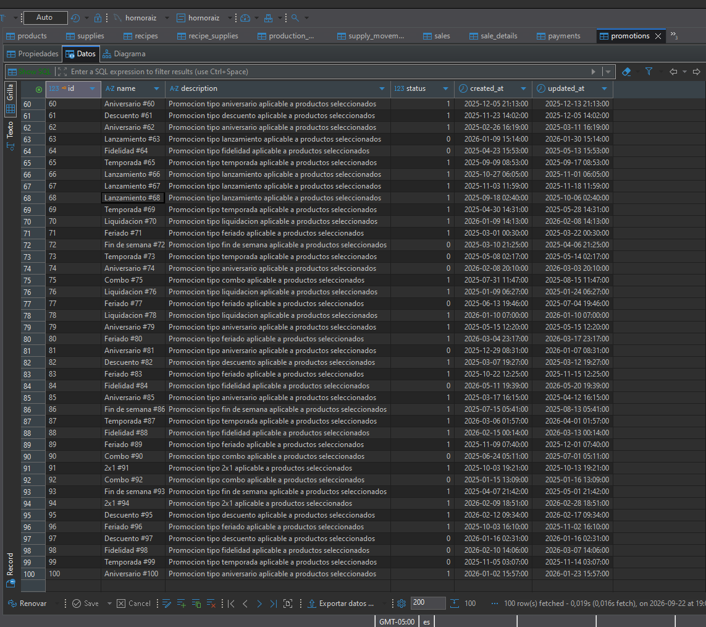

### 1.13 Consultas avanzadas en MySQL

#### 1.13.1 Mostrar algunos de los registros de la tabla `products`

```sql
SELECT sku, name, price, status FROM products;
```

**Evidencia (imagen):**

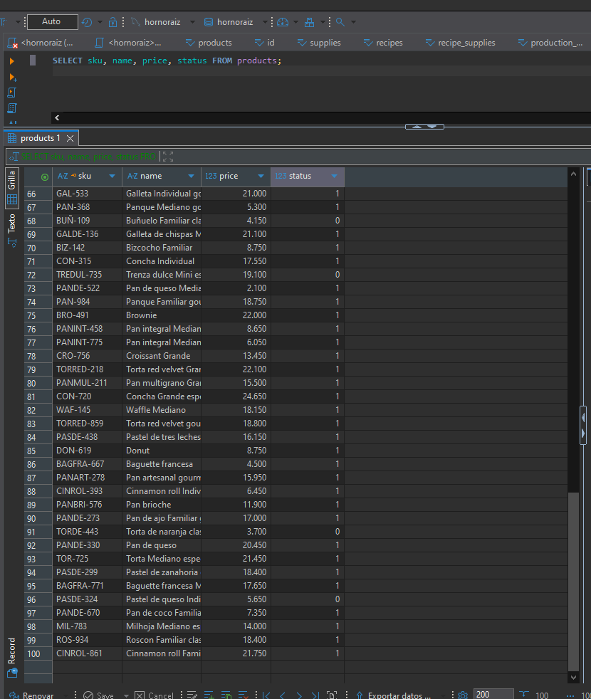

**Resultado:** la consulta devolvió los 100 registros de `products` con sus columnas `sku`, `name`, `price` y `status`, confirmando la carga de datos realizada en la Sección 1.3.

#### 1.13.2 Mostrar de forma ordenada (DESC) las ventas desde su comienzo

```sql
SELECT id, date, subtotal, status FROM sales ORDER BY date DESC;
```

**Evidencia (imagen):**

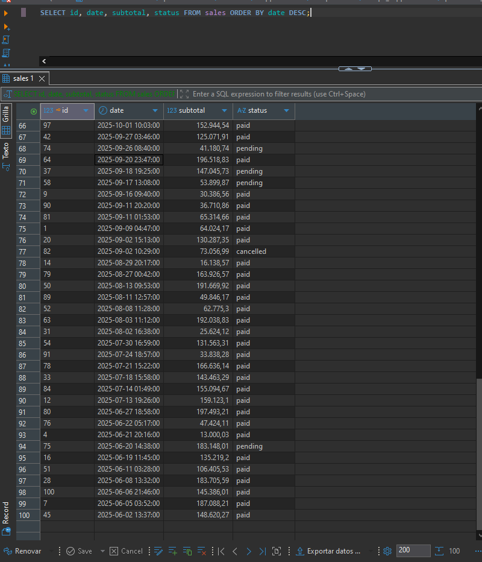

**Resultado:** la consulta devolvió los 100 registros de `sales` ordenados de la fecha más reciente (2026-03-27) a la más antigua (2025-06-02), confirmando que `ORDER BY date DESC` funciona correctamente sobre los datos cargados en la Sección 1.9.

#### 1.13.3 Consultas a múltiples tablas mediante WHERE

```sql
SELECT *
FROM sale_details SD, sales S
WHERE S.id = SD.header_id;
```

**Evidencia (imagen):**

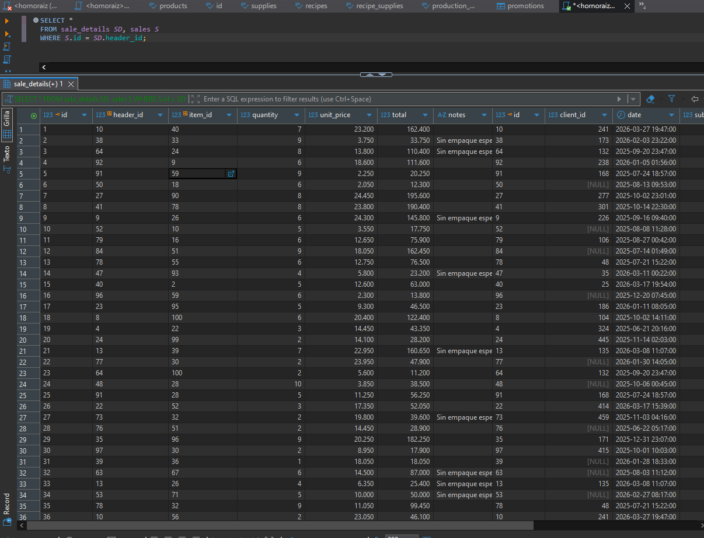

**Resultado:** la consulta devolvió los 100 registros de `sale_details` combinados con su venta correspondiente en `sales`, mediante la condición `S.id = SD.header_id` en la cláusula WHERE.

#### 1.13.4 Consultas a múltiples tablas mediante JOIN

```sql
SELECT S.date, S.status, SD.*
FROM sales AS S
JOIN sale_details AS SD ON (S.id = SD.header_id);
```

**Evidencia (imagen):**

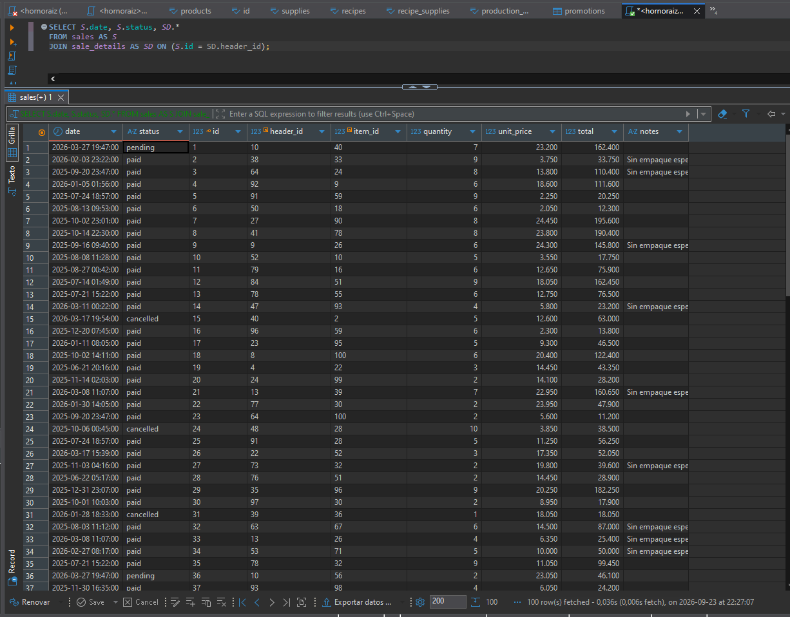

**Resultado:** la consulta devolvió los 100 registros combinando `sales` y `sale_details` mediante `JOIN ... ON`, con el mismo resultado que la Sección 1.13.3 (forma WHERE), confirmando que ambas sintaxis son equivalentes para esta relación.

#### 1.13.5 Condiciones en las consultas / filtros

Para las condiciones se utiliza la cláusula WHERE. Se realiza la misma consulta de la Sección 1.13.3/1.13.4, filtrando por un estado específico de `sales.status`.

```sql
SELECT *
FROM sale_details SD, sales S
WHERE S.id = SD.header_id AND S.status = 'paid';
```

**Evidencia (imagen):**

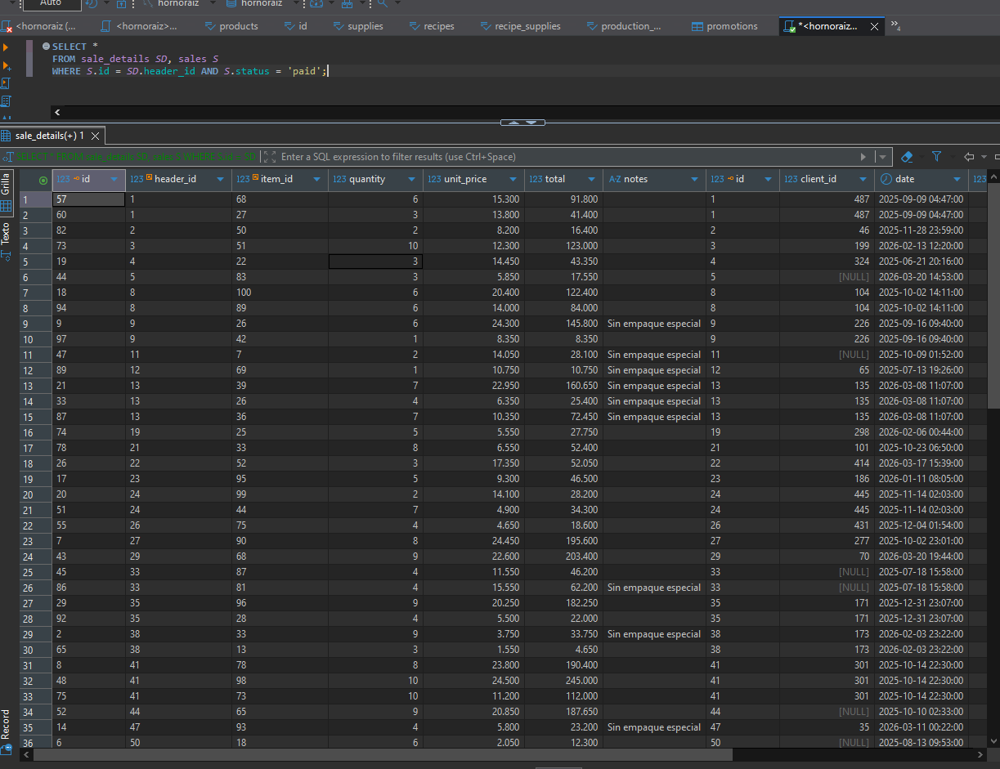

**Resultado:** la consulta devolvió 82 registros con `status = 'paid'`, filtrando del total de 100 combinaciones `sale_details`/`sales`.

```sql
SELECT S.date, S.status, SD.*
FROM sales AS S
JOIN sale_details AS SD ON (S.id = SD.header_id)
WHERE S.status = 'cancelled';
```

**Evidencia (imagen):**

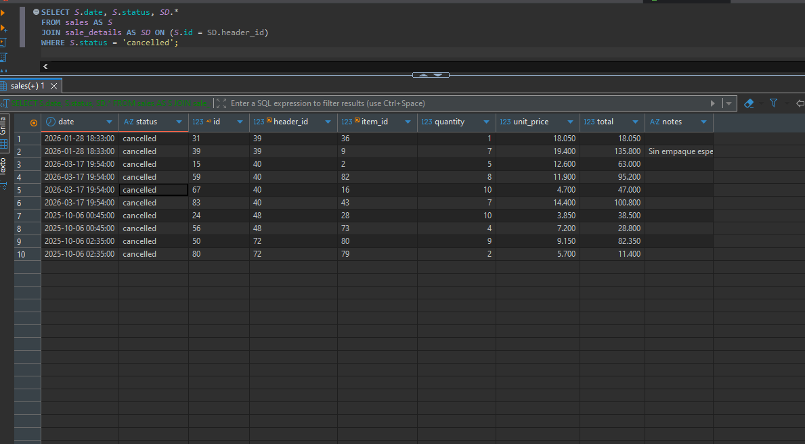

**Resultado:** la consulta devolvió 10 registros con `status = 'cancelled'`, usando la forma JOIN en vez de WHERE para la relación entre tablas.

#### 1.13.6 Consultas con filtros condicional LIKE

```sql
SELECT * FROM products AS P WHERE P.name LIKE 'Pan%';
```

**Evidencia (imagen):**

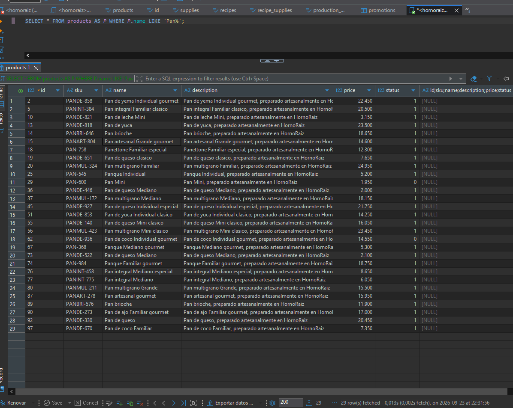

**Resultado:** la consulta devolvió 28 registros cuyo `name` comienza con "Pan" (Pan de yema, Pan integral, Pan de leche, Panettone, etc.), aplicando el operador `LIKE` con comodín al final del patrón.

**Mostrar los productos cuya descripción contenga la palabra "chocolate":**

```sql
SELECT * FROM products AS P WHERE P.description LIKE CONCAT('%','chocolate','%');
```

**Evidencia (imagen):**

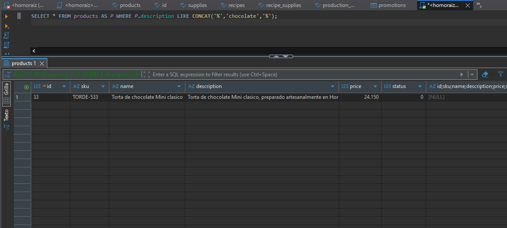

**Resultado:** la consulta devolvió 1 registro (`Torta de chocolate Mini clasico`), usando `CONCAT` para construir el patrón `%chocolate%` y localizar la coincidencia dentro de la descripción, sin importar su posición en el texto.

#### 1.13.7 Consultas con filtros condicionales BETWEEN

```sql
SELECT P.name, P.sku, SD.quantity, SD.total, S.date, PAY.method
FROM products P
JOIN sale_details SD ON P.id = SD.item_id
JOIN sales S ON SD.header_id = S.id
JOIN payments PAY ON PAY.reference_id = S.id AND PAY.reference_type = 'sale'
WHERE PAY.date BETWEEN '2025-06-01 00:00:00' AND '2026-03-30 23:59:59'
ORDER BY PAY.date ASC;
```

**Evidencia (imagen):**

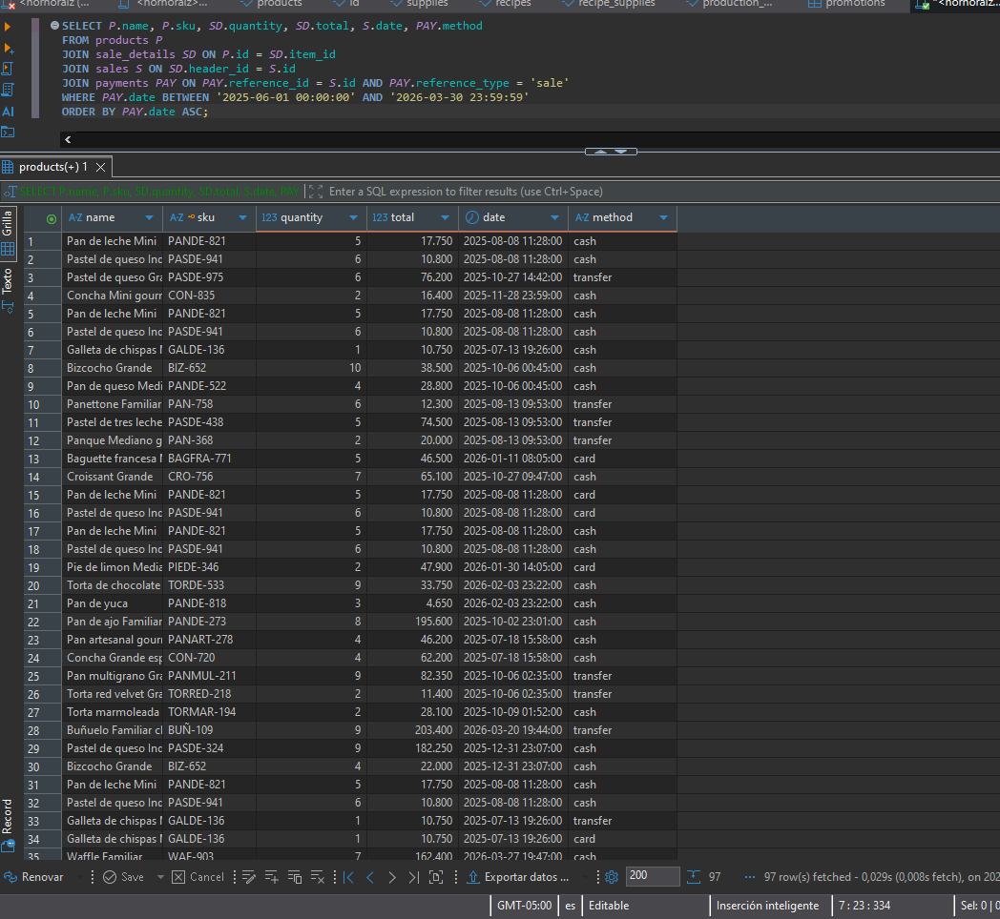

**Resultado:** la consulta combina `products`, `sale_details`, `sales` y `payments` en una cadena de 4 tablas, filtrando por `PAY.date` dentro del rango especificado. Se observan filas repetidas para una misma venta cuando esta tiene múltiples `sale_details` y múltiples `payments` asociados (por ejemplo, "Pan de leche Mini" y "Pastel de queso Individual" aparecen juntos varias veces): esto es el resultado esperado de un JOIN entre dos relaciones 1:N sobre la misma venta, no una duplicación de datos.

#### 1.13.8 Consultas con agrupamiento GROUP BY

**Forma 1 (rango de fechas, con AVG):**
```sql
SELECT S.id, S.date, SUM(PAY.amount) AS total_paid, COUNT(PAY.id) AS payment_count, AVG(PAY.amount) AS avg_payment
FROM sales S
JOIN payments PAY ON PAY.reference_id = S.id AND PAY.reference_type = 'sale'
WHERE PAY.date BETWEEN '2025-06-01 00:00:00' AND '2026-03-30 23:59:59'
GROUP BY S.id, S.date
ORDER BY total_paid DESC;
```

**Evidencia (imagen):**

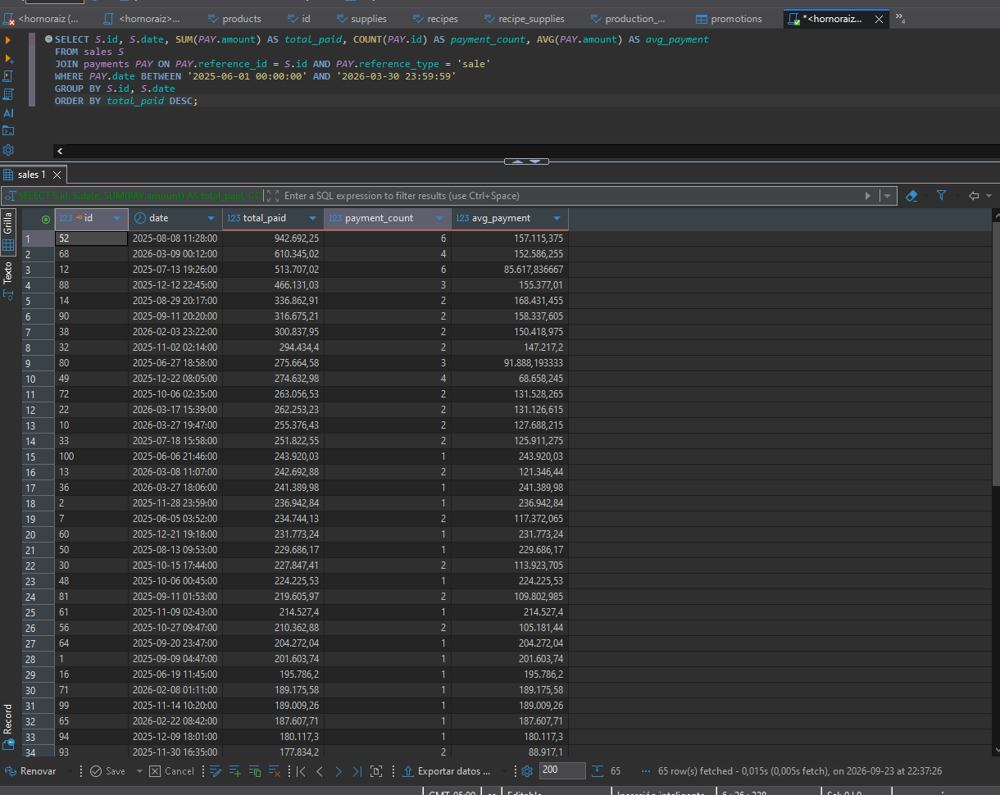

**Resultado:** 62 ventas agrupadas, con el total pagado por cada una (hasta 6 pagos por venta), su cantidad de pagos y el promedio, dentro del rango de fechas indicado. La venta 52 encabeza con $942.692,25 en 6 pagos.

**Forma 2 (filtro por status y method):**
```sql
SELECT S.id, S.date, SUM(PAY.amount) AS total_paid, COUNT(PAY.id) AS payment_count
FROM sales S
JOIN payments PAY ON PAY.reference_id = S.id AND PAY.reference_type = 'sale'
WHERE PAY.status = 'completed' AND PAY.method = 'card'
GROUP BY S.id, S.date
ORDER BY total_paid DESC;
```

**Evidencia (imagen):**

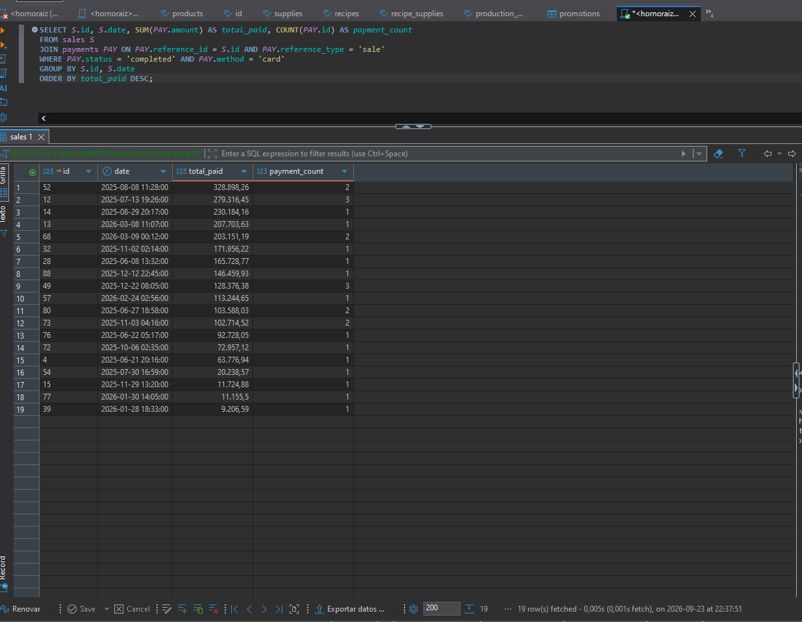

**Resultado:** 19 ventas cumplen la condición `status = 'completed' AND method = 'card'`, encabezadas por la venta 52 con $328.898,26 en 2 pagos.

**Con HAVING:**
```sql
SELECT S.id, S.date, SUM(PAY.amount) AS total_paid, COUNT(PAY.id) AS payment_count
FROM sales S
JOIN payments PAY ON PAY.reference_id = S.id AND PAY.reference_type = 'sale'
GROUP BY S.id, S.date
HAVING SUM(PAY.amount) >= 100000
ORDER BY total_paid DESC;
```

**Evidencia (imagen):**

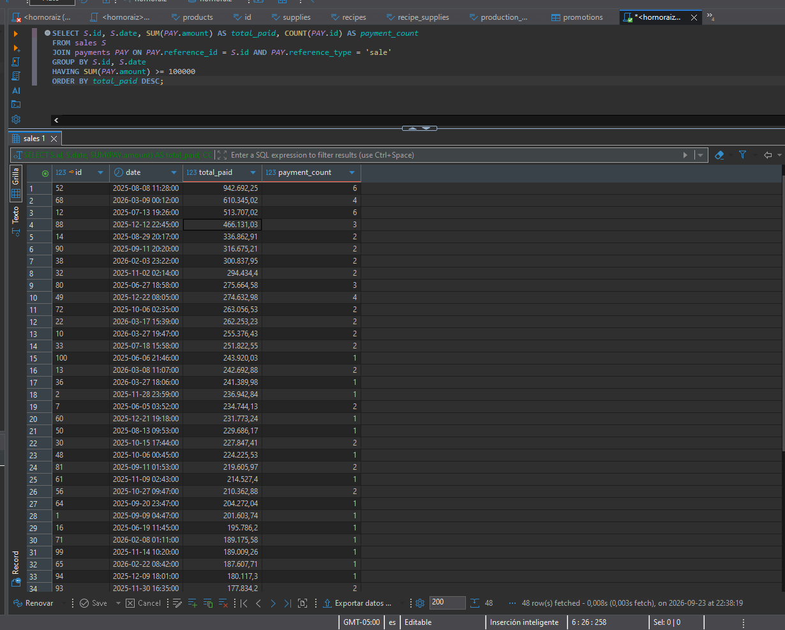

**Resultado:** 47 ventas cumplen la condición `SUM(PAY.amount) >= 100000`, encabezadas por la venta 52 con $942.692,25 en 6 pagos. El conjunto es un subconjunto de la Forma 1 (Sección 1.13.8), filtrado por el umbral establecido en `HAVING`.

#### 1.13.9 Subconsultas y teoría de conjuntos

Mostrar los productos que no han sido vendidos (sin registro en `sale_details`/`sales`) dentro de un rango de fechas específico.

**Forma 1 (subconsulta con NOT IN):**
```sql
SELECT * FROM products AS P
WHERE P.id NOT IN (
  SELECT SD.item_id FROM sale_details SD
  JOIN sales S ON SD.header_id = S.id
  WHERE S.date BETWEEN '2025-06-01' AND '2026-03-30'
);
```

**Evidencia (imagen):**

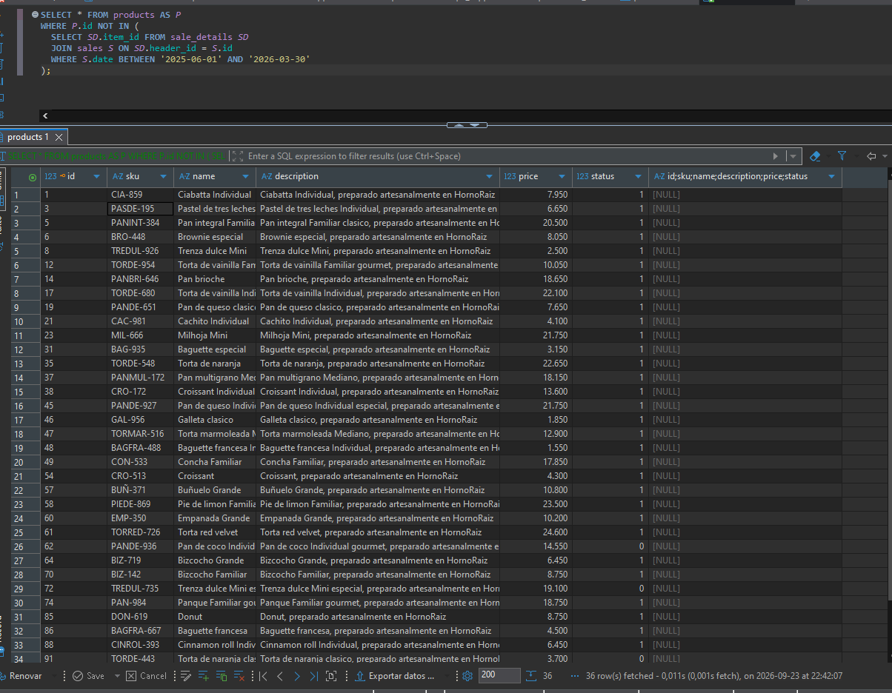

**Resultado:** 35 productos sin ventas registradas en el rango de fechas indicado.

**Forma 2 (LEFT JOIN con IS NULL):**
```sql
SELECT * FROM products AS P
LEFT JOIN sale_details AS SD ON (P.id = SD.item_id)
LEFT JOIN sales AS S ON (SD.header_id = S.id AND S.date BETWEEN '2025-06-01' AND '2026-03-30')
WHERE S.id IS NULL;
```

**Evidencia (imagen):**

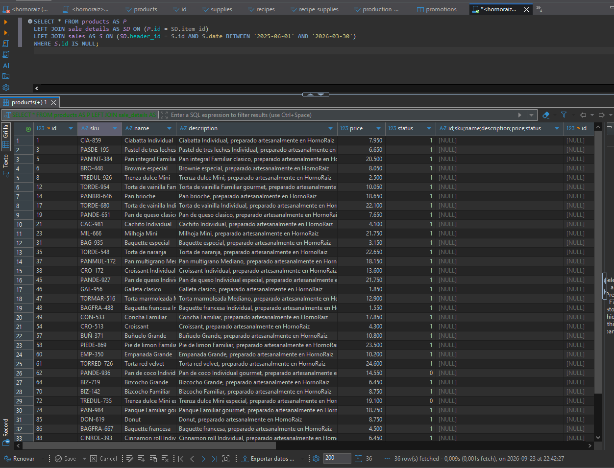

**Resultado:** mismos 35 productos que la Forma 1, confirmando la equivalencia entre ambas formas de expresar la teoría de conjuntos (diferencia entre `products` y los productos presentes en `sale_details`/`sales` dentro del rango).

## 2. PostgreSQL

### 2.1 Renombramiento de tablas

Siguiendo la misma normativa aplicada en MySQL (Sección 1.1), se renombraron las tablas de la base `hornoraiz` en PostgreSQL a plural e inglés. A diferencia de MySQL, PostgreSQL no soporta `RENAME TABLE` para múltiples tablas en una sola sentencia; cada tabla requiere su propio `ALTER TABLE ... RENAME TO`.

```sql
ALTER TABLE producto RENAME TO products;
ALTER TABLE insumo RENAME TO supplies;
ALTER TABLE receta RENAME TO recipes;
ALTER TABLE receta_insumo RENAME TO recipe_supplies;
ALTER TABLE lote_produccion RENAME TO production_batches;
ALTER TABLE movimiento_insumo RENAME TO supply_movements;
ALTER TABLE venta RENAME TO sales;
ALTER TABLE venta_detalle RENAME TO sale_details;
ALTER TABLE pago RENAME TO payments;
ALTER TABLE promocion RENAME TO promotions;
```

**Evidencia (imagen):**

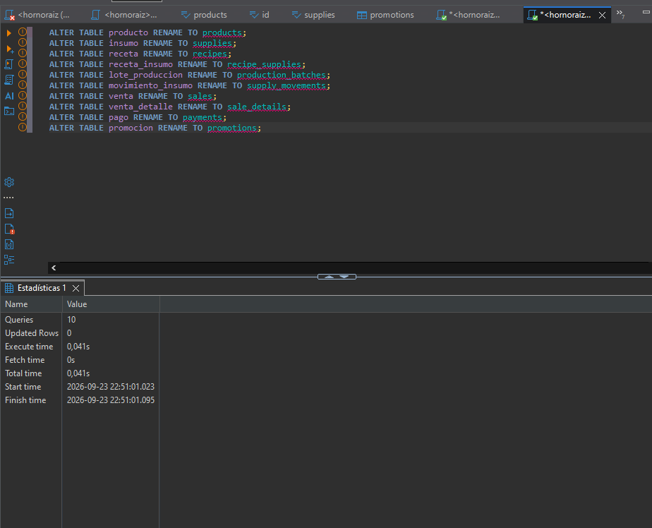

**Resultado:** las 10 tablas quedaron renombradas a plural e inglés, sin pérdida de datos ni de las relaciones de Foreign Key existentes.

### 2.2 Renombramiento de columnas

Al igual que con las tablas, PostgreSQL exige una sentencia `ALTER TABLE` independiente por cada `RENAME COLUMN` — no admite agrupar varias columnas en una sola sentencia como sí permite MySQL.

```sql
ALTER TABLE products RENAME COLUMN nombre TO name;
ALTER TABLE products RENAME COLUMN descripcion TO description;
ALTER TABLE products RENAME COLUMN precio TO price;
ALTER TABLE products RENAME COLUMN is_active TO status;

ALTER TABLE supplies RENAME COLUMN codigo TO code;
ALTER TABLE supplies RENAME COLUMN nombre TO name;
ALTER TABLE supplies RENAME COLUMN unidad_medida TO unit_of_measure;
ALTER TABLE supplies RENAME COLUMN stock_minimo TO min_stock;
ALTER TABLE supplies RENAME COLUMN is_active TO status;

ALTER TABLE recipes RENAME COLUMN producto_id TO product_id;
ALTER TABLE recipes RENAME COLUMN nombre TO name;
ALTER TABLE recipes RENAME COLUMN descripcion TO description;
ALTER TABLE recipes RENAME COLUMN is_active TO status;

ALTER TABLE recipe_supplies RENAME COLUMN principal_id TO main_id;
ALTER TABLE recipe_supplies RENAME COLUMN relacionado_id TO related_id;
ALTER TABLE recipe_supplies RENAME COLUMN datos_relacion TO relation_data;
ALTER TABLE recipe_supplies RENAME COLUMN is_active TO status;

ALTER TABLE production_batches RENAME COLUMN receta_id TO recipe_id;
ALTER TABLE production_batches RENAME COLUMN nombre TO name;
ALTER TABLE production_batches RENAME COLUMN descripcion TO description;
ALTER TABLE production_batches RENAME COLUMN is_active TO status;

ALTER TABLE supply_movements RENAME COLUMN lote_produccion_id TO production_batch_id;
ALTER TABLE supply_movements RENAME COLUMN insumo_id TO supply_id;
ALTER TABLE supply_movements RENAME COLUMN tipo TO type;
ALTER TABLE supply_movements RENAME COLUMN fecha TO date;
ALTER TABLE supply_movements RENAME COLUMN cantidad TO quantity;
ALTER TABLE supply_movements RENAME COLUMN observaciones TO notes;
ALTER TABLE supply_movements RENAME COLUMN estado TO status;

ALTER TABLE sales RENAME COLUMN cliente_id TO client_id;
ALTER TABLE sales RENAME COLUMN fecha TO date;
ALTER TABLE sales RENAME COLUMN impuestos TO taxes;
ALTER TABLE sales RENAME COLUMN estado TO status;

ALTER TABLE sale_details RENAME COLUMN cabecera_id TO header_id;
ALTER TABLE sale_details RENAME COLUMN cantidad TO quantity;
ALTER TABLE sale_details RENAME COLUMN valor_unitario TO unit_price;
ALTER TABLE sale_details RENAME COLUMN observaciones TO notes;

ALTER TABLE payments RENAME COLUMN referencia_tipo TO reference_type;
ALTER TABLE payments RENAME COLUMN referencia_id TO reference_id;
ALTER TABLE payments RENAME COLUMN metodo TO method;
ALTER TABLE payments RENAME COLUMN monto TO amount;
ALTER TABLE payments RENAME COLUMN fecha TO date;
ALTER TABLE payments RENAME COLUMN estado TO status;

ALTER TABLE promotions RENAME COLUMN nombre TO name;
ALTER TABLE promotions RENAME COLUMN descripcion TO description;
ALTER TABLE promotions RENAME COLUMN is_active TO status;
```

**Evidencia (imagen):**

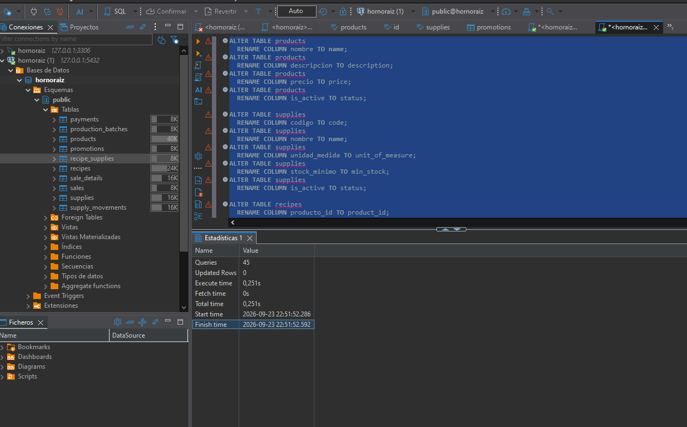

**Resultado:** se verificaron los nombres finales mediante consulta a `information_schema.columns`. Aplica la misma advertencia documentada para MySQL (Sección 1.2): `status` no tiene un dominio de valores uniforme entre tablas — es booleano (`0`/`1`, ex `is_active`) en `products`, `supplies`, `recipes`, `recipe_supplies`, `production_batches` y `promotions`, y texto de flujo de negocio (ex `estado`) en `sales`, `payments` y `supply_movements`.

### 2.3 Carga de datos — tabla `products`

Se importó el mismo archivo `products.csv` generado para MySQL (100 registros, separado por `;`), sin necesidad de regenerarlo.

**Evidencia (imagen):**

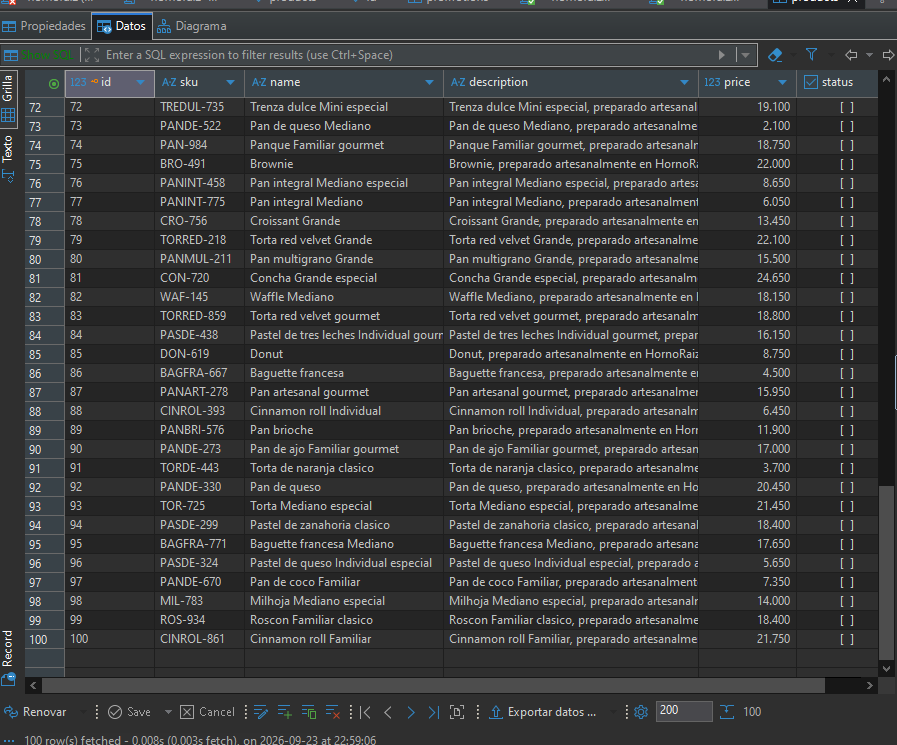

**Resultado:** se importaron los 100 registros en la tabla `products` sin errores.

### 2.4 Carga de datos — tabla `supplies`

**Evidencia (imagen):**

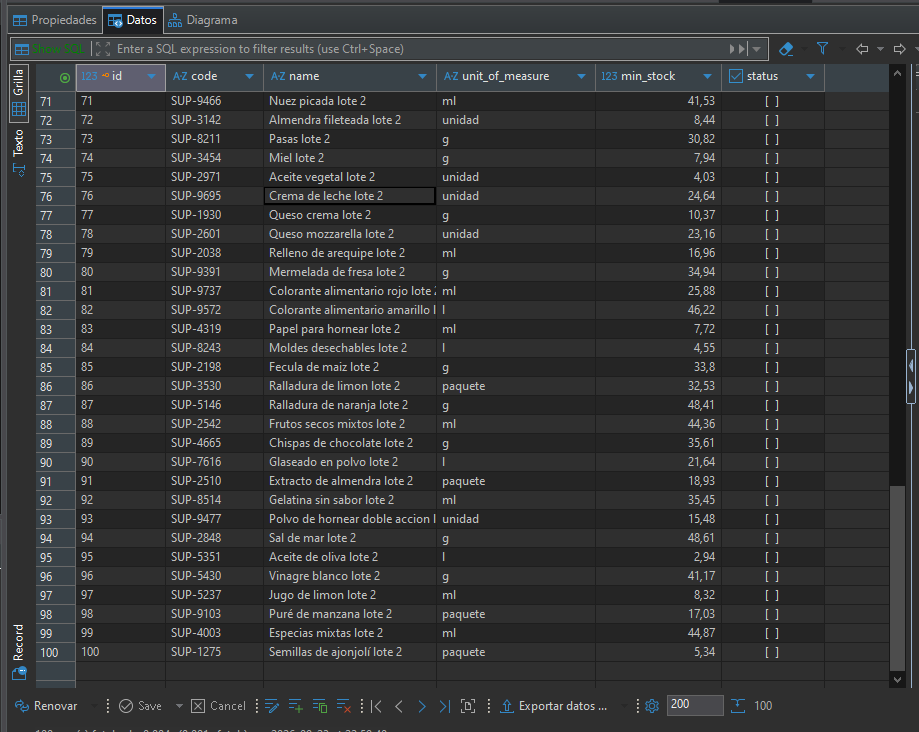

**Resultado:** se importaron los 100 registros en la tabla `supplies` sin errores.

### 2.5 Carga de datos — tabla `recipes`

**Evidencia (imagen):**

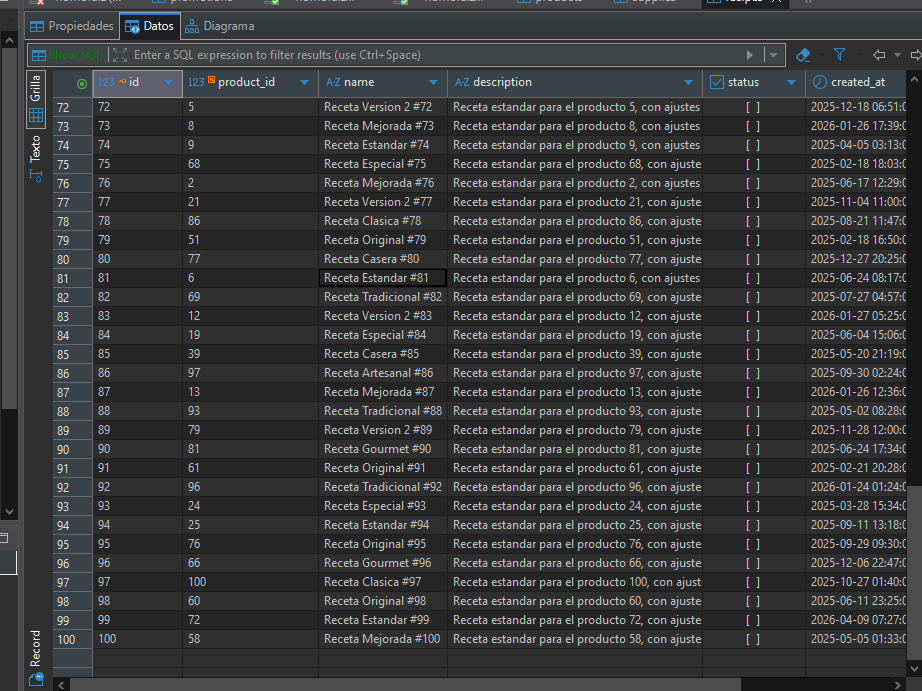

**Resultado:** se importaron los 100 registros en la tabla `recipes` sin errores, respetando la Foreign Key hacia `products`.

### 2.6 Carga de datos — tabla `recipe_supplies`

**Evidencia (imagen):**

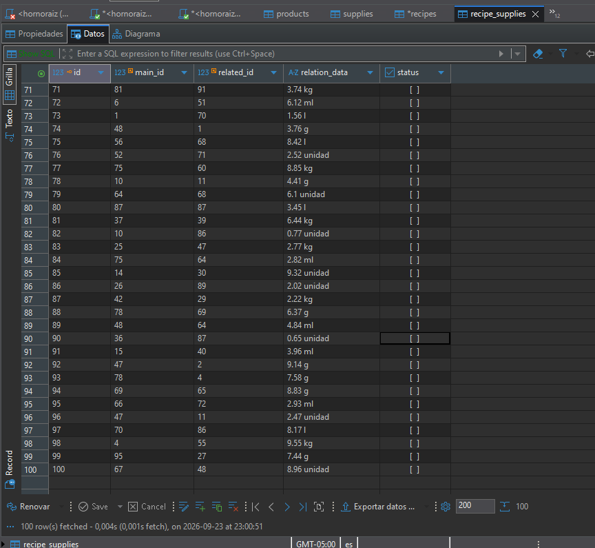

**Resultado:** se importaron los 100 registros en la tabla `recipe_supplies` sin errores, respetando las Foreign Keys hacia `recipes` e `supplies`.

### 2.7 Carga de datos — tabla `production_batches`

**Evidencia (imagen):**

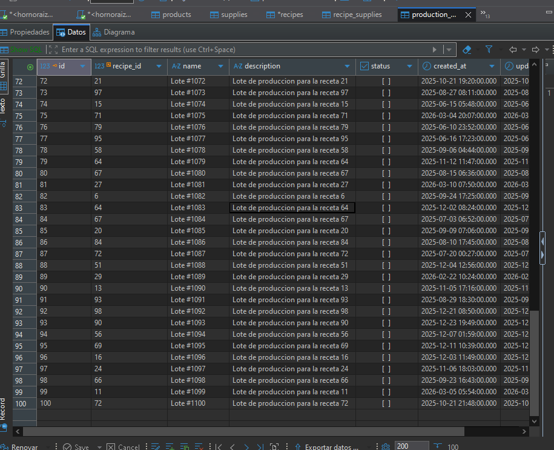

**Resultado:** se importaron los 100 registros en la tabla `production_batches` sin errores, respetando la Foreign Key hacia `recipes`.

### 2.8 Carga de datos — tabla `supply_movements`

**Evidencia (imagen):**

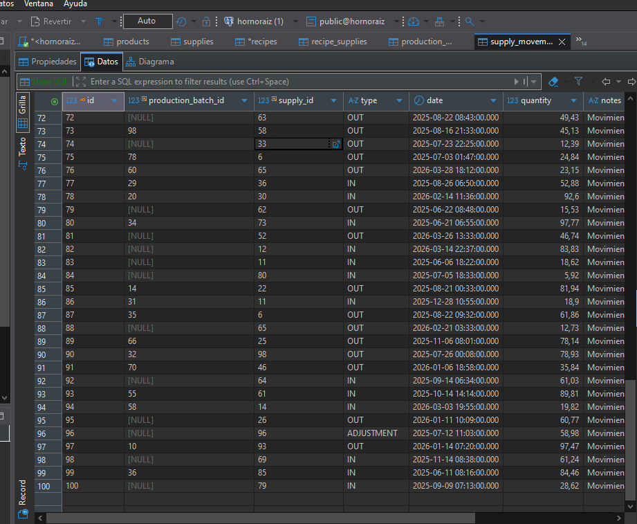

**Resultado:** se importaron los 100 registros en la tabla `supply_movements` sin errores, con `production_batch_id` nullable importado correctamente como `NULL` en las filas vacías del CSV.

### 2.9 Carga de datos — tabla `sales`

**Evidencia (imagen):**

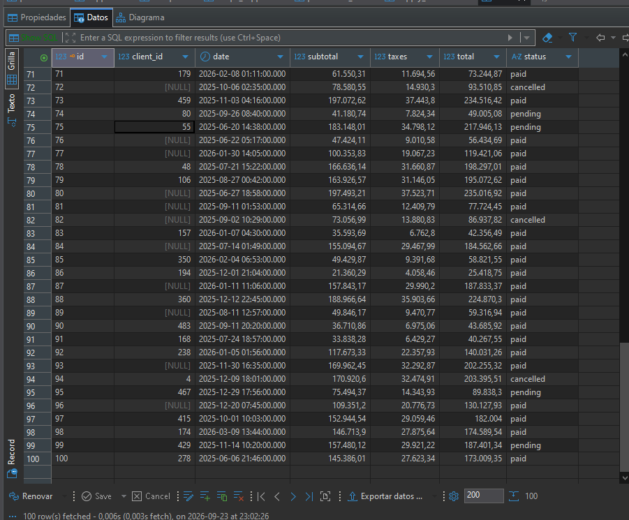

**Resultado:** se importaron los 100 registros en la tabla `sales` sin errores.

### 2.10 Carga de datos — tabla `sale_details`

**Evidencia (imagen):**

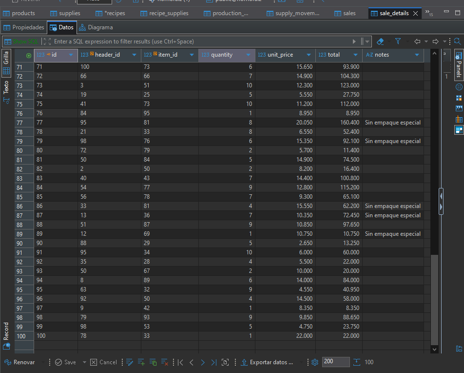

**Resultado:** se importaron los 100 registros en la tabla `sale_details` sin errores, respetando las Foreign Keys hacia `sales` y `products`.

### 2.11 Carga de datos — tabla `payments`

**Evidencia (imagen):**

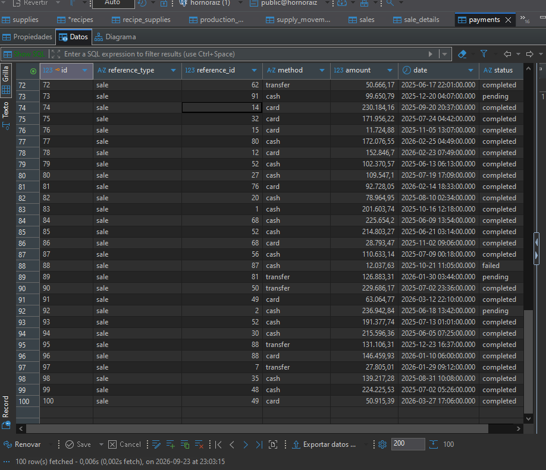

**Resultado:** se importaron los 100 registros en la tabla `payments` sin errores.

### 2.12 Carga de datos — tabla `promotions`

**Evidencia (imagen):**

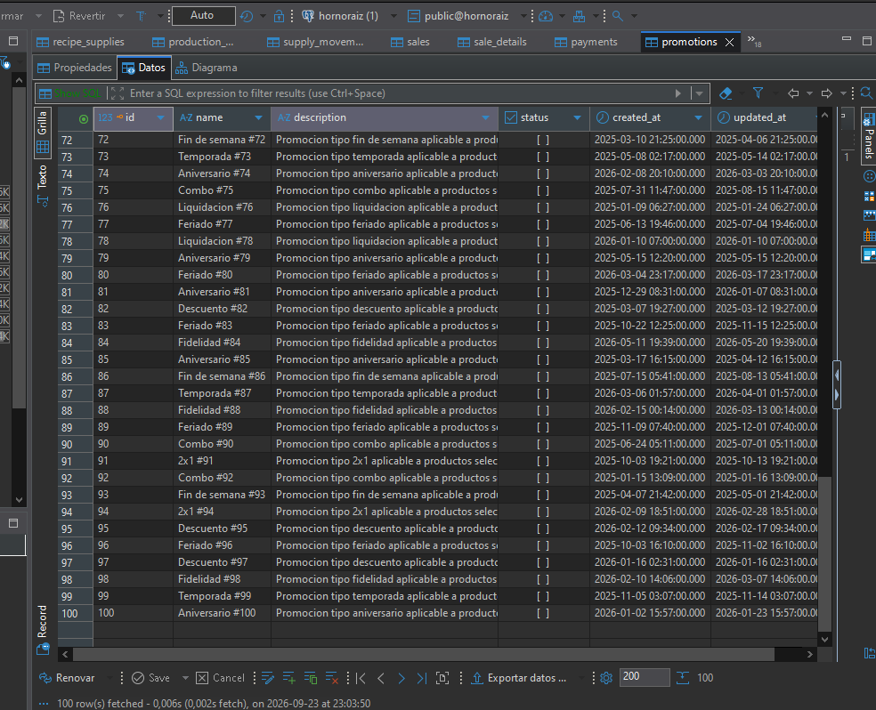

**Resultado:** se importaron los 100 registros en la tabla `promotions` sin errores.

### 2.13 Incidente: conversión incorrecta de `status` (boolean) al importar por asistente gráfico

Al importar los 6 archivos CSV correspondientes a tablas con columna `status` de tipo `boolean` (`products`, `supplies`, `recipes`, `recipe_supplies`, `production_batches`, `promotions`) mediante el asistente gráfico de DBeaver (Secciones 2.3 a 2.12), todos los registros quedaron con `status = false`, independientemente del valor `1`/`0` original en el CSV, sin que el asistente reportara ningún error.

**Diagnóstico:**

```sql
SELECT 'products' t, COUNT(*) FILTER (WHERE status) AS activos, COUNT(*) FILTER (WHERE NOT status) AS inactivos FROM products
UNION ALL SELECT 'supplies', COUNT(*) FILTER (WHERE status), COUNT(*) FILTER (WHERE NOT status) FROM supplies
UNION ALL SELECT 'recipes', COUNT(*) FILTER (WHERE status), COUNT(*) FILTER (WHERE NOT status) FROM recipes
UNION ALL SELECT 'recipe_supplies', COUNT(*) FILTER (WHERE status), COUNT(*) FILTER (WHERE NOT status) FROM recipe_supplies
UNION ALL SELECT 'production_batches', COUNT(*) FILTER (WHERE status), COUNT(*) FILTER (WHERE NOT status) FROM production_batches
UNION ALL SELECT 'promotions', COUNT(*) FILTER (WHERE status), COUNT(*) FILTER (WHERE NOT status) FROM promotions;
```

confirmó `activos = 0` en las 6 tablas, evidenciando que el driver del asistente gráfico no convirtió correctamente los valores de texto `'1'`/`'0'` del CSV al tipo `boolean` nativo de PostgreSQL.

**Solución:** se truncaron las 6 tablas afectadas (y `sale_details`, `supply_movements`, vaciadas en cascada por sus Foreign Keys) y se reimportaron mediante `\copy` desde el cliente `psql`, conectado directamente al contenedor Docker de PostgreSQL (`postgres-server`, puerto `5432`), en vez del asistente gráfico:

```sql
TRUNCATE TABLE recipe_supplies, production_batches, recipes, supplies, promotions, products RESTART IDENTITY CASCADE;
```

```\copy products FROM '/home/vboxuser/products.csv' WITH (FORMAT csv, DELIMITER ';', HEADER true)
\copy supplies FROM '/home/vboxuser/supplies.csv' WITH (FORMAT csv, DELIMITER ';', HEADER true)
\copy recipes FROM '/home/vboxuser/recipes.csv' WITH (FORMAT csv, DELIMITER ';', HEADER true)
\copy recipe_supplies FROM '/home/vboxuser/recipe_supplies.csv' WITH (FORMAT csv, DELIMITER ';', HEADER true)
\copy production_batches FROM '/home/vboxuser/production_batches.csv' WITH (FORMAT csv, DELIMITER ';', HEADER true)
\copy sale_details FROM '/home/vboxuser/sale_details.csv' WITH (FORMAT csv, DELIMITER ';', HEADER true)
\copy promotions FROM '/home/vboxuser/promotions.csv' WITH (FORMAT csv, DELIMITER ';', HEADER true)
```

**Evidencia (imagen):**

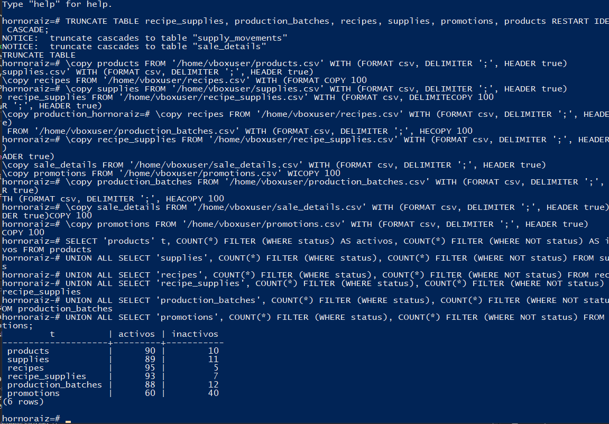

**Resultado:** tras la reimportación por `\copy`, la conversión de `status` se realizó correctamente, obteniendo proporciones reales de activos/inactivos en las 6 tablas (`products`: 90/10, `supplies`: 89/11, `recipes`: 95/5, `recipe_supplies`: 93/7, `production_batches`: 88/12, `promotions`: 60/40), a diferencia del `0/100` uniforme que arrojó el asistente gráfico.

#### 2.14.1 Mostrar algunos de los registros de la tabla `products`

```sql
SELECT sku, name, price, status FROM products;
```

**Evidencia (imagen):**

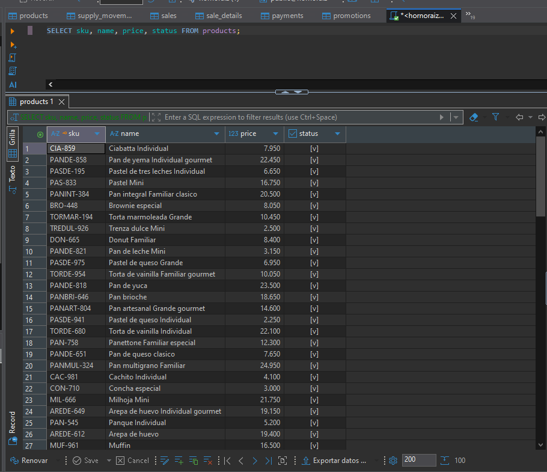

**Resultado:** la consulta devolvió los 100 registros de `products` con `status` en formato `true`/`false` (tipo nativo `boolean` de PostgreSQL, a diferencia de `1`/`0` en MySQL), coincidiendo con los mismos productos activos/inactivos verificados tras la corrección de la Sección 2.13.

#### 2.14.2 Mostrar de forma ordenada (DESC) las ventas desde su comienzo

```sql
SELECT id, date, subtotal, status FROM sales ORDER BY date DESC;
```

**Evidencia (imagen):**

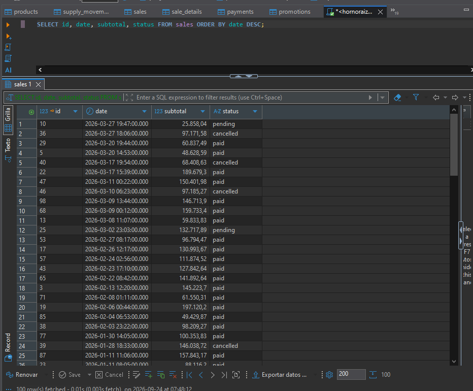

**Resultado:** la consulta devolvió los 100 registros de `sales` ordenados de la fecha más reciente (2026-03-27) a la más antigua (2025-06-02), mismos valores y orden que en MySQL (Sección 1.13.2). La columna `date` se muestra con precisión de milisegundos (`.000`), propia del tipo `timestamp` de PostgreSQL.

#### 2.14.3 Consultas a múltiples tablas mediante WHERE

```sql
SELECT *
FROM sale_details SD, sales S
WHERE S.id = SD.header_id;
```

**Evidencia (imagen):**

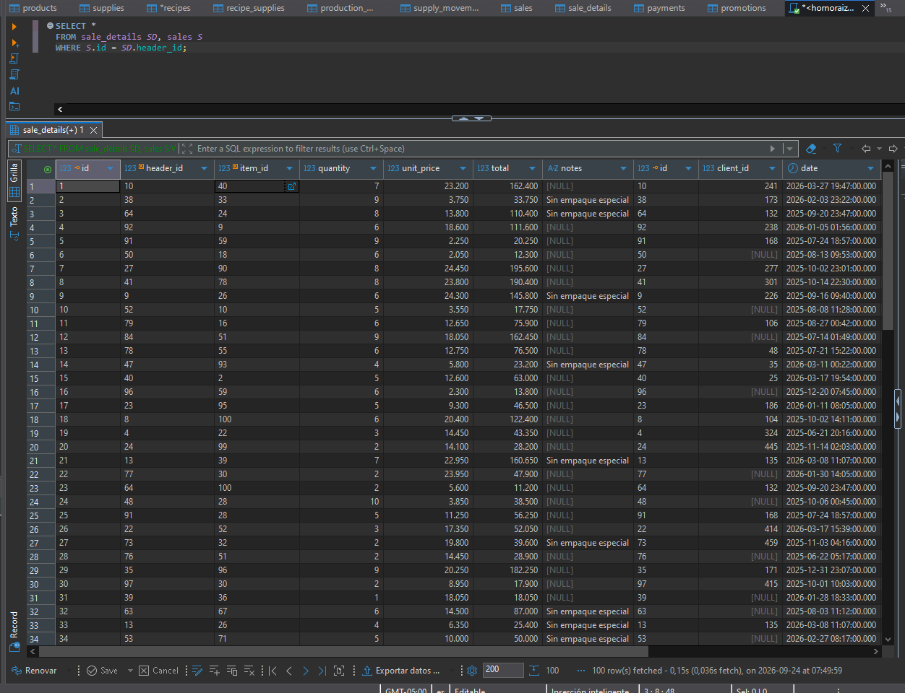

**Resultado:** la consulta devolvió los 100 registros de `sale_details` combinados con su venta correspondiente en `sales`, mismos resultados que en MySQL (Sección 1.13.3).

#### 2.14.4 Consultas a múltiples tablas mediante JOIN

```sql
SELECT S.date, S.status, SD.*
FROM sales AS S
JOIN sale_details AS SD ON (S.id = SD.header_id);
```

**Evidencia (imagen):**

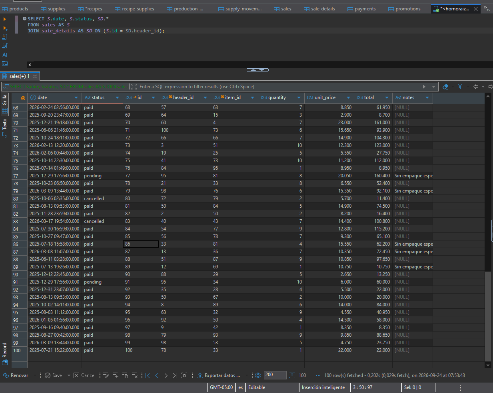

**Resultado:** la consulta devolvió los 100 registros combinando `sales` y `sale_details` mediante `JOIN ... ON`, con el mismo resultado que la Sección 2.14.3 (forma WHERE) y que MySQL (Sección 1.13.4).

#### 2.14.5 Condiciones en las consultas / filtros

```sql
SELECT *
FROM sale_details SD, sales S
WHERE S.id = SD.header_id AND S.status = 'paid';
```

**Evidencia (imagen):**

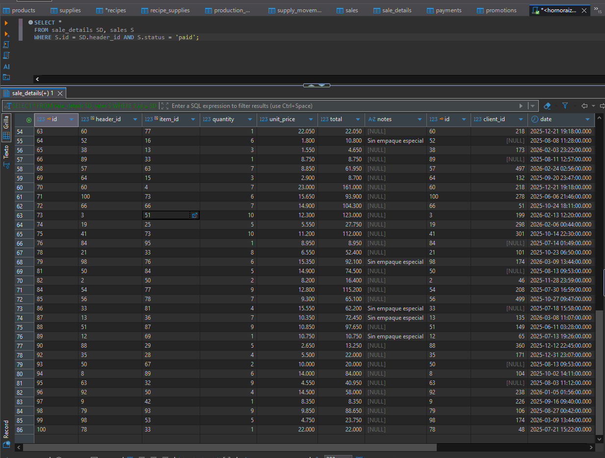

**Resultado:** la consulta devolvió 82 registros con `status = 'paid'`, mismo resultado que en MySQL (Sección 1.13.5).

```sql
SELECT S.date, S.status, SD.*
FROM sales AS S
JOIN sale_details AS SD ON (S.id = SD.header_id)
WHERE S.status = 'cancelled';
```

**Evidencia (imagen):**

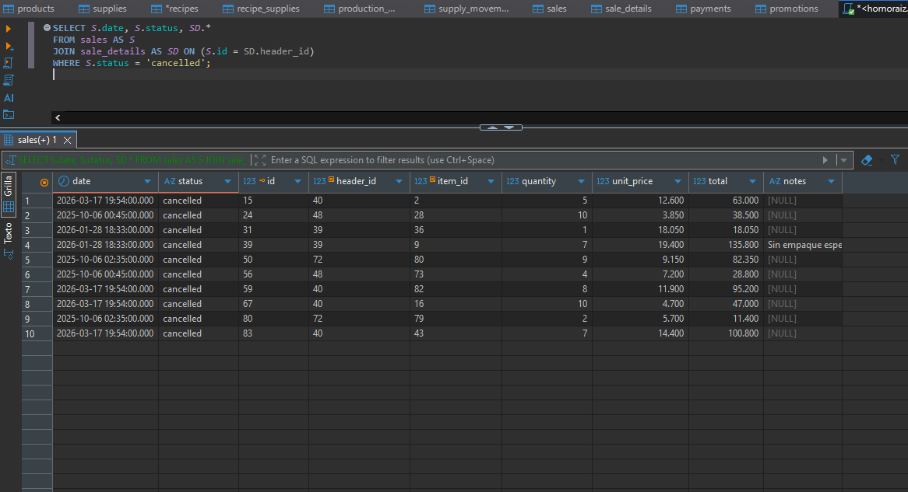

**Resultado:** la consulta devolvió 10 registros con `status = 'cancelled'`, mismo resultado que en MySQL (Sección 1.13.5).

#### 2.14.6 Consultas con filtros condicional LIKE

```sql
SELECT * FROM products AS P WHERE P.name LIKE 'Pan%';
```

**Evidencia (imagen):**

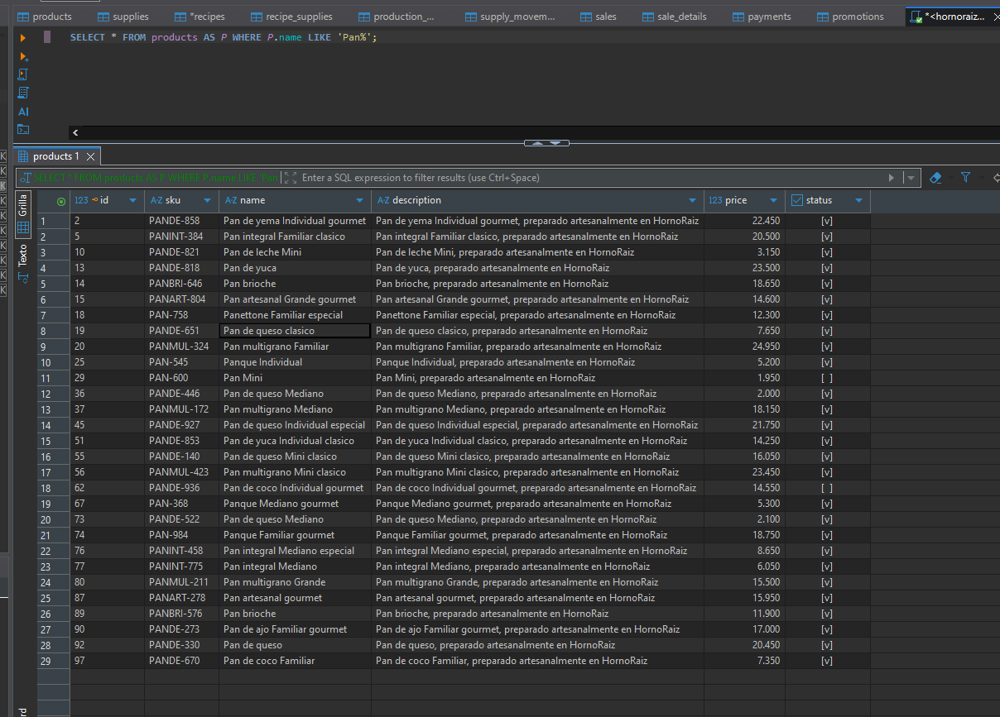

**Resultado:** la consulta devolvió 28 registros cuyo `name` comienza con "Pan", mismo resultado que en MySQL (Sección 1.13.6).

**Mostrar los productos cuya descripción contenga la palabra "chocolate":**

```sql
SELECT * FROM products AS P WHERE P.description LIKE CONCAT('%','chocolate','%');
```

**Evidencia (imagen):**

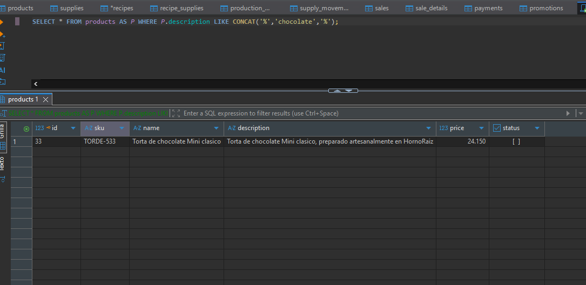

**Resultado:** la consulta devolvió 1 registro (`Torta de chocolate Mini clasico`), mismo resultado que en MySQL.

**Combinación (status = cancelled y name LIKE 'Pan%'):**

```sql
SELECT S.date, S.status, P.name
FROM sales AS S
JOIN sale_details AS SD ON (S.id = SD.header_id)
JOIN products AS P ON (P.id = SD.item_id)
WHERE S.status = 'cancelled' AND P.name LIKE 'Pan%';
```

**Evidencia (imagen):**

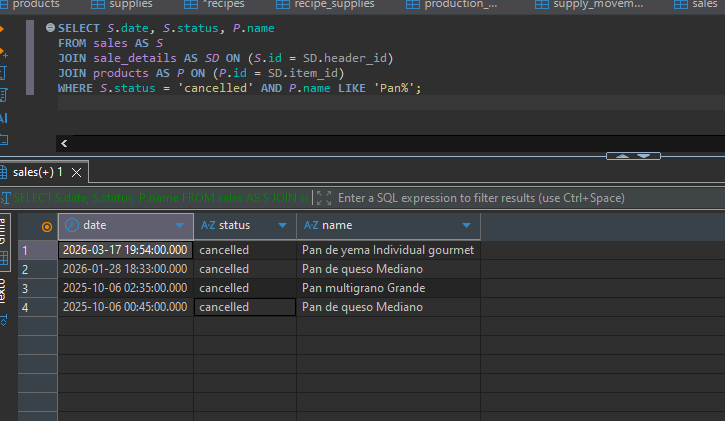

**Resultado:** la consulta devolvió 4 registros, coincidiendo con productos cuyo nombre empieza con "Pan" dentro de las ventas canceladas de la Sección 2.14.5.

#### 2.14.7 Consultas con filtros condicionales BETWEEN

```sql
SELECT P.name, P.sku, SD.quantity, SD.total, S.date, PAY.method
FROM products P
JOIN sale_details SD ON P.id = SD.item_id
JOIN sales S ON SD.header_id = S.id
JOIN payments PAY ON PAY.reference_id = S.id AND PAY.reference_type = 'sale'
WHERE PAY.date BETWEEN '2025-06-01 00:00:00' AND '2026-03-30 23:59:59'
ORDER BY PAY.date ASC;
```

**Evidencia (imagen):**

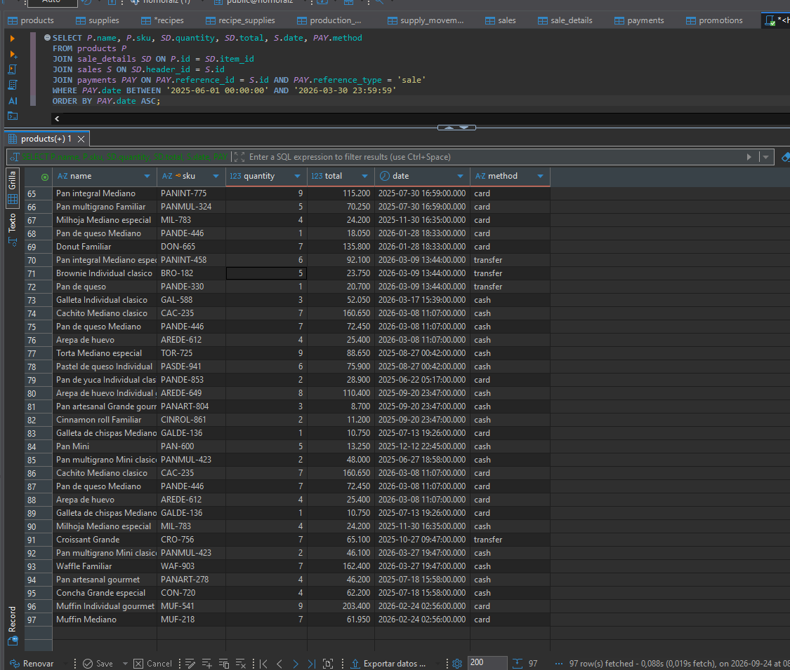

**Resultado:** la consulta combina `products`, `sale_details`, `sales` y `payments` en una cadena de 4 tablas, con el mismo resultado que en MySQL (Sección 1.13.7): filas repetidas por venta cuando existen múltiples `sale_details` y múltiples `payments` asociados, mismo fenómeno esperado del JOIN entre dos relaciones 1:N.


#### 2.14.8 Consultas con agrupamiento GROUP BY

**Forma 1 (rango de fechas, con AVG):**
```sql
SELECT S.id, S.date, SUM(PAY.amount) AS total_paid, COUNT(PAY.id) AS payment_count, AVG(PAY.amount) AS avg_payment
FROM sales S
JOIN payments PAY ON PAY.reference_id = S.id AND PAY.reference_type = 'sale'
WHERE PAY.date BETWEEN '2025-06-01 00:00:00' AND '2026-03-30 23:59:59'
GROUP BY S.id, S.date
ORDER BY total_paid DESC;
```

**Evidencia (imagen):**

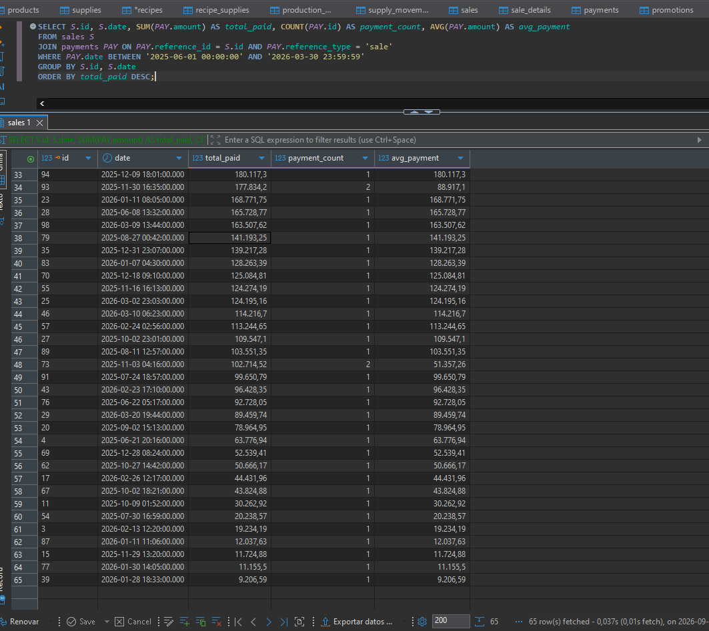

**Resultado:** 62 ventas agrupadas, mismo resultado que en MySQL (Sección 1.13.8), encabezadas por la venta 52 con $942.692,25 en 6 pagos. La columna `avg_payment` muestra mayor precisión decimal (`157115.375000000000`) que MySQL, comportamiento propio de `NUMERIC`/`AVG` en PostgreSQL.

**Forma 2 (filtro por status y method):**
```sql
SELECT S.id, S.date, SUM(PAY.amount) AS total_paid, COUNT(PAY.id) AS payment_count
FROM sales S
JOIN payments PAY ON PAY.reference_id = S.id AND PAY.reference_type = 'sale'
WHERE PAY.status = 'completed' AND PAY.method = 'card'
GROUP BY S.id, S.date
ORDER BY total_paid DESC;
```

**Evidencia (imagen):**

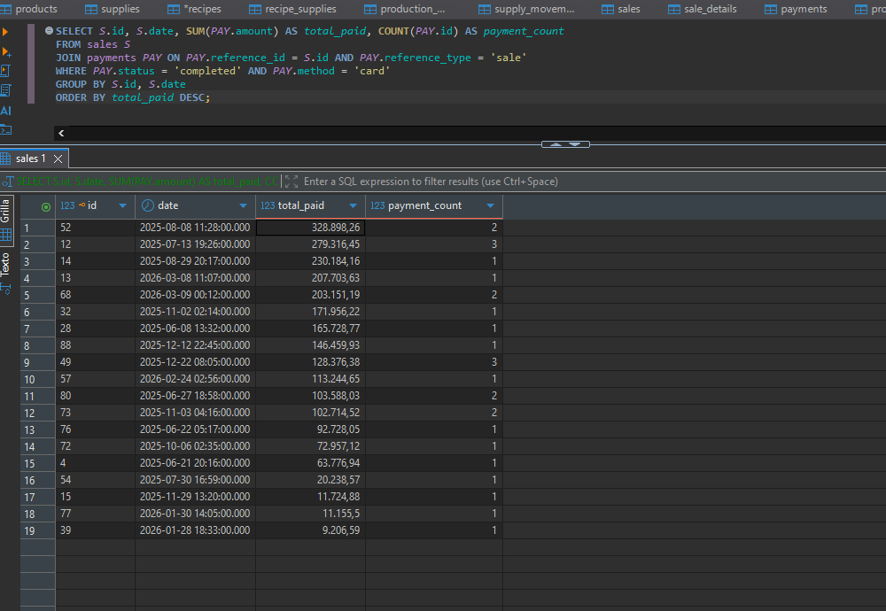

**Resultado:** 19 ventas, mismo resultado que en MySQL, encabezadas por la venta 52 con $328.898,26 en 2 pagos.

**Con HAVING:**
```sql
SELECT S.id, S.date, SUM(PAY.amount) AS total_paid, COUNT(PAY.id) AS payment_count
FROM sales S
JOIN payments PAY ON PAY.reference_id = S.id AND PAY.reference_type = 'sale'
GROUP BY S.id, S.date
HAVING SUM(PAY.amount) >= 100000
ORDER BY total_paid DESC;
```

**Evidencia (imagen):**

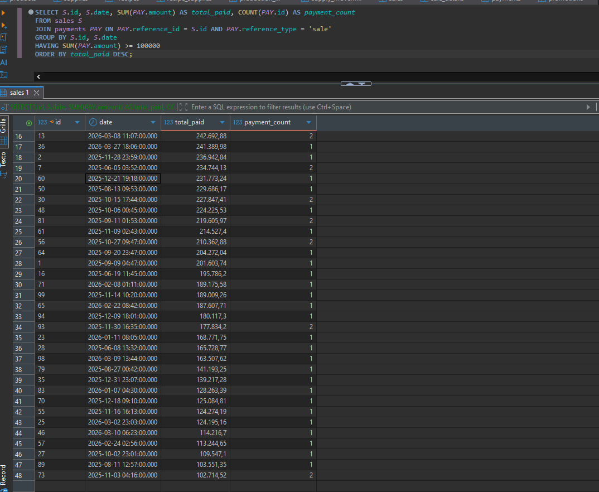

**Resultado:** 47 ventas, mismo resultado que en MySQL, encabezadas por la venta 52 con $942.692,25 en 6 pagos.

#### 2.14.9 Subconsultas y teoría de conjuntos

Mostrar los productos que no han sido vendidos (sin registro en `sale_details`/`sales`) dentro de un rango de fechas específico.

**Forma 1 (subconsulta con NOT IN):**
```sql
SELECT * FROM products AS P
WHERE P.id NOT IN (
  SELECT SD.item_id FROM sale_details SD
  JOIN sales S ON SD.header_id = S.id
  WHERE S.date BETWEEN '2025-06-01' AND '2026-03-30'
);
```

**Evidencia (imagen):**

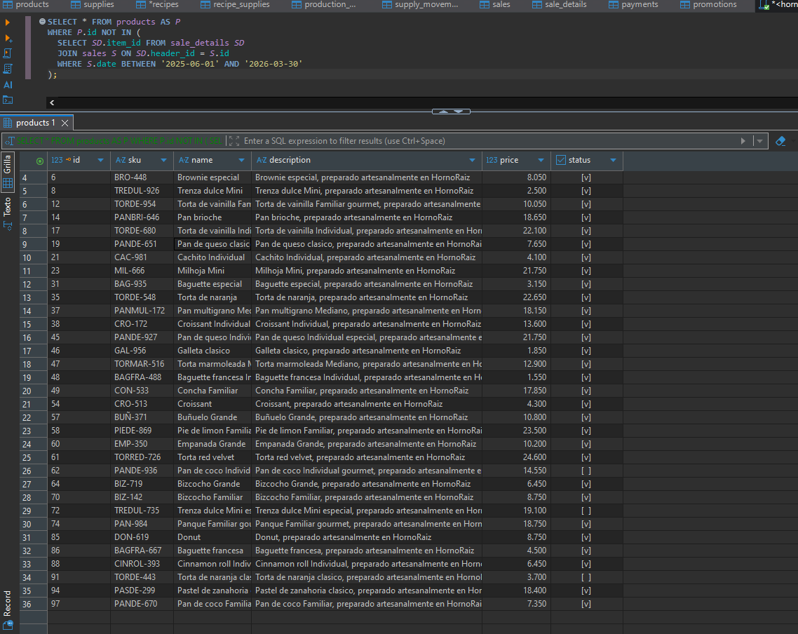

**Resultado:** 35 productos sin ventas registradas en el rango de fechas indicado, mismo resultado que en MySQL (Sección 1.13.9).

**Forma 2 (LEFT JOIN con IS NULL):**
```sql
SELECT * FROM products AS P
LEFT JOIN sale_details AS SD ON (P.id = SD.item_id)
LEFT JOIN sales AS S ON (SD.header_id = S.id AND S.date BETWEEN '2025-06-01' AND '2026-03-30')
WHERE S.id IS NULL;
```

**Evidencia (imagen):**

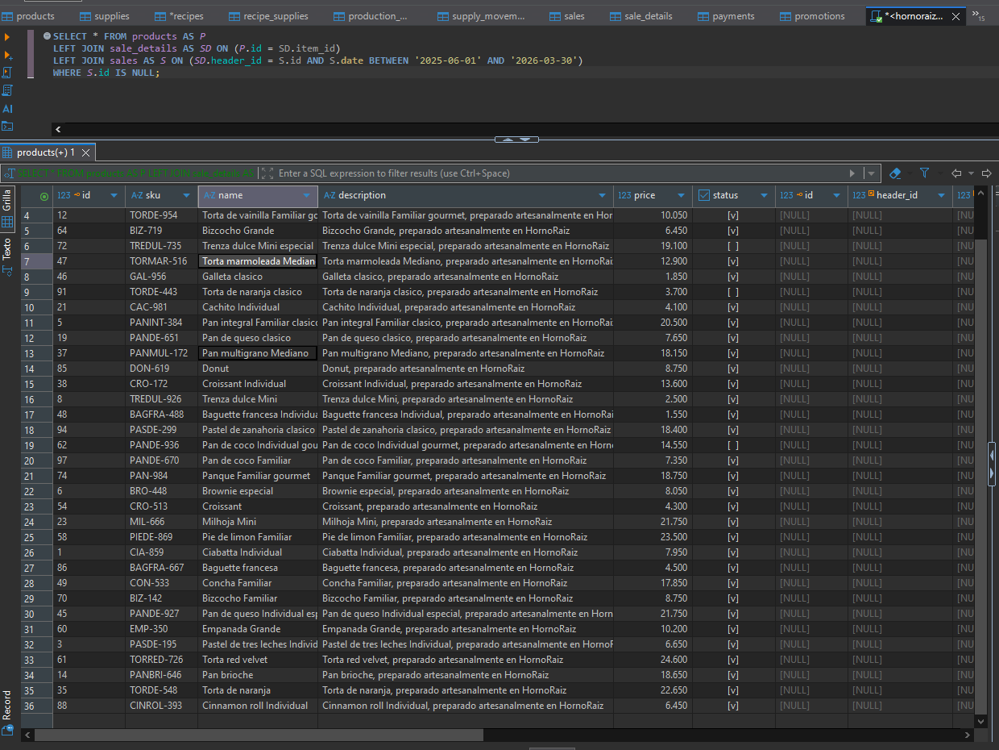

**Resultado:** mismos 35 productos que la Forma 1, confirmando la equivalencia entre ambas formas de expresar la teoría de conjuntos, tal como en MySQL.

## 3. SQL Server

### 3.1 Renombramiento de tablas

Siguiendo la misma normativa aplicada en MySQL (Sección 1.1) y PostgreSQL (Sección 2.1), se renombraron las tablas de la base `hornoraiz` en SQL Server a plural e inglés. T-SQL no soporta `RENAME TABLE` ni `ALTER TABLE ... RENAME TO` — el renombrado se realiza mediante el procedimiento almacenado del sistema `sp_rename`.

```sql
EXEC sp_rename 'producto', 'products';
EXEC sp_rename 'insumo', 'supplies';
EXEC sp_rename 'receta', 'recipes';
EXEC sp_rename 'receta_insumo', 'recipe_supplies';
EXEC sp_rename 'lote_produccion', 'production_batches';
EXEC sp_rename 'movimiento_insumo', 'supply_movements';
EXEC sp_rename 'venta', 'sales';
EXEC sp_rename 'venta_detalle', 'sale_details';
EXEC sp_rename 'pago', 'payments';
EXEC sp_rename 'promocion', 'promotions';
```

**Evidencia (imagen):**

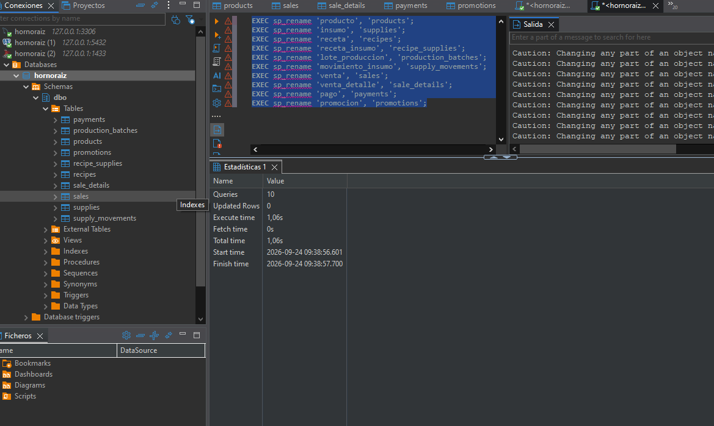

**Resultado:** las 10 tablas quedaron renombradas a plural e inglés, sin pérdida de datos ni de las relaciones de Foreign Key existentes. `sp_rename` mostró la advertencia informativa estándar sobre el cambio de nombre de objetos, sin afectar el resultado.

### 3.2 Renombramiento de columnas

Al igual que las tablas, las columnas se renombraron con `sp_rename`, indicando `'tabla.columna_vieja'` como objeto y `'COLUMN'` como tipo, ya que este procedimiento también renombra otros tipos de objetos (índices, restricciones) y requiere esa distinción explícita.

```sql
EXEC sp_rename 'products.nombre', 'name', 'COLUMN';
EXEC sp_rename 'products.descripcion', 'description', 'COLUMN';
EXEC sp_rename 'products.precio', 'price', 'COLUMN';
EXEC sp_rename 'products.is_active', 'status', 'COLUMN';

EXEC sp_rename 'supplies.codigo', 'code', 'COLUMN';
EXEC sp_rename 'supplies.nombre', 'name', 'COLUMN';
EXEC sp_rename 'supplies.unidad_medida', 'unit_of_measure', 'COLUMN';
EXEC sp_rename 'supplies.stock_minimo', 'min_stock', 'COLUMN';
EXEC sp_rename 'supplies.is_active', 'status', 'COLUMN';

EXEC sp_rename 'recipes.producto_id', 'product_id', 'COLUMN';
EXEC sp_rename 'recipes.nombre', 'name', 'COLUMN';
EXEC sp_rename 'recipes.descripcion', 'description', 'COLUMN';
EXEC sp_rename 'recipes.is_active', 'status', 'COLUMN';

EXEC sp_rename 'recipe_supplies.principal_id', 'main_id', 'COLUMN';
EXEC sp_rename 'recipe_supplies.relacionado_id', 'related_id', 'COLUMN';
EXEC sp_rename 'recipe_supplies.datos_relacion', 'relation_data', 'COLUMN';
EXEC sp_rename 'recipe_supplies.is_active', 'status', 'COLUMN';

EXEC sp_rename 'production_batches.receta_id', 'recipe_id', 'COLUMN';
EXEC sp_rename 'production_batches.nombre', 'name', 'COLUMN';
EXEC sp_rename 'production_batches.descripcion', 'description', 'COLUMN';
EXEC sp_rename 'production_batches.is_active', 'status', 'COLUMN';

EXEC sp_rename 'supply_movements.lote_produccion_id', 'production_batch_id', 'COLUMN';
EXEC sp_rename 'supply_movements.insumo_id', 'supply_id', 'COLUMN';
EXEC sp_rename 'supply_movements.tipo', 'type', 'COLUMN';
EXEC sp_rename 'supply_movements.fecha', 'date', 'COLUMN';
EXEC sp_rename 'supply_movements.cantidad', 'quantity', 'COLUMN';
EXEC sp_rename 'supply_movements.observaciones', 'notes', 'COLUMN';
EXEC sp_rename 'supply_movements.estado', 'status', 'COLUMN';

EXEC sp_rename 'sales.cliente_id', 'client_id', 'COLUMN';
EXEC sp_rename 'sales.fecha', 'date', 'COLUMN';
EXEC sp_rename 'sales.impuestos', 'taxes', 'COLUMN';
EXEC sp_rename 'sales.estado', 'status', 'COLUMN';

EXEC sp_rename 'sale_details.cabecera_id', 'header_id', 'COLUMN';
EXEC sp_rename 'sale_details.cantidad', 'quantity', 'COLUMN';
EXEC sp_rename 'sale_details.valor_unitario', 'unit_price', 'COLUMN';
EXEC sp_rename 'sale_details.observaciones', 'notes', 'COLUMN';

EXEC sp_rename 'payments.referencia_tipo', 'reference_type', 'COLUMN';
EXEC sp_rename 'payments.referencia_id', 'reference_id', 'COLUMN';
EXEC sp_rename 'payments.metodo', 'method', 'COLUMN';
EXEC sp_rename 'payments.monto', 'amount', 'COLUMN';
EXEC sp_rename 'payments.fecha', 'date', 'COLUMN';
EXEC sp_rename 'payments.estado', 'status', 'COLUMN';

EXEC sp_rename 'promotions.nombre', 'name', 'COLUMN';
EXEC sp_rename 'promotions.descripcion', 'description', 'COLUMN';
EXEC sp_rename 'promotions.is_active', 'status', 'COLUMN';
```

**Evidencia (imagen):**

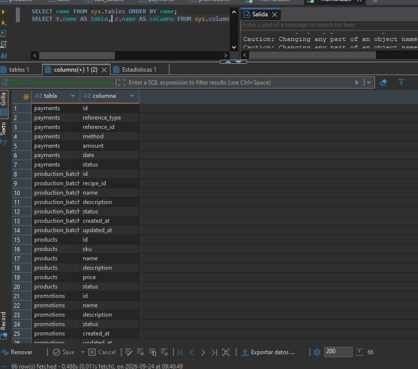

**Resultado:** se verificaron los nombres finales mediante consulta a `sys.columns` unida con `sys.tables`, confirmando que las 10 tablas quedaron con sus columnas en inglés, idénticas a MySQL y PostgreSQL. Aplica la misma advertencia documentada en las Secciones 1.2/2.2: `status` no tiene un dominio de valores uniforme entre tablas.

### 3.4 Carga de datos — tabla `products`

Se importó el mismo archivo `products.csv` generado para MySQL (100 registros, separado por `;`), sin necesidad de regenerarlo.

**Evidencia (imagen):**

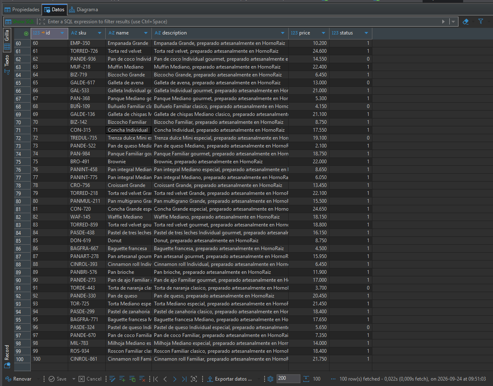

**Resultado:** se importaron los 100 registros en la tabla `products` sin errores.

### 3.5 Carga de datos — tabla `supplies`

**Evidencia (imagen):**

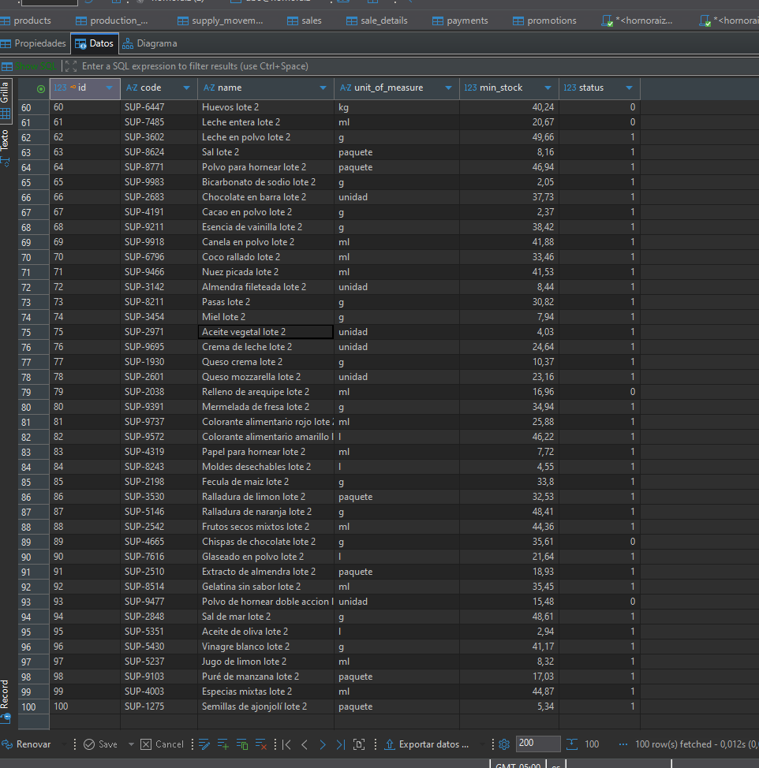

**Resultado:** se importaron los 100 registros en la tabla `supplies` sin errores.

### 3.6 Carga de datos — tabla `recipes`

**Evidencia (imagen):**

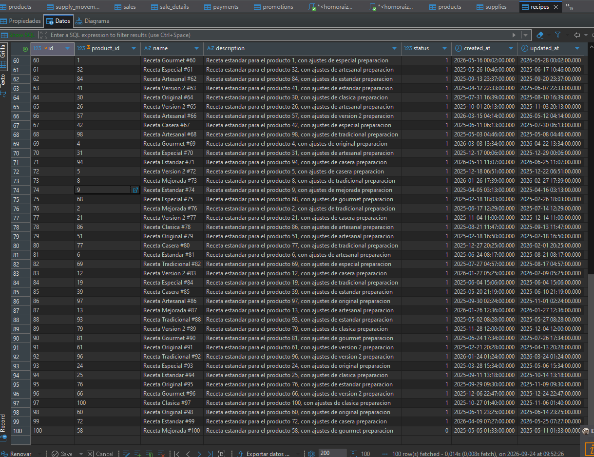

**Resultado:** se importaron los 100 registros en la tabla `recipes` sin errores, respetando la Foreign Key hacia `products`.

### 3.7 Carga de datos — tabla `recipe_supplies`

**Evidencia (imagen):**

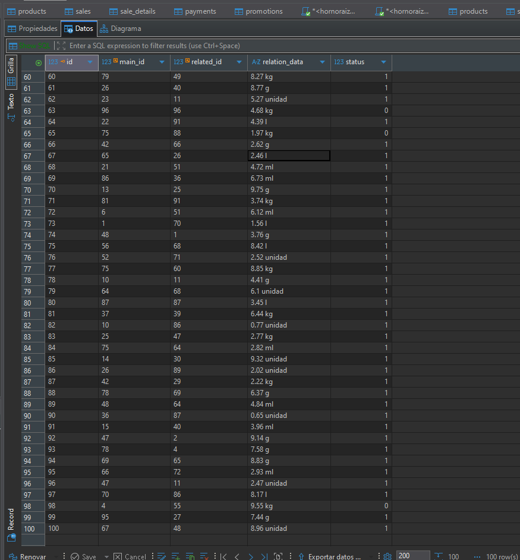

**Resultado:** se importaron los 100 registros en la tabla `recipe_supplies` sin errores, respetando las Foreign Keys hacia `recipes` e `supplies`.

### 3.8 Carga de datos — tabla `production_batches`

**Evidencia (imagen):**

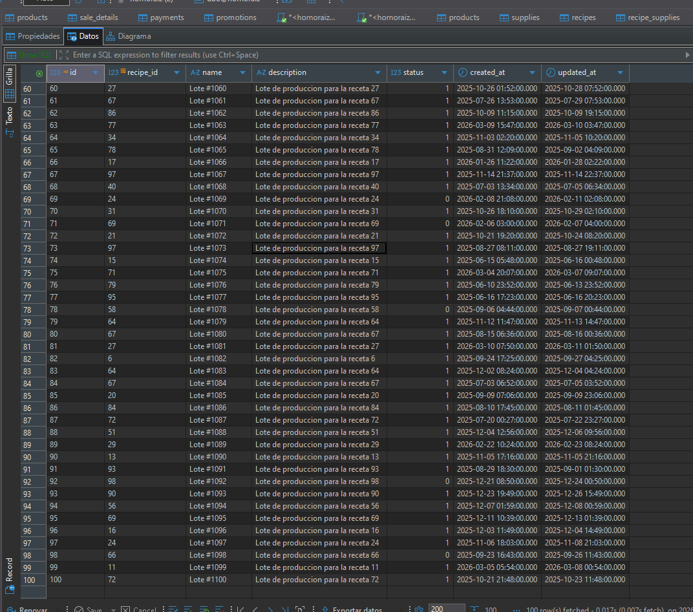

**Resultado:** se importaron los 100 registros en la tabla `production_batches` sin errores, respetando la Foreign Key hacia `recipes`.

### 3.9 Carga de datos — tabla `supply_movements`

**Evidencia (imagen):**

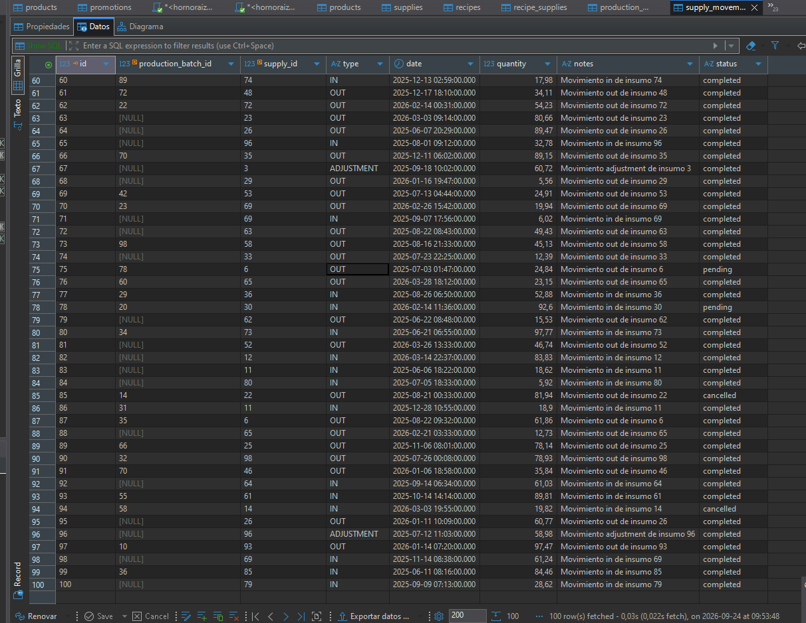

**Resultado:** se importaron los 100 registros en la tabla `supply_movements` sin errores, con `production_batch_id` nullable importado correctamente como `NULL` en las filas vacías del CSV.

### 3.10 Carga de datos — tabla `sales`

**Evidencia (imagen):**

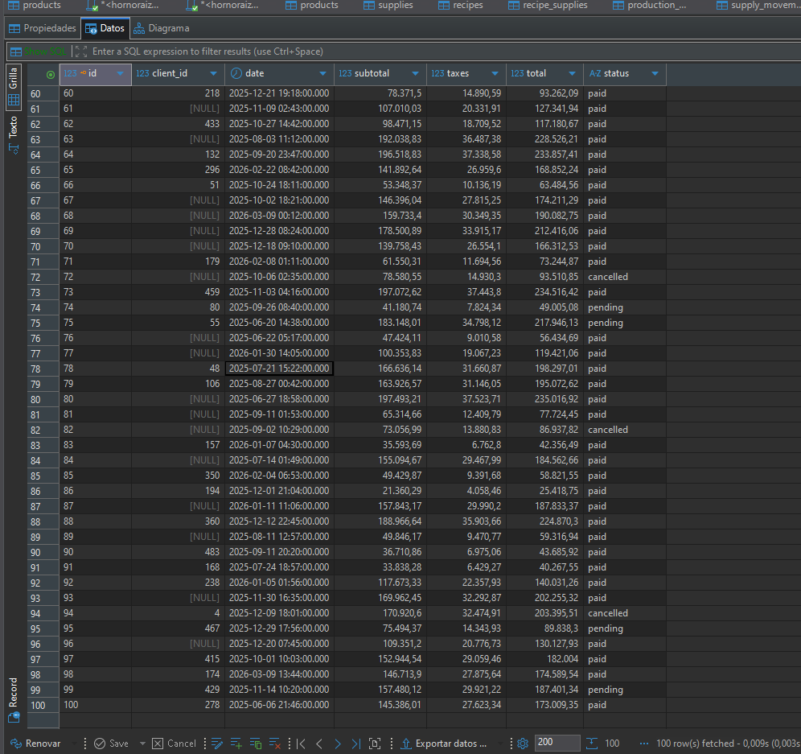

**Resultado:** se importaron los 100 registros en la tabla `sales` sin errores.

### 3.11 Carga de datos — tabla `sale_details`

**Evidencia (imagen):**

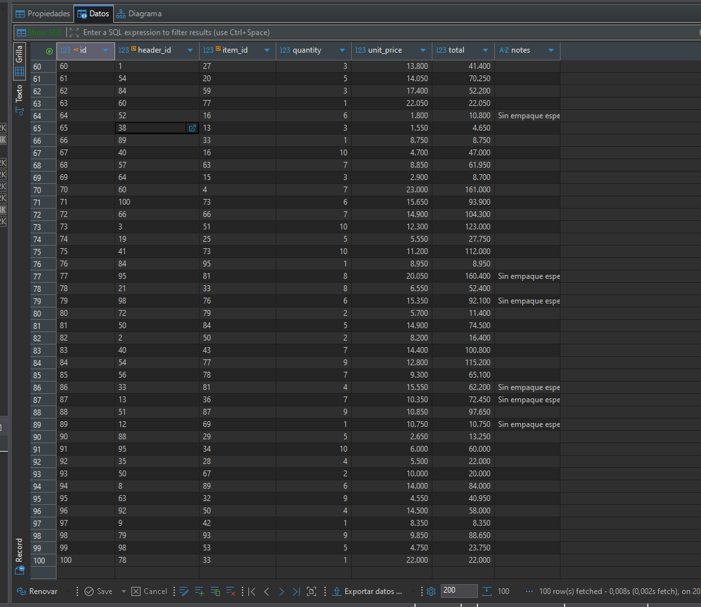

**Resultado:** se importaron los 100 registros en la tabla `sale_details` sin errores, respetando las Foreign Keys hacia `sales` y `products`.

### 3.12 Carga de datos — tabla `payments`

**Evidencia (imagen):**

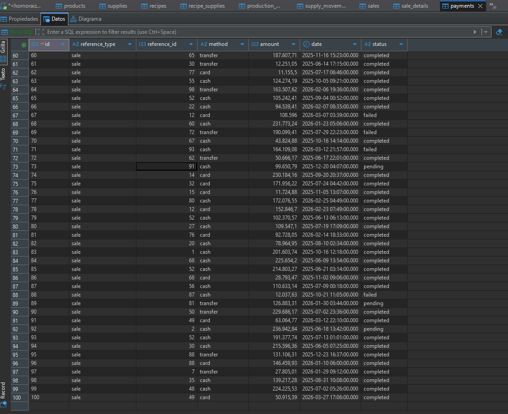

**Resultado:** se importaron los 100 registros en la tabla `payments` sin errores.

### 3.13 Carga de datos — tabla `promotions`

**Evidencia (imagen):**

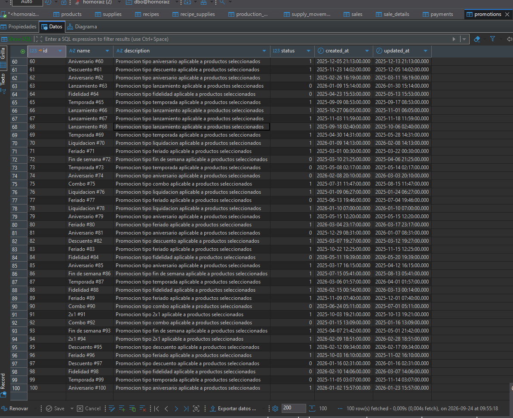

**Resultado:** se importaron los 100 registros en la tabla `promotions` sin errores.

### 3.14 Verificación de la conversión de `status` (tipo `BIT`)

```sql
SELECT 'products' t, SUM(CASE WHEN status=1 THEN 1 ELSE 0 END) AS activos, SUM(CASE WHEN status=0 THEN 1 ELSE 0 END) AS inactivos FROM products
UNION ALL SELECT 'supplies', SUM(CASE WHEN status=1 THEN 1 ELSE 0 END), SUM(CASE WHEN status=0 THEN 1 ELSE 0 END) FROM supplies
UNION ALL SELECT 'recipes', SUM(CASE WHEN status=1 THEN 1 ELSE 0 END), SUM(CASE WHEN status=0 THEN 1 ELSE 0 END) FROM recipes
UNION ALL SELECT 'recipe_supplies', SUM(CASE WHEN status=1 THEN 1 ELSE 0 END), SUM(CASE WHEN status=0 THEN 1 ELSE 0 END) FROM recipe_supplies
UNION ALL SELECT 'production_batches', SUM(CASE WHEN status=1 THEN 1 ELSE 0 END), SUM(CASE WHEN status=0 THEN 1 ELSE 0 END) FROM production_batches
UNION ALL SELECT 'promotions', SUM(CASE WHEN status=1 THEN 1 ELSE 0 END), SUM(CASE WHEN status=0 THEN 1 ELSE 0 END) FROM promotions;
```

**Evidencia (imagen):**

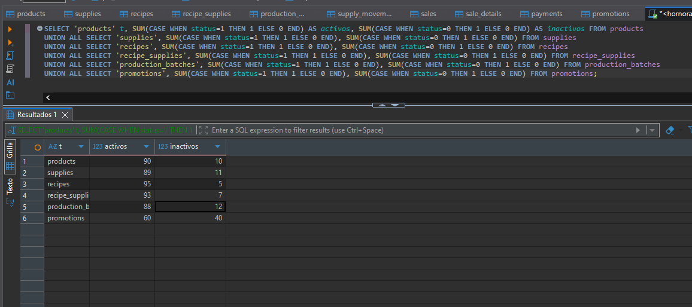

**Resultado:** a diferencia de PostgreSQL (Sección 2.13), el asistente gráfico de DBeaver sí convirtió correctamente los valores `1`/`0` del CSV al tipo `BIT` nativo de SQL Server en las 6 tablas booleanas, sin necesidad de recurrir a una vía alterna de importación. Proporciones obtenidas: `products` 90/10, `supplies` 89/11, `recipes` 95/5, `recipe_supplies` 93/7, `production_batches` 88/12, `promotions` 60/40 — idénticas a MySQL y a la corrección final de PostgreSQL.

#### 3.15.1 Mostrar algunos de los registros de la tabla `products`

```sql
SELECT sku, name, price, status FROM products;
```

**Evidencia (imagen):**

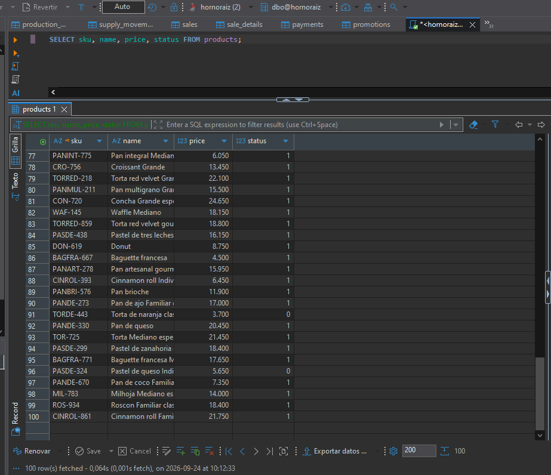

**Resultado:** la consulta devolvió los 100 registros de `products`, mismo resultado que en MySQL (Sección 1.13.1) y PostgreSQL (Sección 2.14.1).

#### 3.15.2 Mostrar de forma ordenada (DESC) las ventas desde su comienzo

```sql
SELECT id, date, subtotal, status FROM sales ORDER BY date DESC;
```

**Evidencia (imagen):**

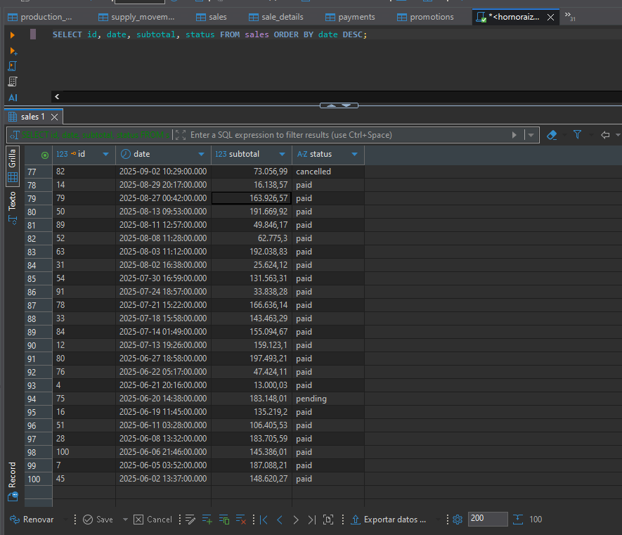

**Resultado:** la consulta devolvió los 100 registros de `sales` ordenados de la fecha más reciente a la más antigua, mismo resultado que en MySQL (Sección 1.13.2) y PostgreSQL (Sección 2.14.2).

#### 3.15.3 Consultas a múltiples tablas mediante WHERE

```sql
SELECT *
FROM sale_details SD, sales S
WHERE S.id = SD.header_id;
```

**Evidencia (imagen):**

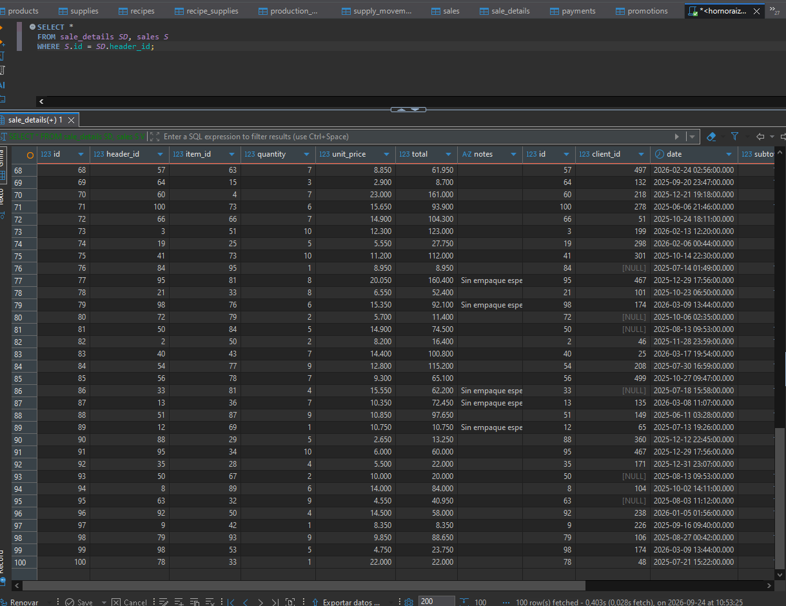

**Resultado:** la consulta devolvió los 100 registros de `sale_details` combinados con su venta correspondiente en `sales`, mismo resultado que en MySQL (Sección 1.13.3) y PostgreSQL (Sección 2.14.3).

#### 3.15.4 Consultas a múltiples tablas mediante JOIN

```sql
SELECT S.date, S.status, SD.*
FROM sales AS S
JOIN sale_details AS SD ON (S.id = SD.header_id);
```

**Evidencia (imagen):**

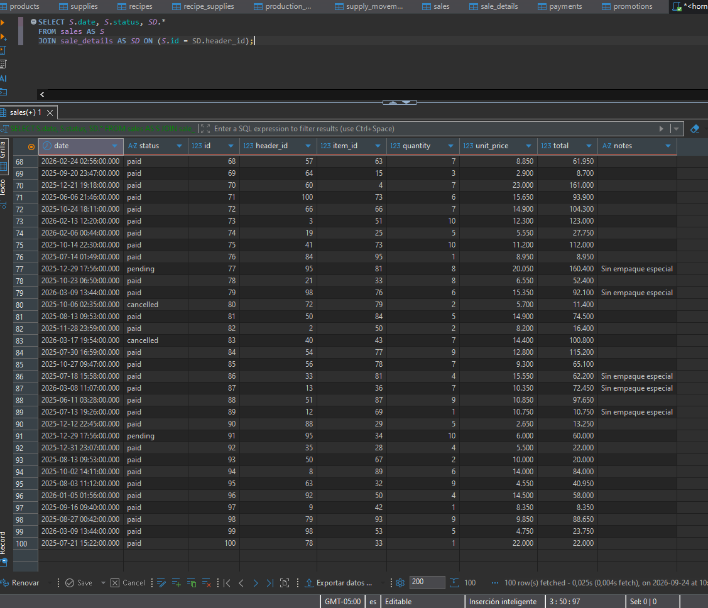

**Resultado:** la consulta devolvió los 100 registros combinando `sales` y `sale_details` mediante `JOIN ... ON`, mismo resultado que en MySQL (Sección 1.13.4) y PostgreSQL (Sección 2.14.4).

#### 3.15.5 Condiciones en las consultas / filtros

```sql
SELECT *
FROM sale_details SD, sales S
WHERE S.id = SD.header_id AND S.status = 'paid';
```

**Evidencia (imagen):**

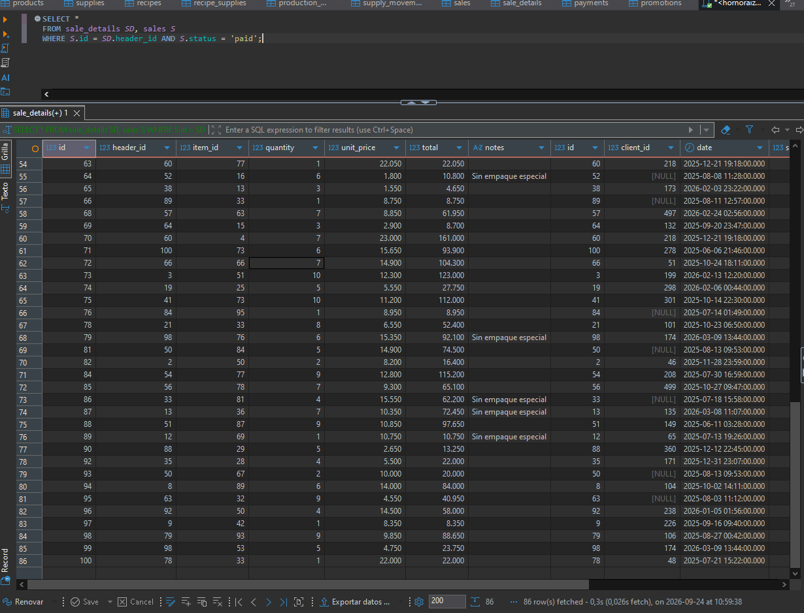

**Resultado:** la consulta devolvió 82 registros con `status = 'paid'`, mismo resultado que en MySQL (Sección 1.13.5) y PostgreSQL (Sección 2.14.5).

```sql
SELECT S.date, S.status, SD.*
FROM sales AS S
JOIN sale_details AS SD ON (S.id = SD.header_id)
WHERE S.status = 'cancelled';
```

**Evidencia (imagen):**

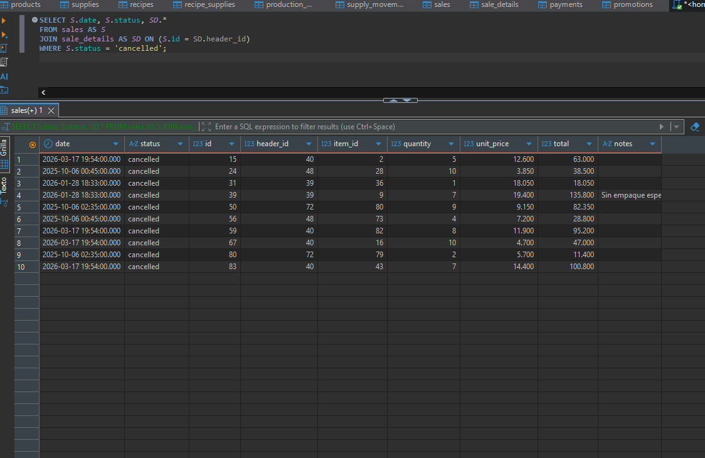

**Resultado:** la consulta devolvió 10 registros con `status = 'cancelled'`, mismo resultado que en MySQL y PostgreSQL.

#### 3.15.6 Consultas con filtros condicional LIKE

```sql
SELECT * FROM products AS P WHERE P.name LIKE 'Pan%';
```

**Evidencia (imagen):**

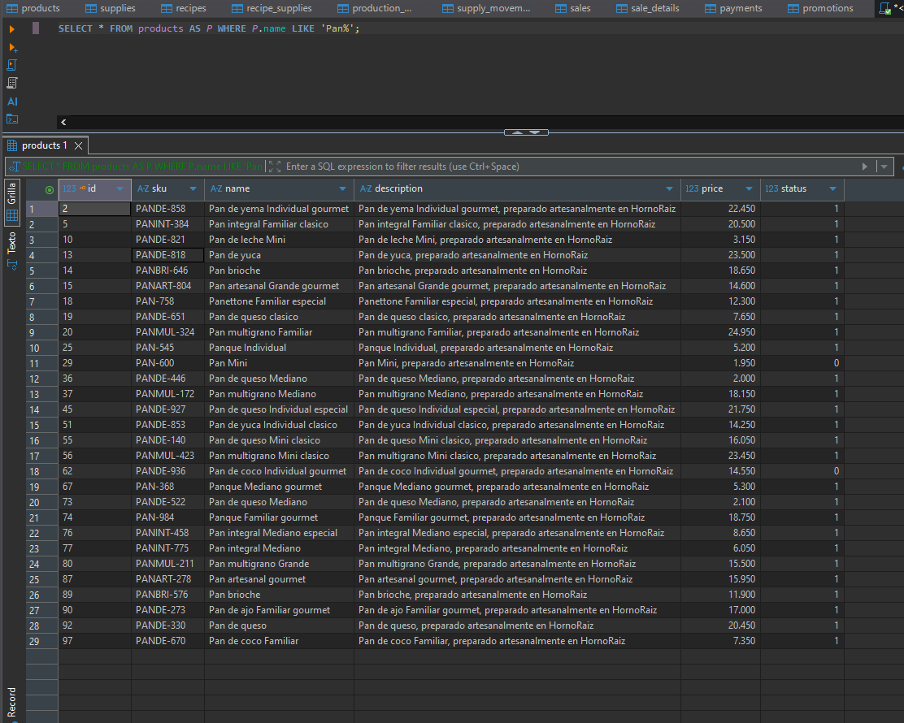

**Resultado:** la consulta devolvió 28 registros cuyo `name` comienza con "Pan", mismo resultado que en MySQL (Sección 1.13.6) y PostgreSQL (Sección 2.14.6).

**Mostrar los productos cuya descripción contenga la palabra "chocolate":**

```sql
SELECT * FROM products AS P WHERE P.description LIKE CONCAT('%','chocolate','%');
```

**Evidencia (imagen):**

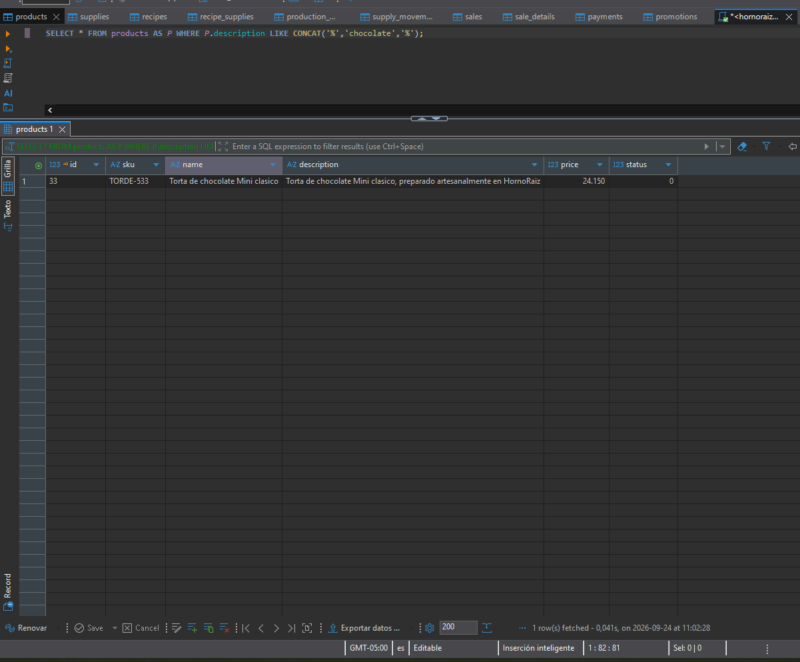

**Resultado:** la consulta devolvió 1 registro (`Torta de chocolate Mini clasico`), mismo resultado que en MySQL y PostgreSQL.

**Combinación (status = cancelled y name LIKE 'Pan%'):**

```sql
SELECT S.date, S.status, P.name
FROM sales AS S
JOIN sale_details AS SD ON (S.id = SD.header_id)
JOIN products AS P ON (P.id = SD.item_id)
WHERE S.status = 'cancelled' AND P.name LIKE 'Pan%';
```

**Evidencia (imagen):**

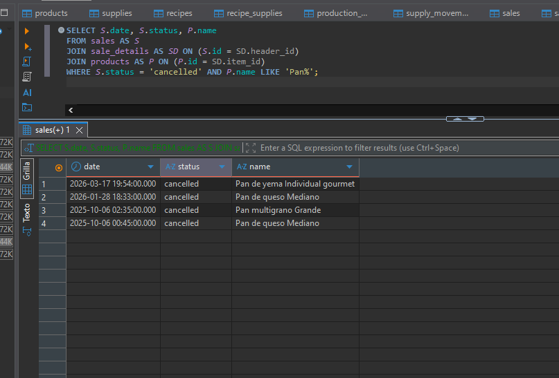

**Resultado:** la consulta devolvió 4 registros, mismo resultado que en MySQL y PostgreSQL.

#### 3.15.7 Consultas con filtros condicionales BETWEEN

```sql
SELECT P.name, P.sku, SD.quantity, SD.total, S.date, PAY.method
FROM products P
JOIN sale_details SD ON P.id = SD.item_id
JOIN sales S ON SD.header_id = S.id
JOIN payments PAY ON PAY.reference_id = S.id AND PAY.reference_type = 'sale'
WHERE PAY.date BETWEEN '2025-06-01 00:00:00' AND '2026-03-30 23:59:59'
ORDER BY PAY.date ASC;
```

**Evidencia (imagen):**

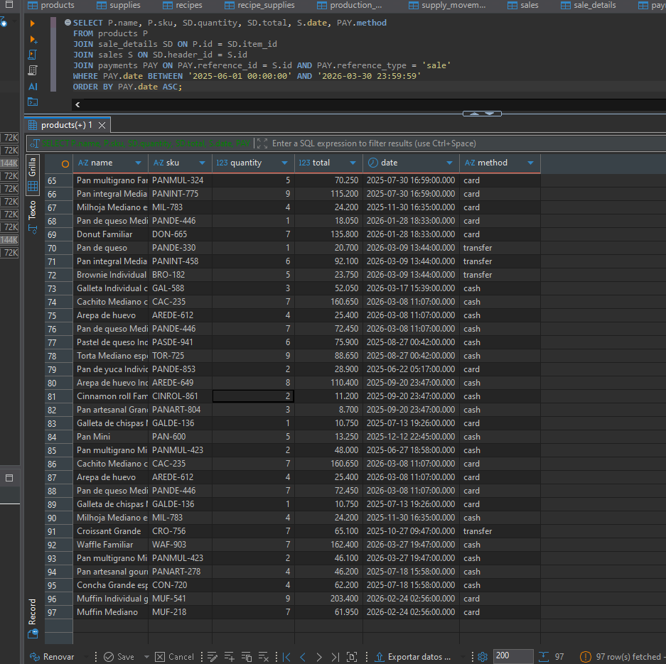

**Resultado:** la consulta combina `products`, `sale_details`, `sales` y `payments` en una cadena de 4 tablas, con el mismo resultado que en MySQL (Sección 1.13.7) y PostgreSQL (Sección 2.14.7): filas repetidas por venta cuando existen múltiples `sale_details` y múltiples `payments` asociados.

#### 3.15.8 Consultas con agrupamiento GROUP BY

**Forma 1 (rango de fechas, con AVG):**
```sql
SELECT S.id, S.date, SUM(PAY.amount) AS total_paid, COUNT(PAY.id) AS payment_count, AVG(PAY.amount) AS avg_payment
FROM sales S
JOIN payments PAY ON PAY.reference_id = S.id AND PAY.reference_type = 'sale'
WHERE PAY.date BETWEEN '2025-06-01 00:00:00' AND '2026-03-30 23:59:59'
GROUP BY S.id, S.date
ORDER BY total_paid DESC;
```

**Evidencia (imagen):**

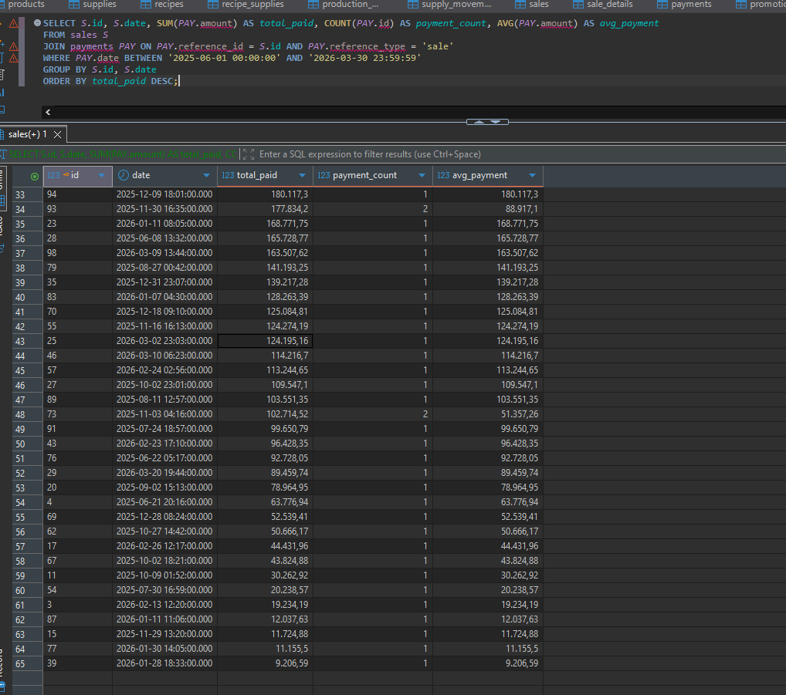

**Resultado:** 62 ventas agrupadas, mismo resultado que en MySQL (Sección 1.13.8) y PostgreSQL (Sección 2.14.8), encabezadas por la venta 52 con $942.692,25 en 6 pagos.

**Forma 2 (filtro por status y method):**
```sql
SELECT S.id, S.date, SUM(PAY.amount) AS total_paid, COUNT(PAY.id) AS payment_count
FROM sales S
JOIN payments PAY ON PAY.reference_id = S.id AND PAY.reference_type = 'sale'
WHERE PAY.status = 'completed' AND PAY.method = 'card'
GROUP BY S.id, S.date
ORDER BY total_paid DESC;
```

**Evidencia (imagen):**

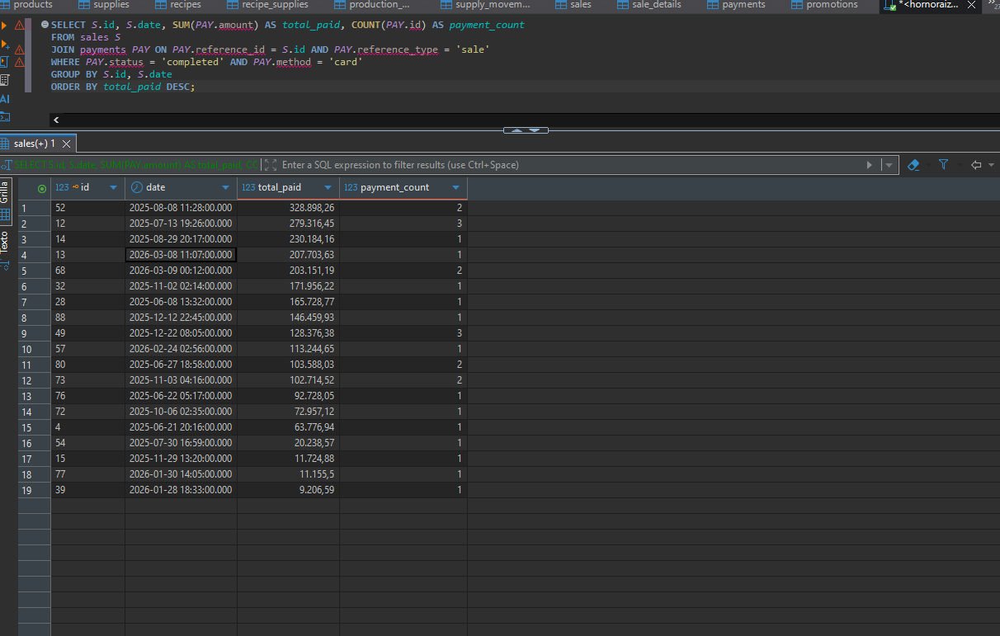

**Resultado:** 19 ventas, mismo resultado que en MySQL y PostgreSQL, encabezadas por la venta 52 con $328.898,26 en 2 pagos.

**Con HAVING:**
```sql
SELECT S.id, S.date, SUM(PAY.amount) AS total_paid, COUNT(PAY.id) AS payment_count
FROM sales S
JOIN payments PAY ON PAY.reference_id = S.id AND PAY.reference_type = 'sale'
GROUP BY S.id, S.date
HAVING SUM(PAY.amount) >= 100000
ORDER BY total_paid DESC;
```

**Evidencia (imagen):**

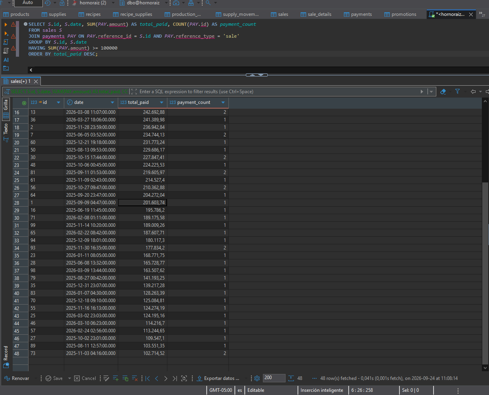

**Resultado:** 47 ventas, mismo resultado que en MySQL y PostgreSQL, encabezadas por la venta 52 con $942.692,25 en 6 pagos.

#### 3.15.9 Subconsultas y teoría de conjuntos

Mostrar los productos que no han sido vendidos (sin registro en `sale_details`/`sales`) dentro de un rango de fechas específico.

**Forma 1 (subconsulta con NOT IN):**
```sql
SELECT * FROM products AS P
WHERE P.id NOT IN (
  SELECT SD.item_id FROM sale_details SD
  JOIN sales S ON SD.header_id = S.id
  WHERE S.date BETWEEN '2025-06-01' AND '2026-03-30'
);
```

**Evidencia (imagen):**

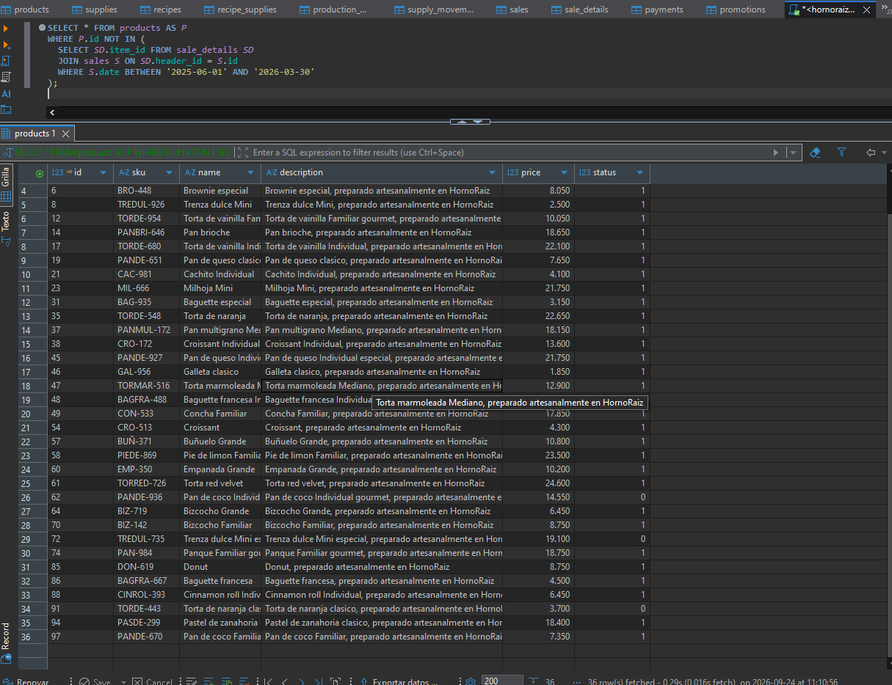

**Resultado:** 35 productos sin ventas registradas en el rango de fechas indicado, mismo resultado que en MySQL (Sección 1.13.9) y PostgreSQL (Sección 2.14.9).

**Forma 2 (LEFT JOIN con IS NULL):**
```sql
SELECT * FROM products AS P
LEFT JOIN sale_details AS SD ON (P.id = SD.item_id)
LEFT JOIN sales AS S ON (SD.header_id = S.id AND S.date BETWEEN '2025-06-01' AND '2026-03-30')
WHERE S.id IS NULL;
```

**Evidencia (imagen):**

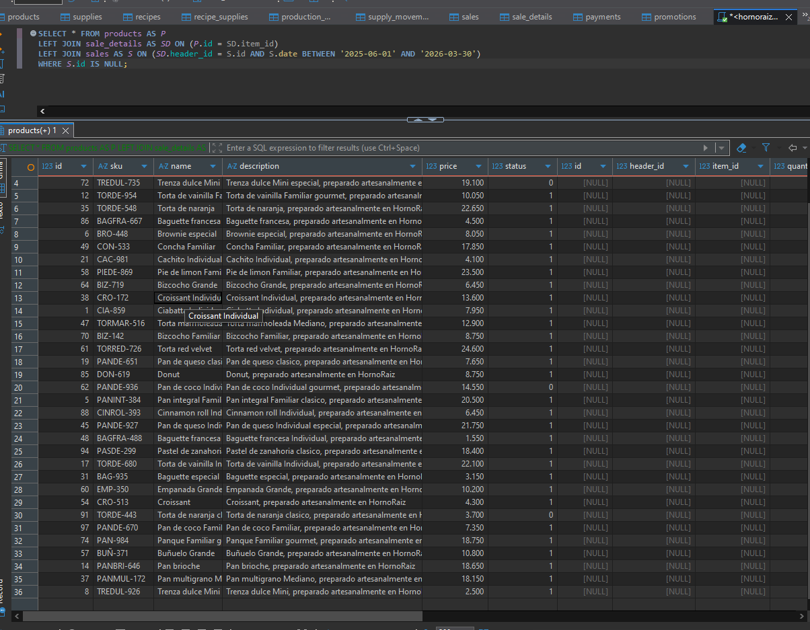

**Resultado:** mismos 35 productos que la Forma 1, confirmando la equivalencia entre ambas formas de expresar la teoría de conjuntos, consistente con MySQL y PostgreSQL.

## 4. Oracle

### 4.1 Renombramiento de tablas

Siguiendo la misma normativa aplicada en los otros tres motores, se renombraron las tablas de la base `hornoraiz` en Oracle a plural e inglés. Oracle usa `RENAME` directo sobre el nombre de la tabla (sin `TABLE` ni `TO`, a diferencia de PostgreSQL/SQL Server).

```sql
RENAME producto TO products;
RENAME insumo TO supplies;
RENAME receta TO recipes;
RENAME receta_insumo TO recipe_supplies;
RENAME lote_produccion TO production_batches;
RENAME movimiento_insumo TO supply_movements;
RENAME venta TO sales;
RENAME venta_detalle TO sale_details;
RENAME pago TO payments;
RENAME promocion TO promotions;
```

**Evidencia (imagen):**

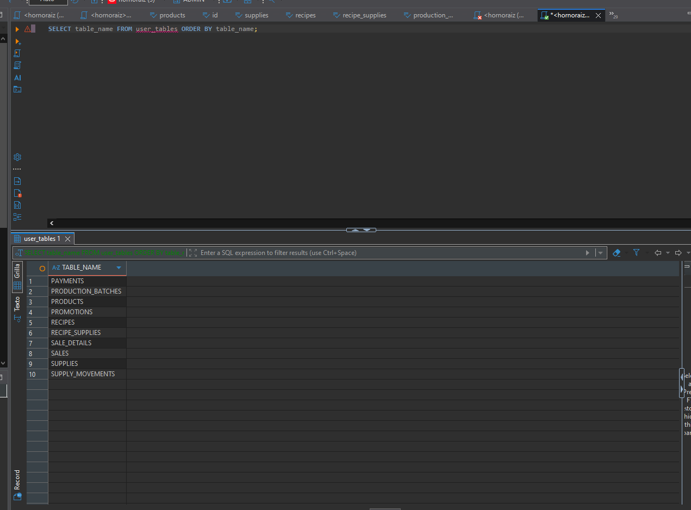

**Resultado:** las 10 tablas quedaron renombradas a plural e inglés, sin tabla puente residual (a diferencia de MySQL/PostgreSQL/SQL Server, este esquema de Oracle nunca tuvo `promocion_producto`).

### 4.2 Renombramiento de columnas

```sql
ALTER TABLE products RENAME COLUMN nombre TO name;
ALTER TABLE products RENAME COLUMN descripcion TO description;
ALTER TABLE products RENAME COLUMN precio TO price;
ALTER TABLE products RENAME COLUMN is_active TO status;

ALTER TABLE supplies RENAME COLUMN codigo TO code;
ALTER TABLE supplies RENAME COLUMN nombre TO name;
ALTER TABLE supplies RENAME COLUMN unidad_medida TO unit_of_measure;
ALTER TABLE supplies RENAME COLUMN stock_minimo TO min_stock;
ALTER TABLE supplies RENAME COLUMN is_active TO status;

ALTER TABLE recipes RENAME COLUMN producto_id TO product_id;
ALTER TABLE recipes RENAME COLUMN nombre TO name;
ALTER TABLE recipes RENAME COLUMN descripcion TO description;
ALTER TABLE recipes RENAME COLUMN is_active TO status;

ALTER TABLE recipe_supplies RENAME COLUMN principal_id TO main_id;
ALTER TABLE recipe_supplies RENAME COLUMN relacionado_id TO related_id;
ALTER TABLE recipe_supplies RENAME COLUMN datos_relacion TO relation_data;
ALTER TABLE recipe_supplies RENAME COLUMN is_active TO status;

ALTER TABLE production_batches RENAME COLUMN receta_id TO recipe_id;
ALTER TABLE production_batches RENAME COLUMN nombre TO name;
ALTER TABLE production_batches RENAME COLUMN descripcion TO description;
ALTER TABLE production_batches RENAME COLUMN is_active TO status;

ALTER TABLE supply_movements RENAME COLUMN lote_produccion_id TO production_batch_id;
ALTER TABLE supply_movements RENAME COLUMN insumo_id TO supply_id;
ALTER TABLE supply_movements RENAME COLUMN tipo TO type;
ALTER TABLE supply_movements RENAME COLUMN fecha TO "date";
ALTER TABLE supply_movements RENAME COLUMN cantidad TO quantity;
ALTER TABLE supply_movements RENAME COLUMN observaciones TO notes;
ALTER TABLE supply_movements RENAME COLUMN estado TO status;

ALTER TABLE sales RENAME COLUMN cliente_id TO client_id;
ALTER TABLE sales RENAME COLUMN fecha TO "date";
ALTER TABLE sales RENAME COLUMN impuestos TO taxes;
ALTER TABLE sales RENAME COLUMN estado TO status;

ALTER TABLE sale_details RENAME COLUMN cabecera_id TO header_id;
ALTER TABLE sale_details RENAME COLUMN cantidad TO quantity;
ALTER TABLE sale_details RENAME COLUMN valor_unitario TO unit_price;
ALTER TABLE sale_details RENAME COLUMN observaciones TO notes;

ALTER TABLE payments RENAME COLUMN referencia_tipo TO reference_type;
ALTER TABLE payments RENAME COLUMN referencia_id TO reference_id;
ALTER TABLE payments RENAME COLUMN metodo TO method;
ALTER TABLE payments RENAME COLUMN monto TO amount;
ALTER TABLE payments RENAME COLUMN fecha TO "date";
ALTER TABLE payments RENAME COLUMN estado TO status;

ALTER TABLE promotions RENAME COLUMN nombre TO name;
ALTER TABLE promotions RENAME COLUMN descripcion TO description;
ALTER TABLE promotions RENAME COLUMN is_active TO status;
```

**Evidencia (imagen):**

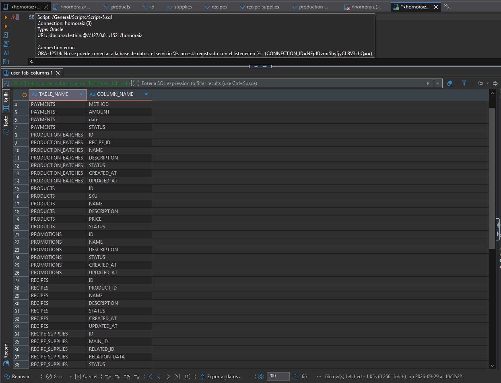

**Resultado:** se verificaron los nombres finales mediante `user_tab_columns`, confirmando el esquema en inglés idéntico a MySQL, PostgreSQL y SQL Server. Se documenta un incidente específico de Oracle: `DATE` es palabra reservada del motor, por lo que la columna `fecha` en `supply_movements`, `sales` y `payments` no pudo renombrarse a `date` sin comillas dobles (`ORA-00904: identificador no válido`). Se corrigió forzando el identificador como `"date"` (quoted identifier), lo cual implica que toda consulta futura sobre estas 3 tablas debe referenciar esa columna entre comillas dobles en minúscula exacta (`S."date"`, no `S.date`), a diferencia de las demás columnas.

### 4.3 Corrección de columnas identidad antes de la carga

Al intentar importar `products.csv`, se produjo el siguiente error durante la inserción:

```SQL Error [32795] [99999]: ORA-32795: no se puede insertar una columna de identidad siempre generada```


**Diagnóstico:** las 10 tablas se habían creado originalmente con `id NUMBER GENERATED BY DEFAULT AS IDENTITY` (según el registro de instalación inicial), pero en algún punto quedaron como `GENERATED ALWAYS AS IDENTITY`, lo cual impide insertar un valor explícito en `id` — necesario para mantener la correspondencia de Foreign Keys entre los CSV ya generados (`recipes.product_id`, `sale_details.item_id`, etc., dependientes del rango 1-100 de `products.id`).

**Solución:**

```sql
ALTER TABLE products MODIFY id GENERATED BY DEFAULT AS IDENTITY;
ALTER TABLE supplies MODIFY id GENERATED BY DEFAULT AS IDENTITY;
ALTER TABLE recipes MODIFY id GENERATED BY DEFAULT AS IDENTITY;
ALTER TABLE recipe_supplies MODIFY id GENERATED BY DEFAULT AS IDENTITY;
ALTER TABLE production_batches MODIFY id GENERATED BY DEFAULT AS IDENTITY;
ALTER TABLE supply_movements MODIFY id GENERATED BY DEFAULT AS IDENTITY;
ALTER TABLE sales MODIFY id GENERATED BY DEFAULT AS IDENTITY;
ALTER TABLE sale_details MODIFY id GENERATED BY DEFAULT AS IDENTITY;
ALTER TABLE payments MODIFY id GENERATED BY DEFAULT AS IDENTITY;
ALTER TABLE promotions MODIFY id GENERATED BY DEFAULT AS IDENTITY;
```

**Resultado:** tras el cambio, las 10 columnas `id` permiten inserción explícita de valores, habilitando la importación de los CSV con IDs predefinidos.

### 4.4 Carga de datos — tabla `products`

Se importó el mismo archivo `products.csv` reutilizado en los otros tres motores.

**Evidencia (imagen):**

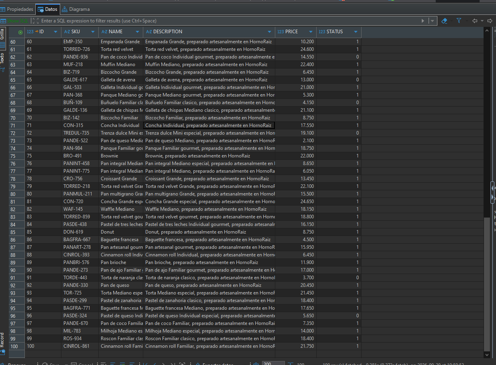

**Resultado:** se importaron los 100 registros en la tabla `products` sin errores, tras la corrección de la Sección 4.3.

### 4.5 Carga de datos — tabla `supplies`

**Evidencia (imagen):**

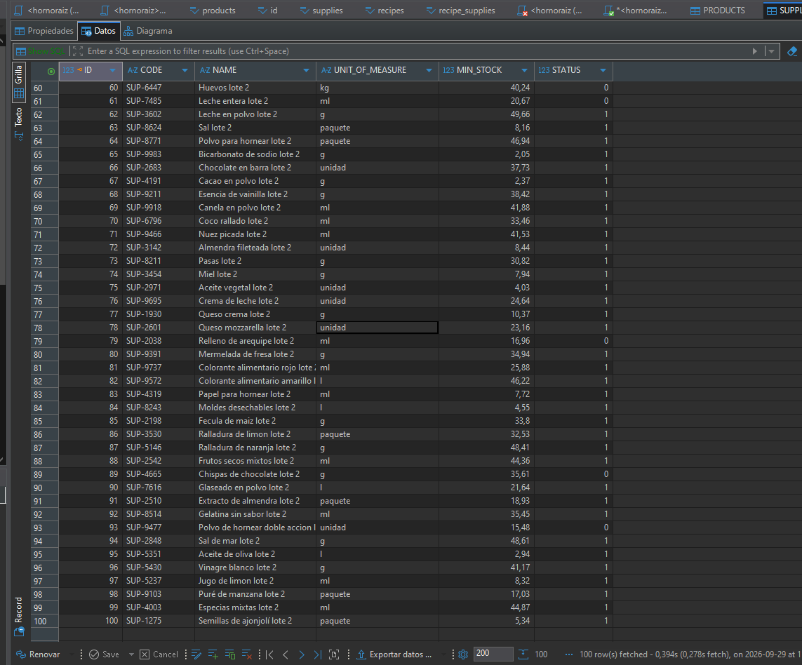

**Resultado:** se importaron los 100 registros en la tabla `supplies` sin errores.

### 4.6 Carga de datos — tabla `recipes`

**Evidencia (imagen):**

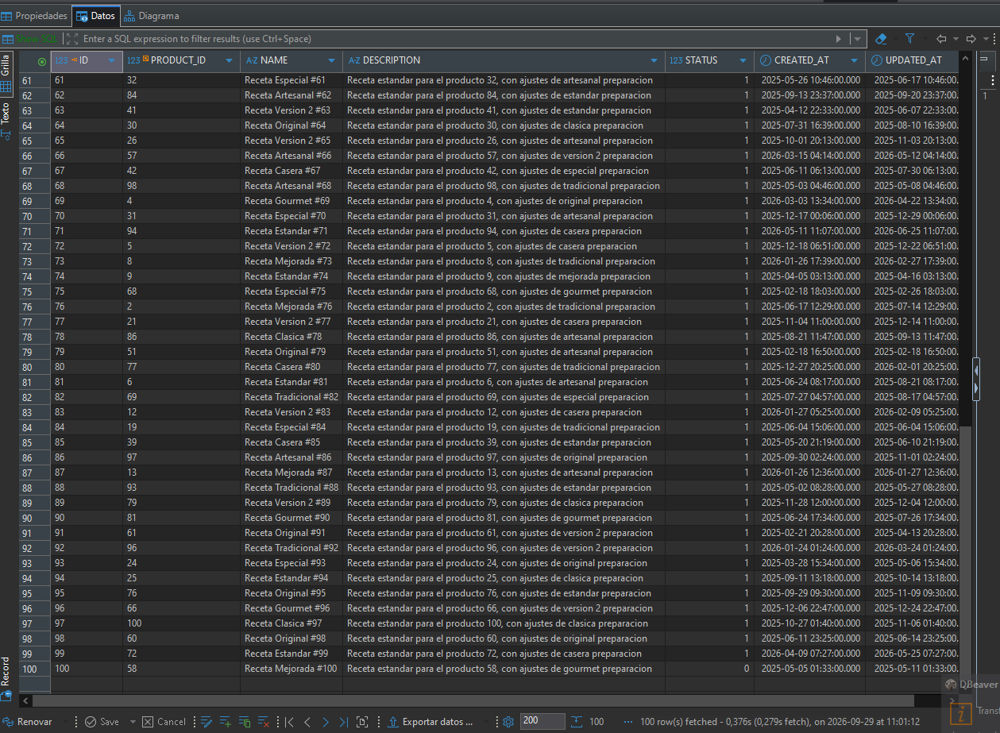

**Resultado:** se importaron los 100 registros en la tabla `recipes` sin errores, respetando la Foreign Key hacia `products`.

### 4.7 Carga de datos — tabla `recipe_supplies`

**Evidencia (imagen):**

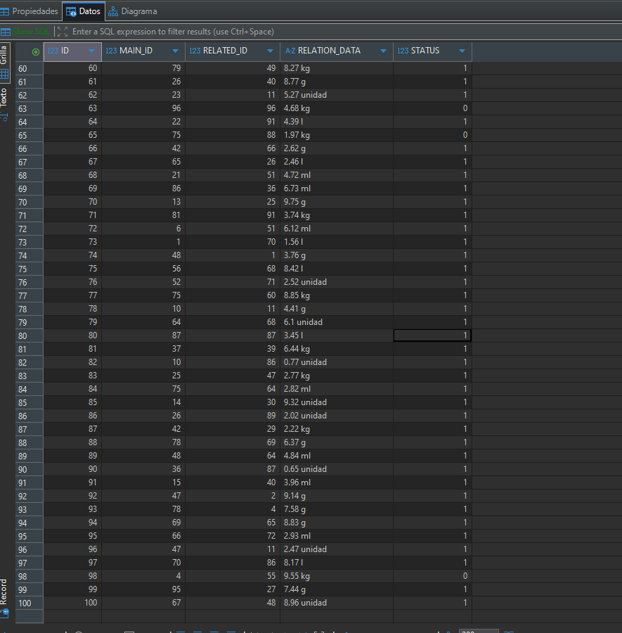

**Resultado:** se importaron los 100 registros en la tabla `recipe_supplies` sin errores, respetando las Foreign Keys hacia `recipes` e `supplies`.

### 4.8 Carga de datos — tabla `production_batches`

**Evidencia (imagen):**

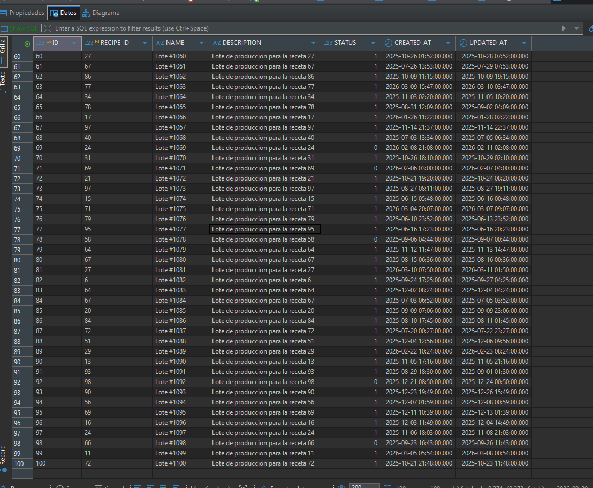

**Resultado:** se importaron los 100 registros en la tabla `production_batches` sin errores, respetando la Foreign Key hacia `recipes`.

### 4.9 Carga de datos — tabla `supply_movements`

**Evidencia (imagen):**

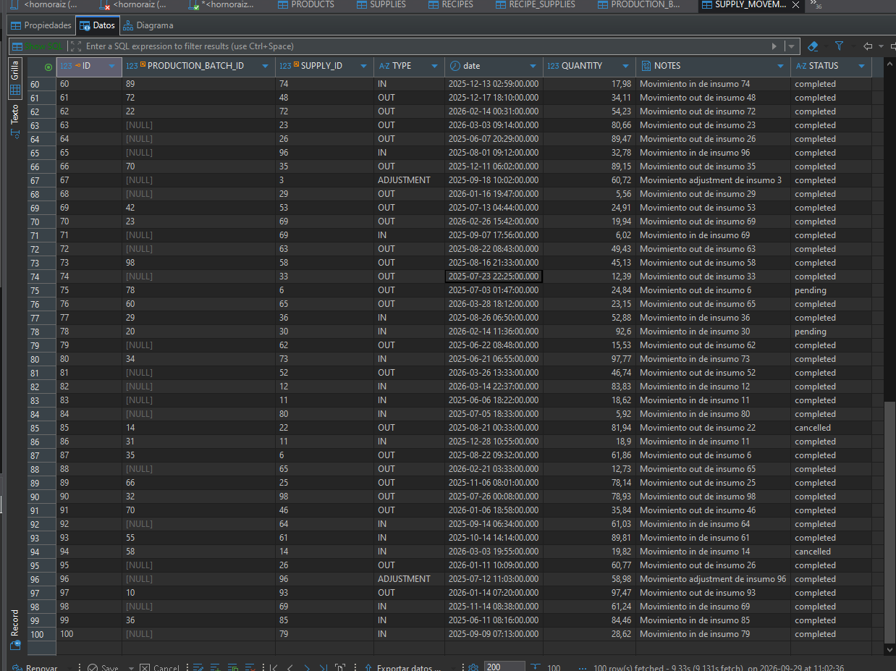

**Resultado:** se importaron los 100 registros en la tabla `supply_movements` sin errores, con `production_batch_id` nullable importado correctamente como `NULL` en las filas vacías del CSV, y la columna `"date"` (quoted identifier) mapeada sin problemas por el asistente de DBeaver.

### 4.10 Carga de datos — tabla `sales`

**Evidencia (imagen):**

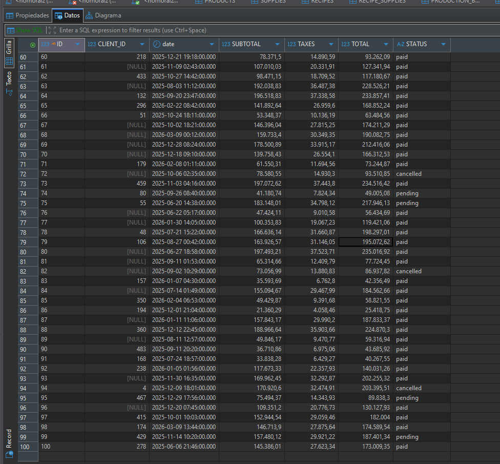

**Resultado:** se importaron los 100 registros en la tabla `sales` sin errores.

### 4.11 Carga de datos — tabla `sale_details`

**Evidencia (imagen):**

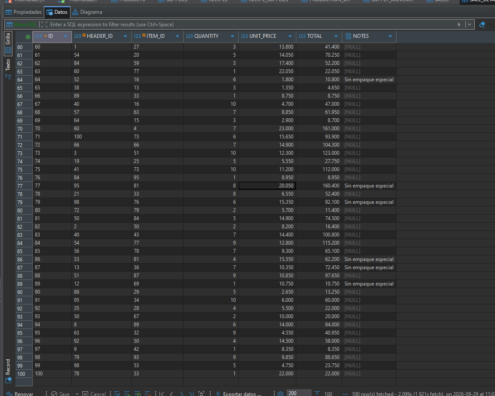

**Resultado:** se importaron los 100 registros en la tabla `sale_details` sin errores, respetando las Foreign Keys hacia `sales` y `products`.

### 4.12 Carga de datos — tabla `payments`

**Evidencia (imagen):**

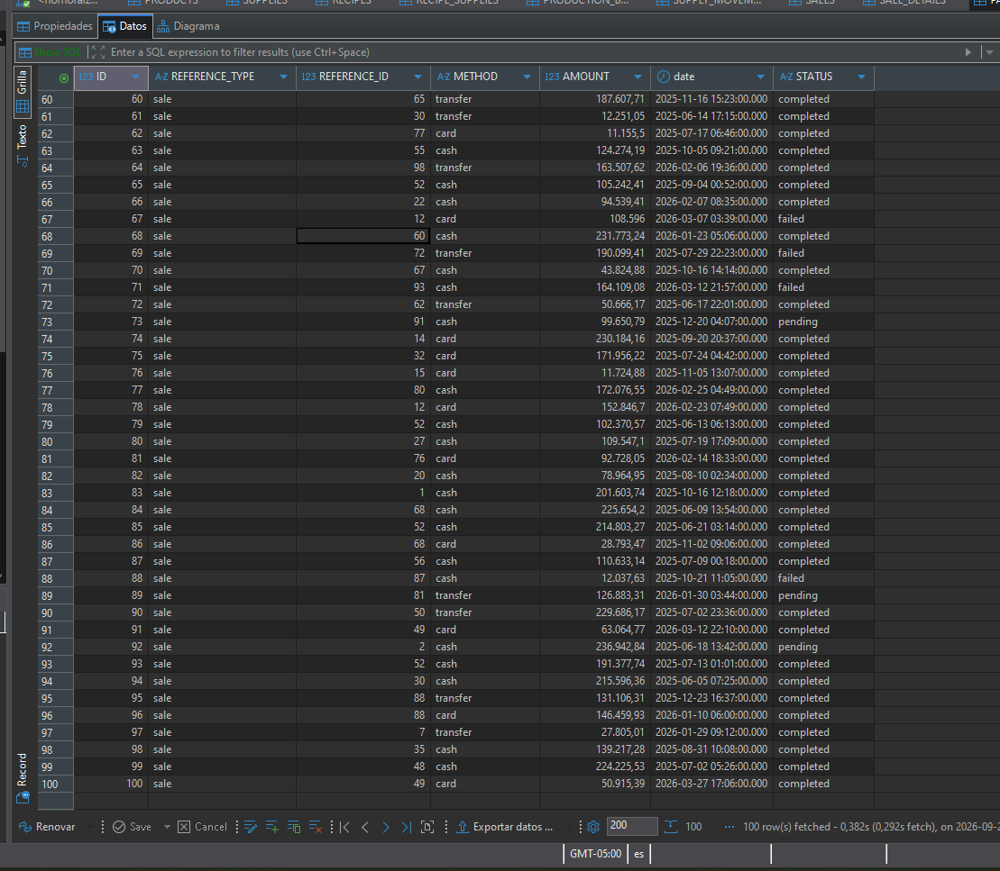

**Resultado:** se importaron los 100 registros en la tabla `payments` sin errores.

### 4.13 Carga de datos — tabla `promotions`

**Evidencia (imagen):**

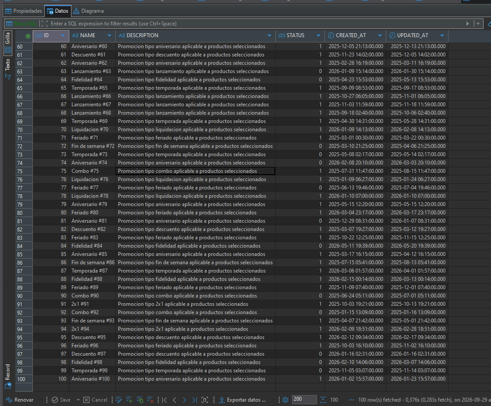

**Resultado:** se importaron los 100 registros en la tabla `promotions` sin errores.

### 4.14 Verificación de conteos y de la conversión de `status` (tipo `NUMBER(1)`)

```sql
SELECT 'PRODUCTS' t, COUNT(*) total, SUM(CASE WHEN status=1 THEN 1 ELSE 0 END) activos, SUM(CASE WHEN status=0 THEN 1 ELSE 0 END) inactivos FROM PRODUCTS
UNION ALL SELECT 'SUPPLIES', COUNT(*), SUM(CASE WHEN status=1 THEN 1 ELSE 0 END), SUM(CASE WHEN status=0 THEN 1 ELSE 0 END) FROM SUPPLIES
UNION ALL SELECT 'RECIPES', COUNT(*), SUM(CASE WHEN status=1 THEN 1 ELSE 0 END), SUM(CASE WHEN status=0 THEN 1 ELSE 0 END) FROM RECIPES
UNION ALL SELECT 'RECIPE_SUPPLIES', COUNT(*), SUM(CASE WHEN status=1 THEN 1 ELSE 0 END), SUM(CASE WHEN status=0 THEN 1 ELSE 0 END) FROM RECIPE_SUPPLIES
UNION ALL SELECT 'PRODUCTION_BATCHES', COUNT(*), SUM(CASE WHEN status=1 THEN 1 ELSE 0 END), SUM(CASE WHEN status=0 THEN 1 ELSE 0 END) FROM PRODUCTION_BATCHES
UNION ALL SELECT 'SUPPLY_MOVEMENTS', COUNT(*), NULL, NULL FROM SUPPLY_MOVEMENTS
UNION ALL SELECT 'SALES', COUNT(*), NULL, NULL FROM SALES
UNION ALL SELECT 'SALE_DETAILS', COUNT(*), NULL, NULL FROM SALE_DETAILS
UNION ALL SELECT 'PAYMENTS', COUNT(*), NULL, NULL FROM PAYMENTS
UNION ALL SELECT 'PROMOTIONS', COUNT(*), SUM(CASE WHEN status=1 THEN 1 ELSE 0 END), SUM(CASE WHEN status=0 THEN 1 ELSE 0 END) FROM PROMOTIONS;
```

**Evidencia (imagen):**

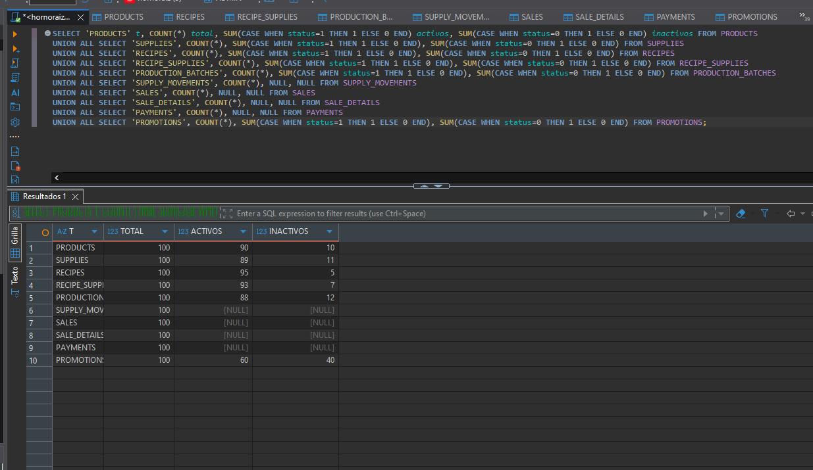

**Resultado:** las 10 tablas quedaron con 100 registros exactos. Las proporciones de `status` en las 6 tablas booleanas coinciden con MySQL, PostgreSQL y SQL Server: `products` 90/10, `supplies` 89/11, `recipes` 95/5, `recipe_supplies` 93/7, `production_batches` 88/12, `promotions` 60/40 — sin el incidente de conversión sufrido en PostgreSQL (Sección 2.13), ya que `NUMBER(1)` en Oracle acepta directamente los valores de texto `'1'`/`'0'` del CSV sin ambigüedad de tipo.

#### 4.15.1 Mostrar algunos de los registros de la tabla `products`

```sql
SELECT sku, name, price, status FROM products;
```

**Evidencia (imagen):**

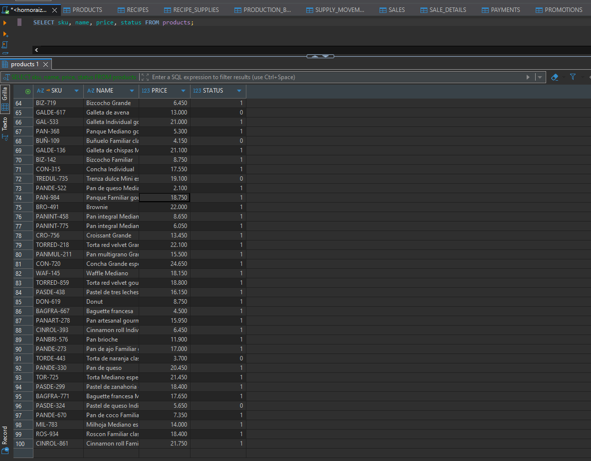

**Resultado:** la consulta devolvió los 100 registros de `products`, mismo resultado que en MySQL (Sección 1.13.1), PostgreSQL (Sección 2.14.1) y SQL Server (Sección 3.15.1).

#### 4.15.2 Mostrar de forma ordenada (DESC) las ventas desde su comienzo

```sql
SELECT id, "date", subtotal, status FROM sales ORDER BY "date" DESC;
```

**Evidencia (imagen):**

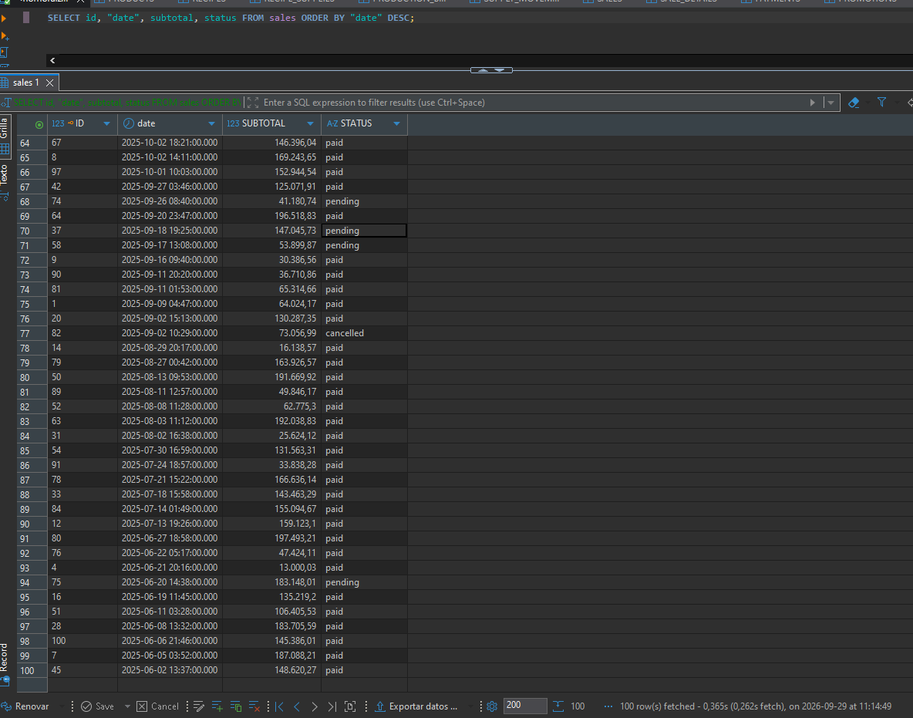

**Resultado:** la consulta devolvió los 100 registros de `sales` ordenados de la fecha más reciente a la más antigua, mismo resultado que en MySQL (Sección 1.13.2), PostgreSQL (Sección 2.14.2) y SQL Server (Sección 3.15.2). Se referenció la columna como `"date"` (quoted identifier), necesario por ser `DATE` palabra reservada en Oracle (ver nota de la Sección 4.2).

#### 4.15.3 Consultas a múltiples tablas mediante WHERE

```sql
SELECT *
FROM sale_details SD, sales S
WHERE S.id = SD.header_id;
```

**Evidencia (imagen):**

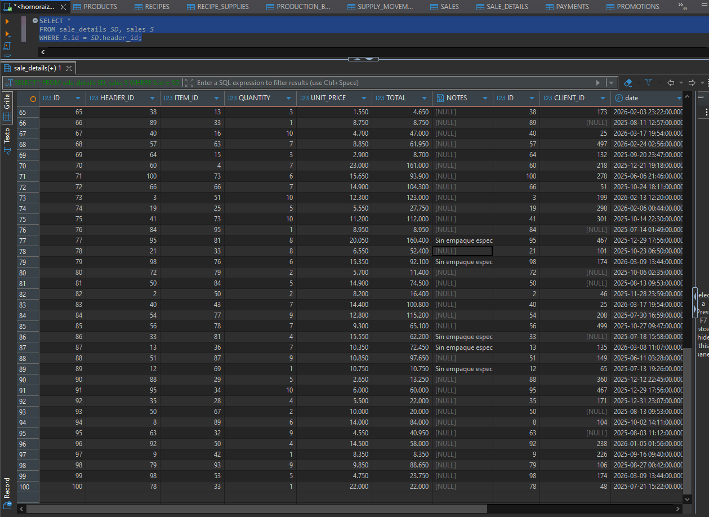

**Resultado:** la consulta devolvió los 100 registros de `sale_details` combinados con su venta correspondiente en `sales`, mismo resultado que en MySQL (Sección 1.13.3), PostgreSQL (Sección 2.14.3) y SQL Server (Sección 3.15.3).

#### 4.15.4 Consultas a múltiples tablas mediante JOIN

```sql
SELECT S."date", S.status, SD.*
FROM sales S
JOIN sale_details SD ON (S.id = SD.header_id);
```

**Evidencia (imagen):**

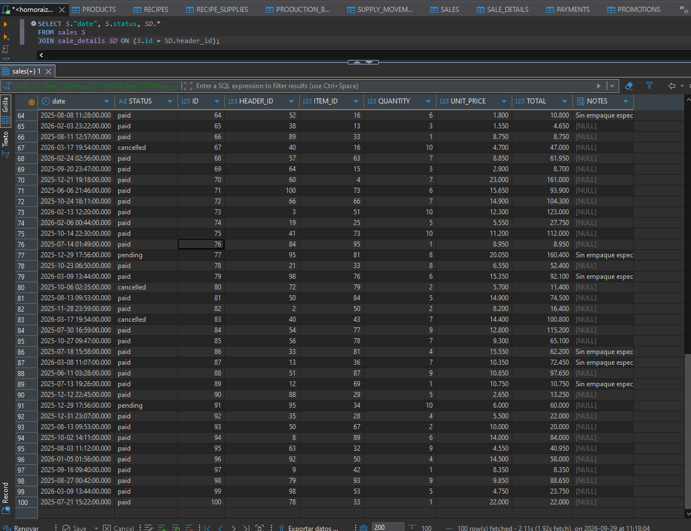

**Resultado:** la consulta devolvió los 100 registros combinando `sales` y `sale_details` mediante `JOIN ... ON`, mismo resultado que en MySQL (Sección 1.13.4), PostgreSQL (Sección 2.14.4) y SQL Server (Sección 3.15.4).

#### 4.15.5 Condiciones en las consultas / filtros

```sql
SELECT *
FROM sale_details SD, sales S
WHERE S.id = SD.header_id AND S.status = 'paid';
```

**Evidencia (imagen):**

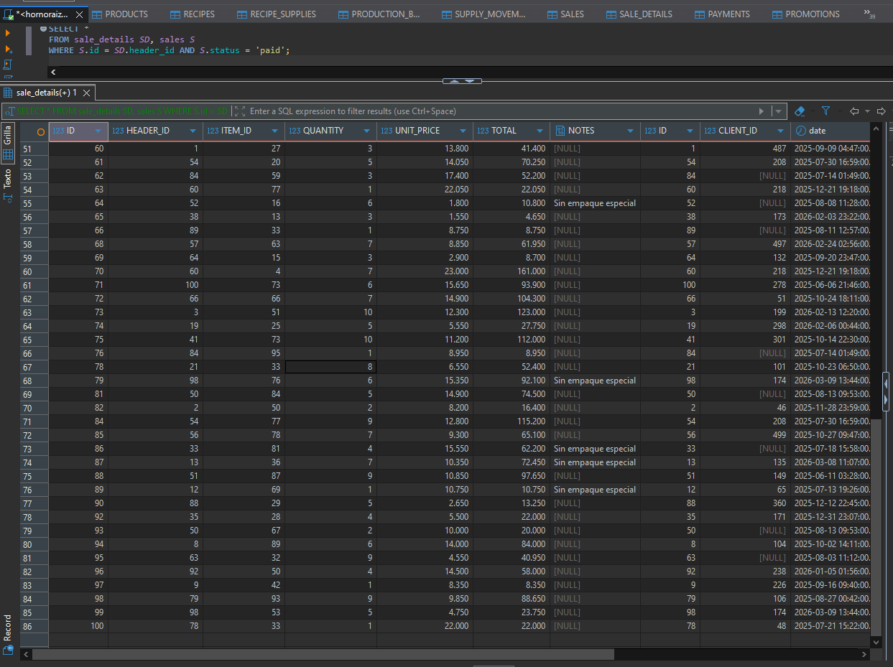

**Resultado:** la consulta devolvió 82 registros con `status = 'paid'`, mismo resultado que en MySQL (Sección 1.13.5), PostgreSQL (Sección 2.14.5) y SQL Server (Sección 3.15.5).

```sql
SELECT S."date", S.status, SD.*
FROM sales S
JOIN sale_details SD ON (S.id = SD.header_id)
WHERE S.status = 'cancelled';
```

**Evidencia (imagen):**

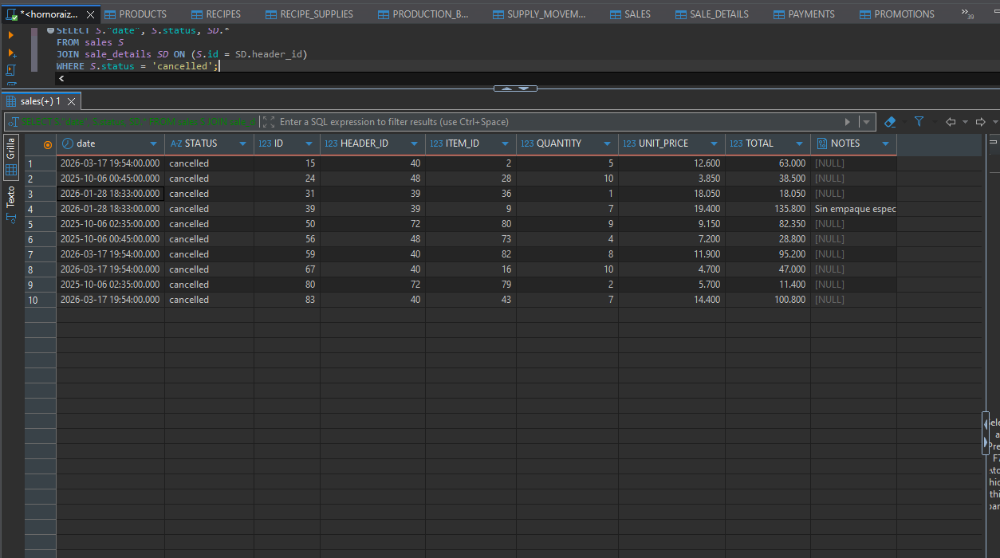

**Resultado:** la consulta devolvió 10 registros con `status = 'cancelled'`, mismo resultado que en los otros tres motores.

#### 4.15.6 Consultas con filtros condicional LIKE

```sql
SELECT * FROM products P WHERE P.name LIKE 'Pan%';
```

**Evidencia (imagen):**

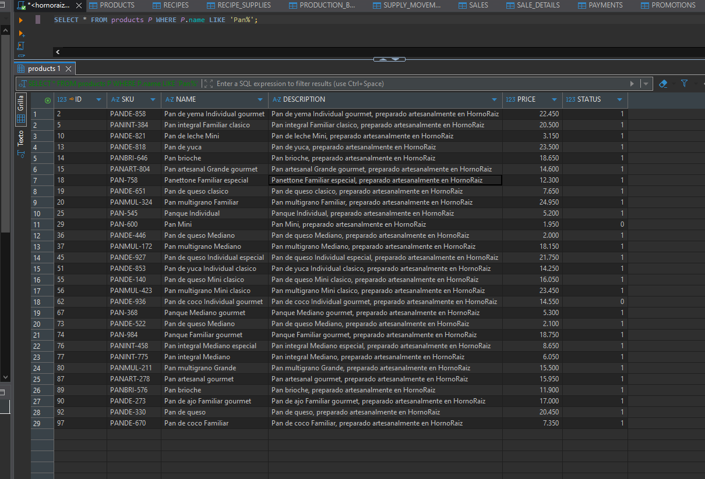

**Resultado:** la consulta devolvió 28 registros cuyo `name` comienza con "Pan", mismo resultado que en MySQL (Sección 1.13.6), PostgreSQL (Sección 2.14.6) y SQL Server (Sección 3.15.6).

**Mostrar los productos cuya descripción contenga la palabra "chocolate":**

```sql
SELECT * FROM products P WHERE P.description LIKE CONCAT(CONCAT('%','chocolate'),'%');
```

**Evidencia (imagen):**

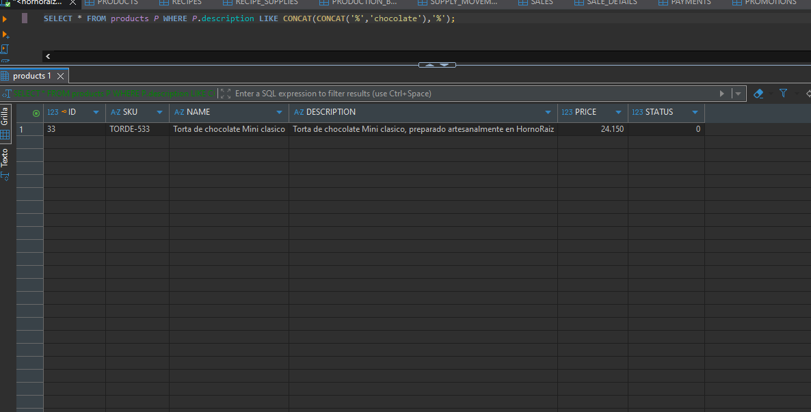

**Resultado:** la consulta devolvió 1 registro (`Torta de chocolate Mini clasico`), mismo resultado que en los otros tres motores. A diferencia de MySQL/PostgreSQL/SQL Server, Oracle solo admite `CONCAT` con 2 argumentos, por lo que el patrón `%chocolate%` requirió anidar dos llamadas (`CONCAT(CONCAT('%','chocolate'),'%')`).

**Combinación (status = cancelled y name LIKE 'Pan%'):**

```sql
SELECT S."date", S.status, P.name
FROM sales S
JOIN sale_details SD ON (S.id = SD.header_id)
JOIN products P ON (P.id = SD.item_id)
WHERE S.status = 'cancelled' AND P.name LIKE 'Pan%';
```

**Evidencia (imagen):**

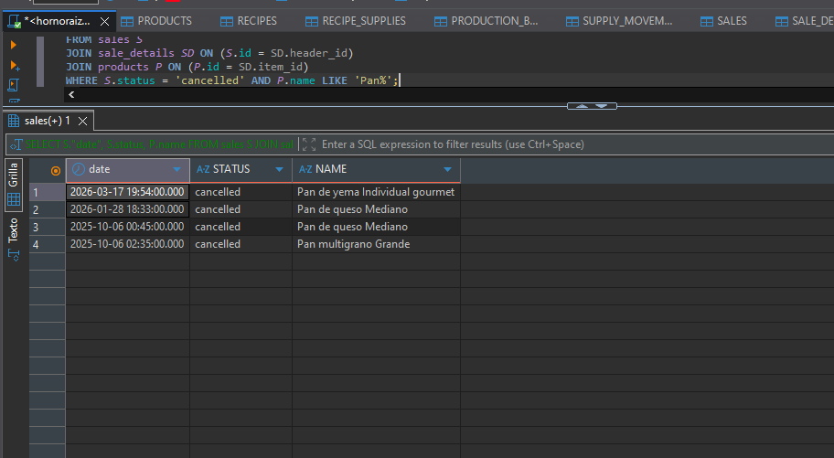

**Resultado:** la consulta devolvió 4 registros, mismo resultado que en los otros tres motores.

#### 4.15.7 Consultas con filtros condicionales BETWEEN

```sql
SELECT P.name, P.sku, SD.quantity, SD.total, S."date", PAY.method
FROM products P
JOIN sale_details SD ON P.id = SD.item_id
JOIN sales S ON SD.header_id = S.id
JOIN payments PAY ON PAY.reference_id = S.id AND PAY.reference_type = 'sale'
WHERE PAY."date" BETWEEN TO_DATE('2025-06-01','YYYY-MM-DD') AND TO_DATE('2026-03-30','YYYY-MM-DD')
ORDER BY PAY."date" ASC;
```

**Evidencia (imagen):**

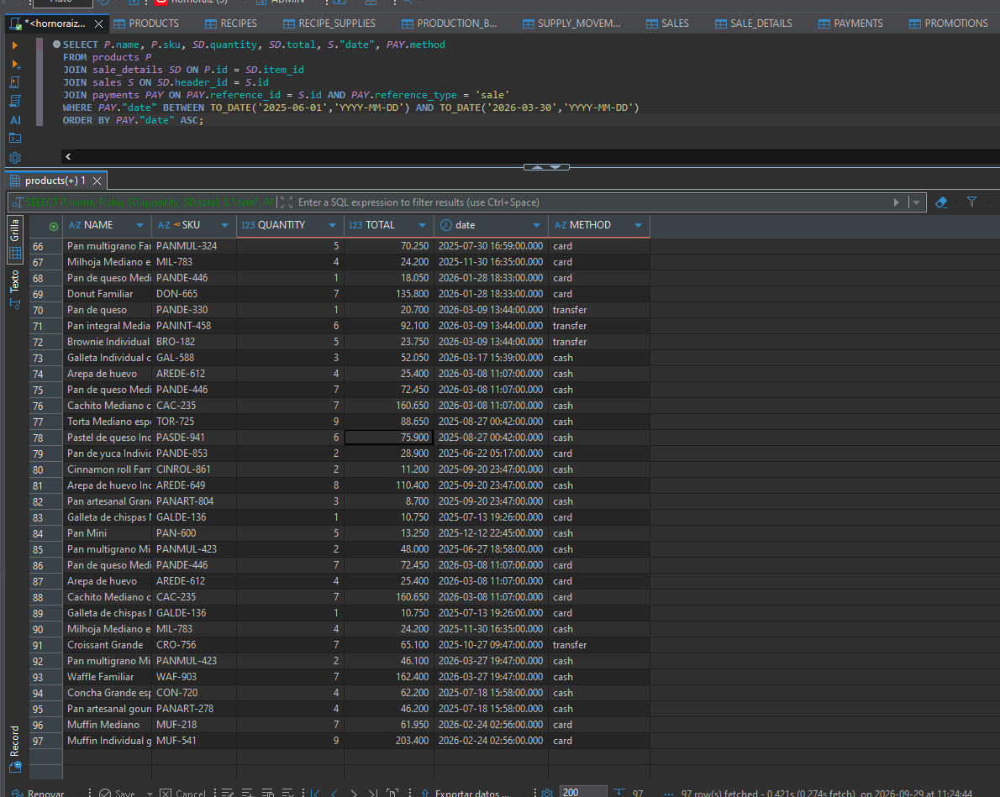

**Resultado:** la consulta combina `products`, `sale_details`, `sales` y `payments` en una cadena de 4 tablas, con el mismo resultado que en MySQL (Sección 1.13.7), PostgreSQL (Sección 2.14.7) y SQL Server (Sección 3.15.7): filas repetidas por venta cuando existen múltiples `sale_details` y múltiples `payments` asociados. Se usó `TO_DATE()` explícito para el rango del `BETWEEN`, ya que Oracle no convierte automáticamente literales de texto a fecha en esta cláusula como sí hacen los otros tres motores.

#### 4.15.8 Consultas con agrupamiento GROUP BY

**Forma 1 (rango de fechas, con AVG):**
```sql
SELECT S.id, S."date", SUM(PAY.amount) AS total_paid, COUNT(PAY.id) AS payment_count, AVG(PAY.amount) AS avg_payment
FROM sales S
JOIN payments PAY ON PAY.reference_id = S.id AND PAY.reference_type = 'sale'
WHERE PAY."date" BETWEEN TO_DATE('2025-06-01','YYYY-MM-DD') AND TO_DATE('2026-03-30','YYYY-MM-DD')
GROUP BY S.id, S."date"
ORDER BY total_paid DESC;
```

**Evidencia (imagen):**

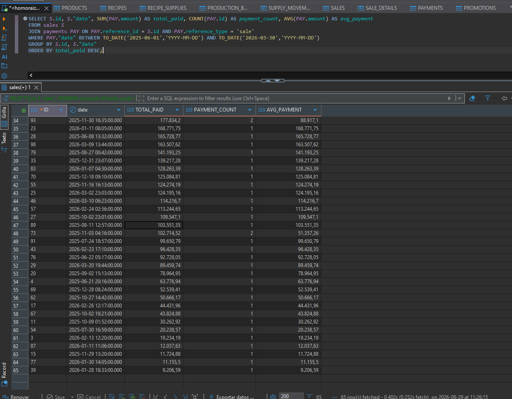

**Resultado:** 62 ventas agrupadas, mismo resultado que en los otros tres motores, encabezadas por la venta 52 con $942.692,25 en 6 pagos. La columna `avg_payment` muestra alta precisión decimal (ej. `85617.8366666666666666666666666666666667`), comportamiento propio del tipo `NUMBER` de Oracle en operaciones `AVG`, con más decimales que MySQL o SQL Server.

**Forma 2 (filtro por status y method):**
```sql
SELECT S.id, S."date", SUM(PAY.amount) AS total_paid, COUNT(PAY.id) AS payment_count
FROM sales S
JOIN payments PAY ON PAY.reference_id = S.id AND PAY.reference_type = 'sale'
WHERE PAY.status = 'completed' AND PAY.method = 'card'
GROUP BY S.id, S."date"
ORDER BY total_paid DESC;
```

**Evidencia (imagen):**

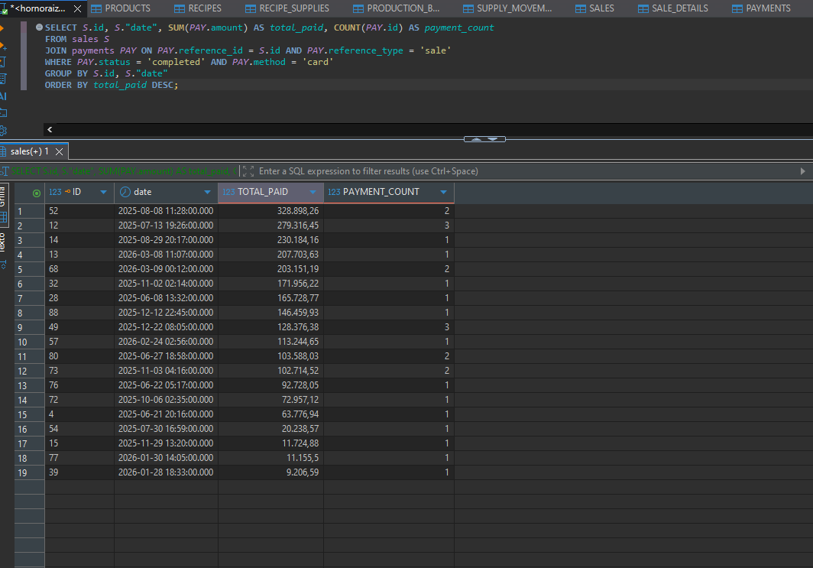

**Resultado:** 19 ventas, mismo resultado que en los otros tres motores, encabezadas por la venta 52 con $328.898,26 en 2 pagos.

**Con HAVING:**
```sql
SELECT S.id, S."date", SUM(PAY.amount) AS total_paid, COUNT(PAY.id) AS payment_count
FROM sales S
JOIN payments PAY ON PAY.reference_id = S.id AND PAY.reference_type = 'sale'
GROUP BY S.id, S."date"
HAVING SUM(PAY.amount) >= 100000
ORDER BY total_paid DESC;
```

**Evidencia (imagen):**

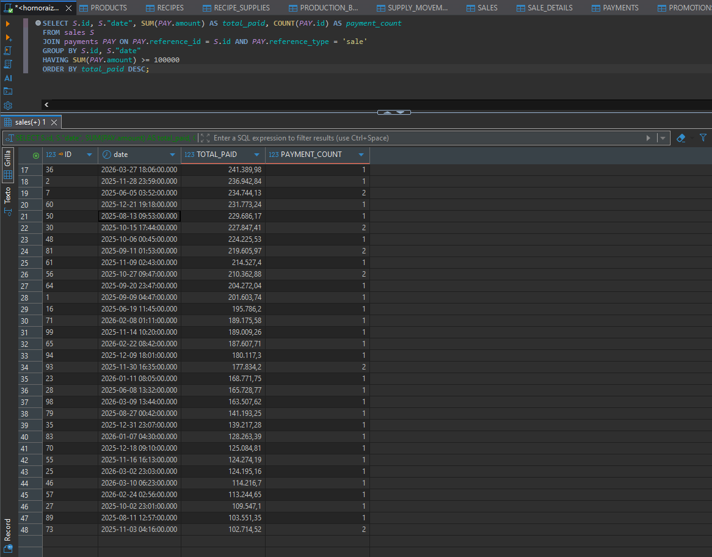

**Resultado:** 47 ventas, mismo resultado que en los otros tres motores, encabezadas por la venta 52 con $942.692,25 en 6 pagos.

#### 4.15.9 Subconsultas y teoría de conjuntos

Mostrar los productos que no han sido vendidos (sin registro en `sale_details`/`sales`) dentro de un rango de fechas específico.

**Forma 1 (subconsulta con NOT IN):**
```sql
SELECT * FROM products P
WHERE P.id NOT IN (
  SELECT SD.item_id FROM sale_details SD
  JOIN sales S ON SD.header_id = S.id
  WHERE S."date" BETWEEN TO_DATE('2025-06-01','YYYY-MM-DD') AND TO_DATE('2026-03-30','YYYY-MM-DD')
);
```

**Evidencia (imagen):**

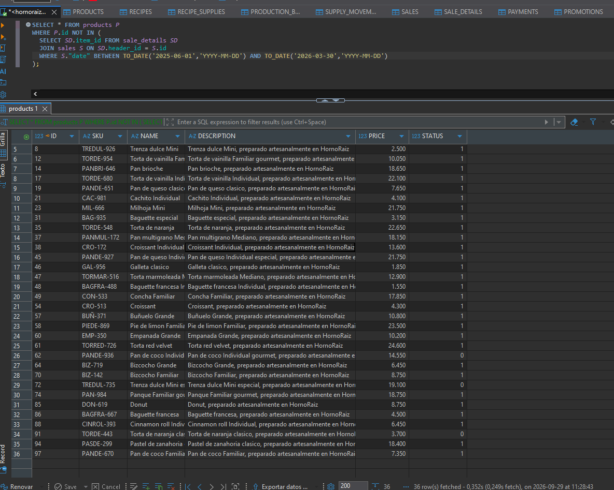

**Resultado:** 35 productos sin ventas registradas en el rango de fechas indicado, mismo resultado que en MySQL (Sección 1.13.9), PostgreSQL (Sección 2.14.9) y SQL Server (Sección 3.15.9).

**Forma 2 (LEFT JOIN con IS NULL):**
```sql
SELECT * FROM products P
LEFT JOIN sale_details SD ON (P.id = SD.item_id)
LEFT JOIN sales S ON (SD.header_id = S.id AND S."date" BETWEEN TO_DATE('2025-06-01','YYYY-MM-DD') AND TO_DATE('2026-03-30','YYYY-MM-DD'))
WHERE S.id IS NULL;
```

**Evidencia (imagen):**

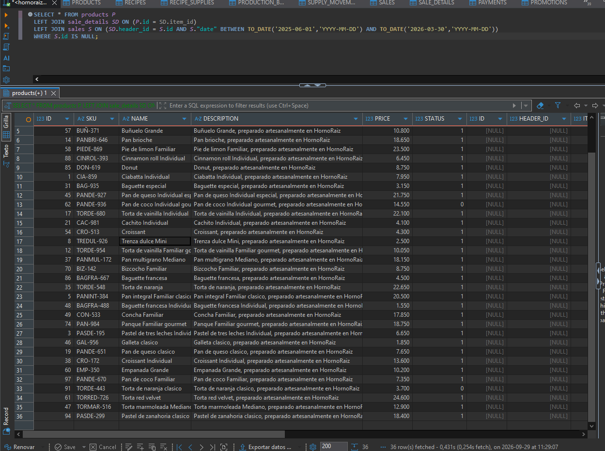

**Resultado:** mismos 35 productos que la Forma 1, confirmando la equivalencia entre ambas formas de expresar la teoría de conjuntos, consistente con los otros tres motores.

## Conclusión

En este trabajo se aplicó la normativa de nomenclatura del profesor (tablas en plural e inglés) sobre el modelo `hornoraiz` ya construido en los cuatro motores de base de datos, seguido de la carga de 100 registros de prueba por tabla y la implementación de las 9 consultas avanzadas solicitadas: consulta simple, ordenamiento, join mediante `WHERE`, join explícito, filtros condicionales, `LIKE`, `BETWEEN`, agrupamiento con `GROUP BY`/`HAVING`, y subconsultas con teoría de conjuntos (`NOT IN` / `LEFT JOIN`).

El proceso de renombrado expuso diferencias reales de sintaxis entre los cuatro motores: MySQL permite `RENAME TABLE` múltiple y `ALTER TABLE` con varias cláusulas `RENAME COLUMN` en una sola sentencia; PostgreSQL y Oracle exigen una sentencia por cada tabla o columna; SQL Server resuelve ambos casos mediante el procedimiento del sistema `sp_rename`. Se documentó también una decisión de diseño consciente: la columna booleana `is_active` se unificó bajo el nombre `status` en las tablas de catálogo (`products`, `supplies`, `recipes`, `recipe_supplies`, `production_batches`, `promotions`), coexistiendo con una columna `status` de tipo texto de flujo de negocio en las tablas transaccionales (`sales`, `payments`, `supply_movements`) — una ambigüedad de nombre que quedó advertida explícitamente para no inducir errores en las consultas.

La carga de datos, reutilizando los mismos 10 archivos CSV en los cuatro motores, permitió detectar y corregir tres incidentes técnicos concretos, no anticipados en el diseño original:

1. **PostgreSQL**: el asistente gráfico de importación de DBeaver convirtió incorrectamente los valores `1`/`0` del CSV al tipo `boolean` nativo, dejando el 100% de los registros en `false` sin reportar error. Se diagnosticó mediante conteo de valores y se corrigió reimportando con `\copy` desde el cliente `psql`, que sí interpreta la conversión correctamente.
2. **Oracle — columnas de identidad**: las columnas `id`, creadas originalmente como `GENERATED BY DEFAULT AS IDENTITY`, aparecieron como `GENERATED ALWAYS AS IDENTITY`, impidiendo insertar los valores explícitos necesarios para mantener la correspondencia de Foreign Keys entre los CSV. Se corrigió con `ALTER TABLE ... MODIFY id GENERATED BY DEFAULT AS IDENTITY` en las 10 tablas.
3. **Oracle — palabra reservada**: `DATE` es un identificador reservado en Oracle, lo que impidió renombrar la columna `fecha` a `date` sin comillas dobles en `supply_movements`, `sales` y `payments`. Se resolvió forzando el identificador entre comillas (`"date"`), con la consecuencia de que toda consulta posterior sobre esas tres tablas debió referenciar la columna en ese formato exacto.

A pesar de estas diferencias de sintaxis y de los tres incidentes de motor, los resultados obtenidos en las 9 consultas avanzadas fueron idénticos en los cuatro motores — mismas cantidades de filas, mismos totales, mismos productos y ventas identificados en cada caso — confirmando que el modelo de datos y los datos de prueba se mantuvieron consistentes a lo largo de todo el ejercicio, y que las diferencias encontradas fueron exclusivamente de sintaxis y comportamiento de cada motor, no de la lógica de las consultas en sí.

### 1.14 Procedimientos almacenados

Cada consulta de la sección 1.13 se llevó a un procedimiento almacenado (`CREATE PROCEDURE`) para guardarla dentro del motor y ejecutarla con `CALL`. Se crearon 15 procedimientos, uno por cada forma de las 9 consultas, con el nombre `sp_consulta_<número>`.

**Incidente 1 — error 1064 al crear con `BEGIN ... END`.** El primer intento usó `BEGIN ... END` y DBeaver respondió `ERROR 1064 ... near 'END'`. El editor corta la sentencia en el primer `;`, el del `SELECT`, y deja el `END` suelto. Como cada consulta es una sola sentencia, se creó cada procedimiento sin bloque `BEGIN ... END`, y cada `CREATE` queda con un único `;` al final.

**Incidente 2 — columna residual en `products`.** Al ejecutar `sp_consulta_1_6a` aparecía una séptima columna, `id;sku;name;description;price;status`, llena de `NULL`. Era el encabezado del CSV, leído como nombre de columna por una importación con el delimitador mal configurado. Se comprobó que estaba solo en `products` y vacía en las 100 filas, se hizo un respaldo con `mysqldump` y se eliminó:

```sql
ALTER TABLE products DROP COLUMN `id;sku;name;description;price;status`;
```

Después `products` quedó con 100 filas y 6 columnas, como en los otros motores. Los procedimientos con `SELECT *` no necesitaron recrearse, porque MySQL resuelve las columnas al ejecutar.

#### 1.14.1 Mostrar algunos de los registros de `products`

**Narrativa:** esta consulta es el punto de partida para comprobar que el catálogo se cargó completo. Proyecta solo `sku`, `name`, `price` y `status`, las columnas que identifican un producto, en vez de traer la tabla entera con `SELECT *`.

```sql
CREATE PROCEDURE sp_consulta_1_1() SELECT sku, name, price, status FROM products;
```

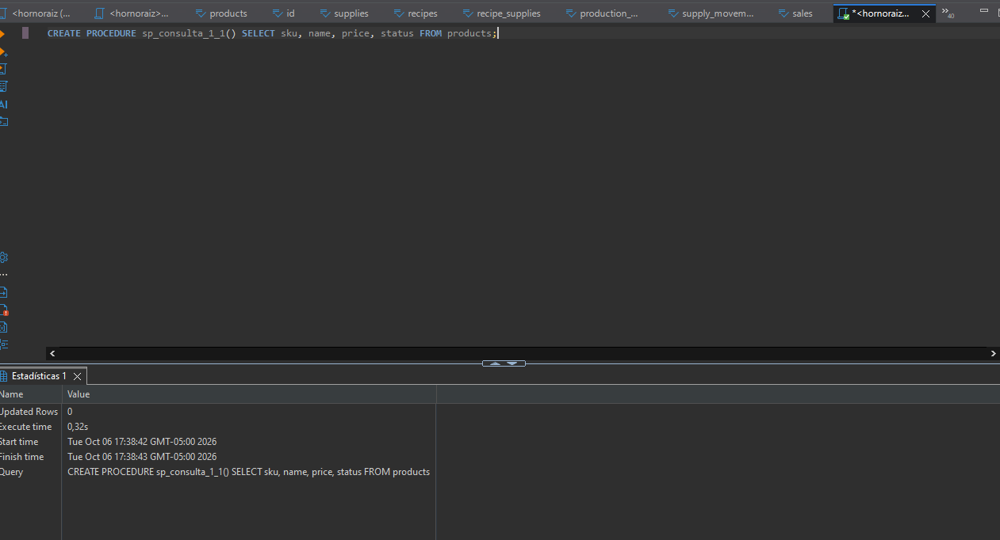

```sql
CALL sp_consulta_1_1();
```

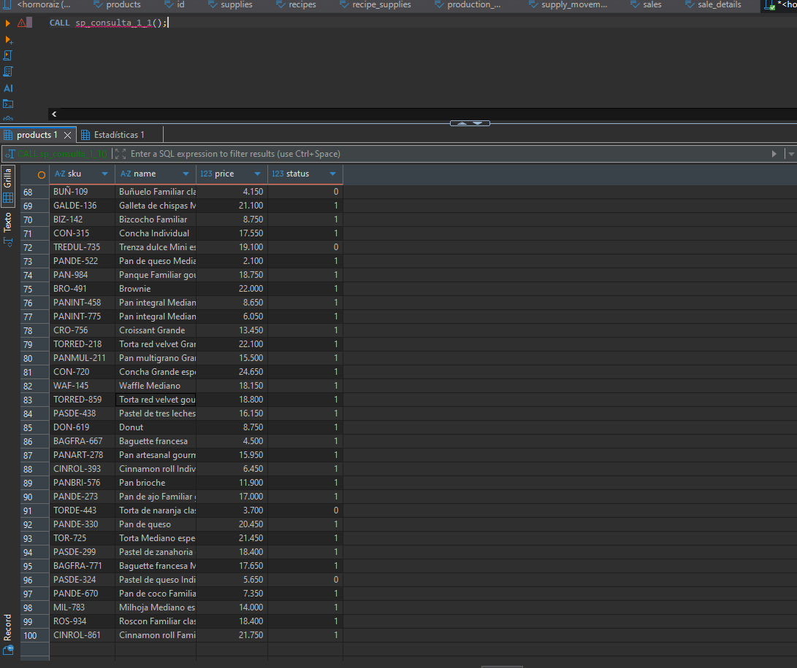

**Resultado:** devolvió 100 productos: 90 activos (`status = 1`) y 10 inactivos (`status = 0`). `CIA-859` aparece a $7.950, el mismo precio de los otros tres motores.

#### 1.14.2 Ventas ordenadas de la más reciente a la más antigua

**Narrativa:** responde "¿qué se vendió últimamente?". Usa `ORDER BY date DESC` sobre `sales`, de modo que la primera fila sea la venta más nueva. Sirve para revisar la actividad reciente de la panadería.

```sql
CREATE PROCEDURE sp_consulta_1_2() SELECT id, date, subtotal, status FROM sales ORDER BY date DESC;
```

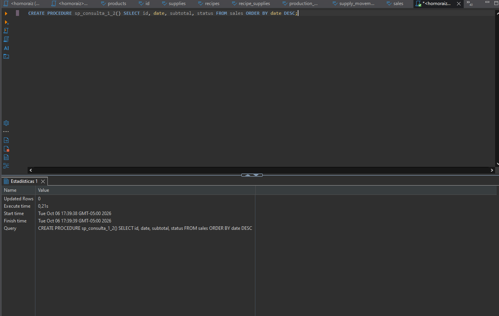

```sql
CALL sp_consulta_1_2();
```

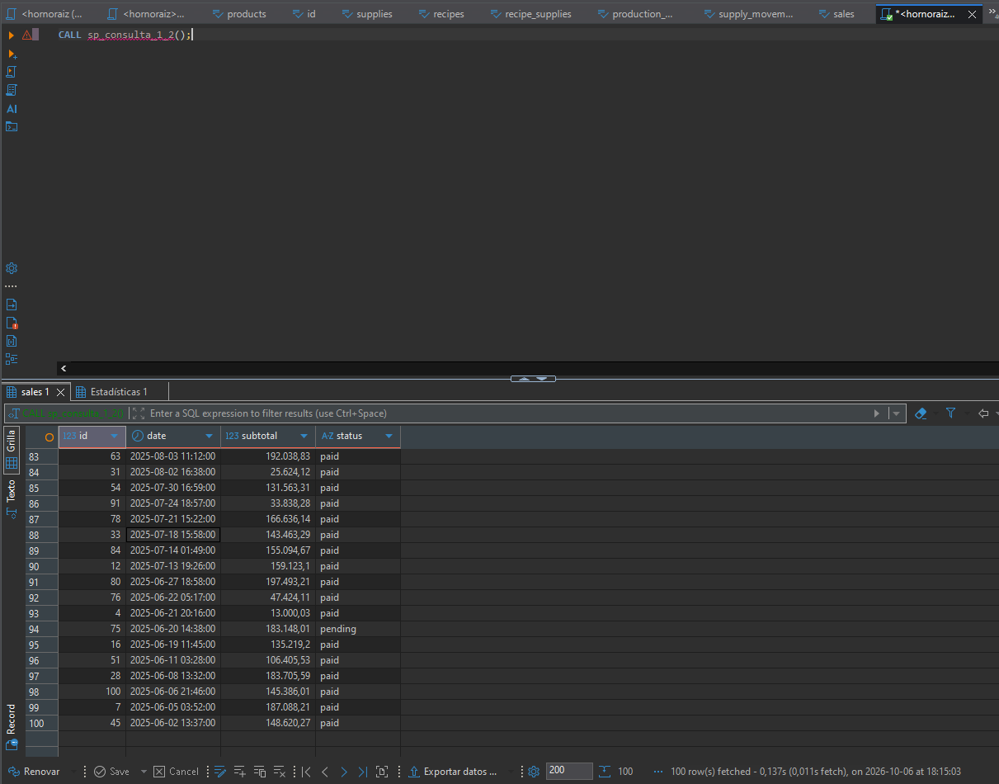

**Resultado:** devolvió las 100 ventas. La más reciente es la venta 10 (27 de marzo de 2026, pendiente) y la más antigua la venta 45 (2 de junio de 2025). El rango cubre unos diez meses de operación.

#### 1.14.3 Ventas con sus líneas de detalle, relación en `WHERE`

**Narrativa:** relaciona cada línea de `sale_details` con su venta en `sales`. La unión se hace con la condición `S.id = SD.header_id` en el `WHERE`: la clave primaria de la venta contra la clave foránea de la línea. Muestra qué productos y cantidades componen cada venta.

```sql
CREATE PROCEDURE sp_consulta_1_3() SELECT * FROM sale_details SD, sales S WHERE S.id = SD.header_id;
```

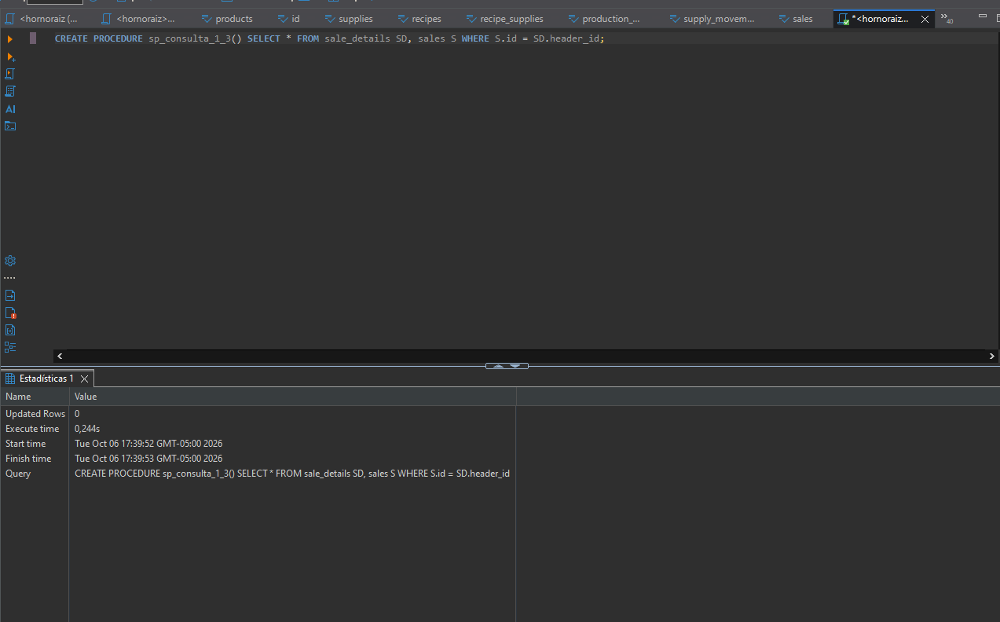

```sql
CALL sp_consulta_1_3();
```

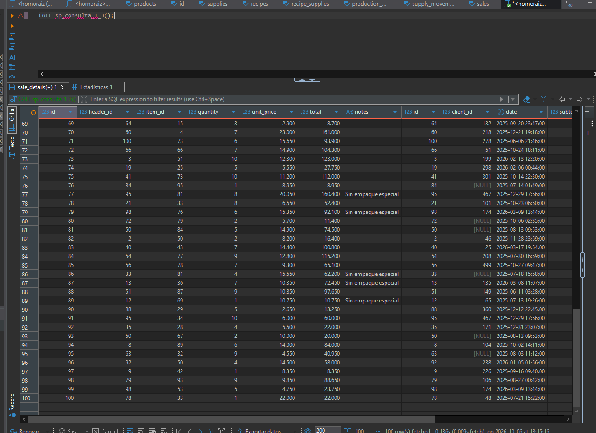

**Resultado:** devolvió 100 filas, una por línea de detalle, cada una con los datos de su venta. Ninguna línea quedó sin venta, lo que confirma la integridad de la clave foránea `header_id`.

#### 1.14.4 Ventas con sus líneas de detalle, relación con `JOIN`

**Narrativa:** es la misma pregunta que la 1.14.3, resuelta con `JOIN ... ON`. Proyecta de `sales` solo la fecha y el estado, y de `sale_details` todas las columnas. Esto separa la condición de unión de los posibles filtros, que se agregan en el `WHERE`.

```sql
CREATE PROCEDURE sp_consulta_1_4()
SELECT S.date, S.status, SD.*
FROM sales AS S
JOIN sale_details AS SD ON (S.id = SD.header_id);
```

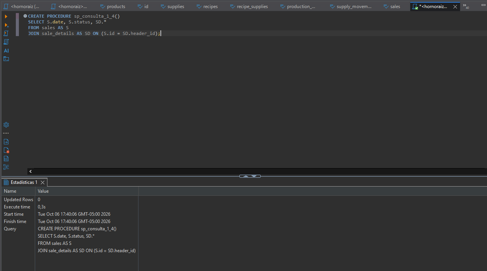

```sql
CALL sp_consulta_1_4();
```

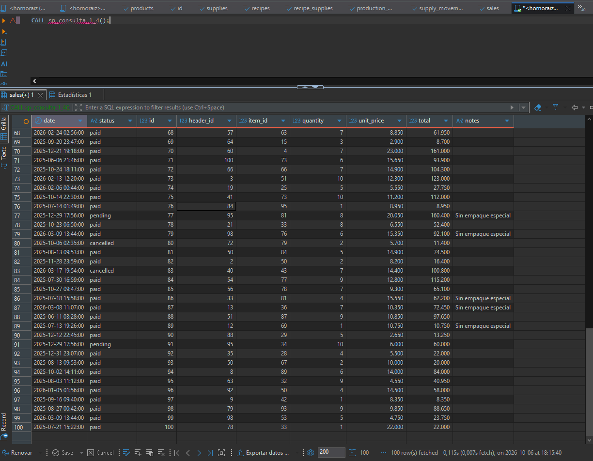

**Resultado:** devolvió las mismas 100 filas que `sp_consulta_1_3`, lo que confirma que ambas sintaxis son equivalentes para esta relación. En la grilla se ven líneas de ventas pagadas, canceladas y pendientes.

#### 1.14.5 Filtro por estado de la venta

**Narrativa:** estas dos consultas reparten las líneas de detalle según el estado de su venta. El estado se filtra en `sales`, porque `sale_details` no tiene columna `status`. La primera usa la relación en el `WHERE` y mide las ventas pagadas. La segunda usa `JOIN` y aísla las canceladas.

```sql
CREATE PROCEDURE sp_consulta_1_5a()
SELECT * FROM sale_details SD, sales S
WHERE S.id = SD.header_id AND S.status = 'paid';
```

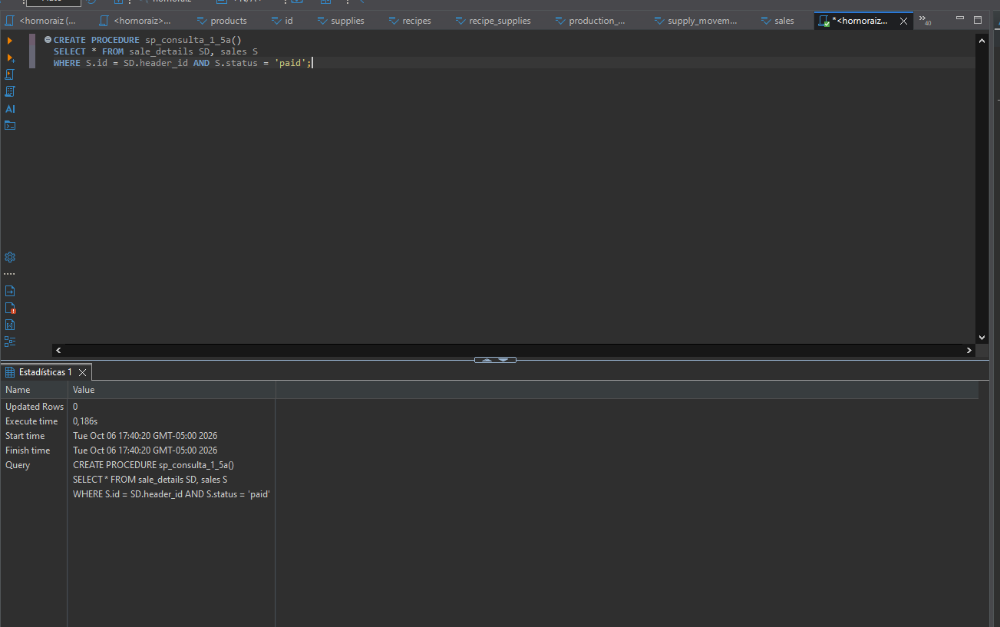

```sql
CALL sp_consulta_1_5a();
```

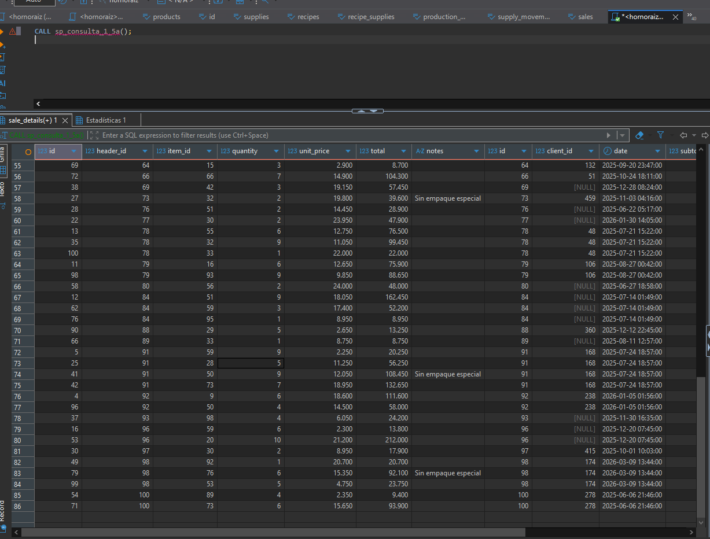

**Resultado:** 86 de las 100 líneas (86 %) pertenecen a ventas pagadas.

```sql
CREATE PROCEDURE sp_consulta_1_5b()
SELECT S.date, S.status, SD.*
FROM sales AS S
JOIN sale_details AS SD ON (S.id = SD.header_id)
WHERE S.status = 'cancelled';
```

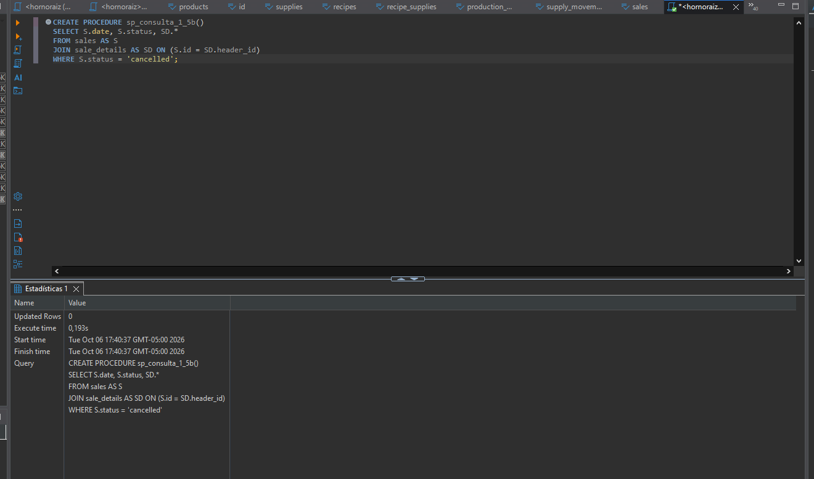

```sql
CALL sp_consulta_1_5b();
```

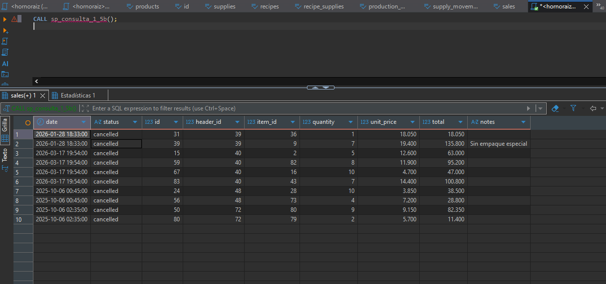

**Resultado:** 10 líneas, que corresponden a 4 ventas canceladas (39, 40, 48 y 72). Las 4 líneas restantes de las 100 pertenecen a ventas pendientes.

#### 1.14.6 Filtros con `LIKE`

**Narrativa:** tres búsquedas por patrón de texto. La primera usa `LIKE 'Pan%'` para listar los productos cuyo nombre empieza por "Pan". La segunda construye el patrón con `CONCAT('%','chocolate','%')` para buscar la palabra en cualquier posición de la descripción. La tercera combina el filtro de texto con el estado de la venta, para ver qué productos "Pan" se cancelaron.

```sql
CREATE PROCEDURE sp_consulta_1_6a() SELECT * FROM products AS P WHERE P.name LIKE 'Pan%';
```

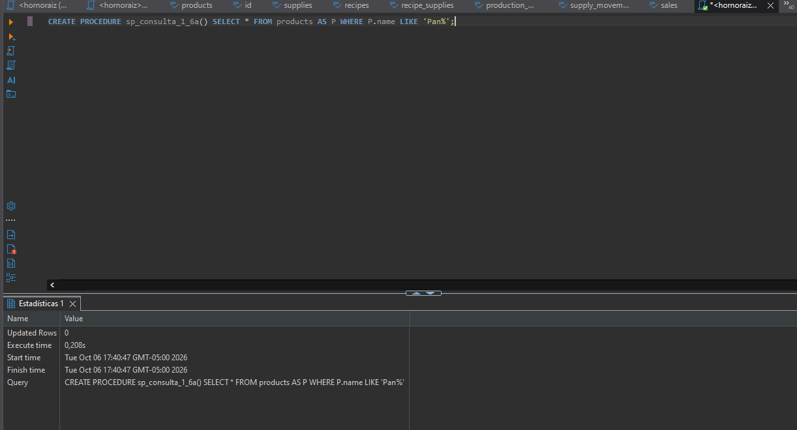

```sql
CALL sp_consulta_1_6a();
```

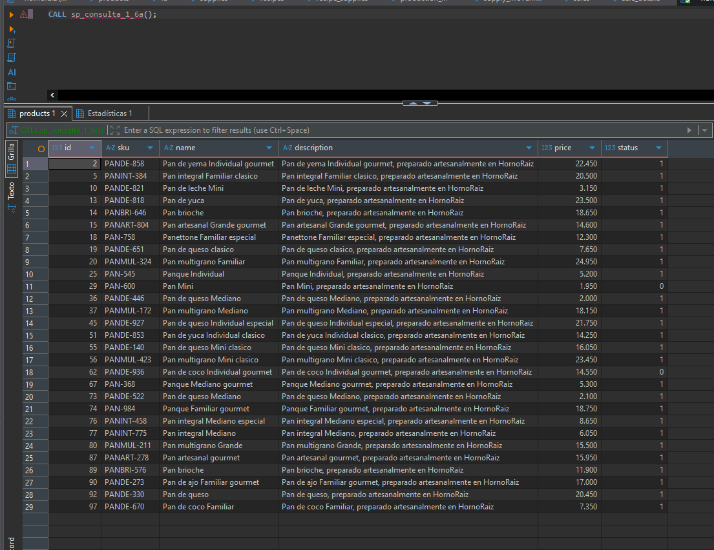

**Resultado:** 29 productos. El patrón incluye también Panettone y Panque, porque solo exige que el nombre comience por "Pan". Dos de ellos están inactivos: `PAN-600` y `PANDE-936`.

```sql
CREATE PROCEDURE sp_consulta_1_6b() SELECT * FROM products AS P WHERE P.description LIKE CONCAT('%','chocolate','%');
```

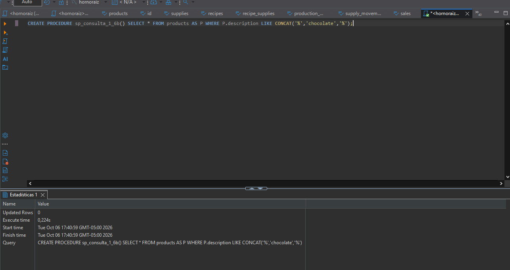

```sql
CALL sp_consulta_1_6b();
```

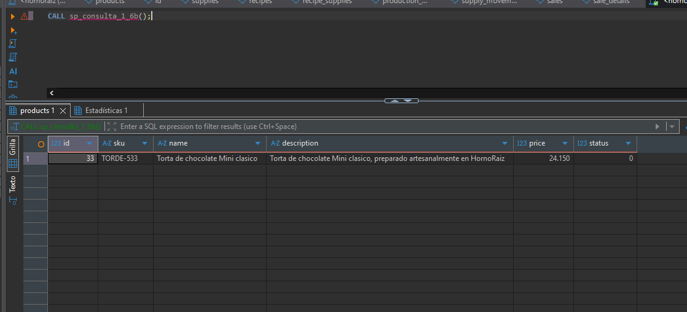

**Resultado:** un solo producto, `Torta de chocolate Mini clasico` (`TORDE-533`, $24.150), que además está inactivo. Es el único del catálogo cuya descripción menciona el chocolate.

```sql
CREATE PROCEDURE sp_consulta_1_6c()
SELECT S.date, S.status, P.name
FROM sales AS S
JOIN sale_details AS SD ON (S.id = SD.header_id)
JOIN products AS P ON (P.id = SD.item_id)
WHERE S.status = 'cancelled' AND P.name LIKE 'Pan%';
```

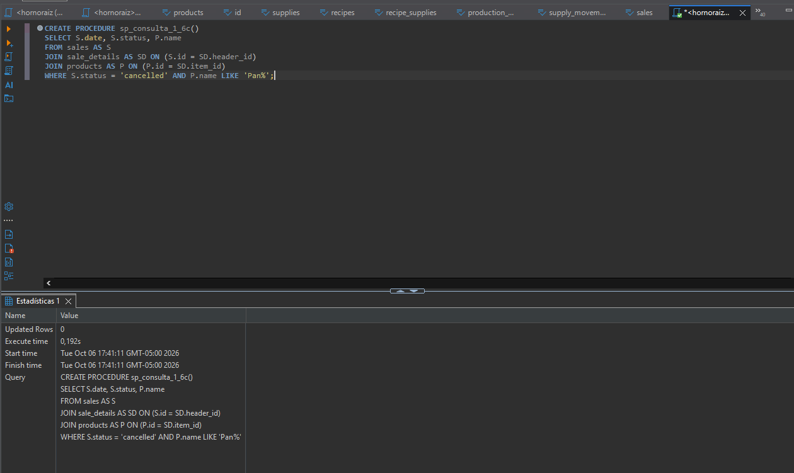

```sql
CALL sp_consulta_1_6c();
```

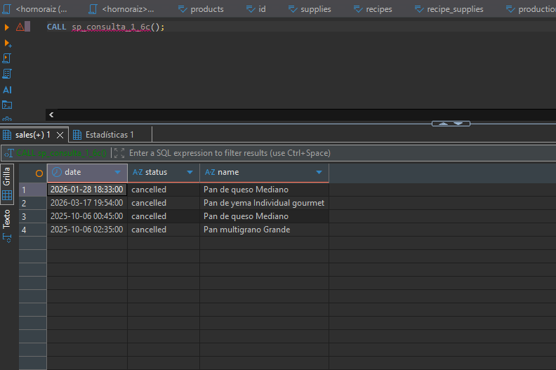

**Resultado:** 4 filas: `Pan de yema Individual gourmet` (17 de marzo de 2026), `Pan de queso Mediano` (28 de enero de 2026 y 6 de octubre de 2025) y `Pan multigrano Grande` (6 de octubre de 2025). De las 10 líneas canceladas, 4 son panes.

#### 1.14.7 Filtro con `BETWEEN` sobre cuatro tablas

**Narrativa:** responde "¿qué productos se vendieron y cómo se pagaron entre el 1 de junio de 2025 y el 30 de marzo de 2026?". Encadena `products`, `sale_details`, `sales` y `payments`. Como `payments.reference_id` apunta a la venta, la unión exige también `reference_type = 'sale'`. `BETWEEN` acota la fecha del pago y `ORDER BY` lo ordena de más antiguo a más reciente.

```sql
CREATE PROCEDURE sp_consulta_1_7()
SELECT P.name, P.sku, SD.quantity, SD.total, S.date, PAY.method
FROM products P
JOIN sale_details SD ON P.id = SD.item_id
JOIN sales S ON SD.header_id = S.id
JOIN payments PAY ON PAY.reference_id = S.id AND PAY.reference_type = 'sale'
WHERE PAY.date BETWEEN '2025-06-01 00:00:00' AND '2026-03-30 23:59:59'
ORDER BY PAY.date ASC;
```

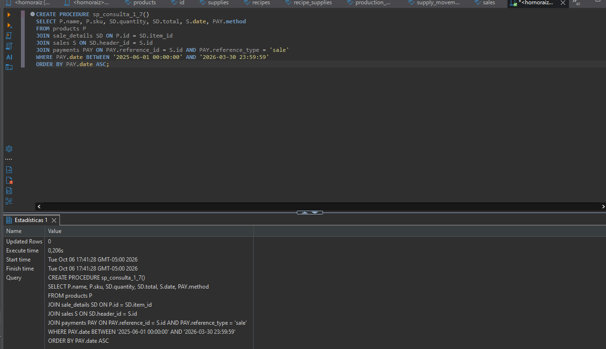

```sql
CALL sp_consulta_1_7();
```

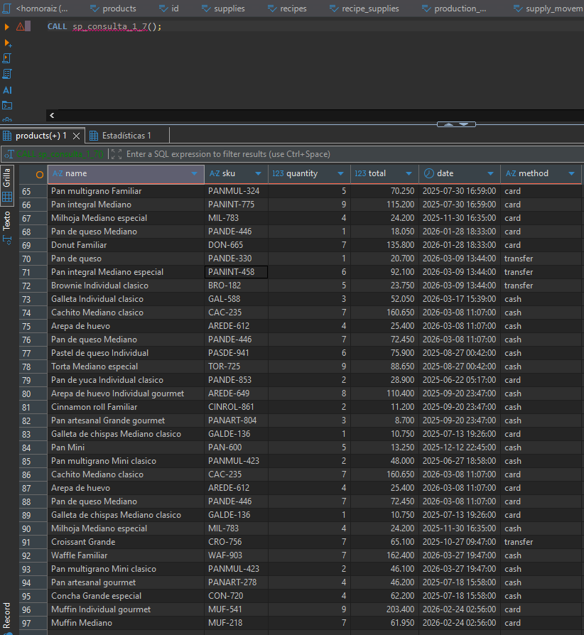

**Resultado:** 97 filas. Una misma línea de venta se repite cuando la venta tiene varios pagos, por ejemplo el `Pan de leche Mini` pagado en efectivo y con tarjeta. Es el resultado esperado de unir dos relaciones 1:N sobre la misma venta y no una duplicación de datos.

#### 1.14.8 Agrupamiento con `GROUP BY` y `HAVING`

**Narrativa:** tres resúmenes de pagos por venta con `SUM`, `COUNT` y `AVG`. Responden cuánto se pagó por cada venta, cuántos pagos fueron y cuál fue el promedio. Las dos primeras acotan las filas antes de agrupar con `WHERE`: la primera por rango de fechas y la segunda por estado y método de pago. La tercera filtra después de agrupar con `HAVING`, porque la condición depende de la suma ya calculada.

```sql
CREATE PROCEDURE sp_consulta_1_8a()
SELECT S.id, S.date, SUM(PAY.amount) AS total_paid, COUNT(PAY.id) AS payment_count, AVG(PAY.amount) AS avg_payment
FROM sales S
JOIN payments PAY ON PAY.reference_id = S.id AND PAY.reference_type = 'sale'
WHERE PAY.date BETWEEN '2025-06-01 00:00:00' AND '2026-03-30 23:59:59'
GROUP BY S.id, S.date
ORDER BY total_paid DESC;
```

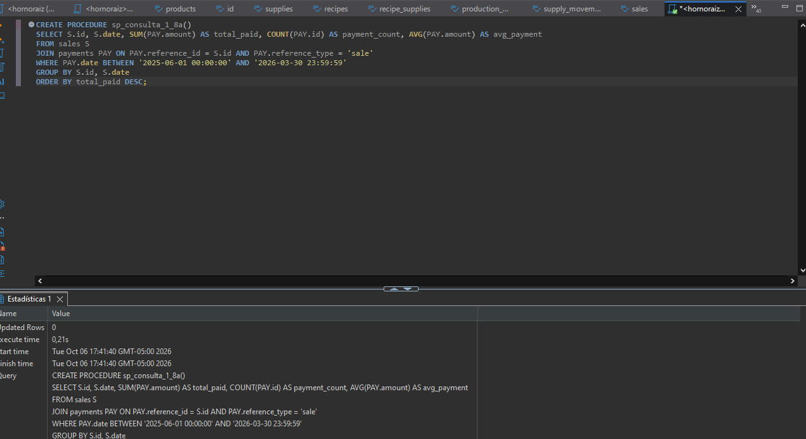

```sql
CALL sp_consulta_1_8a();
```

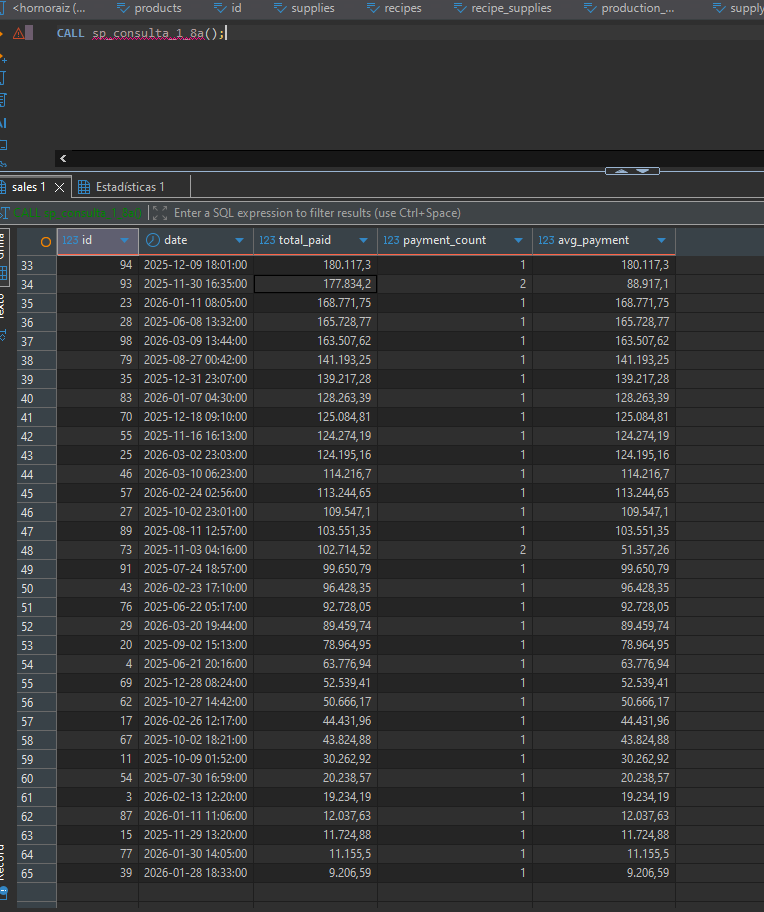

**Resultado:** 65 ventas con pagos en el rango. La venta 52 encabeza la lista con $942.692,25 repartidos en 6 pagos, y la última es la venta 39, con $9.206,59 en un solo pago.

```sql
CREATE PROCEDURE sp_consulta_1_8b()
SELECT S.id, S.date, SUM(PAY.amount) AS total_paid, COUNT(PAY.id) AS payment_count
FROM sales S
JOIN payments PAY ON PAY.reference_id = S.id AND PAY.reference_type = 'sale'
WHERE PAY.status = 'completed' AND PAY.method = 'card'
GROUP BY S.id, S.date
ORDER BY total_paid DESC;
```

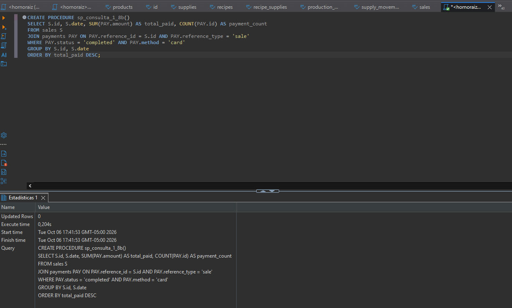

```sql
CALL sp_consulta_1_8b();
```

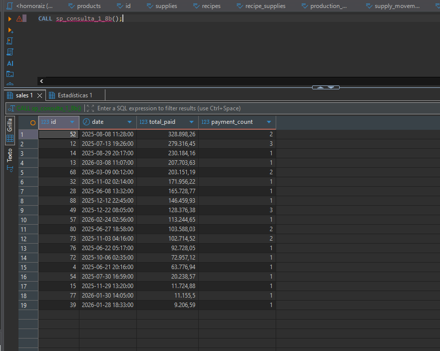

**Resultado:** 19 ventas tienen pagos con tarjeta ya completados. De nuevo encabeza la venta 52, con $328.898,26 en 2 pagos, de modo que un poco más de un tercio de lo cobrado en esa venta fue con tarjeta.

```sql
CREATE PROCEDURE sp_consulta_1_8c()
SELECT S.id, S.date, SUM(PAY.amount) AS total_paid, COUNT(PAY.id) AS payment_count
FROM sales S
JOIN payments PAY ON PAY.reference_id = S.id AND PAY.reference_type = 'sale'
GROUP BY S.id, S.date
HAVING SUM(PAY.amount) >= 100000
ORDER BY total_paid DESC;
```

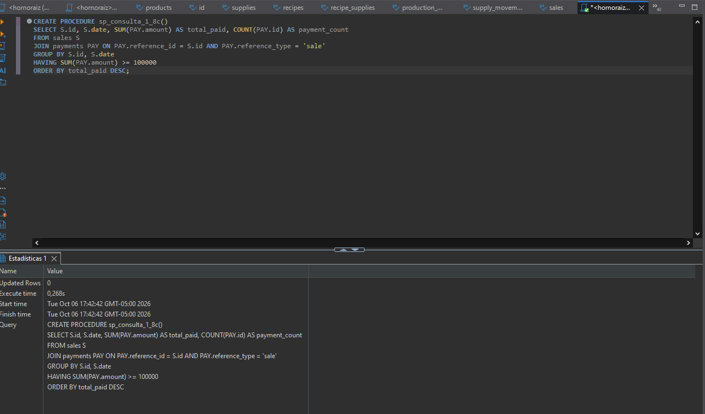

```sql
CALL sp_consulta_1_8c();
```

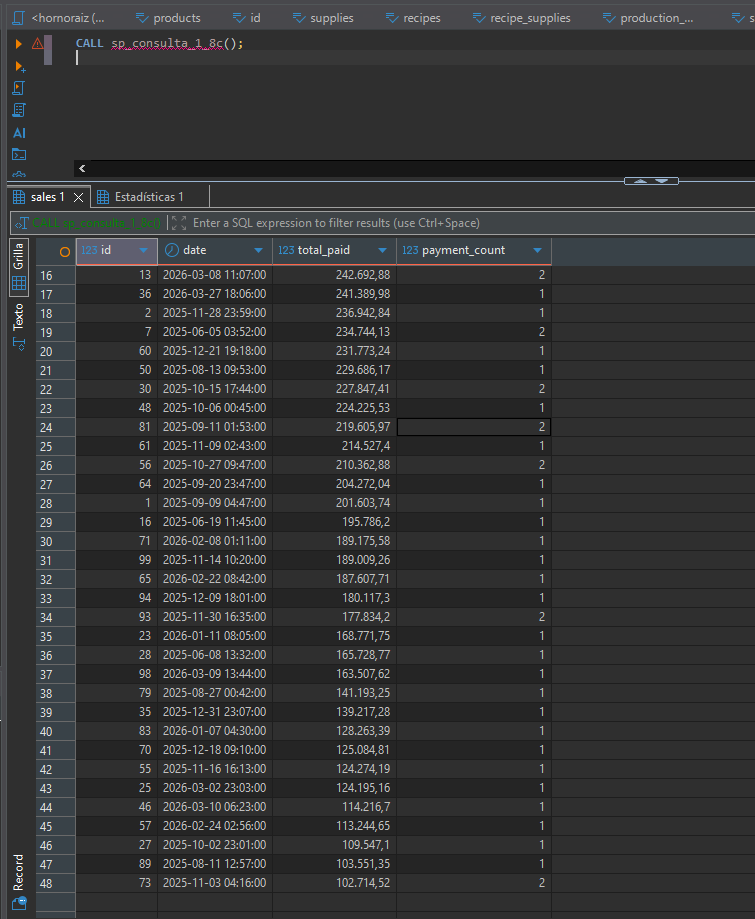

**Resultado:** 48 ventas acumulan $100.000 o más en pagos, y la venta 52 vuelve a ser la mayor, con $942.692,25 en 6 pagos. Esta consulta no lleva filtro de fechas, así que considera todos los pagos registrados.

#### 1.14.9 Subconsultas y teoría de conjuntos

**Narrativa:** responde "¿qué productos no se vendieron entre el 1 de junio de 2025 y el 30 de marzo de 2026?". Es una diferencia de conjuntos: todos los productos menos los que aparecen en alguna línea de venta del rango. La primera forma usa `NOT IN` con una subconsulta. La segunda usa `LEFT JOIN` con `WHERE S.id IS NULL`.

```sql
CREATE PROCEDURE sp_consulta_1_9a()
SELECT * FROM products AS P
WHERE P.id NOT IN (
  SELECT SD.item_id FROM sale_details SD
  JOIN sales S ON SD.header_id = S.id
  WHERE S.date BETWEEN '2025-06-01' AND '2026-03-30'
);
```

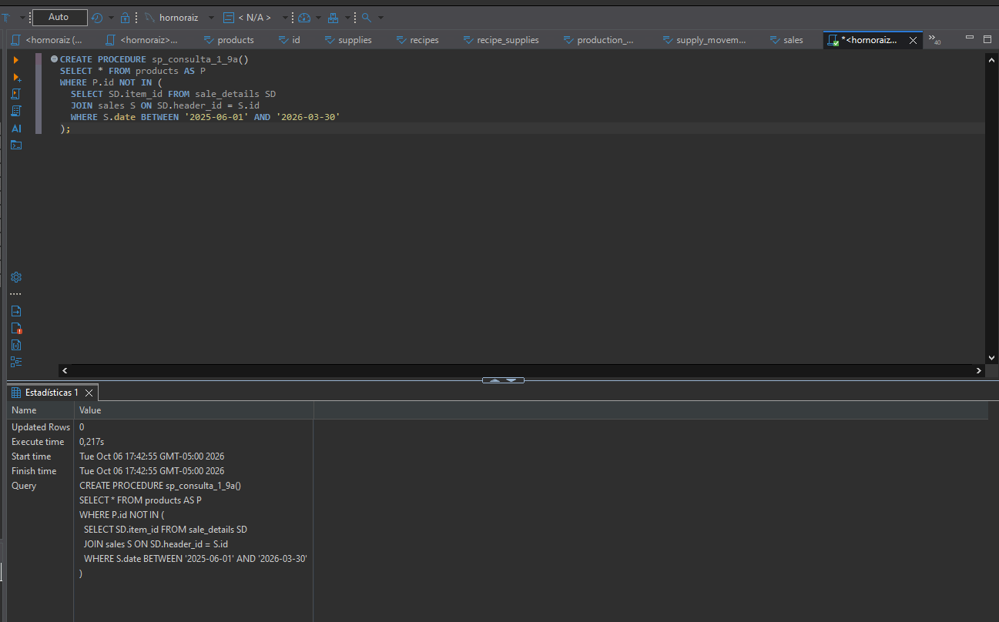

```sql
CALL sp_consulta_1_9a();
```

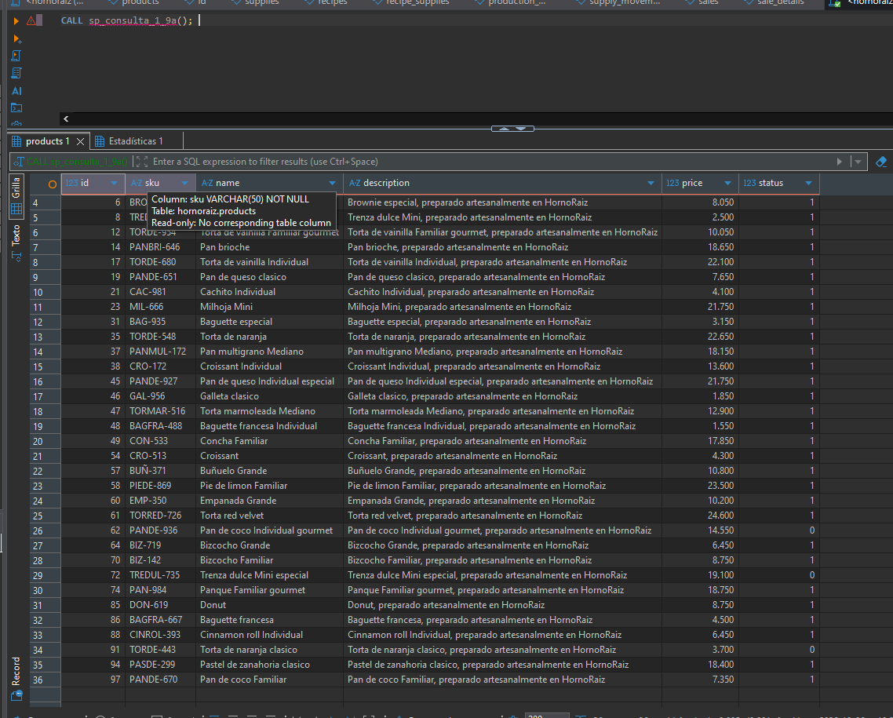

**Resultado:** 36 de los 100 productos no tuvieron ventas en el rango, y los otros 64 sí se vendieron al menos una vez.

```sql
CREATE PROCEDURE sp_consulta_1_9b()
SELECT * FROM products AS P
LEFT JOIN sale_details AS SD ON (P.id = SD.item_id)
LEFT JOIN sales AS S ON (SD.header_id = S.id AND S.date BETWEEN '2025-06-01' AND '2026-03-30')
WHERE S.id IS NULL;
```

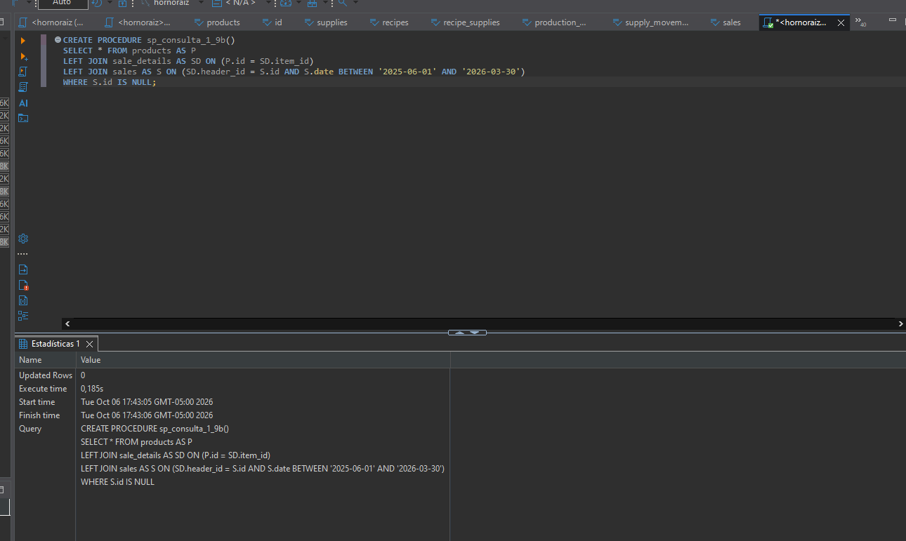

```sql
CALL sp_consulta_1_9b();
```

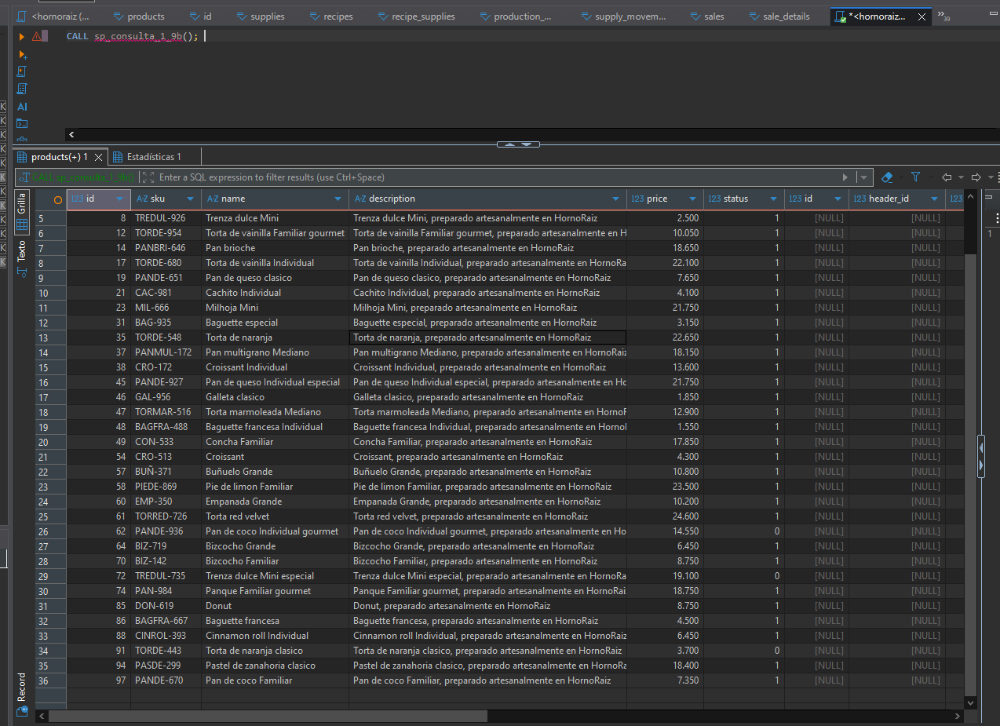

**Resultado:** los mismos 36 productos que la forma con `NOT IN`, lo que confirma que ambas expresiones de la diferencia de conjuntos son equivalentes.

### 1.15 Triggers de auditoría

Se crearon las tablas `products_audit` y `sales_audit`, que registran automáticamente cada inserción, actualización o eliminación sobre `products` y `sales`. Se eligieron estas dos tablas porque sus cambios pesan más en el negocio: el precio de un producto y el estado de una venta. Cada fila de auditoría guarda el estado anterior (`old_data`) y el posterior (`new_data`) en formato JSON, con la fecha del cambio.

Cada tabla de auditoría tiene tres triggers de registro (`AFTER INSERT`, `AFTER UPDATE` y `AFTER DELETE` sobre la tabla original) y tres de protección. Estos últimos bloquean cualquier `UPDATE` o `DELETE` sobre la tabla de auditoría y rechazan un `INSERT` directo que no venga de los triggers de registro. Para esto último, cada trigger de registro fija una variable de sesión (`@from_products_trigger` o `@from_sales_trigger`) antes de insertar y la limpia después. En total son 12 triggers.

**Incidente 3 — privilegio `SUPER`.** Al crear los primeros triggers con el usuario `admin`, MySQL respondió `ERROR 1419: You do not have the SUPER privilege and binary logging is enabled`. Con el registro binario activo, MySQL exige ese privilegio, que es de servidor y no de base de datos. Se resolvió entrando como `root` y activando `SET GLOBAL log_bin_trust_function_creators = 1;`.

**Creación por terminal.** Por el mismo motivo del incidente 1, los triggers con `BEGIN ... END` se crearon desde un archivo `.sql` ejecutado con el cliente `mysql` de la VPS, usando `DELIMITER $$`, y no desde DBeaver. Por eso los triggers aparecen con `Definer = root@localhost`.

```bash
docker exec -i mysql-server mysql -u root -p**** hornoraiz < ~/triggers_mysql.sql
```

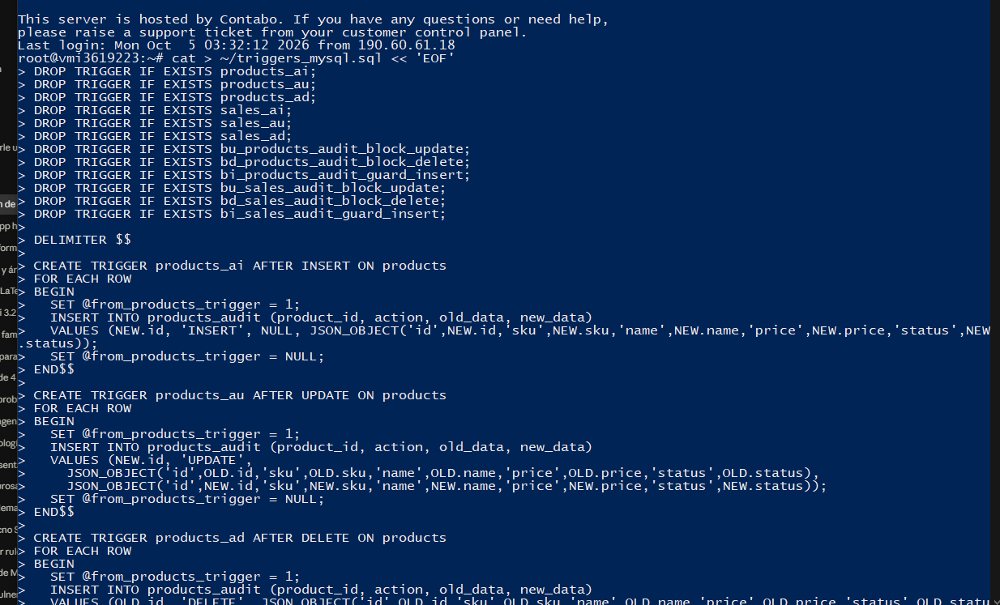

**Verificación en DBeaver.** `SHOW TRIGGERS` lista los 12 triggers: `products_ai`, `products_au`, `products_ad`, `sales_ai`, `sales_au`, `sales_ad` y los seis de protección (`bu_`, `bd_` y `bi_` para cada tabla de auditoría).

```sql
SHOW TRIGGERS;
```

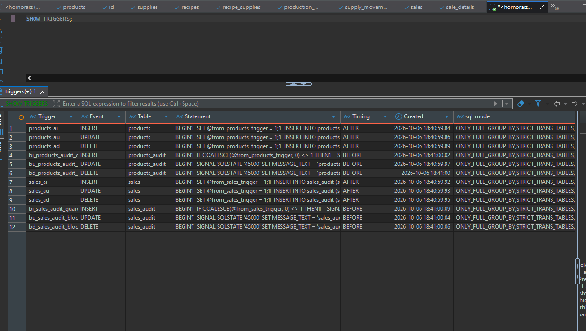

#### Prueba de `products_audit`

Se insertó un producto de prueba (`TEST-001`), se le cambió el precio y se borró. Se usó un producto nuevo para no alterar los datos de las consultas.

```sql
INSERT INTO products (sku, name, description, price, status) VALUES ('TEST-001','Producto de prueba','Prueba de auditoria',1000.00,1);
UPDATE products SET price = 1500.00 WHERE sku = 'TEST-001';
DELETE FROM products WHERE sku = 'TEST-001';
SELECT id, product_id, action, old_data, new_data FROM products_audit ORDER BY id DESC LIMIT 3;
```

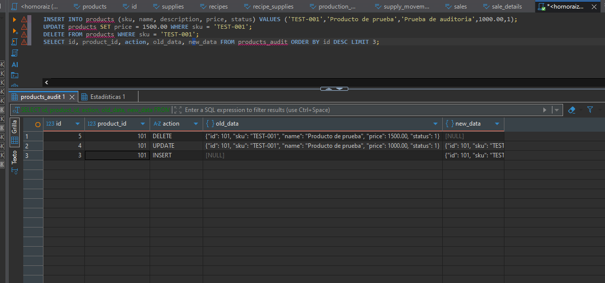

**Resultado:** se registraron las tres operaciones sobre el producto 101: el `INSERT` con precio 1000, el `UPDATE` con `old_data` en 1000 y `new_data` en 1500, y el `DELETE` con el estado final (precio 1500). La tabla conserva además filas anteriores de las primeras pruebas, porque su historial no se puede borrar.

#### Prueba de `sales_audit`

```sql
INSERT INTO sales (client_id, date, subtotal, taxes, total, status) VALUES (NULL, NOW(), 1000.00, 190.00, 1190.00, 'pending');
SET @sid = LAST_INSERT_ID();
UPDATE sales SET status = 'paid' WHERE id = @sid;
DELETE FROM sales WHERE id = @sid;
SELECT id, sale_id, action, old_data, new_data FROM sales_audit ORDER BY id DESC LIMIT 3;
```

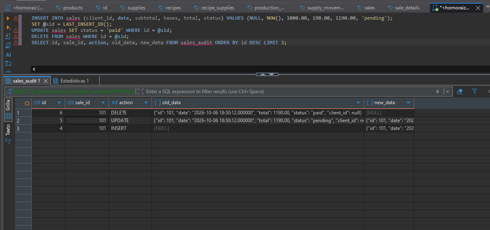

**Resultado:** para la venta 101 quedaron el `INSERT` en `pending`, el `UPDATE` de `pending` a `paid` y el `DELETE` con el último estado. La auditoría capta el cambio de estado de la venta, que es el dato que más interesa.

#### Pruebas de inmutabilidad

Se intentó alterar las tablas de auditoría. Las cuatro operaciones fueron rechazadas por los triggers de protección, con el error `1644` (`SQLSTATE 45000`):

```sql
UPDATE products_audit SET action = 'X' WHERE id = 1;
DELETE FROM products_audit WHERE id = 1;
INSERT INTO products_audit (product_id, action, old_data, new_data) VALUES (999,'INSERT',NULL,NULL);
UPDATE sales_audit SET action = 'X' WHERE id = 1;
```

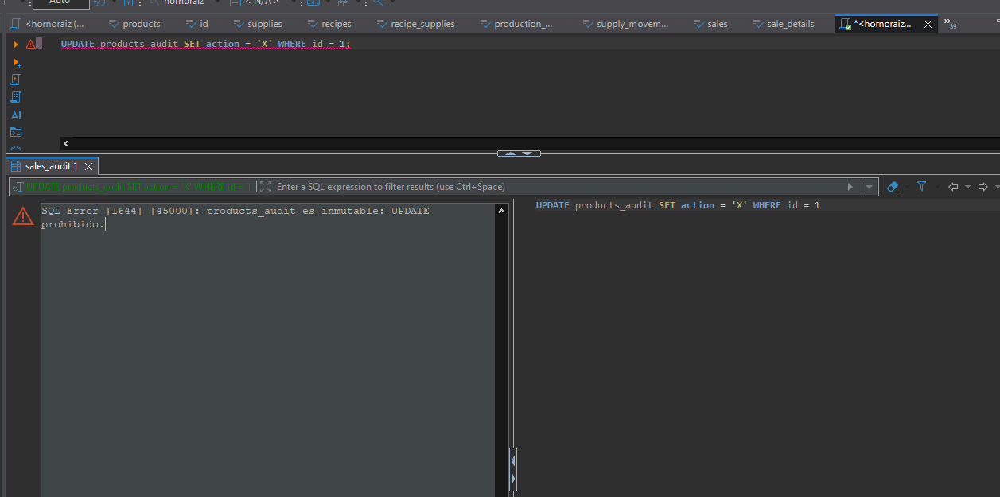

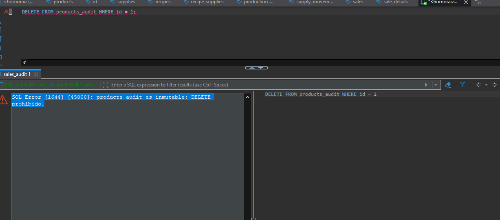

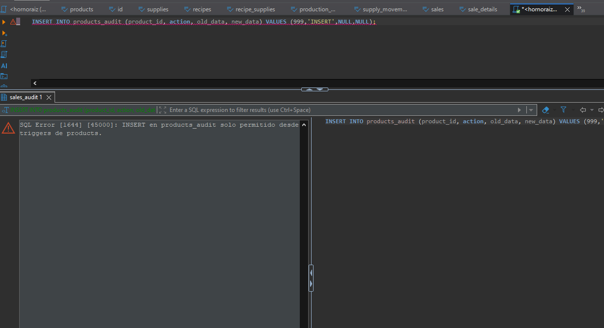

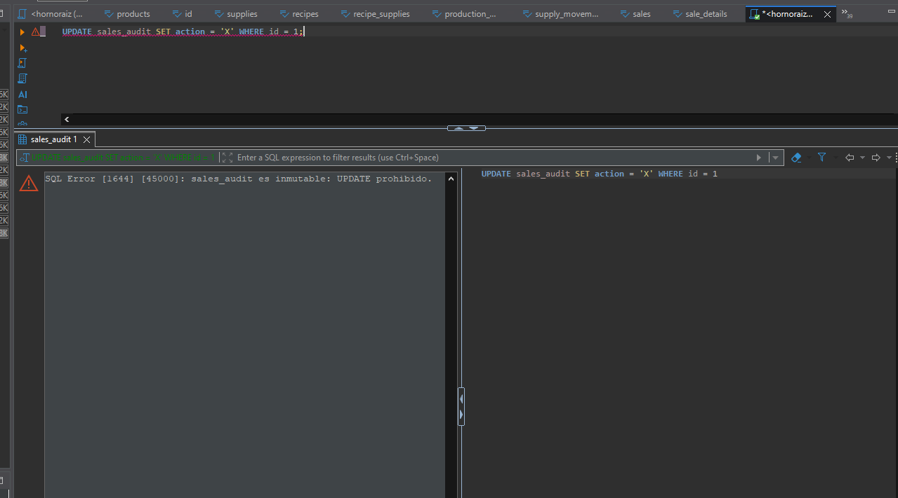

**Resultado:** los mensajes fueron `products_audit es inmutable: UPDATE prohibido.`, `products_audit es inmutable: DELETE prohibido.`, `INSERT en products_audit solo permitido desde triggers de products.` y `sales_audit es inmutable: UPDATE prohibido.`. Al final, `products` y `sales` quedaron con 100 filas cada una, igual que antes de las pruebas.

**Limitación.** La sentencia `TRUNCATE TABLE` no dispara triggers en MySQL, así que no queda cubierta por esta protección. Para cerrar ese hueco habría que quitarles el privilegio `DROP`/`TRUNCATE` sobre las tablas de auditoría a los usuarios que no sean administradores.

### 2.15 Procedimientos almacenados

Las 15 consultas de la sección 2.14 se llevaron a procedimientos almacenados con el nombre `sp_consulta_<número>`, igual que en MySQL.

**Diferencia con MySQL.** En PostgreSQL un `PROCEDURE` no devuelve filas por sí solo: la forma de devolver un resultado, `RETURN QUERY`, es propia de las funciones. Como la actividad pide procedimientos y no funciones, cada procedimiento recibe un parámetro `INOUT c refcursor`, abre un cursor con la consulta y lo deja disponible. El resultado se lee con `FETCH ALL FROM c` dentro de la misma transacción:

```sql
BEGIN; CALL sp_consulta_1_1('c'); FETCH ALL FROM c; COMMIT;
```

Se descartó `FUNCTION ... RETURNS TABLE` porque exige declarar cada columna de salida, y varias consultas son `SELECT *` sobre dos o tres tablas, con columnas repetidas (`id`, `total`, `status`). Con el cursor esas consultas se conservan tal cual.

Los 15 procedimientos se crearon uno por uno y quedaron registrados en el catálogo del sistema:

```sql
SELECT proname FROM pg_proc WHERE proname LIKE 'sp_consulta%' ORDER BY 1;
```

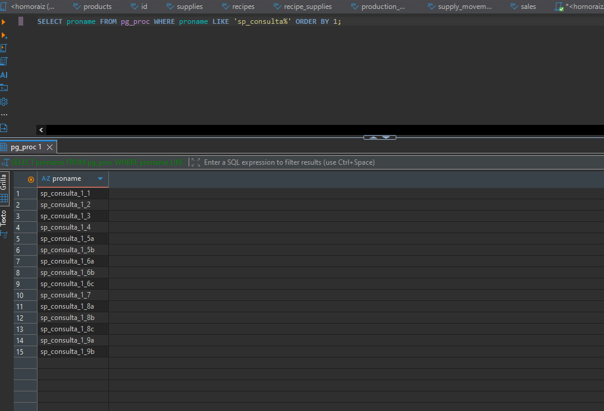

#### 2.15.1 Mostrar algunos de los registros de `products`

**Narrativa:** es el punto de partida para comprobar que el catálogo se cargó completo. Proyecta solo `sku`, `name`, `price` y `status`, en vez de traer la tabla entera. En PostgreSQL `status` es un `boolean` nativo, así que se ve como `true` o `false`.

```sql
CREATE OR REPLACE PROCEDURE sp_consulta_1_1(INOUT c refcursor) LANGUAGE plpgsql AS $$
BEGIN
  OPEN c FOR SELECT sku, name, price, status FROM products;
END;
$$;
```

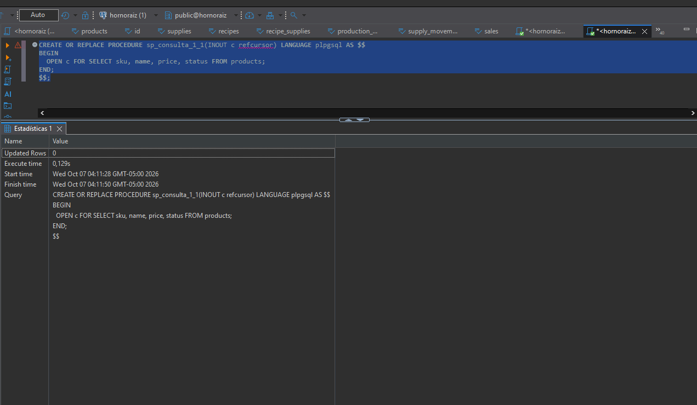

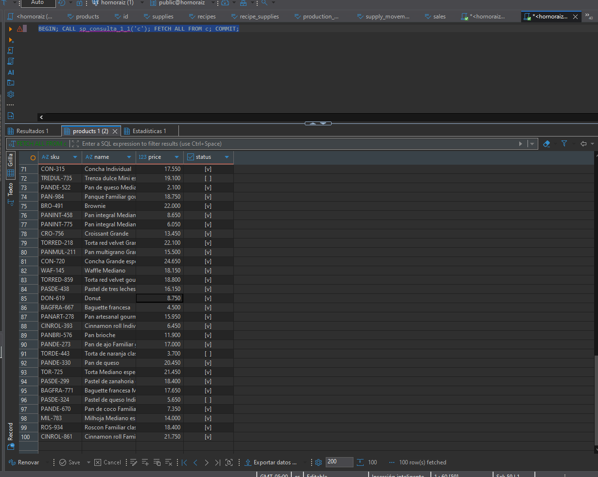

**Resultado:** devolvió 100 productos: 90 con `status = true` y 10 con `false`, las mismas proporciones de los otros motores. `CIA-859` aparece a $7.950.

#### 2.15.2 Ventas ordenadas de la más reciente a la más antigua

**Narrativa:** responde "¿qué se vendió últimamente?". Usa `ORDER BY date DESC` sobre `sales`, de modo que la primera fila sea la venta más nueva.

```sql
CREATE OR REPLACE PROCEDURE sp_consulta_1_2(INOUT c refcursor) LANGUAGE plpgsql AS $$
BEGIN
  OPEN c FOR SELECT id, date, subtotal, status FROM sales ORDER BY date DESC;
END;
$$;
```

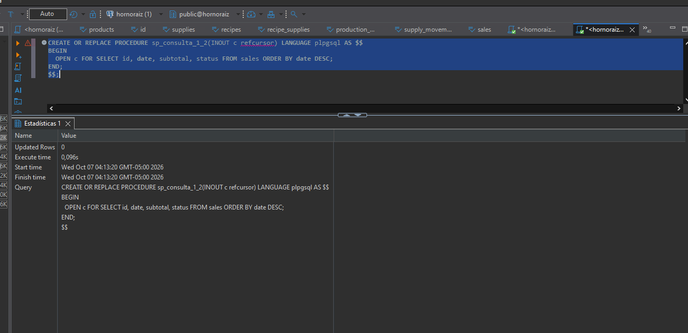

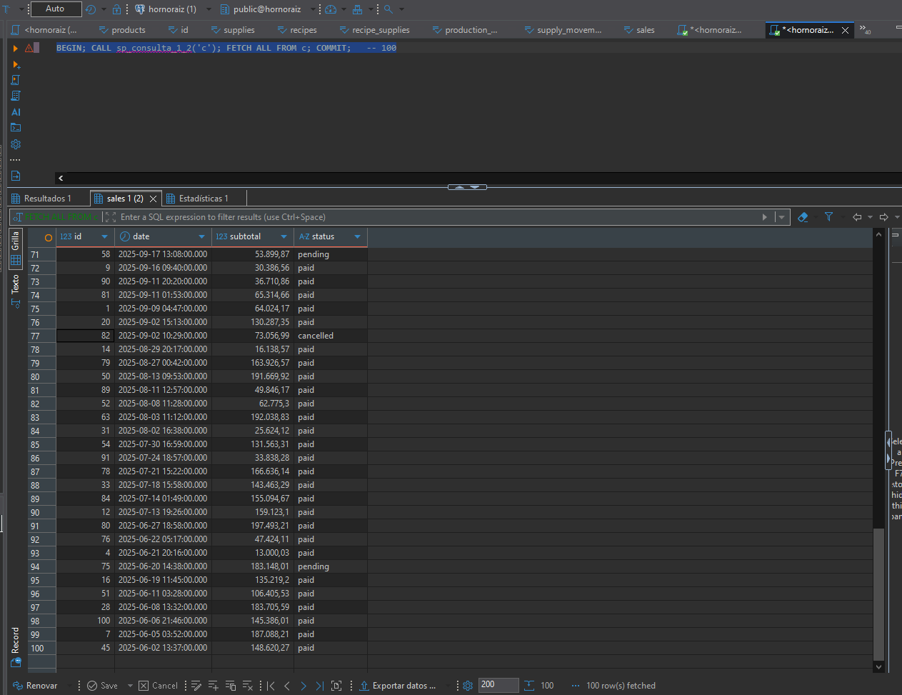

**Resultado:** devolvió las 100 ventas, de la venta 10 (27 de marzo de 2026, pendiente) a la venta 45 (2 de junio de 2025). El orden es el mismo que en MySQL. Aquí la fecha se muestra como `timestamp` con milisegundos (`.000`).

#### 2.15.3 Ventas con sus líneas de detalle, relación en `WHERE`

**Narrativa:** relaciona cada línea de `sale_details` con su venta mediante `S.id = SD.header_id` en el `WHERE`. Muestra qué productos y cantidades componen cada venta.

```sql
CREATE OR REPLACE PROCEDURE sp_consulta_1_3(INOUT c refcursor) LANGUAGE plpgsql AS $$
BEGIN
  OPEN c FOR SELECT * FROM sale_details SD, sales S WHERE S.id = SD.header_id;
END;
$$;
```

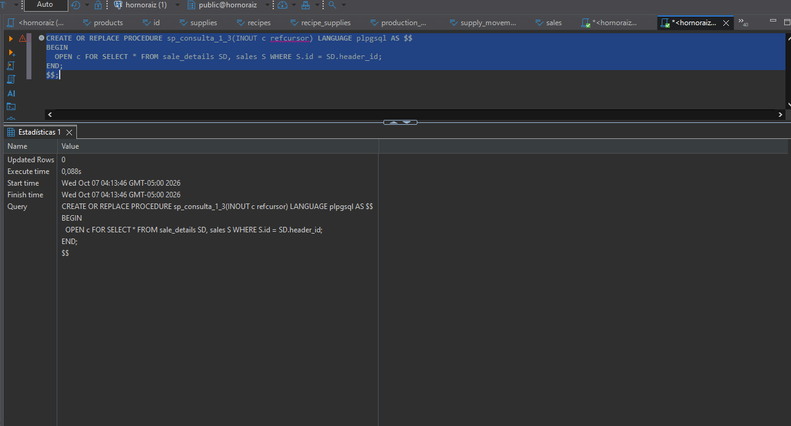

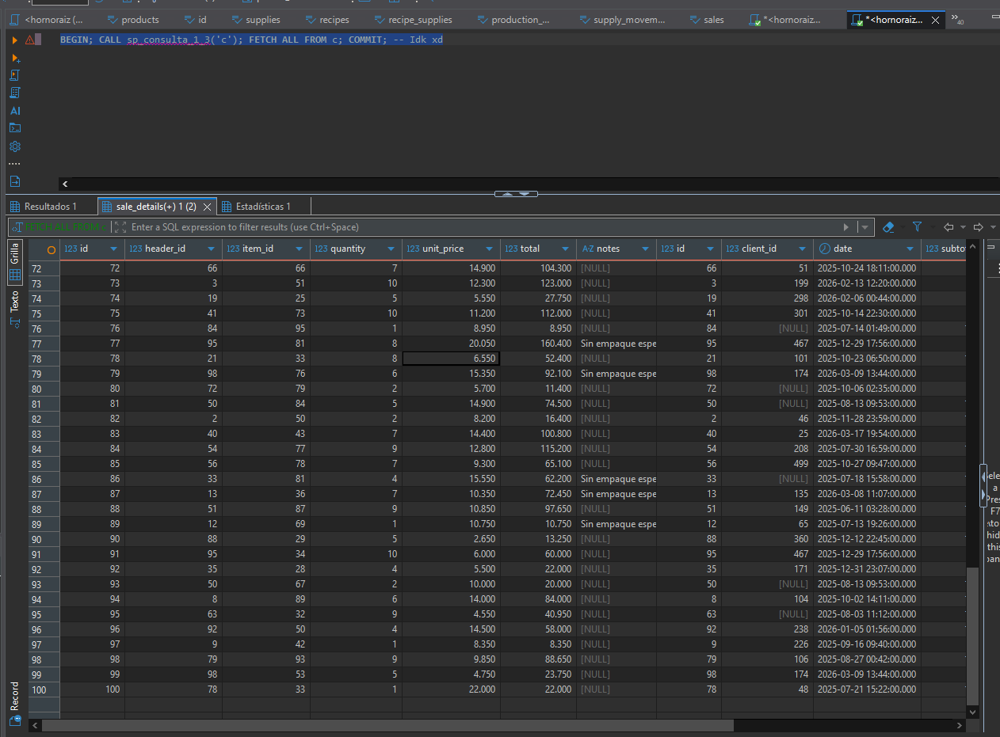

**Resultado:** 100 filas, una por línea de detalle, con las columnas de `sale_details` y de `sales` juntas (`id`, `total` y `status` aparecen dos veces, una por tabla). Ninguna línea quedó sin venta.

#### 2.15.4 Ventas con sus líneas de detalle, relación con `JOIN`

**Narrativa:** la misma pregunta que la 2.15.3, resuelta con `JOIN ... ON`. Proyecta de `sales` solo la fecha y el estado, y de `sale_details` todas las columnas.

```sql
CREATE OR REPLACE PROCEDURE sp_consulta_1_4(INOUT c refcursor) LANGUAGE plpgsql AS $$
BEGIN
  OPEN c FOR SELECT S.date, S.status, SD.* FROM sales AS S JOIN sale_details AS SD ON (S.id = SD.header_id);
END;
$$;
```

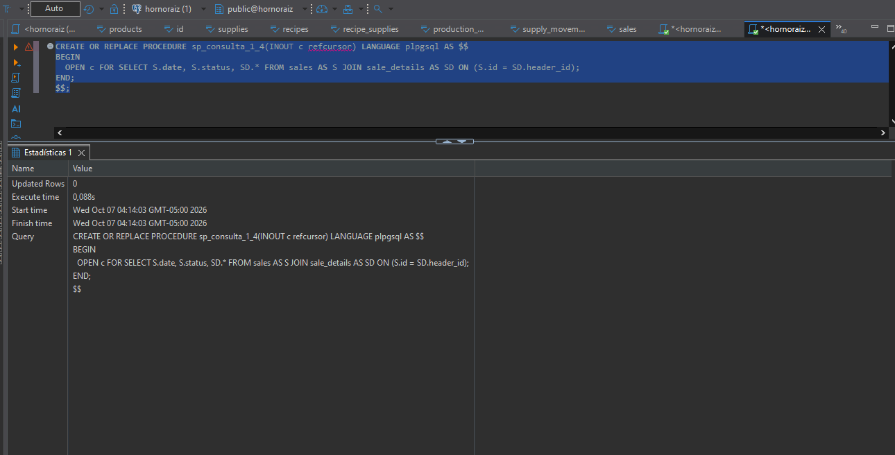

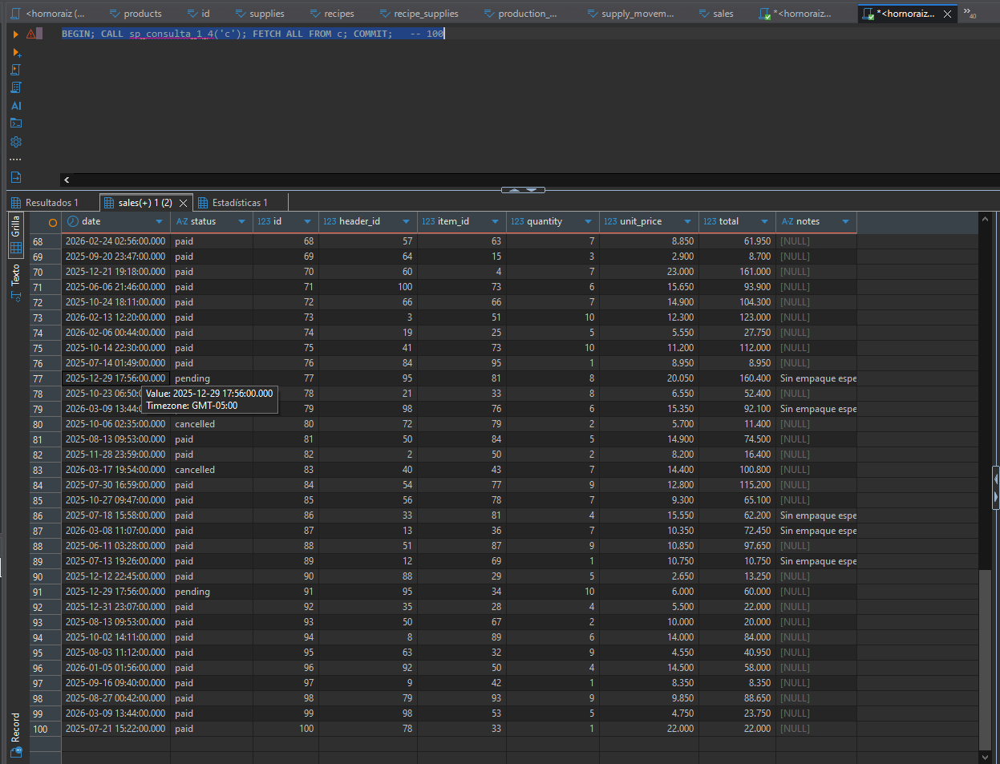

**Resultado:** las mismas 100 filas que el procedimiento anterior, lo que confirma que ambas sintaxis son equivalentes.

#### 2.15.5 Filtro por estado de la venta

**Narrativa:** reparte las líneas de detalle según el estado de su venta. El estado se filtra en `sales`, porque `sale_details` no tiene columna `status`. La primera usa la relación en `WHERE` y mide las ventas pagadas. La segunda usa `JOIN` y aísla las canceladas.

```sql
CREATE OR REPLACE PROCEDURE sp_consulta_1_5a(INOUT c refcursor) LANGUAGE plpgsql AS $$
BEGIN
  OPEN c FOR SELECT * FROM sale_details SD, sales S WHERE S.id = SD.header_id AND S.status = 'paid';
END;
$$;
```

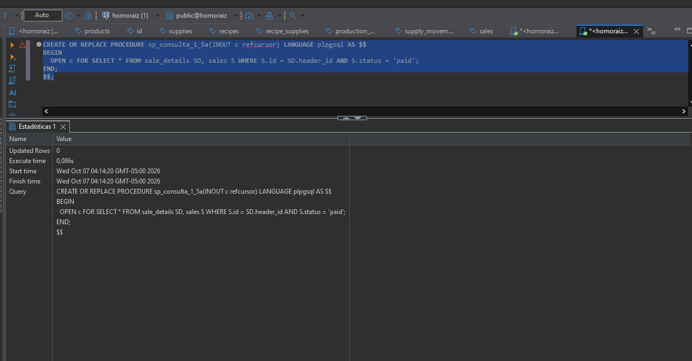

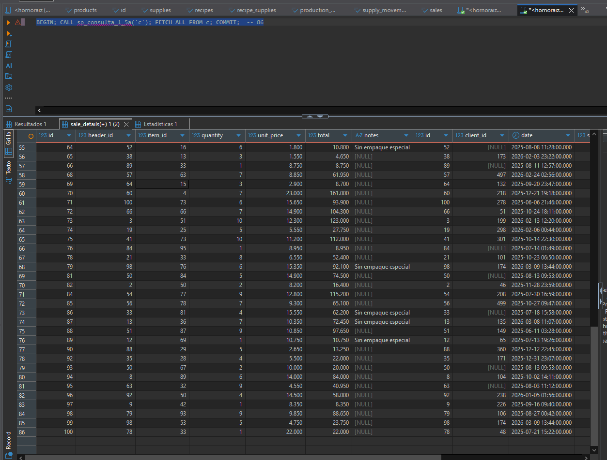

**Resultado:** 86 de las 100 líneas (86 %) pertenecen a ventas pagadas.

```sql
CREATE OR REPLACE PROCEDURE sp_consulta_1_5b(INOUT c refcursor) LANGUAGE plpgsql AS $$
BEGIN
  OPEN c FOR SELECT S.date, S.status, SD.* FROM sales AS S JOIN sale_details AS SD ON (S.id = SD.header_id) WHERE S.status = 'cancelled';
END;
$$;
```

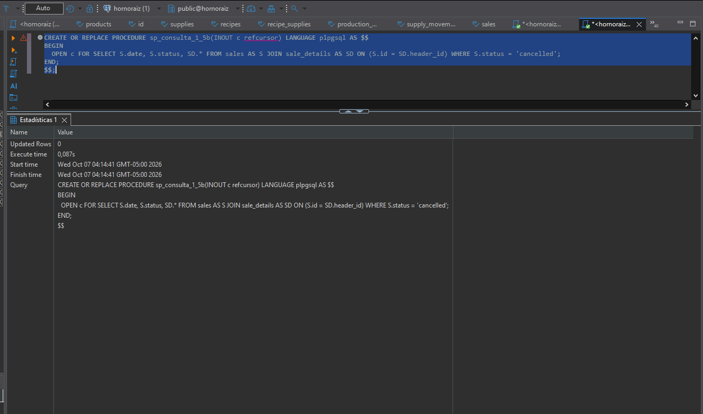

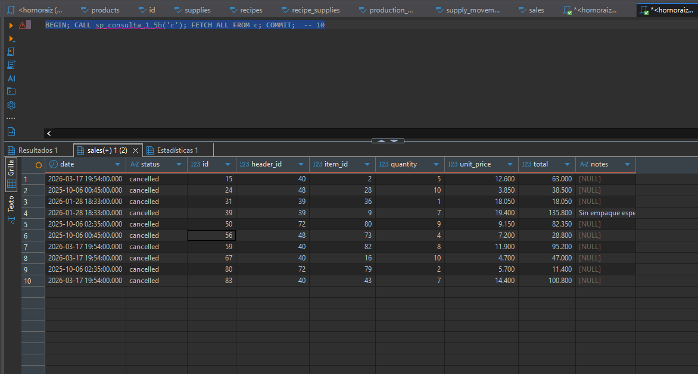

**Resultado:** 10 líneas, que corresponden a 4 ventas canceladas (39, 40, 48 y 72). Las 4 líneas restantes pertenecen a ventas pendientes.

#### 2.15.6 Filtros con `LIKE`

**Narrativa:** tres búsquedas por patrón de texto. La primera lista los productos cuyo nombre empieza por "Pan". La segunda busca la palabra "chocolate" en cualquier posición de la descripción, con el patrón armado por `CONCAT`. La tercera combina el texto con el estado de la venta, para ver qué productos "Pan" se cancelaron. En PostgreSQL `LIKE` distingue mayúsculas de minúsculas, y los nombres del catálogo empiezan siempre en mayúscula, por lo que el patrón `'Pan%'` es suficiente.

```sql
CREATE OR REPLACE PROCEDURE sp_consulta_1_6a(INOUT c refcursor) LANGUAGE plpgsql AS $$
BEGIN
  OPEN c FOR SELECT * FROM products AS P WHERE P.name LIKE 'Pan%';
END;
$$;
```

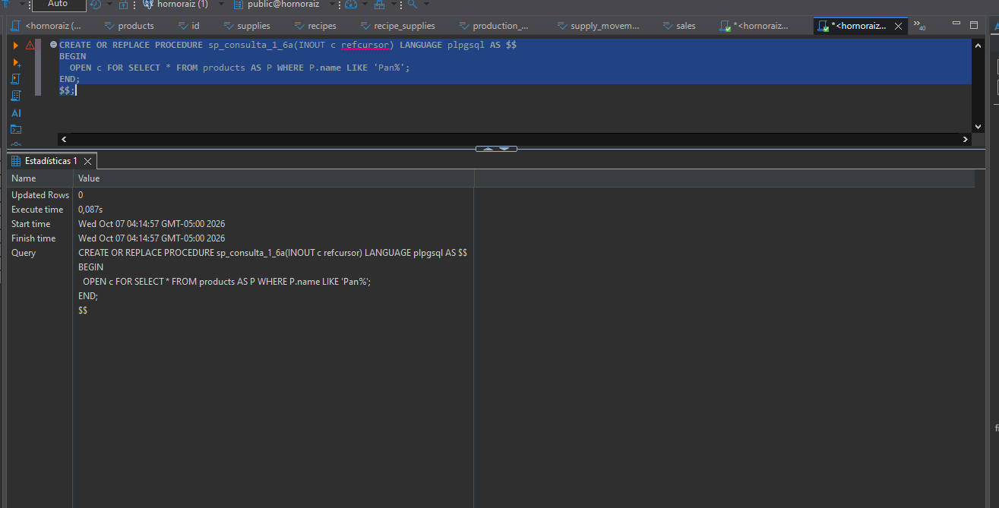

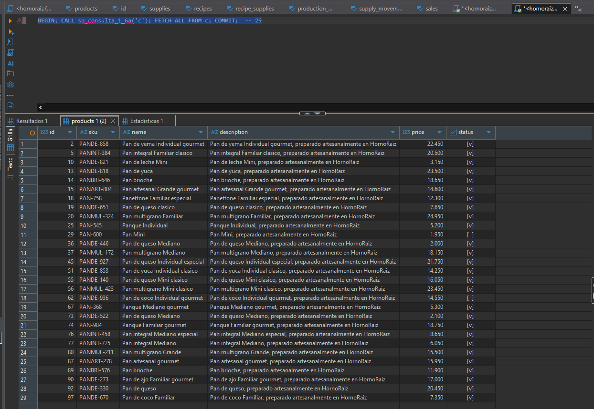

**Resultado:** 29 productos. El patrón incluye también Panettone y Panque, porque solo exige que el nombre comience por "Pan". Dos están inactivos: `PAN-600` y `PANDE-936`.

```sql
CREATE OR REPLACE PROCEDURE sp_consulta_1_6b(INOUT c refcursor) LANGUAGE plpgsql AS $$
BEGIN
  OPEN c FOR SELECT * FROM products AS P WHERE P.description LIKE CONCAT('%','chocolate','%');
END;
$$;
```

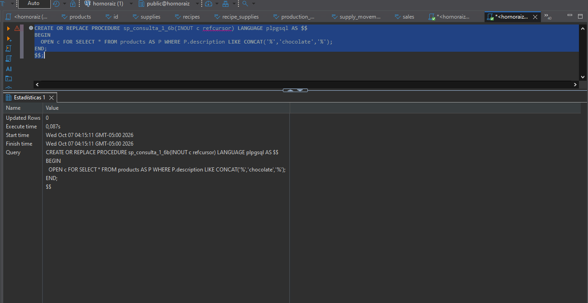

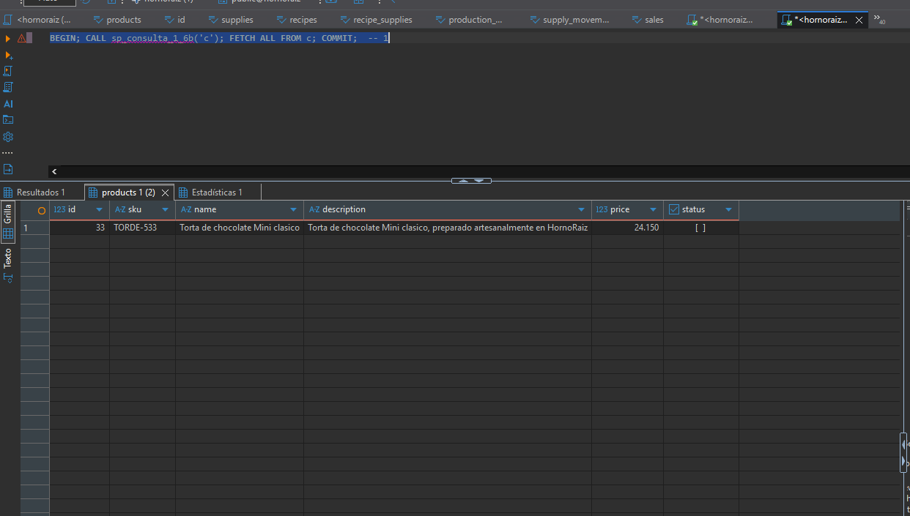

**Resultado:** un solo producto, `Torta de chocolate Mini clasico` (`TORDE-533`, $24.150), que además está inactivo.

```sql
CREATE OR REPLACE PROCEDURE sp_consulta_1_6c(INOUT c refcursor) LANGUAGE plpgsql AS $$
BEGIN
  OPEN c FOR SELECT S.date, S.status, P.name
    FROM sales AS S
    JOIN sale_details AS SD ON (S.id = SD.header_id)
    JOIN products AS P ON (P.id = SD.item_id)
    WHERE S.status = 'cancelled' AND P.name LIKE 'Pan%';
END;
$$;
```

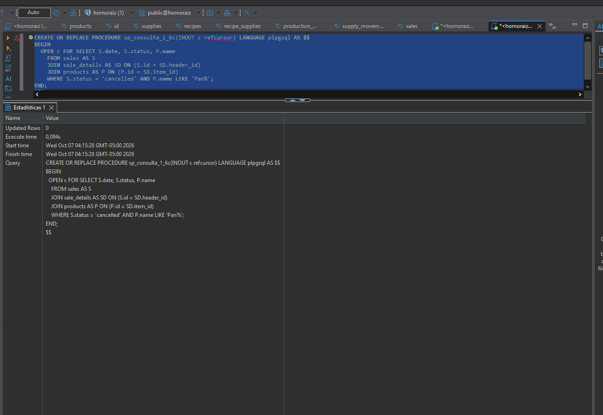

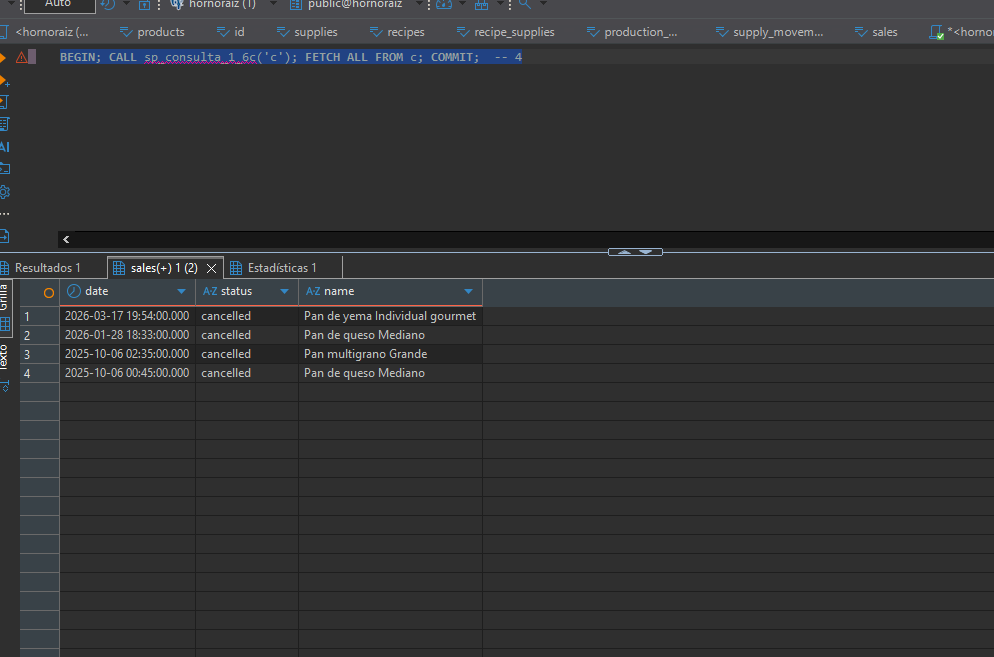

**Resultado:** 4 filas: `Pan de yema Individual gourmet`, dos de `Pan de queso Mediano` y `Pan multigrano Grande`. De las 10 líneas canceladas, 4 son panes.

#### 2.15.7 Filtro con `BETWEEN` sobre cuatro tablas

**Narrativa:** responde "¿qué productos se vendieron y cómo se pagaron entre el 1 de junio de 2025 y el 30 de marzo de 2026?". Encadena `products`, `sale_details`, `sales` y `payments`. Como `payments.reference_id` apunta a la venta, la unión exige también `reference_type = 'sale'`. `BETWEEN` acota la fecha del pago.

```sql
CREATE OR REPLACE PROCEDURE sp_consulta_1_7(INOUT c refcursor) LANGUAGE plpgsql AS $$
BEGIN
  OPEN c FOR SELECT P.name, P.sku, SD.quantity, SD.total, S.date, PAY.method
    FROM products P
    JOIN sale_details SD ON P.id = SD.item_id
    JOIN sales S ON SD.header_id = S.id
    JOIN payments PAY ON PAY.reference_id = S.id AND PAY.reference_type = 'sale'
    WHERE PAY.date BETWEEN '2025-06-01 00:00:00' AND '2026-03-30 23:59:59'
    ORDER BY PAY.date ASC;
END;
$$;
```

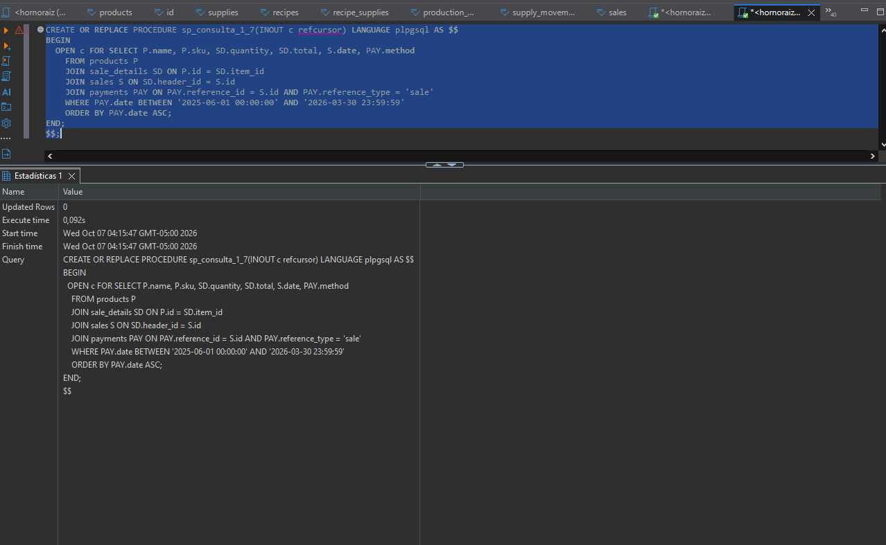

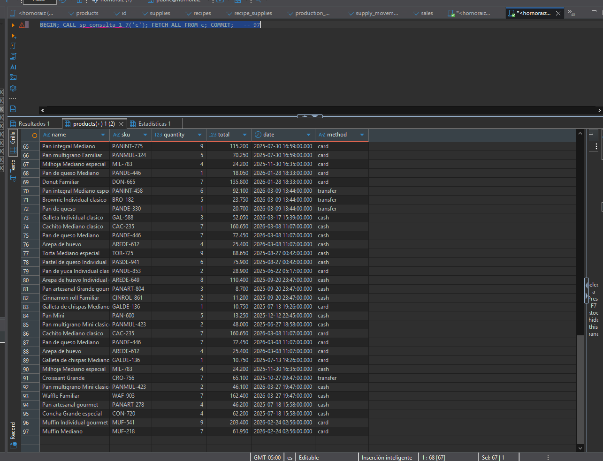

**Resultado:** 97 filas. Una misma línea de venta se repite cuando la venta tiene varios pagos, por ejemplo el `Pan de leche Mini` pagado en efectivo y con tarjeta. Es el resultado esperado de unir dos relaciones 1:N sobre la misma venta.

#### 2.15.8 Agrupamiento con `GROUP BY` y `HAVING`

**Narrativa:** tres resúmenes de pagos por venta con `SUM`, `COUNT` y `AVG`. Responden cuánto se pagó por cada venta, cuántos pagos fueron y cuál fue el promedio. Las dos primeras acotan las filas con `WHERE` antes de agrupar: la primera por rango de fechas y la segunda por estado y método de pago. La tercera filtra con `HAVING` después de agrupar, porque la condición depende de la suma ya calculada.

```sql
CREATE OR REPLACE PROCEDURE sp_consulta_1_8a(INOUT c refcursor) LANGUAGE plpgsql AS $$
BEGIN
  OPEN c FOR SELECT S.id, S.date, SUM(PAY.amount) AS total_paid, COUNT(PAY.id) AS payment_count, AVG(PAY.amount) AS avg_payment
    FROM sales S
    JOIN payments PAY ON PAY.reference_id = S.id AND PAY.reference_type = 'sale'
    WHERE PAY.date BETWEEN '2025-06-01 00:00:00' AND '2026-03-30 23:59:59'
    GROUP BY S.id, S.date
    ORDER BY total_paid DESC;
END;
$$;
```

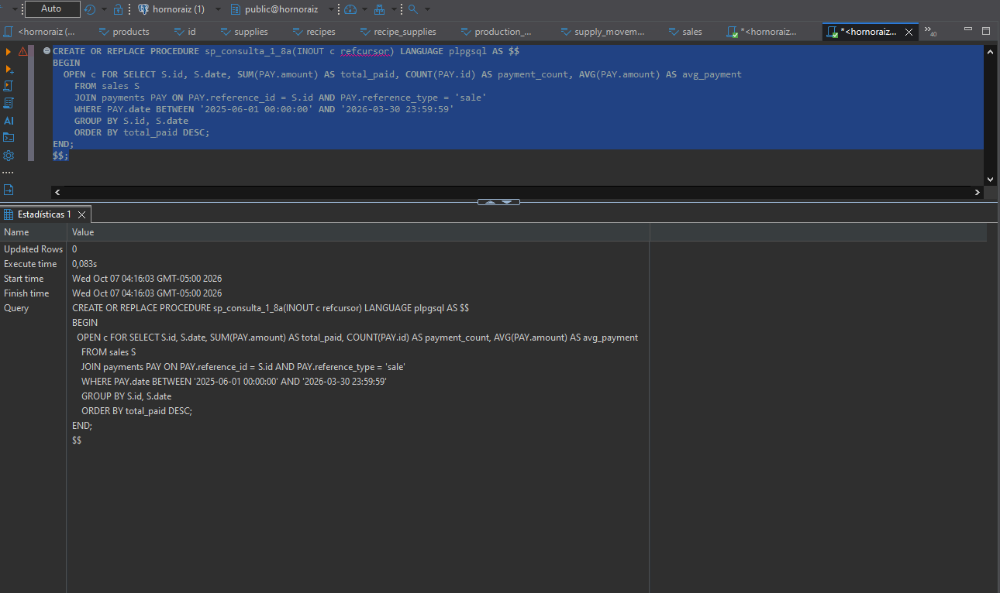

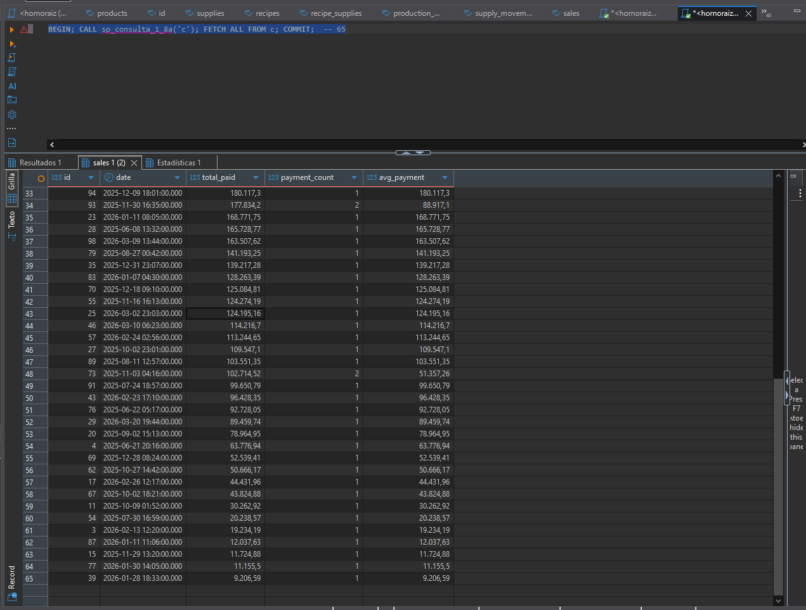

**Resultado:** 65 ventas con pagos en el rango. La venta 52 encabeza con $942.692,25 en 6 pagos. La columna `avg_payment` muestra más decimales que en MySQL, porque `AVG` sobre `NUMERIC` en PostgreSQL conserva la precisión completa.

```sql
CREATE OR REPLACE PROCEDURE sp_consulta_1_8b(INOUT c refcursor) LANGUAGE plpgsql AS $$
BEGIN
  OPEN c FOR SELECT S.id, S.date, SUM(PAY.amount) AS total_paid, COUNT(PAY.id) AS payment_count
    FROM sales S
    JOIN payments PAY ON PAY.reference_id = S.id AND PAY.reference_type = 'sale'
    WHERE PAY.status = 'completed' AND PAY.method = 'card'
    GROUP BY S.id, S.date
    ORDER BY total_paid DESC;
END;
$$;
```

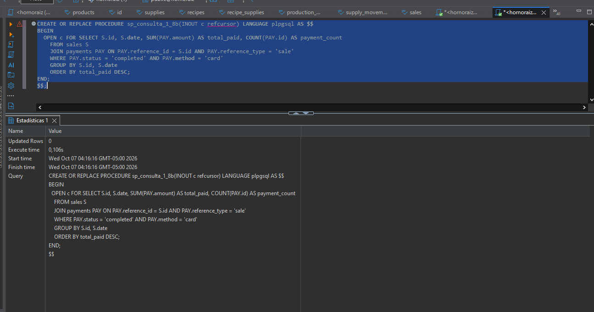

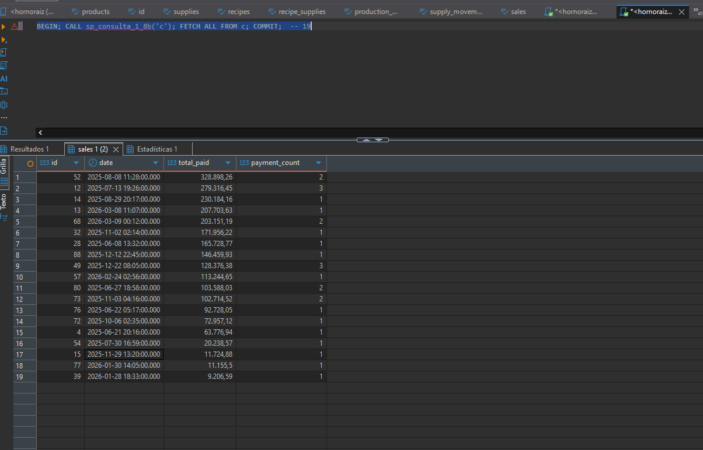

**Resultado:** 19 ventas tienen pagos con tarjeta ya completados. La venta 52 vuelve a encabezar, con $328.898,26 en 2 pagos.

```sql
CREATE OR REPLACE PROCEDURE sp_consulta_1_8c(INOUT c refcursor) LANGUAGE plpgsql AS $$
BEGIN
  OPEN c FOR SELECT S.id, S.date, SUM(PAY.amount) AS total_paid, COUNT(PAY.id) AS payment_count
    FROM sales S
    JOIN payments PAY ON PAY.reference_id = S.id AND PAY.reference_type = 'sale'
    GROUP BY S.id, S.date
    HAVING SUM(PAY.amount) >= 100000
    ORDER BY total_paid DESC;
END;
$$;
```

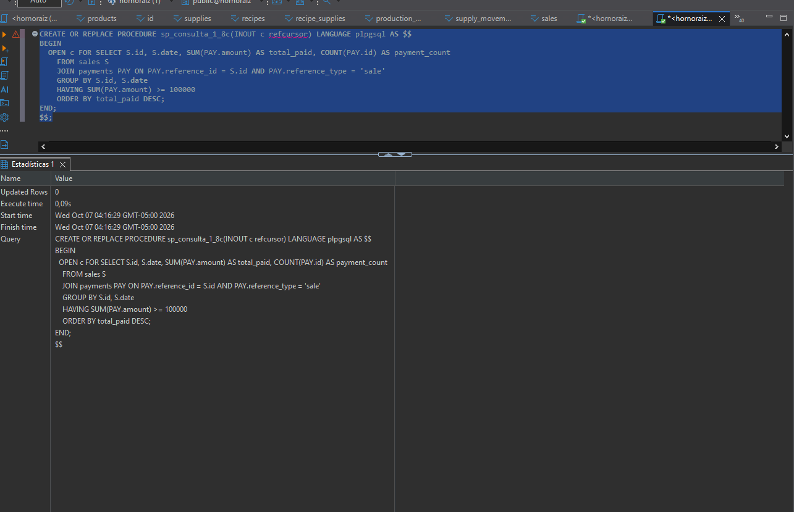

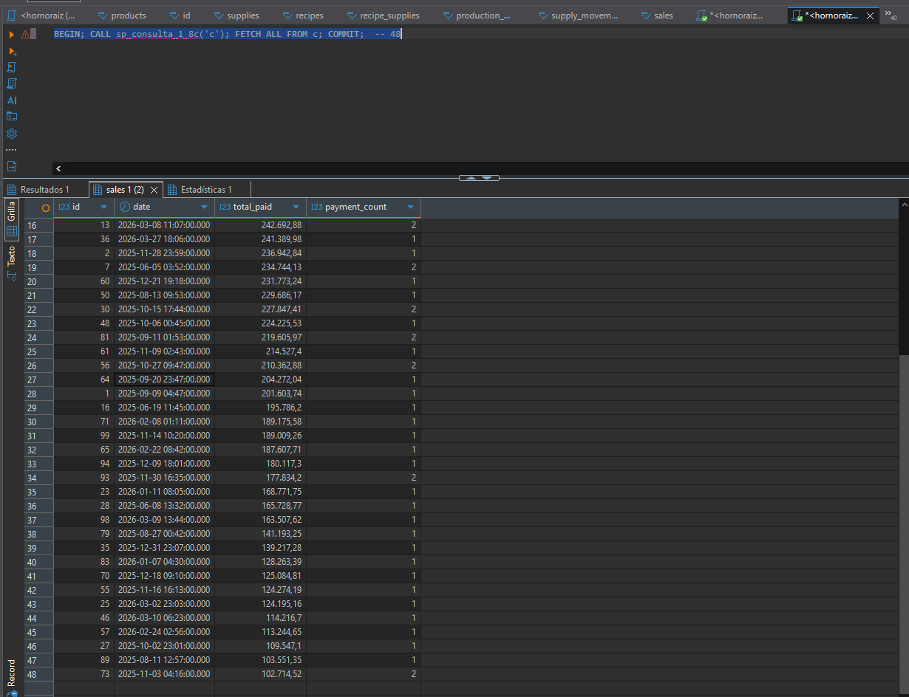

**Resultado:** 48 ventas acumulan $100.000 o más en pagos, y la venta 52 vuelve a ser la mayor, con $942.692,25. Esta consulta no lleva filtro de fechas, así que considera todos los pagos registrados.

#### 2.15.9 Subconsultas y teoría de conjuntos

**Narrativa:** responde "¿qué productos no se vendieron entre el 1 de junio de 2025 y el 30 de marzo de 2026?". Es una diferencia de conjuntos: todos los productos menos los que aparecen en alguna línea de venta del rango. La primera forma usa `NOT IN` con una subconsulta. La segunda usa `LEFT JOIN` con `WHERE S.id IS NULL`.

```sql
CREATE OR REPLACE PROCEDURE sp_consulta_1_9a(INOUT c refcursor) LANGUAGE plpgsql AS $$
BEGIN
  OPEN c FOR SELECT * FROM products AS P
    WHERE P.id NOT IN (
      SELECT SD.item_id FROM sale_details SD
      JOIN sales S ON SD.header_id = S.id
      WHERE S.date BETWEEN '2025-06-01' AND '2026-03-30');
END;
$$;
```

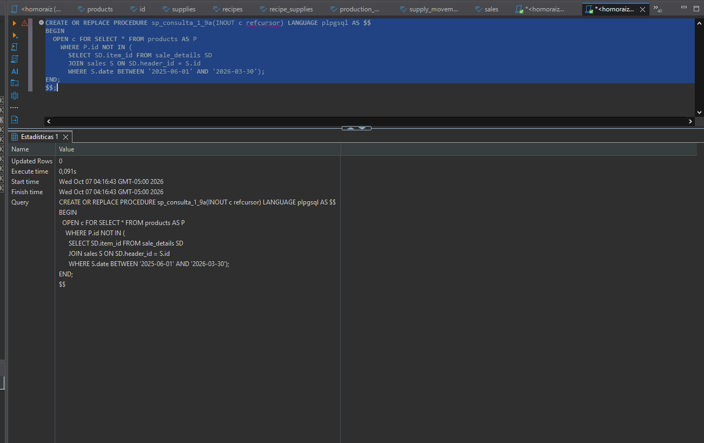

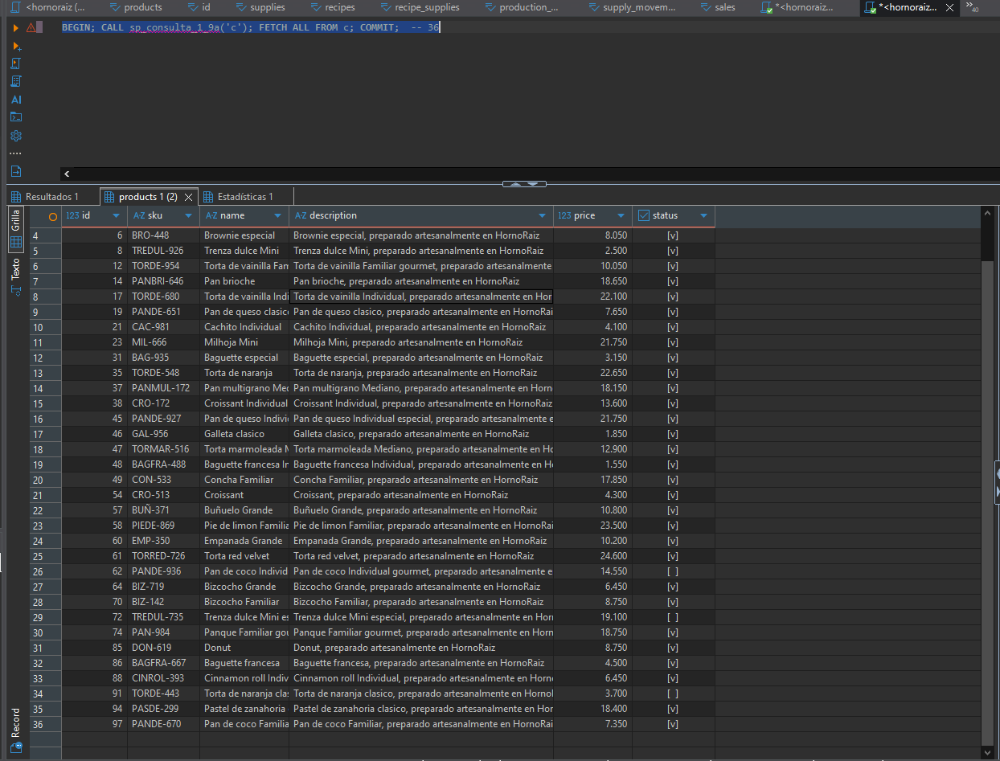

**Resultado:** 36 de los 100 productos no tuvieron ventas en el rango, y los otros 64 sí se vendieron al menos una vez.

```sql
CREATE OR REPLACE PROCEDURE sp_consulta_1_9b(INOUT c refcursor) LANGUAGE plpgsql AS $$
BEGIN
  OPEN c FOR SELECT * FROM products AS P
    LEFT JOIN sale_details AS SD ON (P.id = SD.item_id)
    LEFT JOIN sales AS S ON (SD.header_id = S.id AND S.date BETWEEN '2025-06-01' AND '2026-03-30')
    WHERE S.id IS NULL;
END;
$$;
```

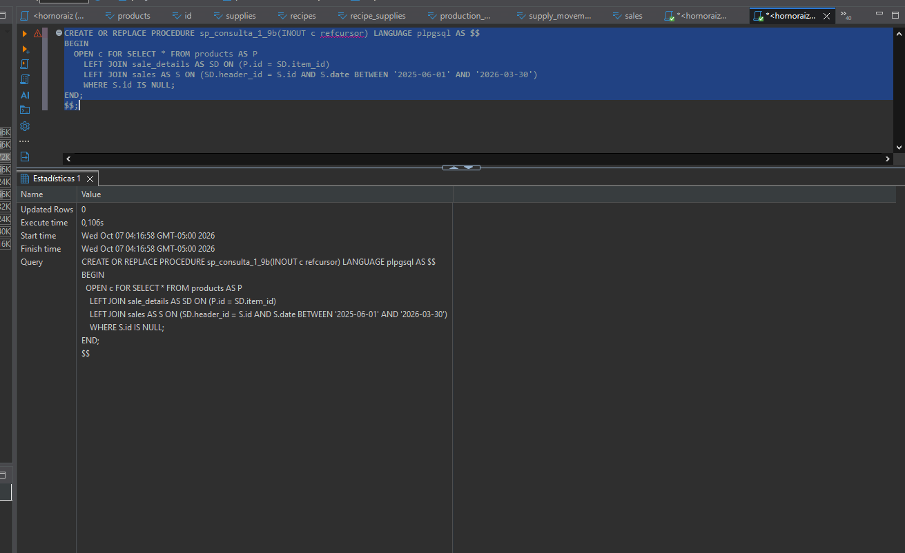

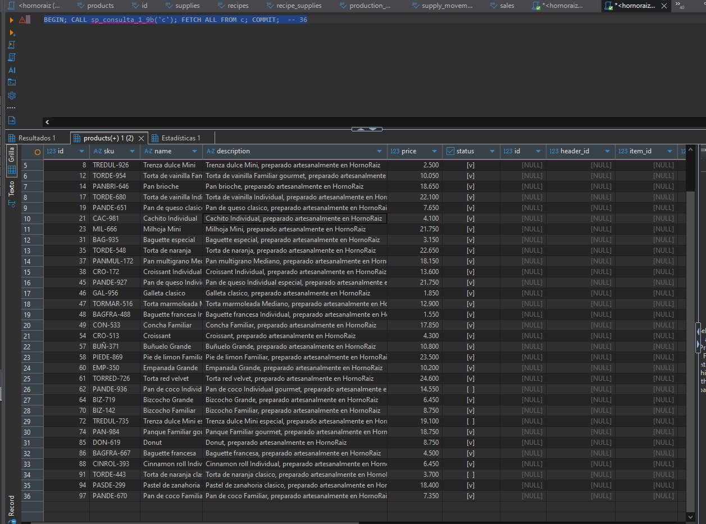

**Resultado:** los mismos 36 productos que la forma con `NOT IN`, lo que confirma que ambas expresiones de la diferencia de conjuntos son equivalentes.

### 2.16 Triggers de auditoría

Se crearon las tablas `products_audit` y `sales_audit`, que registran automáticamente cada inserción, actualización o eliminación sobre `products` y `sales`. Se eligieron estas dos tablas porque sus cambios pesan más en el negocio: el precio de un producto y el estado de una venta. Cada fila de auditoría guarda el estado anterior (`old_data`) y el posterior (`new_data`) en formato `JSONB`, con la fecha del cambio.

Cada tabla de auditoría tiene tres protecciones: un trigger de registro sobre la tabla original, uno que bloquea cualquier `UPDATE` o `DELETE` sobre la tabla de auditoría y uno que rechaza un `INSERT` directo que no venga del trigger de registro.

**Diferencias con MySQL.**

- En PostgreSQL un trigger ejecuta una función, así que hay una función por tabla (`fn_audit_products` y `fn_audit_sales`) que sirve para los tres eventos. La variable `TG_OP` indica si fue `INSERT`, `UPDATE` o `DELETE`.
- `to_jsonb(NEW)` y `to_jsonb(OLD)` serializan la fila completa, sin listar columna por columna como en MySQL. Si la tabla gana una columna, la auditoría la incluye sola.
- Las dos funciones de protección (`fn_audit_block` y `fn_audit_guard`) las comparten ambas tablas de auditoría.
- La marca que autoriza el `INSERT` es una configuración de la transacción (`set_config('audit.from_trigger', '1', true)`), y no una variable de sesión como en MySQL. Se activa antes de insertar en la auditoría y se limpia después, así que no queda activa si la transacción termina.
- Un solo trigger cubre `UPDATE OR DELETE` sobre cada tabla de auditoría, con el mismo código de error (`45000`).

```sql
CREATE TABLE IF NOT EXISTS products_audit (
  id BIGINT GENERATED ALWAYS AS IDENTITY PRIMARY KEY,
  product_id INT NOT NULL,
  action VARCHAR(10) NOT NULL,
  old_data JSONB,
  new_data JSONB,
  changed_at TIMESTAMP NOT NULL DEFAULT CURRENT_TIMESTAMP
);

CREATE TABLE IF NOT EXISTS sales_audit (
  id BIGINT GENERATED ALWAYS AS IDENTITY PRIMARY KEY,
  sale_id INT NOT NULL,
  action VARCHAR(10) NOT NULL,
  old_data JSONB,
  new_data JSONB,
  changed_at TIMESTAMP NOT NULL DEFAULT CURRENT_TIMESTAMP
);

CREATE OR REPLACE FUNCTION fn_audit_products() RETURNS trigger AS $$
BEGIN
  PERFORM set_config('audit.from_trigger', '1', true);
  IF TG_OP = 'INSERT' THEN
    INSERT INTO products_audit(product_id, action, old_data, new_data) VALUES (NEW.id, 'INSERT', NULL, to_jsonb(NEW));
  ELSIF TG_OP = 'UPDATE' THEN
    INSERT INTO products_audit(product_id, action, old_data, new_data) VALUES (NEW.id, 'UPDATE', to_jsonb(OLD), to_jsonb(NEW));
  ELSE
    INSERT INTO products_audit(product_id, action, old_data, new_data) VALUES (OLD.id, 'DELETE', to_jsonb(OLD), NULL);
  END IF;
  PERFORM set_config('audit.from_trigger', '', true);
  RETURN NULL;
END;
$$ LANGUAGE plpgsql;

CREATE OR REPLACE FUNCTION fn_audit_sales() RETURNS trigger AS $$
BEGIN
  PERFORM set_config('audit.from_trigger', '1', true);
  IF TG_OP = 'INSERT' THEN
    INSERT INTO sales_audit(sale_id, action, old_data, new_data) VALUES (NEW.id, 'INSERT', NULL, to_jsonb(NEW));
  ELSIF TG_OP = 'UPDATE' THEN
    INSERT INTO sales_audit(sale_id, action, old_data, new_data) VALUES (NEW.id, 'UPDATE', to_jsonb(OLD), to_jsonb(NEW));
  ELSE
    INSERT INTO sales_audit(sale_id, action, old_data, new_data) VALUES (OLD.id, 'DELETE', to_jsonb(OLD), NULL);
  END IF;
  PERFORM set_config('audit.from_trigger', '', true);
  RETURN NULL;
END;
$$ LANGUAGE plpgsql;

CREATE OR REPLACE FUNCTION fn_audit_block() RETURNS trigger AS $$
BEGIN
  RAISE EXCEPTION '% es inmutable: % prohibido.', TG_TABLE_NAME, TG_OP USING ERRCODE = '45000';
END;
$$ LANGUAGE plpgsql;

CREATE OR REPLACE FUNCTION fn_audit_guard() RETURNS trigger AS $$
BEGIN
  IF COALESCE(current_setting('audit.from_trigger', true), '') <> '1' THEN
    RAISE EXCEPTION 'INSERT en % solo permitido desde los triggers de la tabla original.', TG_TABLE_NAME USING ERRCODE = '45000';
  END IF;
  RETURN NEW;
END;
$$ LANGUAGE plpgsql;

DROP TRIGGER IF EXISTS trg_products_audit ON products;
CREATE TRIGGER trg_products_audit AFTER INSERT OR UPDATE OR DELETE ON products
FOR EACH ROW EXECUTE FUNCTION fn_audit_products();

DROP TRIGGER IF EXISTS trg_sales_audit ON sales;
CREATE TRIGGER trg_sales_audit AFTER INSERT OR UPDATE OR DELETE ON sales
FOR EACH ROW EXECUTE FUNCTION fn_audit_sales();

DROP TRIGGER IF EXISTS trg_products_audit_block ON products_audit;
CREATE TRIGGER trg_products_audit_block BEFORE UPDATE OR DELETE ON products_audit
FOR EACH ROW EXECUTE FUNCTION fn_audit_block();

DROP TRIGGER IF EXISTS trg_products_audit_guard ON products_audit;
CREATE TRIGGER trg_products_audit_guard BEFORE INSERT ON products_audit
FOR EACH ROW EXECUTE FUNCTION fn_audit_guard();

DROP TRIGGER IF EXISTS trg_sales_audit_block ON sales_audit;
CREATE TRIGGER trg_sales_audit_block BEFORE UPDATE OR DELETE ON sales_audit
FOR EACH ROW EXECUTE FUNCTION fn_audit_block();

DROP TRIGGER IF EXISTS trg_sales_audit_guard ON sales_audit;
CREATE TRIGGER trg_sales_audit_guard BEFORE INSERT ON sales_audit
FOR EACH ROW EXECUTE FUNCTION fn_audit_guard();
```

**Verificación.** `pg_trigger` también lista tres triggers del modelo original (`trg_receta_updated_at`, `trg_lote_produccion_updated_at` y `trg_promocion_updated_at`), que mantienen la columna `updated_at`. Por eso la consulta filtra los de auditoría por nombre y deben salir seis:

```sql
SELECT tgname, tgrelid::regclass AS tabla FROM pg_trigger WHERE NOT tgisinternal AND tgname LIKE '%audit%' ORDER BY 2,1;
```

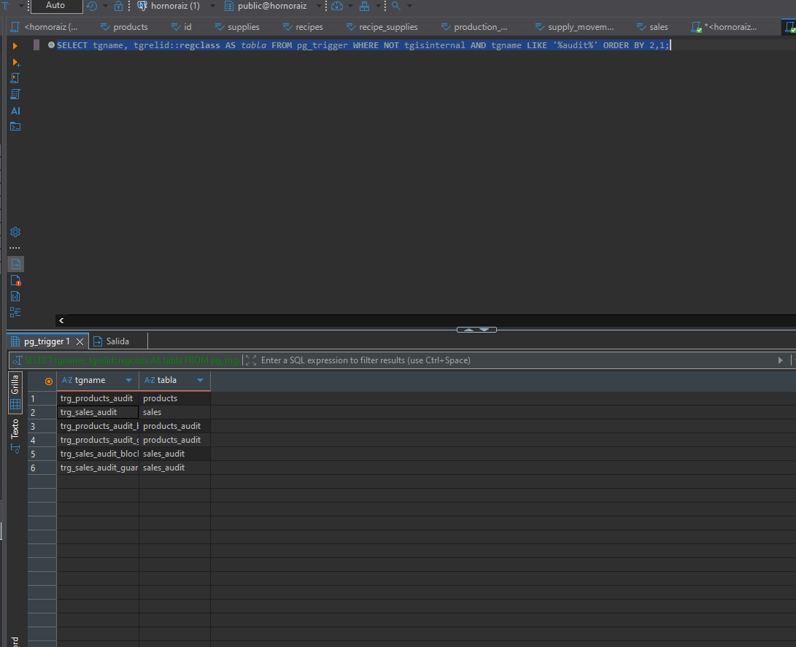

#### Prueba de `products_audit`

Los datos se cargaron con ids propios (1 a 100), por lo que las pruebas usan un `id` explícito (9001) en vez de depender de la secuencia. Se insertó un producto de prueba, se le cambió el precio y se borró.

```sql
INSERT INTO products (id, sku, name, description, price, status) VALUES (9001,'TEST-001','Producto de prueba','Prueba de auditoria',1000.00,true);
UPDATE products SET price = 1500.00 WHERE id = 9001;
DELETE FROM products WHERE id = 9001;
SELECT id, product_id, action, old_data, new_data FROM products_audit ORDER BY id DESC LIMIT 3;
```

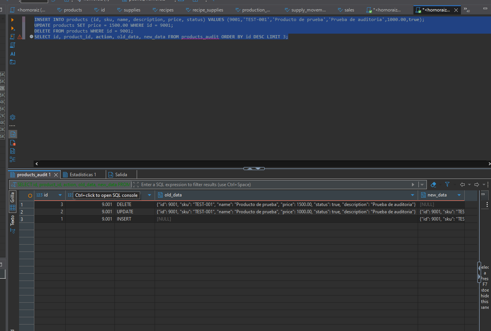

**Resultado:** se registraron las tres operaciones sobre el producto 9001: el `INSERT` con precio 1000, el `UPDATE` con `old_data` en 1000 y `new_data` en 1500, y el `DELETE` con el estado final (precio 1500). Cada registro guarda la fila completa en `JSONB`, con todas las columnas del producto.

#### Prueba de `sales_audit`

```sql
INSERT INTO sales (id, client_id, date, subtotal, taxes, total, status) VALUES (9001, NULL, NOW(), 1000, 190, 1190, 'pending');
UPDATE sales SET status = 'paid' WHERE id = 9001;
DELETE FROM sales WHERE id = 9001;
SELECT id, sale_id, action, old_data, new_data FROM sales_audit ORDER BY id DESC LIMIT 3;
```

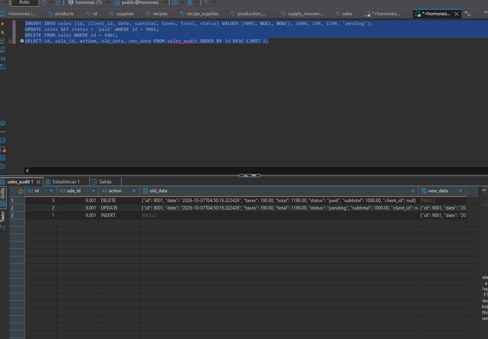

**Resultado:** para la venta 9001 quedaron el `INSERT` en `pending`, el `UPDATE` de `pending` a `paid` y el `DELETE` con el último estado. La auditoría capta el cambio de estado de la venta, que es el dato que más interesa.

#### Pruebas de inmutabilidad

Con las tablas de auditoría ya con filas, se intentó alterarlas. Las cuatro operaciones fueron rechazadas por los triggers de protección:

```sql
UPDATE products_audit SET action = 'X' WHERE id = 1;
DELETE FROM products_audit WHERE id = 1;
INSERT INTO products_audit (product_id, action, old_data, new_data) VALUES (999,'INSERT',NULL,NULL);
UPDATE sales_audit SET action = 'X' WHERE id = 1;
```

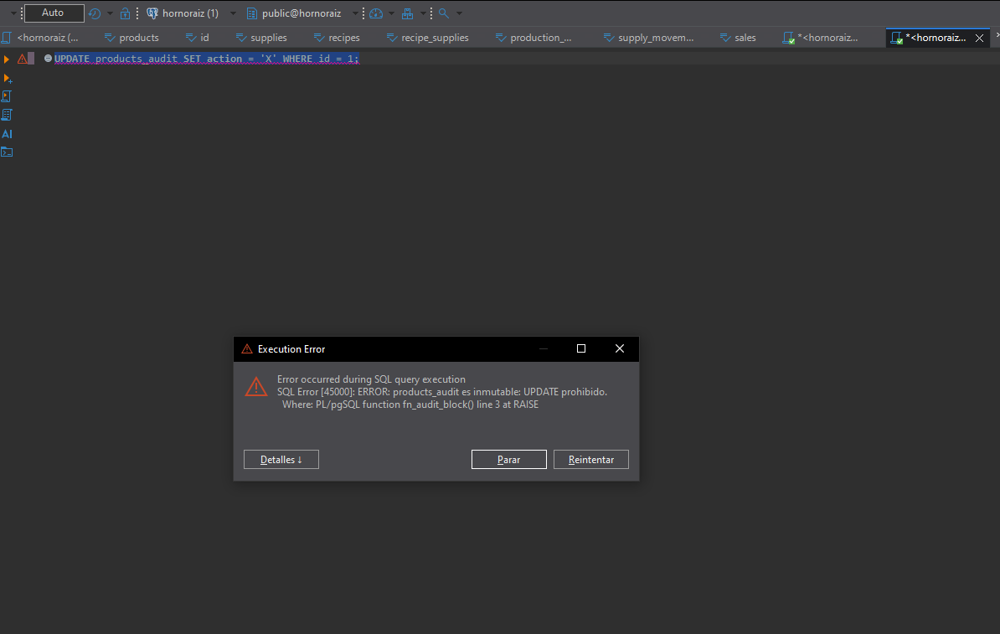

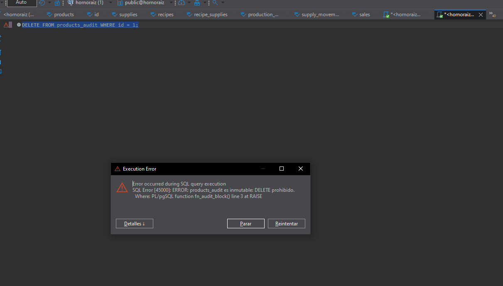

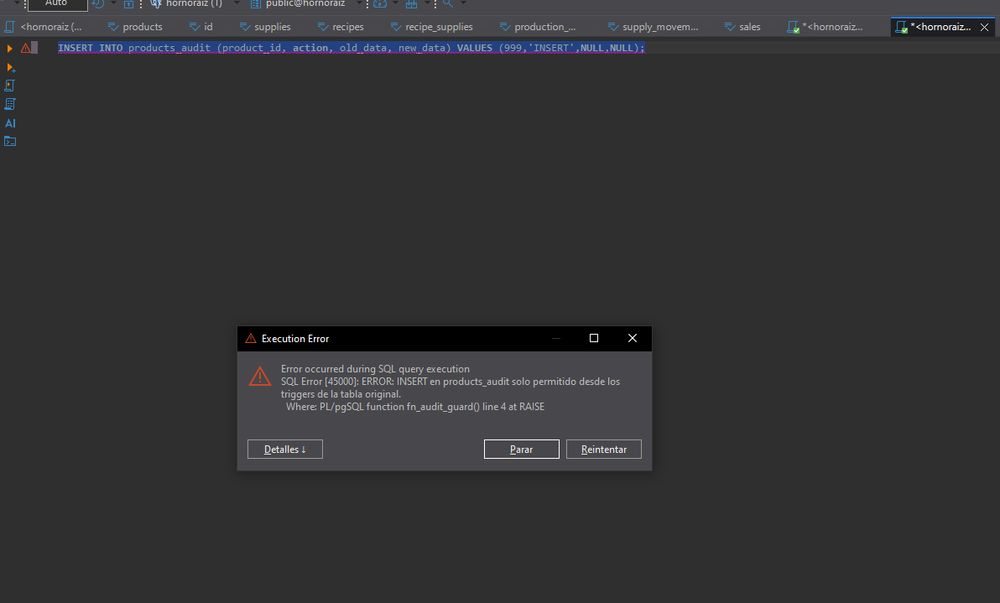

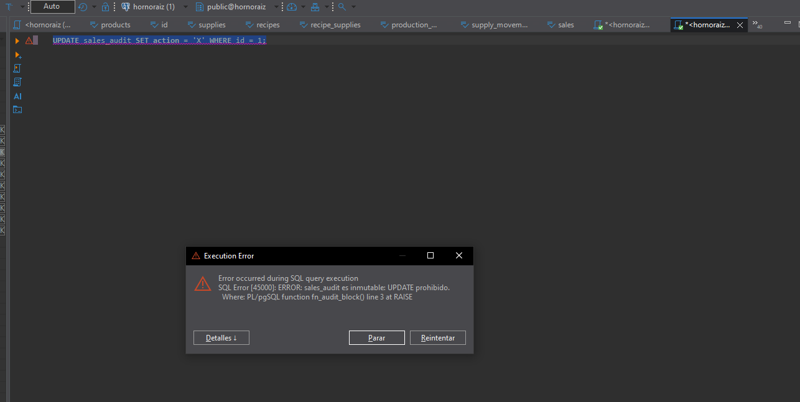

**Resultado:** los mensajes fueron `products_audit es inmutable: UPDATE prohibido.`, `products_audit es inmutable: DELETE prohibido.`, `INSERT en products_audit solo permitido desde los triggers de la tabla original.` y `sales_audit es inmutable: UPDATE prohibido.`. Las pruebas de bloqueo se hicieron después de las de registro, porque el trigger actúa por fila: con la tabla de auditoría vacía, un `UPDATE` o `DELETE` no encuentra nada que bloquear. Al final, `products` y `sales` quedaron con 100 filas cada una.

**Limitación.** La sentencia `TRUNCATE` no dispara triggers `FOR EACH ROW`, así que no queda cubierta por esta protección. Para cerrar ese hueco habría que quitarles el privilegio `TRUNCATE` sobre las tablas de auditoría a los usuarios que no sean administradores.

### 3.16 Procedimientos almacenados

Las 15 consultas de la sección 3.15 se llevaron a procedimientos almacenados con el nombre `sp_consulta_<número>`, igual que en MySQL y PostgreSQL.

**Diferencias con los otros motores.** En SQL Server un procedimiento devuelve directamente el resultado de su `SELECT`, sin cursor como en PostgreSQL. Se crea con `CREATE OR ALTER PROCEDURE ... AS` y se ejecuta con `EXEC`, no con `CALL`. Como cada consulta es una sola sentencia, no necesita bloque `BEGIN ... END`. El estado de los catálogos es un `BIT`, que se muestra como `1` o `0`.

**Creación.** Los 15 procedimientos se crearon primero en lote desde la terminal de la VPS con `sqlcmd`, el cliente de línea de comandos de SQL Server, que entiende `GO`, el separador de lotes. Después se ejecutó cada `CREATE OR ALTER PROCEDURE` uno por uno desde DBeaver para documentar su creación; la sentencia se puede repetir sin efecto. En DBeaver se ejecuta sin la línea `GO`, porque es una palabra del cliente y no de SQL Server, y cada `CREATE OR ALTER PROCEDURE` debe ser la primera sentencia de su lote. Como cada consulta es una sola sentencia, sin bloque `BEGIN ... END`, el editor no la parte por dentro. Esa limitación sí apareció con los triggers (error `102`, sección 3.17).

```bash
docker exec -i mssql-server /opt/mssql-tools18/bin/sqlcmd -S localhost -U SA -P '****' -C -d hornoraiz < ~/sqlserver-procedures.sql
```

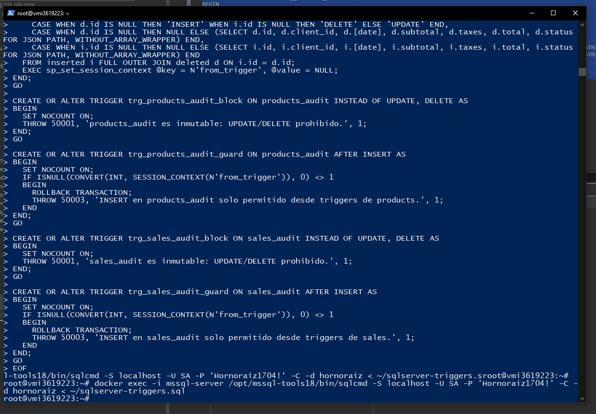

La ejecución no devolvió errores. Desde DBeaver se comprobó que quedaron registrados los 15:

```sql
SELECT name FROM sys.procedures WHERE name LIKE 'sp_consulta%' ORDER BY name;
```

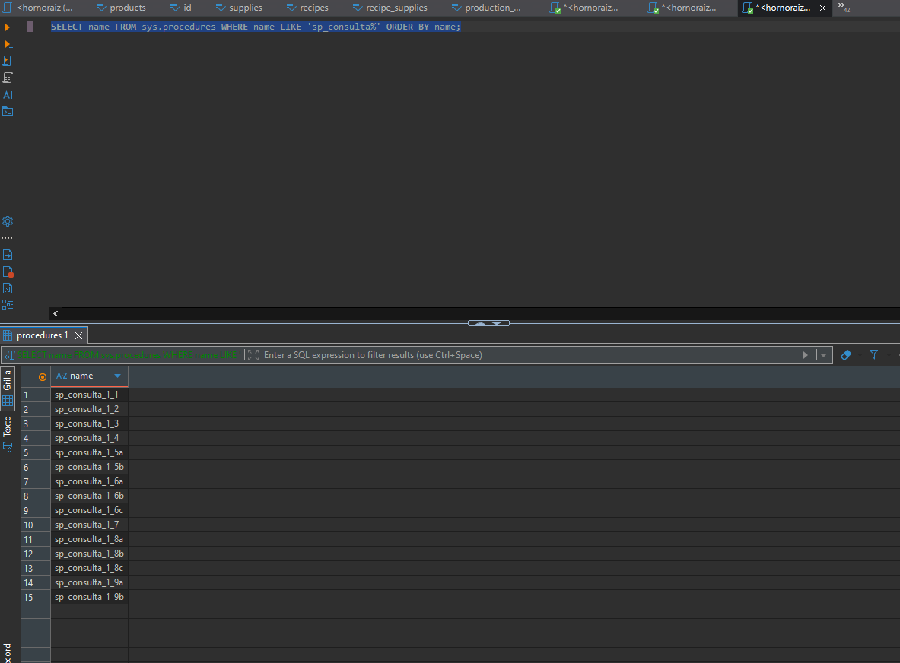

#### 3.16.1 Mostrar algunos de los registros de `products`

**Narrativa:** es el punto de partida para comprobar que el catálogo se cargó completo. Proyecta solo `sku`, `name`, `price` y `status`, en vez de traer la tabla entera.

```sql
CREATE OR ALTER PROCEDURE sp_consulta_1_1 AS
SELECT sku, name, price, status FROM products;
```

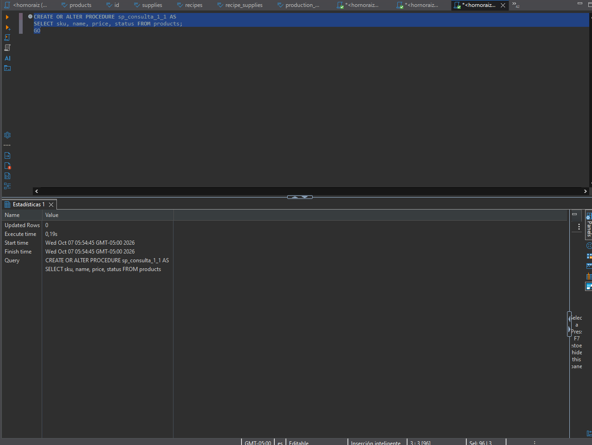

```sql
EXEC sp_consulta_1_1;
```

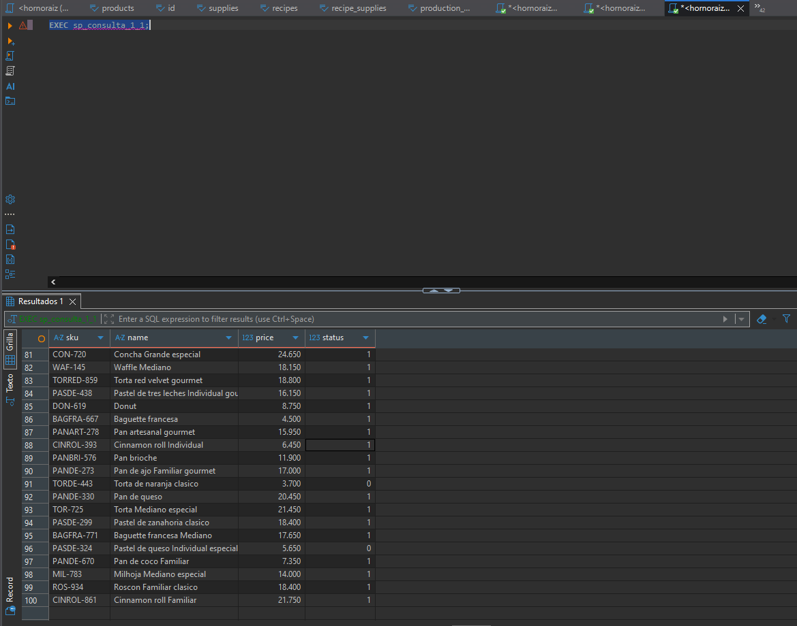

**Resultado:** devolvió 100 productos: 90 con `status = 1` y 10 con `0`, las mismas proporciones de los otros motores. `CIA-859` aparece a $7.950.

#### 3.16.2 Ventas ordenadas de la más reciente a la más antigua

**Narrativa:** responde "¿qué se vendió últimamente?". Usa `ORDER BY date DESC` sobre `sales`, de modo que la primera fila sea la venta más nueva.

```sql
CREATE OR ALTER PROCEDURE sp_consulta_1_2 AS
SELECT id, date, subtotal, status FROM sales ORDER BY date DESC;
```

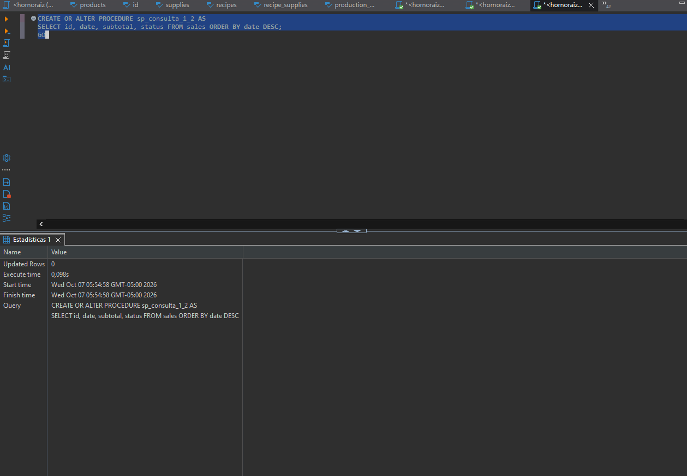

```sql
EXEC sp_consulta_1_2;
```

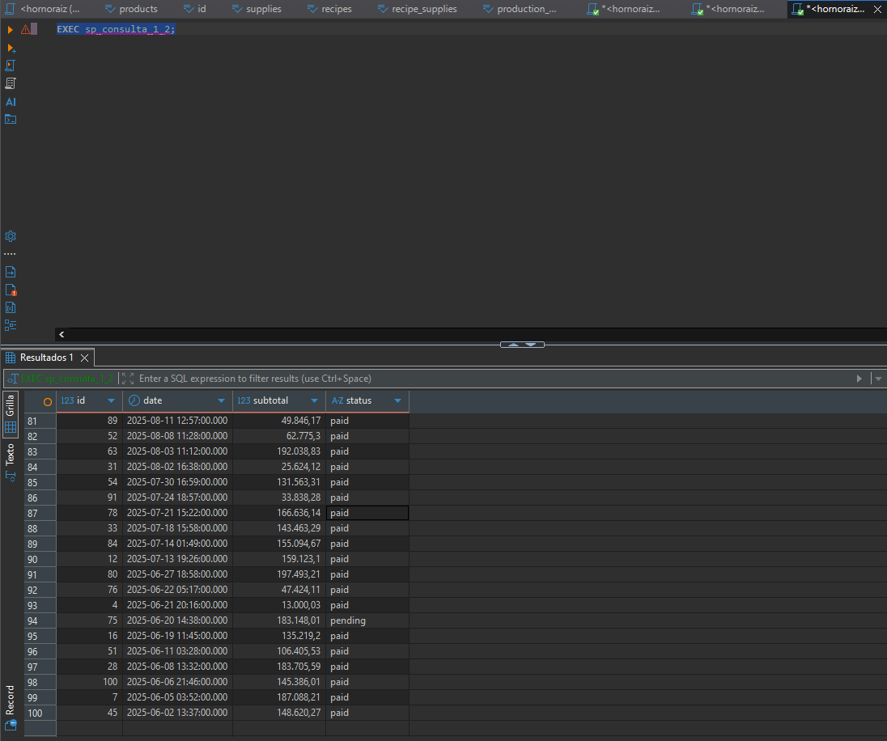

**Resultado:** devolvió las 100 ventas, de la venta 10 (27 de marzo de 2026, pendiente) a la venta 45 (2 de junio de 2025), en el mismo orden que en los otros motores.

#### 3.16.3 Ventas con sus líneas de detalle, relación en `WHERE`

**Narrativa:** relaciona cada línea de `sale_details` con su venta mediante `S.id = SD.header_id` en el `WHERE`. Muestra qué productos y cantidades componen cada venta.

```sql
CREATE OR ALTER PROCEDURE sp_consulta_1_3 AS
SELECT * FROM sale_details SD, sales S WHERE S.id = SD.header_id;
```

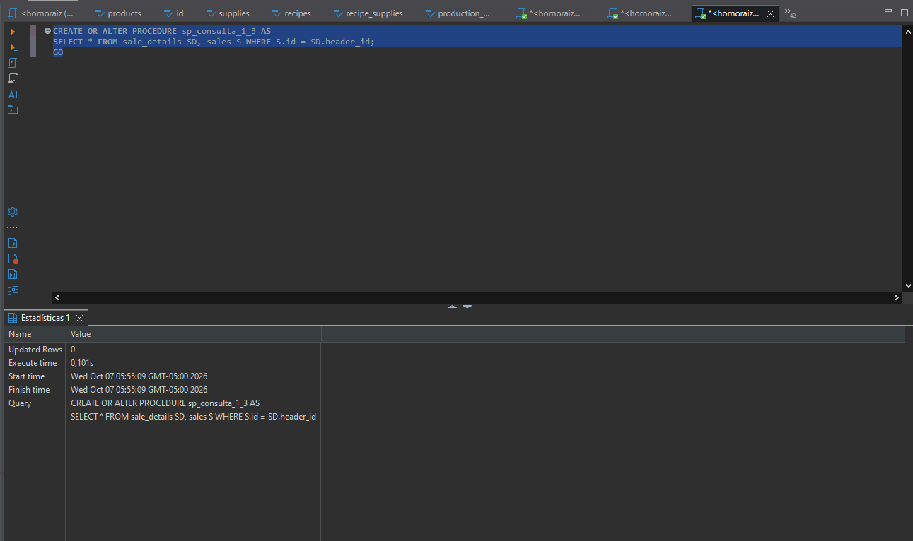

```sql
EXEC sp_consulta_1_3;
```

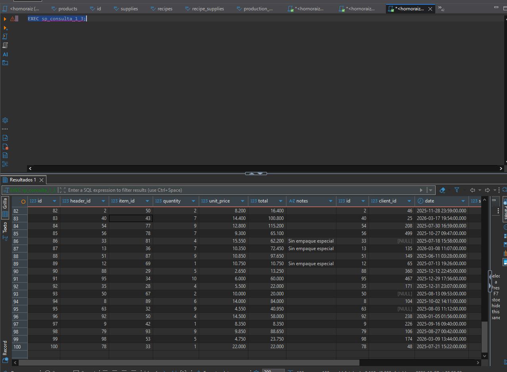

**Resultado:** 100 filas, una por línea de detalle, con las columnas de `sale_details` y de `sales` juntas. Ninguna línea quedó sin venta.

#### 3.16.4 Ventas con sus líneas de detalle, relación con `JOIN`

**Narrativa:** la misma pregunta que la 3.16.3, resuelta con `JOIN ... ON`. Proyecta de `sales` solo la fecha y el estado, y de `sale_details` todas las columnas.

```sql
CREATE OR ALTER PROCEDURE sp_consulta_1_4 AS
SELECT S.date, S.status, SD.*
FROM sales AS S
JOIN sale_details AS SD ON (S.id = SD.header_id);
```

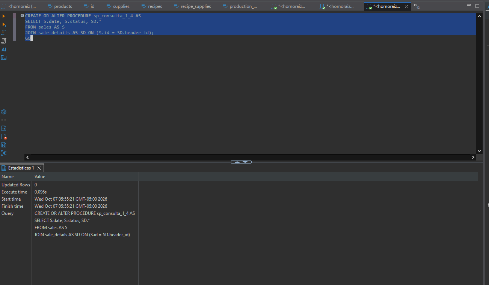

```sql
EXEC sp_consulta_1_4;
```

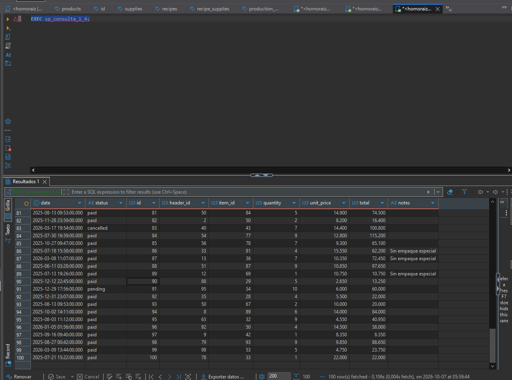

**Resultado:** las mismas 100 filas que el procedimiento anterior, lo que confirma que ambas sintaxis son equivalentes.

#### 3.16.5 Filtro por estado de la venta

**Narrativa:** reparte las líneas de detalle según el estado de su venta. El estado se filtra en `sales`, porque `sale_details` no tiene columna `status`. La primera usa la relación en `WHERE` y mide las ventas pagadas. La segunda usa `JOIN` y aísla las canceladas.

```sql
CREATE OR ALTER PROCEDURE sp_consulta_1_5a AS
SELECT * FROM sale_details SD, sales S
WHERE S.id = SD.header_id AND S.status = 'paid';
```

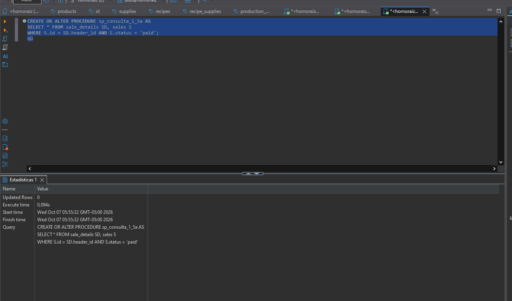

```sql
EXEC sp_consulta_1_5a;
```

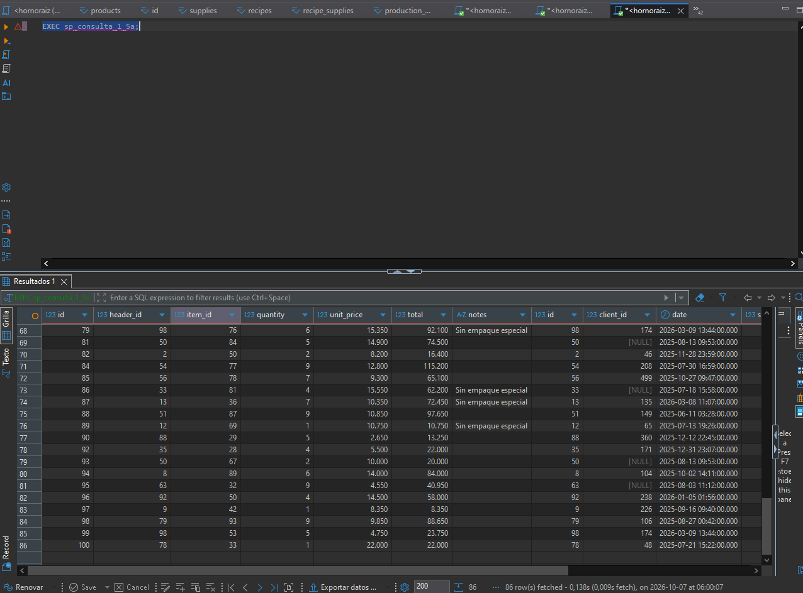

**Resultado:** 86 de las 100 líneas (86 %) pertenecen a ventas pagadas.

```sql
CREATE OR ALTER PROCEDURE sp_consulta_1_5b AS
SELECT S.date, S.status, SD.*
FROM sales AS S
JOIN sale_details AS SD ON (S.id = SD.header_id)
WHERE S.status = 'cancelled';
```

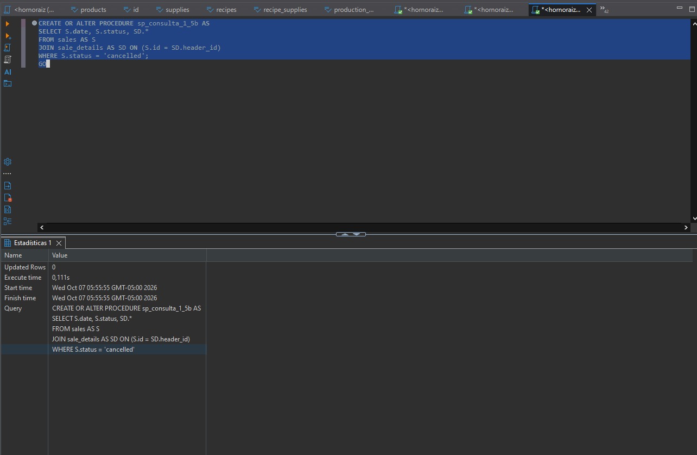

```sql
EXEC sp_consulta_1_5b;
```

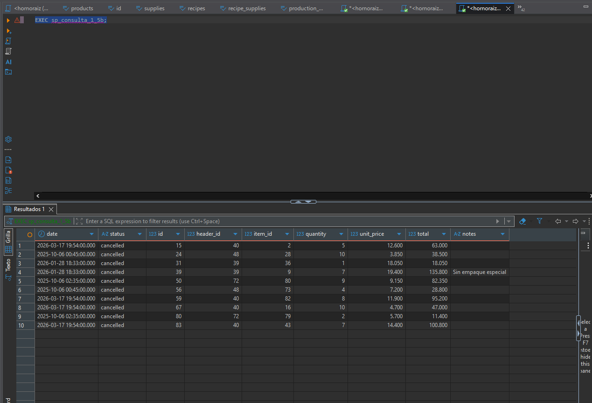

**Resultado:** 10 líneas, que corresponden a 4 ventas canceladas (39, 40, 48 y 72). Las 4 líneas restantes pertenecen a ventas pendientes.

#### 3.16.6 Filtros con `LIKE`

**Narrativa:** tres búsquedas por patrón de texto. La primera lista los productos cuyo nombre empieza por "Pan". La segunda busca la palabra "chocolate" en cualquier posición de la descripción, con el patrón armado por `CONCAT`. La tercera combina el texto con el estado de la venta, para ver qué productos "Pan" se cancelaron. En SQL Server, con la intercalación por defecto, `LIKE` no distingue mayúsculas de minúsculas, así que el patrón `'Pan%'` también encontraría "pan".

```sql
CREATE OR ALTER PROCEDURE sp_consulta_1_6a AS
SELECT * FROM products AS P WHERE P.name LIKE 'Pan%';
```

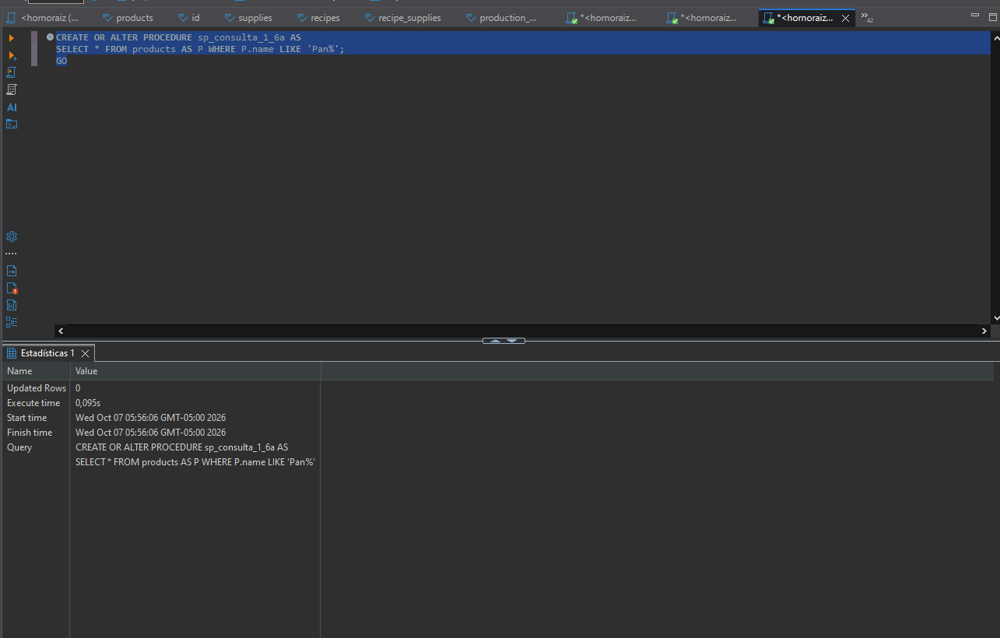

```sql
EXEC sp_consulta_1_6a;
```

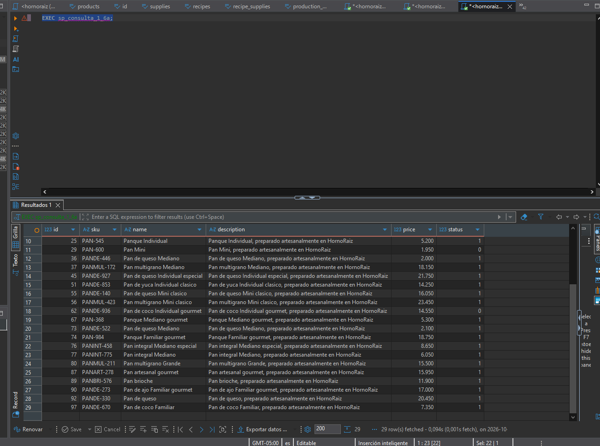

**Resultado:** 29 productos. El patrón incluye también Panettone y Panque, porque solo exige que el nombre comience por "Pan". Dos están inactivos: `PAN-600` y `PANDE-936`.

```sql
CREATE OR ALTER PROCEDURE sp_consulta_1_6b AS
SELECT * FROM products AS P WHERE P.description LIKE CONCAT('%','chocolate','%');
```

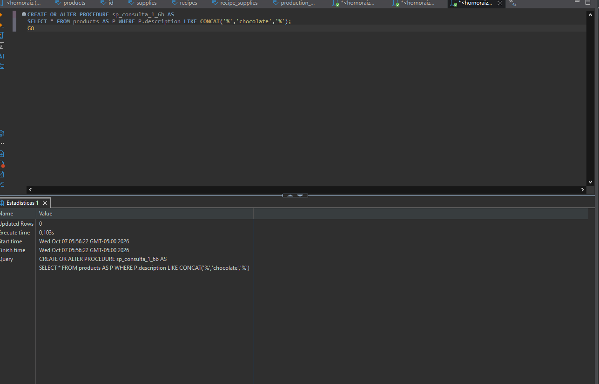

```sql
EXEC sp_consulta_1_6b;
```

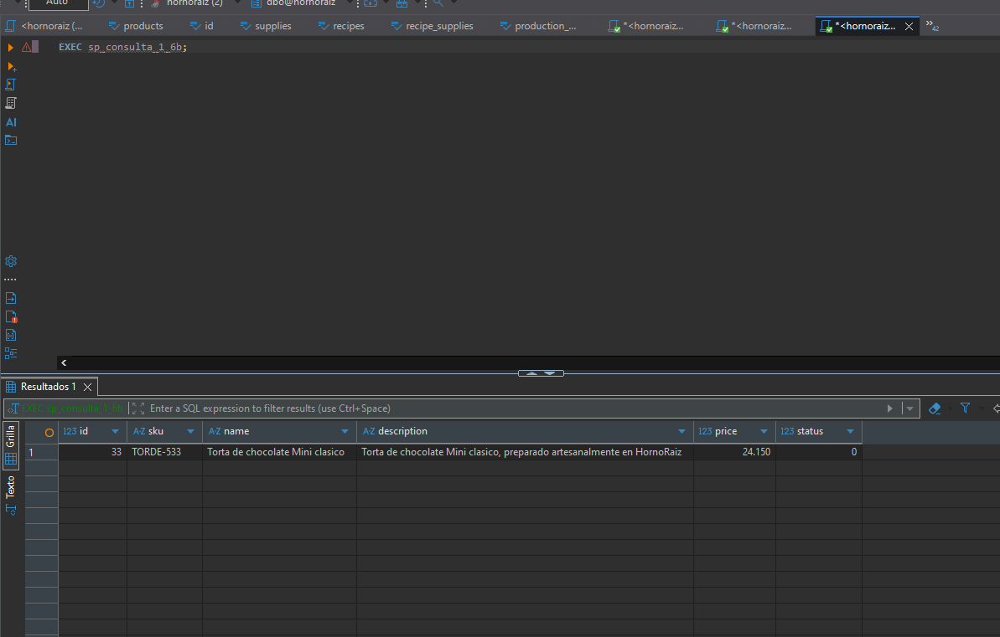

**Resultado:** un solo producto, `Torta de chocolate Mini clasico` (`TORDE-533`, $24.150), que además está inactivo. Aquí `CONCAT` acepta los tres argumentos, a diferencia de Oracle, que solo admite dos.

```sql
CREATE OR ALTER PROCEDURE sp_consulta_1_6c AS
SELECT S.date, S.status, P.name
FROM sales AS S
JOIN sale_details AS SD ON (S.id = SD.header_id)
JOIN products AS P ON (P.id = SD.item_id)
WHERE S.status = 'cancelled' AND P.name LIKE 'Pan%';
```

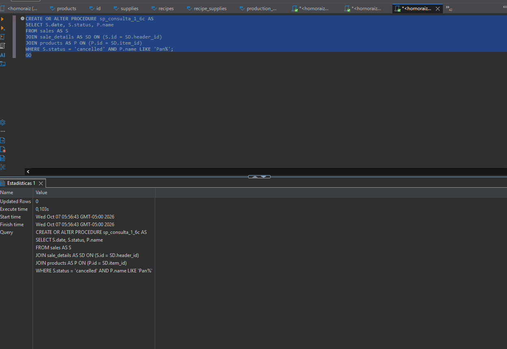

```sql
EXEC sp_consulta_1_6c;
```

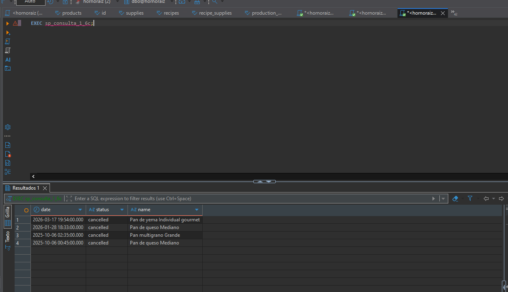

**Resultado:** 4 filas: `Pan de yema Individual gourmet`, dos de `Pan de queso Mediano` y `Pan multigrano Grande`. De las 10 líneas canceladas, 4 son panes.

#### 3.16.7 Filtro con `BETWEEN` sobre cuatro tablas

**Narrativa:** responde "¿qué productos se vendieron y cómo se pagaron entre el 1 de junio de 2025 y el 30 de marzo de 2026?". Encadena `products`, `sale_details`, `sales` y `payments`. Como `payments.reference_id` apunta a la venta, la unión exige también `reference_type = 'sale'`. `BETWEEN` acota la fecha del pago.

```sql
CREATE OR ALTER PROCEDURE sp_consulta_1_7 AS
SELECT P.name, P.sku, SD.quantity, SD.total, S.date, PAY.method
FROM products P
JOIN sale_details SD ON P.id = SD.item_id
JOIN sales S ON SD.header_id = S.id
JOIN payments PAY ON PAY.reference_id = S.id AND PAY.reference_type = 'sale'
WHERE PAY.date BETWEEN '2025-06-01 00:00:00' AND '2026-03-30 23:59:59'
ORDER BY PAY.date ASC;
```

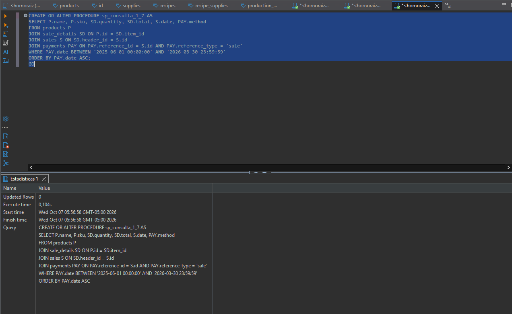

```sql
EXEC sp_consulta_1_7;
```

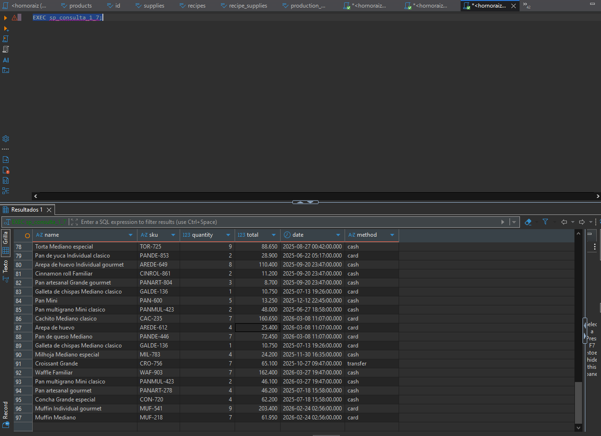

**Resultado:** 97 filas. Una misma línea de venta se repite cuando la venta tiene varios pagos, por ejemplo el `Pan de leche Mini` pagado en efectivo y con tarjeta. Es el resultado esperado de unir dos relaciones 1:N sobre la misma venta.

#### 3.16.8 Agrupamiento con `GROUP BY` y `HAVING`

**Narrativa:** tres resúmenes de pagos por venta con `SUM`, `COUNT` y `AVG`. Responden cuánto se pagó por cada venta, cuántos pagos fueron y cuál fue el promedio. Las dos primeras acotan las filas con `WHERE` antes de agrupar: la primera por rango de fechas y la segunda por estado y método de pago. La tercera filtra con `HAVING` después de agrupar, porque la condición depende de la suma ya calculada.

```sql
CREATE OR ALTER PROCEDURE sp_consulta_1_8a AS
SELECT S.id, S.date, SUM(PAY.amount) AS total_paid, COUNT(PAY.id) AS payment_count, AVG(PAY.amount) AS avg_payment
FROM sales S
JOIN payments PAY ON PAY.reference_id = S.id AND PAY.reference_type = 'sale'
WHERE PAY.date BETWEEN '2025-06-01 00:00:00' AND '2026-03-30 23:59:59'
GROUP BY S.id, S.date
ORDER BY total_paid DESC;
```

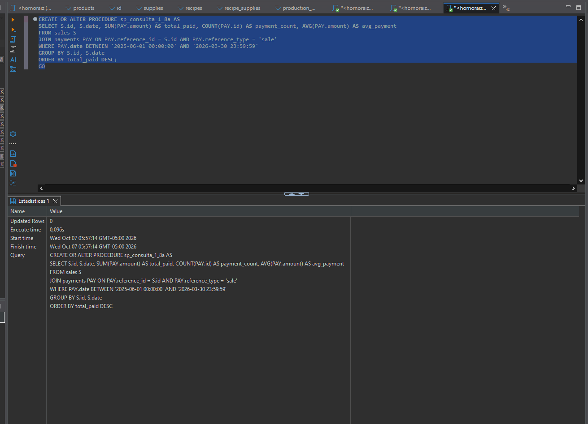

```sql
EXEC sp_consulta_1_8a;
```

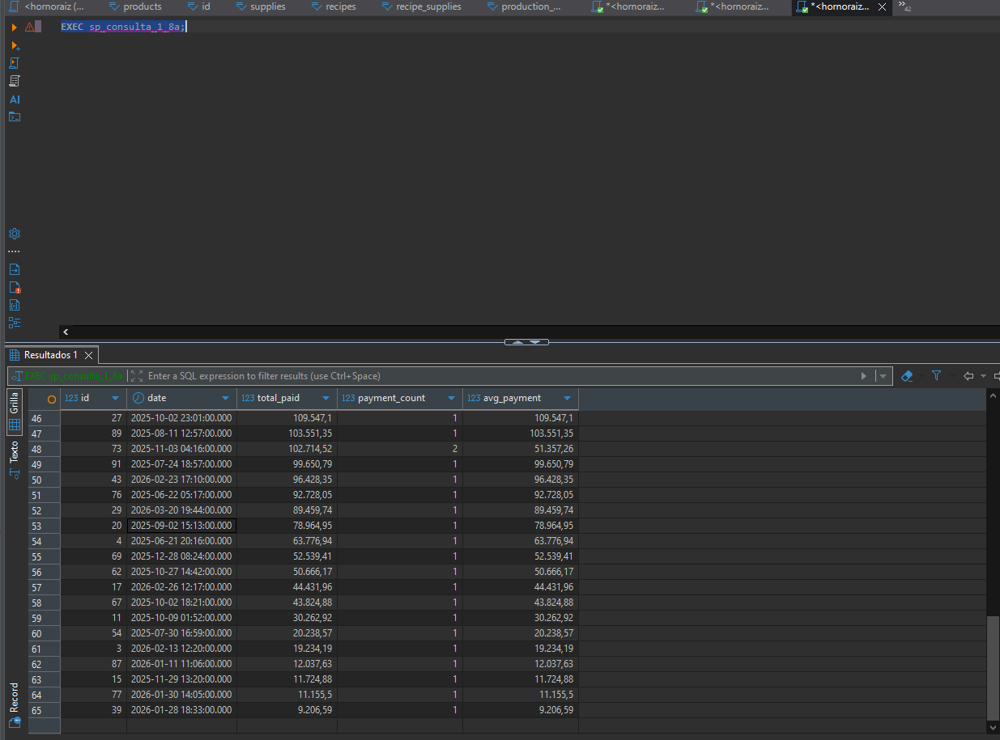

**Resultado:** 65 ventas con pagos en el rango. La venta 52 encabeza con $942.692,25 en 6 pagos. `AVG` sobre una columna `DECIMAL` muestra seis decimales en SQL Server.

```sql
CREATE OR ALTER PROCEDURE sp_consulta_1_8b AS
SELECT S.id, S.date, SUM(PAY.amount) AS total_paid, COUNT(PAY.id) AS payment_count
FROM sales S
JOIN payments PAY ON PAY.reference_id = S.id AND PAY.reference_type = 'sale'
WHERE PAY.status = 'completed' AND PAY.method = 'card'
GROUP BY S.id, S.date
ORDER BY total_paid DESC;
```

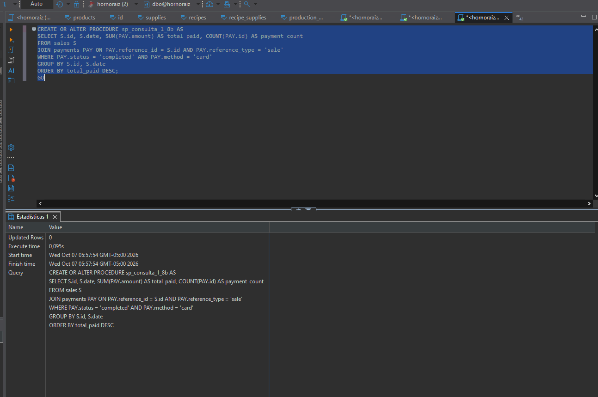

```sql
EXEC sp_consulta_1_8b;
```

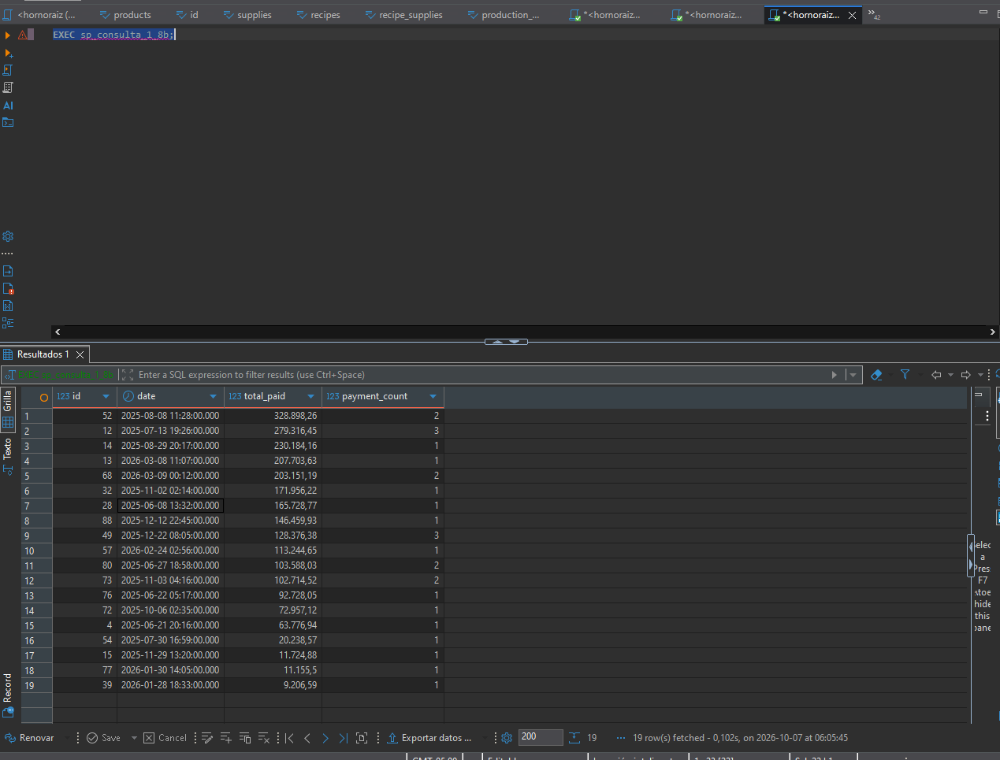

**Resultado:** 19 ventas tienen pagos con tarjeta ya completados. La venta 52 vuelve a encabezar, con $328.898,26 en 2 pagos.

```sql
CREATE OR ALTER PROCEDURE sp_consulta_1_8c AS
SELECT S.id, S.date, SUM(PAY.amount) AS total_paid, COUNT(PAY.id) AS payment_count
FROM sales S
JOIN payments PAY ON PAY.reference_id = S.id AND PAY.reference_type = 'sale'
GROUP BY S.id, S.date
HAVING SUM(PAY.amount) >= 100000
ORDER BY total_paid DESC;
```

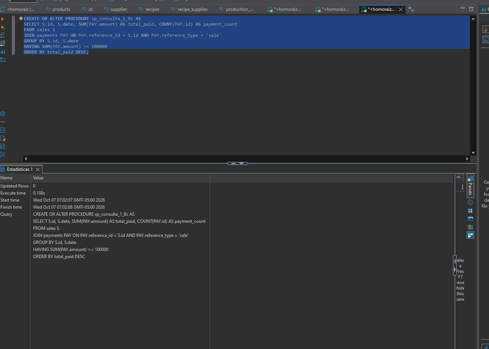

```sql
EXEC sp_consulta_1_8c;
```

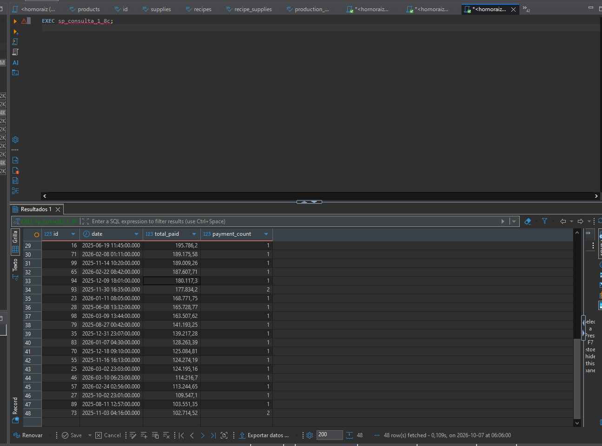

**Resultado:** 48 ventas acumulan $100.000 o más en pagos, y la venta 52 vuelve a ser la mayor, con $942.692,25. Esta consulta no lleva filtro de fechas, así que considera todos los pagos registrados.

#### 3.16.9 Subconsultas y teoría de conjuntos

**Narrativa:** responde "¿qué productos no se vendieron entre el 1 de junio de 2025 y el 30 de marzo de 2026?". Es una diferencia de conjuntos: todos los productos menos los que aparecen en alguna línea de venta del rango. La primera forma usa `NOT IN` con una subconsulta. La segunda usa `LEFT JOIN` con `WHERE S.id IS NULL`.

```sql
CREATE OR ALTER PROCEDURE sp_consulta_1_9a AS
SELECT * FROM products AS P
WHERE P.id NOT IN (
  SELECT SD.item_id FROM sale_details SD
  JOIN sales S ON SD.header_id = S.id
  WHERE S.date BETWEEN '2025-06-01' AND '2026-03-30');
```

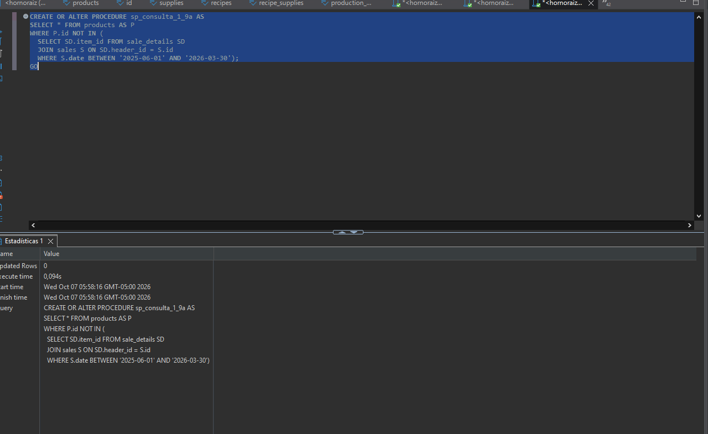

```sql
EXEC sp_consulta_1_9a;
```

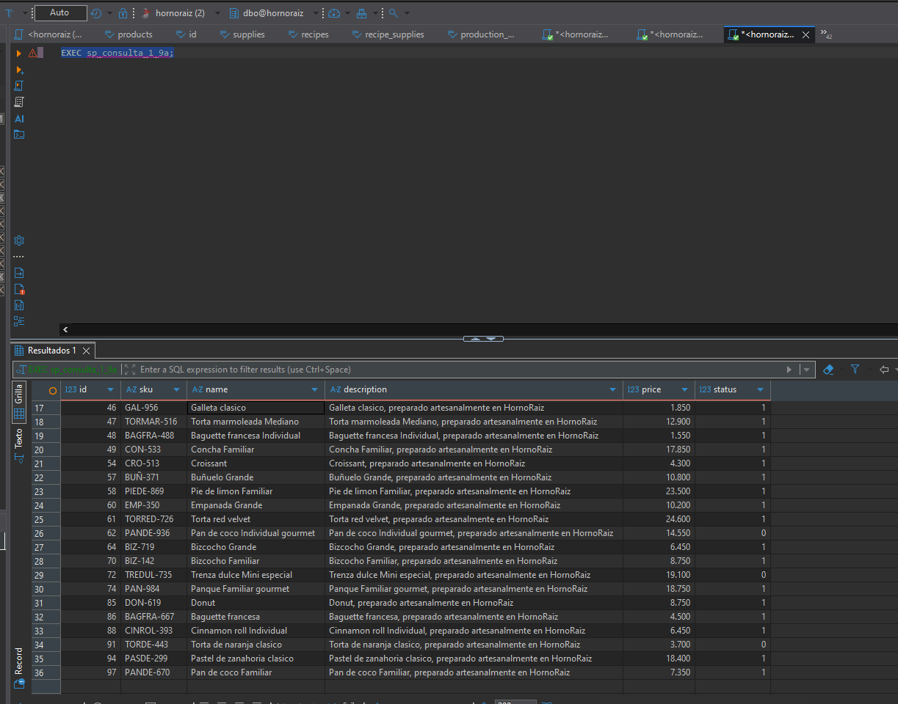

**Resultado:** 36 de los 100 productos no tuvieron ventas en el rango, y los otros 64 sí se vendieron al menos una vez.

```sql
CREATE OR ALTER PROCEDURE sp_consulta_1_9b AS
SELECT * FROM products AS P
LEFT JOIN sale_details AS SD ON (P.id = SD.item_id)
LEFT JOIN sales AS S ON (SD.header_id = S.id AND S.date BETWEEN '2025-06-01' AND '2026-03-30')
WHERE S.id IS NULL;
```

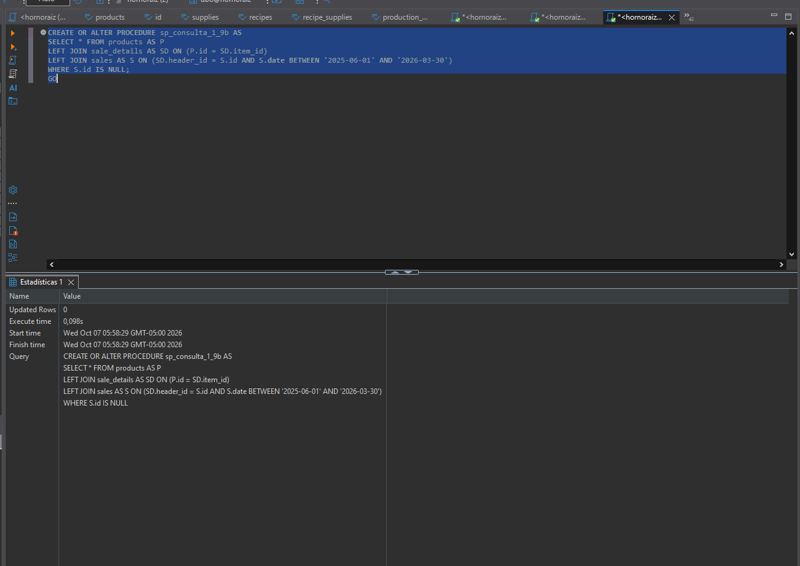

```sql
EXEC sp_consulta_1_9b;
```

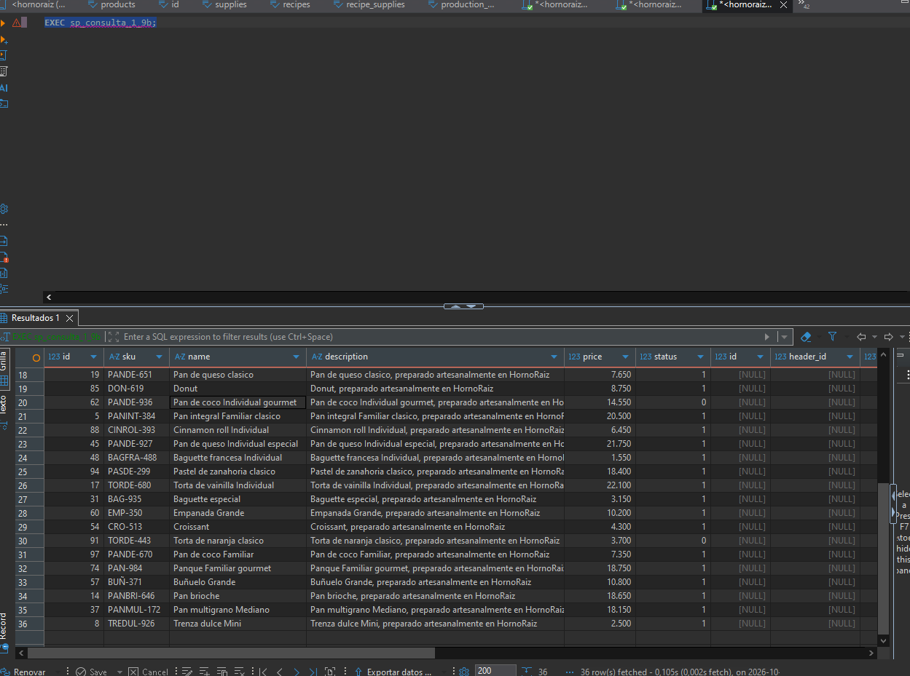

**Resultado:** los mismos 36 productos que la forma con `NOT IN`, lo que confirma que ambas expresiones de la diferencia de conjuntos son equivalentes.

### 3.17 Triggers de auditoría

Se crearon las tablas `products_audit` y `sales_audit`, que registran automáticamente cada inserción, actualización o eliminación sobre `products` y `sales`. Se eligieron estas dos tablas porque sus cambios pesan más en el negocio: el precio de un producto y el estado de una venta. Cada fila de auditoría guarda el estado anterior (`old_data`) y el posterior (`new_data`) en formato JSON, con la fecha del cambio.

Cada tabla de auditoría tiene tres protecciones: un trigger de registro sobre la tabla original, uno que bloquea cualquier `UPDATE` o `DELETE` sobre la tabla de auditoría y uno que rechaza un `INSERT` directo que no venga del trigger de registro.

**Diferencias con MySQL y PostgreSQL.**

- SQL Server no tiene triggers `BEFORE`. Para bloquear `UPDATE` y `DELETE` se usa un trigger `INSTEAD OF`, que sustituye a la operación y lanza el error con `THROW`, de modo que la operación nunca se ejecuta.
- El `INSERT` directo no se puede interceptar antes de que ocurra. Por eso el guardia es un trigger `AFTER INSERT` que, si la marca de autorización no está activa, deshace la transacción con `ROLLBACK` y lanza el error.
- Un trigger de SQL Server se ejecuta una vez por sentencia, no por fila, y recibe las filas afectadas en las tablas virtuales `inserted` y `deleted`. Un solo trigger cubre los tres eventos (`AFTER INSERT, UPDATE, DELETE`). El tipo de operación se deduce de qué tablas traen la fila: solo `inserted` es un `INSERT`, solo `deleted` es un `DELETE` y ambas es un `UPDATE`. Para eso se unen con un `FULL OUTER JOIN`.
- No existe un tipo `JSON` nativo. El JSON se genera con `FOR JSON PATH, WITHOUT_ARRAY_WRAPPER` y se guarda en una columna `NVARCHAR(MAX)`.
- La marca que autoriza el `INSERT` es un valor de contexto de la sesión (`sp_set_session_context` y `SESSION_CONTEXT`). Se activa antes de insertar en la auditoría y se limpia después.

**Incidente — error 102 al crear desde DBeaver.** Al crear el primer trigger desde DBeaver, SQL Server respondió `Incorrect syntax near ';'` (error `102`). El editor parte el script en el primer `;` que encuentra dentro del bloque `BEGIN ... END` y manda un trozo incompleto. Además, `GO` es una palabra del cliente y no de SQL Server. Es la misma limitación que apareció con los triggers de MySQL (error `1064`). Se resolvió ejecutando el script desde la terminal de la VPS con `sqlcmd`, que entiende `GO` y envía cada lote completo.

```sql
IF OBJECT_ID('products_audit', 'U') IS NULL
CREATE TABLE products_audit (
  id BIGINT IDENTITY(1,1) PRIMARY KEY,
  product_id INT NOT NULL,
  action VARCHAR(10) NOT NULL,
  old_data NVARCHAR(MAX) NULL,
  new_data NVARCHAR(MAX) NULL,
  changed_at DATETIME2 NOT NULL DEFAULT SYSDATETIME()
);
GO

IF OBJECT_ID('sales_audit', 'U') IS NULL
CREATE TABLE sales_audit (
  id BIGINT IDENTITY(1,1) PRIMARY KEY,
  sale_id INT NOT NULL,
  action VARCHAR(10) NOT NULL,
  old_data NVARCHAR(MAX) NULL,
  new_data NVARCHAR(MAX) NULL,
  changed_at DATETIME2 NOT NULL DEFAULT SYSDATETIME()
);
GO

CREATE OR ALTER TRIGGER trg_products_audit ON products AFTER INSERT, UPDATE, DELETE AS
BEGIN
  SET NOCOUNT ON;
  EXEC sp_set_session_context @key = N'from_trigger', @value = 1;
  INSERT INTO products_audit (product_id, action, old_data, new_data)
  SELECT COALESCE(i.id, d.id),
    CASE WHEN d.id IS NULL THEN 'INSERT' WHEN i.id IS NULL THEN 'DELETE' ELSE 'UPDATE' END,
    CASE WHEN d.id IS NULL THEN NULL ELSE (SELECT d.id, d.sku, d.name, d.description, d.price, d.status FOR JSON PATH, WITHOUT_ARRAY_WRAPPER) END,
    CASE WHEN i.id IS NULL THEN NULL ELSE (SELECT i.id, i.sku, i.name, i.description, i.price, i.status FOR JSON PATH, WITHOUT_ARRAY_WRAPPER) END
  FROM inserted i FULL OUTER JOIN deleted d ON i.id = d.id;
  EXEC sp_set_session_context @key = N'from_trigger', @value = NULL;
END;
GO

CREATE OR ALTER TRIGGER trg_sales_audit ON sales AFTER INSERT, UPDATE, DELETE AS
BEGIN
  SET NOCOUNT ON;
  EXEC sp_set_session_context @key = N'from_trigger', @value = 1;
  INSERT INTO sales_audit (sale_id, action, old_data, new_data)
  SELECT COALESCE(i.id, d.id),
    CASE WHEN d.id IS NULL THEN 'INSERT' WHEN i.id IS NULL THEN 'DELETE' ELSE 'UPDATE' END,
    CASE WHEN d.id IS NULL THEN NULL ELSE (SELECT d.id, d.client_id, d.[date], d.subtotal, d.taxes, d.total, d.status FOR JSON PATH, WITHOUT_ARRAY_WRAPPER) END,
    CASE WHEN i.id IS NULL THEN NULL ELSE (SELECT i.id, i.client_id, i.[date], i.subtotal, i.taxes, i.total, i.status FOR JSON PATH, WITHOUT_ARRAY_WRAPPER) END
  FROM inserted i FULL OUTER JOIN deleted d ON i.id = d.id;
  EXEC sp_set_session_context @key = N'from_trigger', @value = NULL;
END;
GO

CREATE OR ALTER TRIGGER trg_products_audit_block ON products_audit INSTEAD OF UPDATE, DELETE AS
BEGIN
  SET NOCOUNT ON;
  THROW 50001, 'products_audit es inmutable: UPDATE/DELETE prohibido.', 1;
END;
GO

CREATE OR ALTER TRIGGER trg_products_audit_guard ON products_audit AFTER INSERT AS
BEGIN
  SET NOCOUNT ON;
  IF ISNULL(CONVERT(INT, SESSION_CONTEXT(N'from_trigger')), 0) <> 1
  BEGIN
    ROLLBACK TRANSACTION;
    THROW 50003, 'INSERT en products_audit solo permitido desde triggers de products.', 1;
  END
END;
GO

CREATE OR ALTER TRIGGER trg_sales_audit_block ON sales_audit INSTEAD OF UPDATE, DELETE AS
BEGIN
  SET NOCOUNT ON;
  THROW 50001, 'sales_audit es inmutable: UPDATE/DELETE prohibido.', 1;
END;
GO

CREATE OR ALTER TRIGGER trg_sales_audit_guard ON sales_audit AFTER INSERT AS
BEGIN
  SET NOCOUNT ON;
  IF ISNULL(CONVERT(INT, SESSION_CONTEXT(N'from_trigger')), 0) <> 1
  BEGIN
    ROLLBACK TRANSACTION;
    THROW 50003, 'INSERT en sales_audit solo permitido desde triggers de sales.', 1;
  END
END;
GO
```

```bash
docker exec -i mssql-server /opt/mssql-tools18/bin/sqlcmd -S localhost -U SA -P '****' -C -d hornoraiz < ~/sqlserver-triggers.sql
```


**Verificación.** El modelo original ya traía triggers con nombres en español, por lo que la consulta filtra los de auditoría por nombre. Deben salir seis:

```sql
SELECT name, OBJECT_NAME(parent_id) AS tabla FROM sys.triggers WHERE name LIKE '%audit%' ORDER BY 2,1;
```

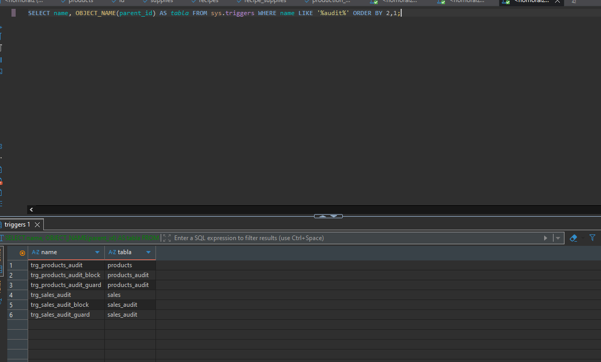

#### Prueba de `products_audit`

Se insertó un producto de prueba (`TEST-001`), se le cambió el precio y se borró. Se usó un producto nuevo para no alterar los datos de las consultas.

```sql
INSERT INTO products (sku, name, description, price, status) VALUES ('TEST-001','Producto de prueba','Prueba de auditoria',1000.00,1);
UPDATE products SET price = 1500.00 WHERE sku = 'TEST-001';
DELETE FROM products WHERE sku = 'TEST-001';
SELECT TOP 3 id, product_id, action, old_data, new_data FROM products_audit ORDER BY id DESC;
```

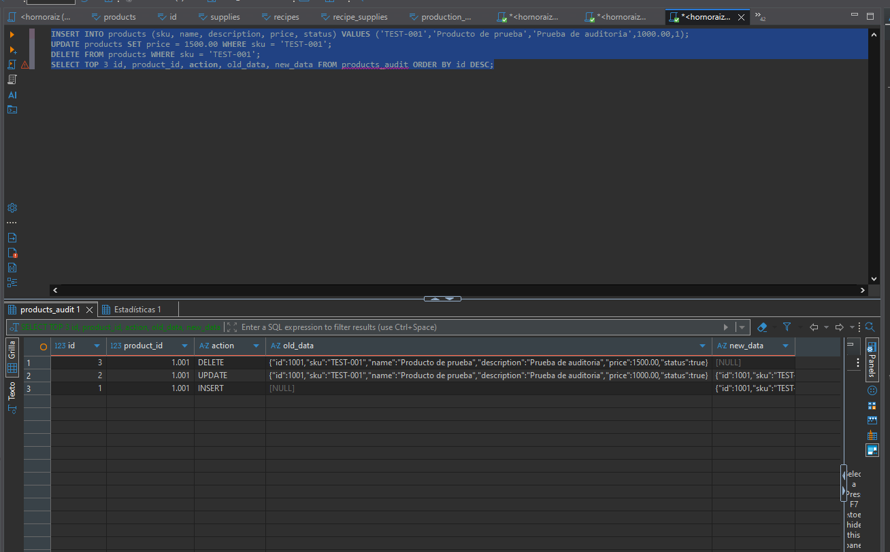

**Resultado:** se registraron las tres operaciones sobre el producto de prueba: el `INSERT` con precio 1000, el `UPDATE` con `old_data` en 1000 y `new_data` en 1500, y el `DELETE` con el estado final (precio 1500). Cada registro guarda la fila completa en JSON, con todas las columnas del producto.

#### Prueba de `sales_audit`

```sql
INSERT INTO sales (client_id, [date], subtotal, taxes, total, status) VALUES (NULL, SYSDATETIME(), 1000, 190, 1190, 'pending');
UPDATE sales SET status = 'paid' WHERE id = (SELECT MAX(id) FROM sales);
DELETE FROM sales WHERE id = (SELECT MAX(id) FROM sales);
SELECT TOP 3 id, sale_id, action, old_data, new_data FROM sales_audit ORDER BY id DESC;
```

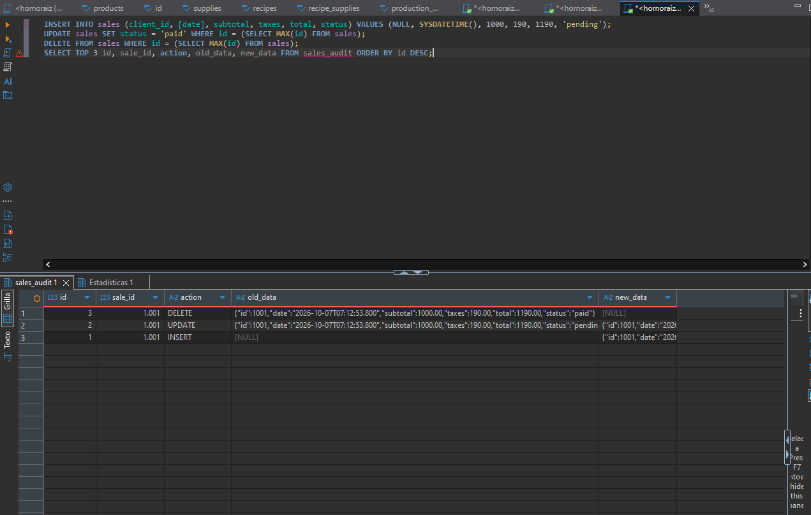

**Resultado:** para la venta de prueba quedaron el `INSERT` en `pending`, el `UPDATE` de `pending` a `paid` y el `DELETE` con el último estado. La auditoría capta el cambio de estado de la venta, que es el dato que más interesa.

#### Pruebas de inmutabilidad

Se intentó alterar las tablas de auditoría. Las cuatro operaciones fueron rechazadas por los triggers de protección:

```sql
UPDATE products_audit SET action = 'X' WHERE id = 1;
DELETE FROM products_audit WHERE id = 1;
INSERT INTO products_audit (product_id, action, old_data, new_data) VALUES (999,'INSERT',NULL,NULL);
UPDATE sales_audit SET action = 'X' WHERE id = 1;
```

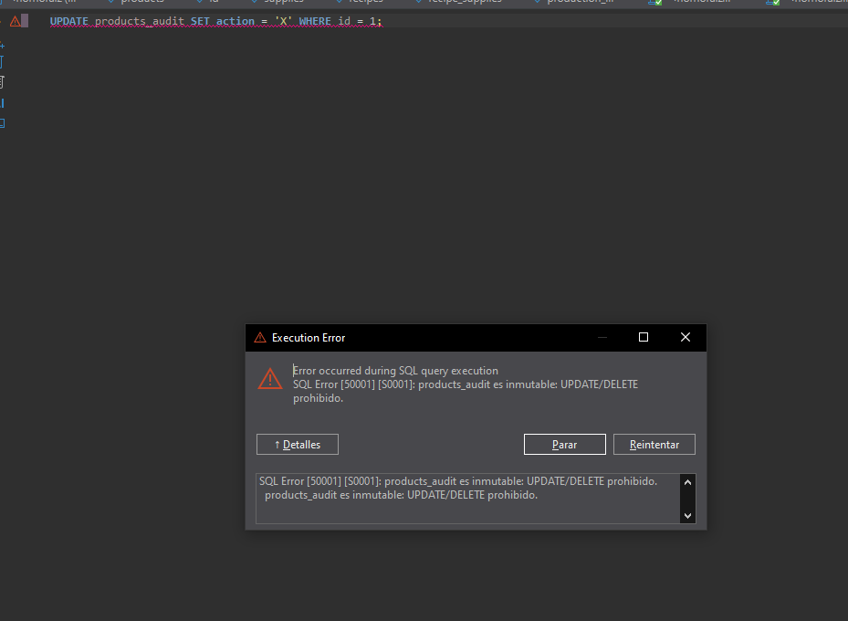

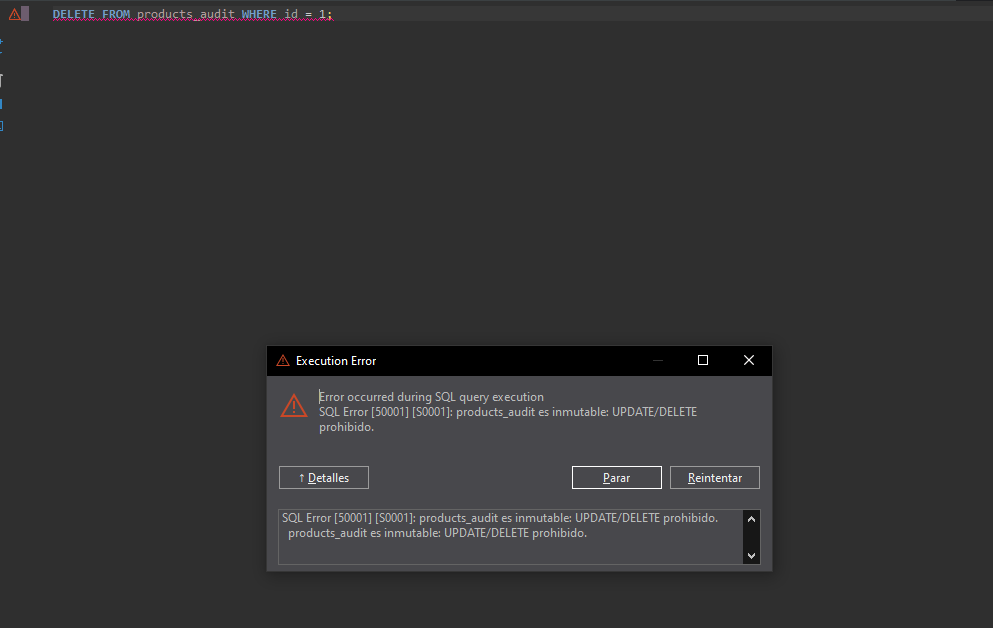

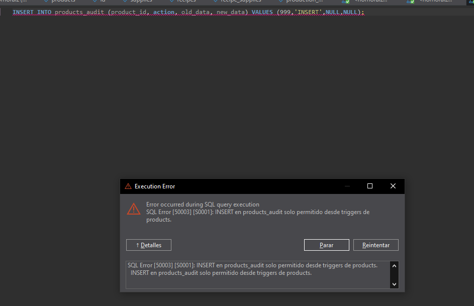

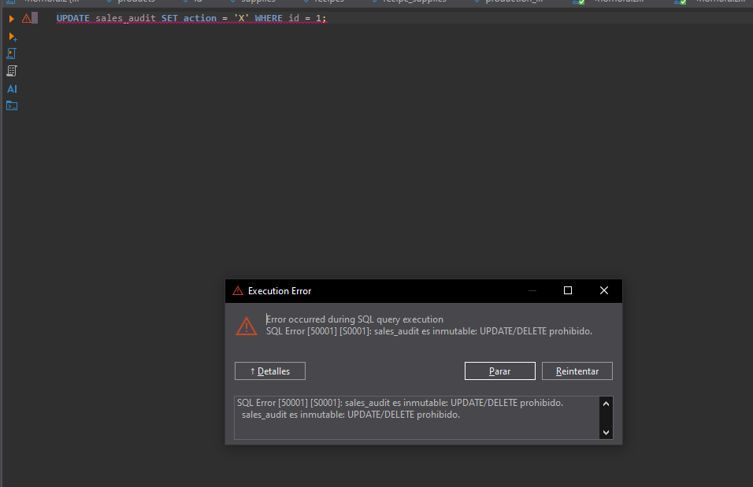

**Resultado:** los mensajes fueron `products_audit es inmutable: UPDATE/DELETE prohibido.` (para el `UPDATE` y para el `DELETE`), `INSERT en products_audit solo permitido desde triggers de products.` y `sales_audit es inmutable: UPDATE/DELETE prohibido.`. Al final, `products` y `sales` quedaron con 100 filas cada una, igual que antes de las pruebas.

**Limitación.** La sentencia `TRUNCATE TABLE` no dispara triggers, así que no queda cubierta por esta protección. Como esa sentencia exige el permiso `ALTER` sobre la tabla, habría que quitárselo sobre las tablas de auditoría a los usuarios que no sean administradores.

### 4.16 Procedimientos almacenados

Las 15 consultas de la sección 4.15 se llevaron a procedimientos almacenados con el nombre `sp_consulta_<número>`, igual que en los otros tres motores.

**Diferencias con los otros motores.** En Oracle un procedimiento no devuelve filas por sí solo. Cada uno abre un cursor (`SYS_REFCURSOR`) con la consulta y lo entrega al cliente con `DBMS_SQL.RETURN_RESULT`, que devuelve un resultado implícito: la grilla aparece al ejecutar el procedimiento, sin tener que leer un cursor aparte como en PostgreSQL. Se ejecuta con un bloque `BEGIN ... END;`.

Se conservaron las particularidades de Oracle ya documentadas en las consultas:

- La columna `date` va entre comillas dobles (`"date"`), porque `DATE` es una palabra reservada (sección 4.2).
- Los alias de tabla se escriben sin `AS`.
- `CONCAT` solo admite dos argumentos, por lo que el patrón `%chocolate%` se arma con dos llamadas anidadas.
- Las fechas de `BETWEEN` se convierten explícitamente con `TO_DATE`.
- `LIKE` distingue mayúsculas de minúsculas, y los nombres del catálogo empiezan en mayúscula, por lo que `'Pan%'` es suficiente.

**Creación.** Cada procedimiento se creó uno por uno desde DBeaver, seleccionando su bloque `CREATE OR REPLACE PROCEDURE ... END;` y ejecutándolo con `Ctrl+Enter`. Después se consultó el diccionario de datos para comprobar que los 15 compilaron sin errores:

```sql
SELECT object_name, status FROM user_objects WHERE object_type = 'PROCEDURE' AND object_name LIKE 'SP_CONSULTA%' ORDER BY object_name;
```

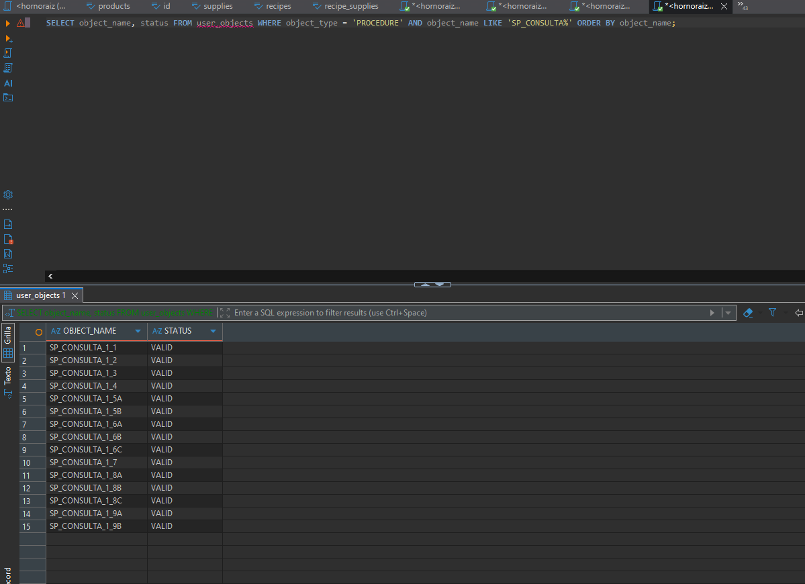

#### 4.16.1 Mostrar algunos de los registros de `products`

**Narrativa:** es el punto de partida para comprobar que el catálogo se cargó completo. Proyecta solo `sku`, `name`, `price` y `status`, en vez de traer la tabla entera.

```sql
CREATE OR REPLACE PROCEDURE sp_consulta_1_1 AS
  c SYS_REFCURSOR;
BEGIN
  OPEN c FOR SELECT sku, name, price, status FROM products;
  DBMS_SQL.RETURN_RESULT(c);
END;
```

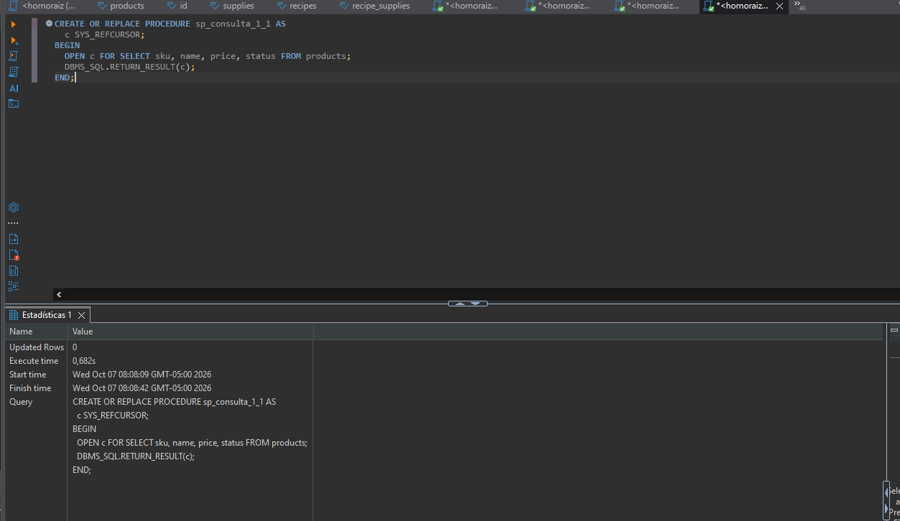

```sql
BEGIN sp_consulta_1_1; END;
```

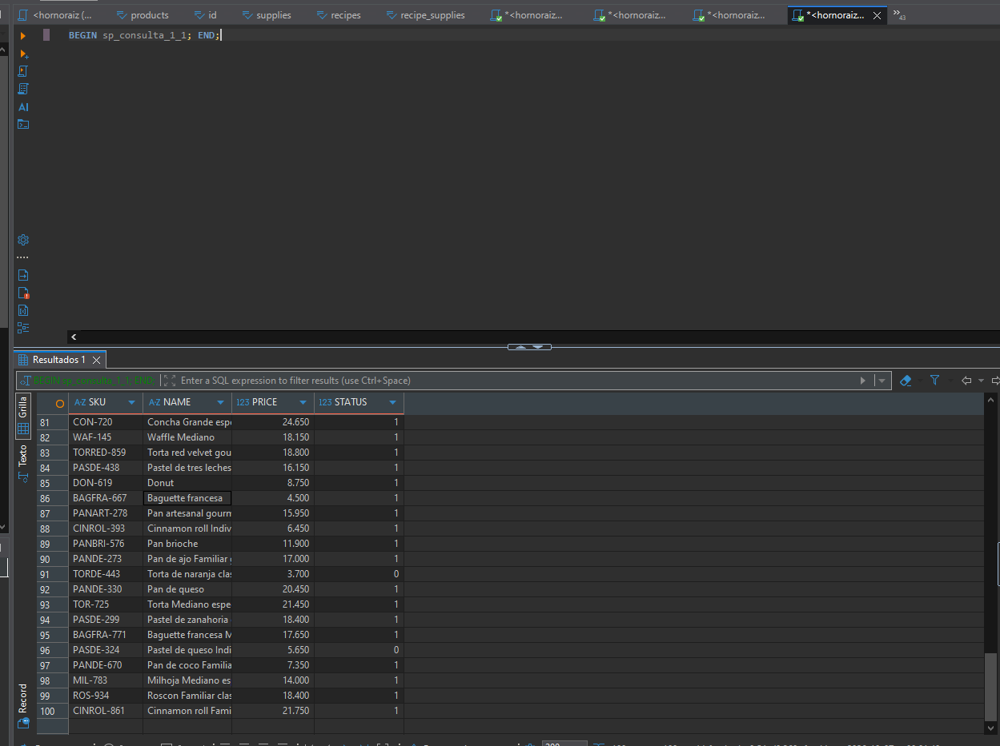

**Resultado:** devolvió 100 productos: 90 con `status = 1` y 10 con `0`, las mismas proporciones de los otros motores. `CIA-859` aparece a $7.950.

#### 4.16.2 Ventas ordenadas de la más reciente a la más antigua

**Narrativa:** responde "¿qué se vendió últimamente?". Usa `ORDER BY "date" DESC` sobre `sales`, de modo que la primera fila sea la venta más nueva.

```sql
CREATE OR REPLACE PROCEDURE sp_consulta_1_2 AS
  c SYS_REFCURSOR;
BEGIN
  OPEN c FOR SELECT id, "date", subtotal, status FROM sales ORDER BY "date" DESC;
  DBMS_SQL.RETURN_RESULT(c);
END;
```

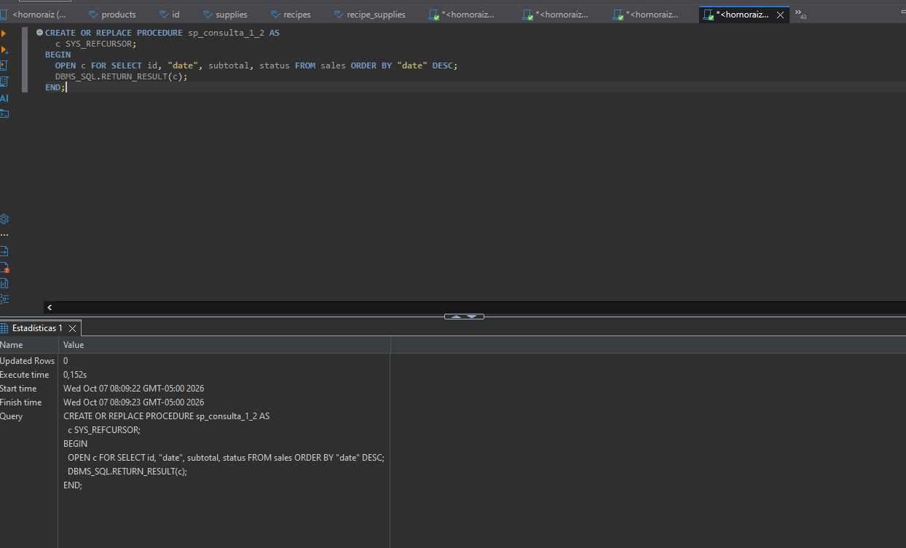

```sql
BEGIN sp_consulta_1_2; END;
```

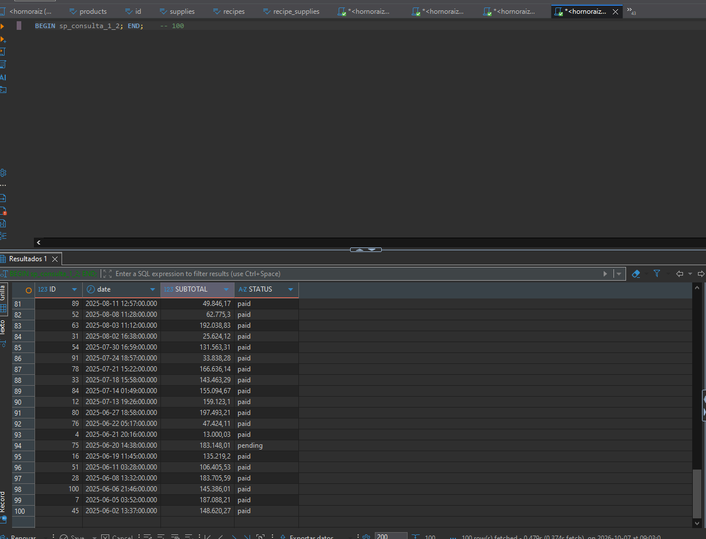

**Resultado:** devolvió las 100 ventas, de la venta 10 (27 de marzo de 2026, pendiente) a la venta 45 (2 de junio de 2025), en el mismo orden que en los otros motores.

#### 4.16.3 Ventas con sus líneas de detalle, relación en `WHERE`

**Narrativa:** relaciona cada línea de `sale_details` con su venta mediante `S.id = SD.header_id` en el `WHERE`. Muestra qué productos y cantidades componen cada venta.

```sql
CREATE OR REPLACE PROCEDURE sp_consulta_1_3 AS
  c SYS_REFCURSOR;
BEGIN
  OPEN c FOR SELECT * FROM sale_details SD, sales S WHERE S.id = SD.header_id;
  DBMS_SQL.RETURN_RESULT(c);
END;
```

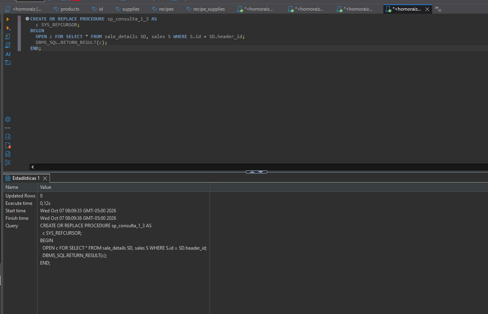

```sql
BEGIN sp_consulta_1_3; END;
```

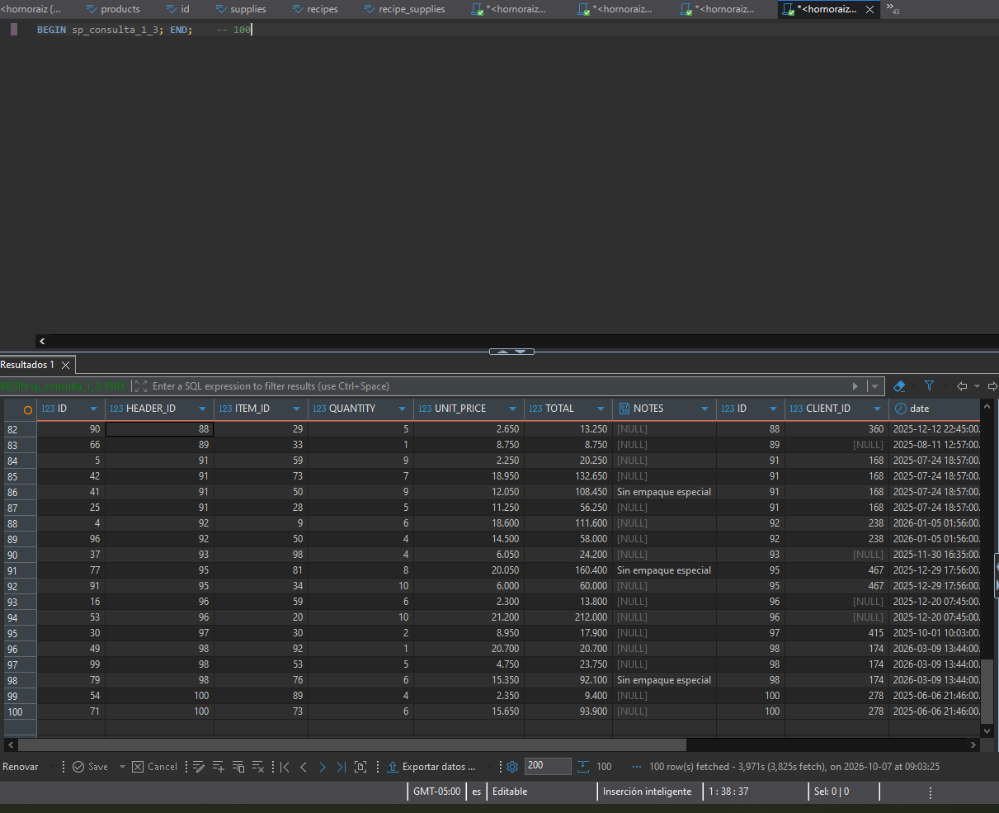

**Resultado:** 100 filas, una por línea de detalle, con las columnas de `sale_details` y de `sales` juntas. Ninguna línea quedó sin venta.

#### 4.16.4 Ventas con sus líneas de detalle, relación con `JOIN`

**Narrativa:** la misma pregunta que la 4.16.3, resuelta con `JOIN ... ON`. Proyecta de `sales` solo la fecha y el estado, y de `sale_details` todas las columnas.

```sql
CREATE OR REPLACE PROCEDURE sp_consulta_1_4 AS
  c SYS_REFCURSOR;
BEGIN
  OPEN c FOR SELECT S."date", S.status, SD.* FROM sales S JOIN sale_details SD ON (S.id = SD.header_id);
  DBMS_SQL.RETURN_RESULT(c);
END;
```

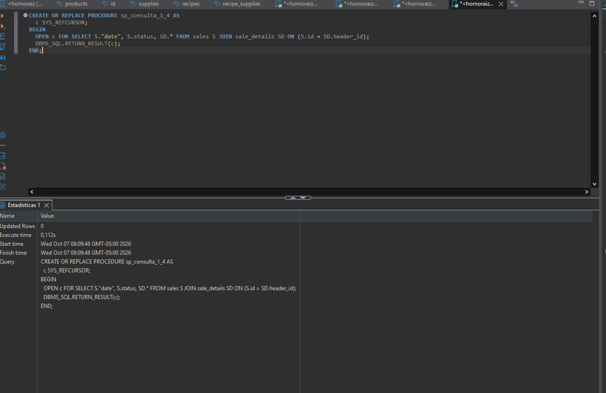

```sql
BEGIN sp_consulta_1_4; END;
```

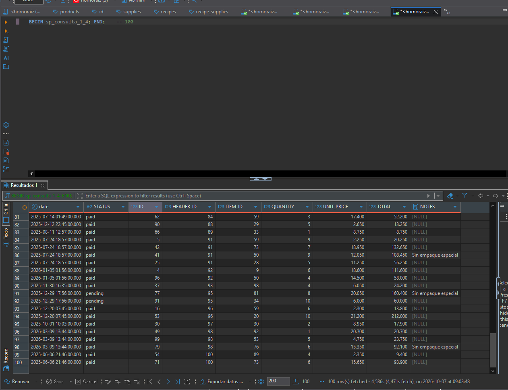

**Resultado:** las mismas 100 filas que el procedimiento anterior, lo que confirma que ambas sintaxis son equivalentes.

#### 4.16.5 Filtro por estado de la venta

**Narrativa:** reparte las líneas de detalle según el estado de su venta. El estado se filtra en `sales`, porque `sale_details` no tiene columna `status`. La primera usa la relación en `WHERE` y mide las ventas pagadas. La segunda usa `JOIN` y aísla las canceladas.

```sql
CREATE OR REPLACE PROCEDURE sp_consulta_1_5a AS
  c SYS_REFCURSOR;
BEGIN
  OPEN c FOR SELECT * FROM sale_details SD, sales S WHERE S.id = SD.header_id AND S.status = 'paid';
  DBMS_SQL.RETURN_RESULT(c);
END;
```

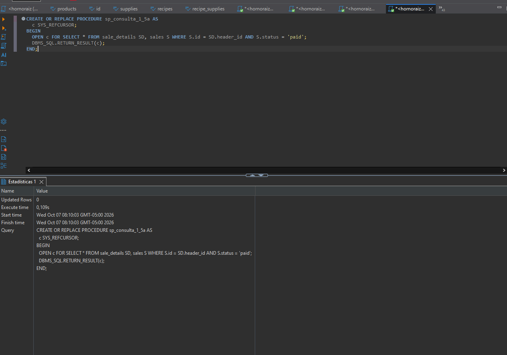

```sql
BEGIN sp_consulta_1_5a; END;
```

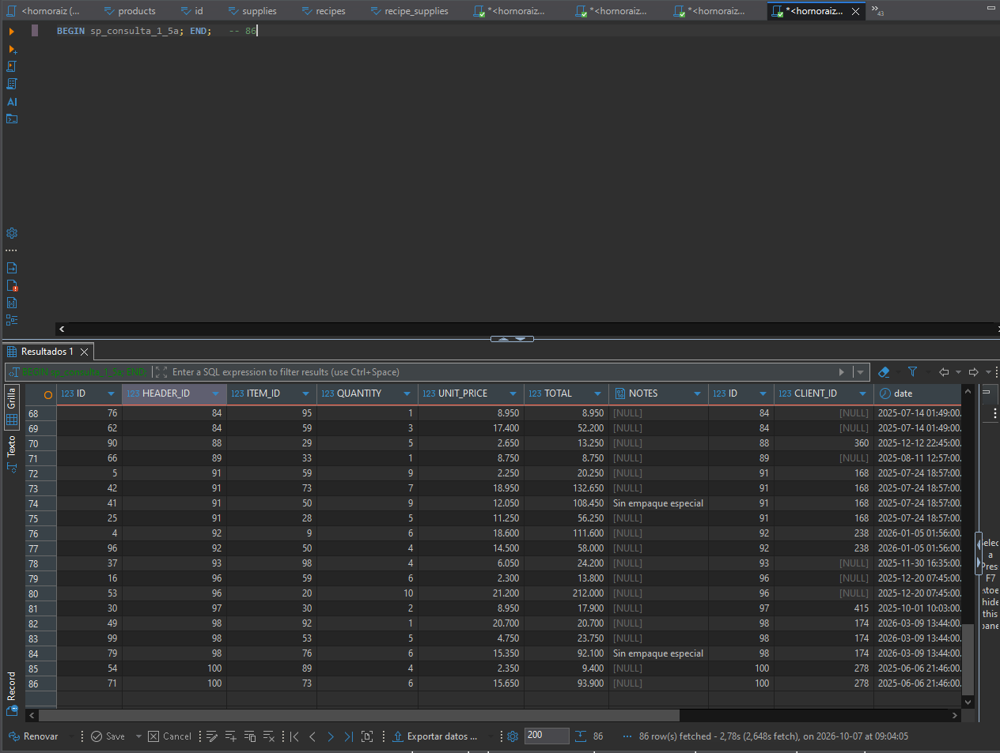

**Resultado:** 86 de las 100 líneas (86 %) pertenecen a ventas pagadas.

```sql
CREATE OR REPLACE PROCEDURE sp_consulta_1_5b AS
  c SYS_REFCURSOR;
BEGIN
  OPEN c FOR SELECT S."date", S.status, SD.* FROM sales S JOIN sale_details SD ON (S.id = SD.header_id) WHERE S.status = 'cancelled';
  DBMS_SQL.RETURN_RESULT(c);
END;
```

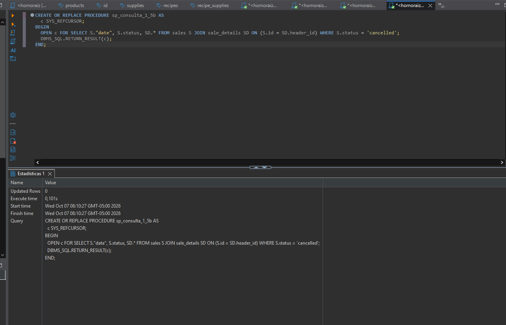

```sql
BEGIN sp_consulta_1_5b; END;
```

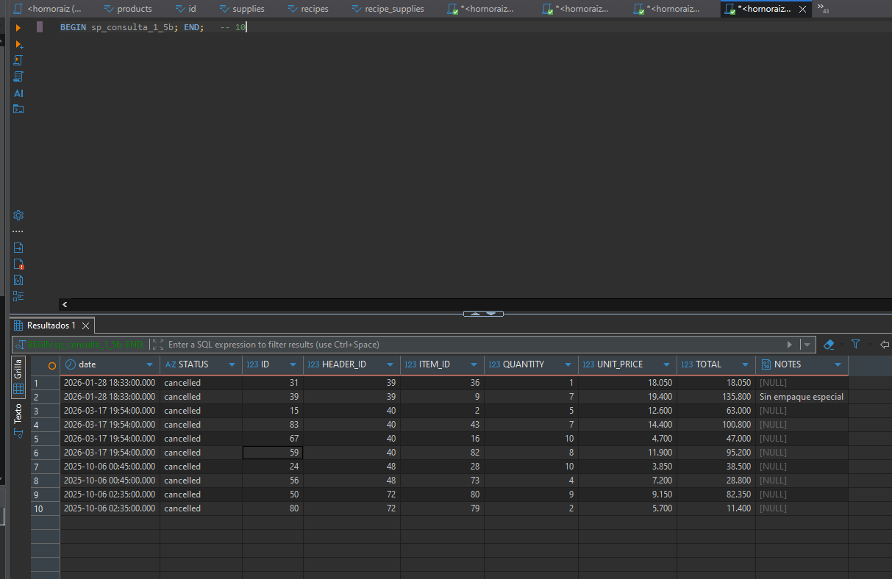

**Resultado:** 10 líneas, que corresponden a 4 ventas canceladas (39, 40, 48 y 72). Las 4 líneas restantes pertenecen a ventas pendientes.

#### 4.16.6 Filtros con `LIKE`

**Narrativa:** tres búsquedas por patrón de texto. La primera lista los productos cuyo nombre empieza por "Pan". La segunda busca la palabra "chocolate" en cualquier posición de la descripción. La tercera combina el texto con el estado de la venta, para ver qué productos "Pan" se cancelaron.

```sql
CREATE OR REPLACE PROCEDURE sp_consulta_1_6a AS
  c SYS_REFCURSOR;
BEGIN
  OPEN c FOR SELECT * FROM products P WHERE P.name LIKE 'Pan%';
  DBMS_SQL.RETURN_RESULT(c);
END;
```

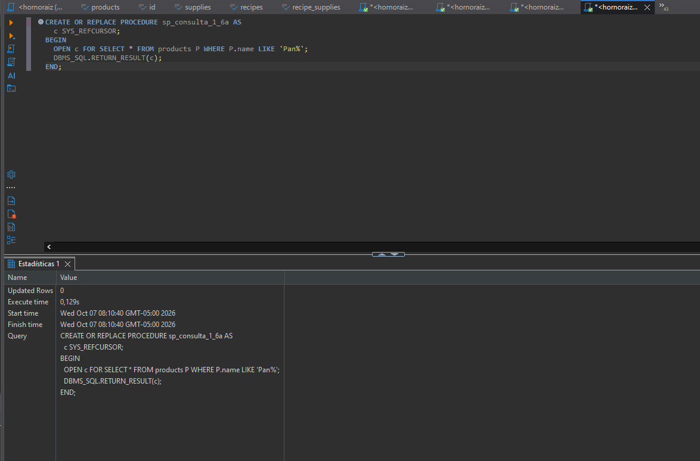

```sql
BEGIN sp_consulta_1_6a; END;
```

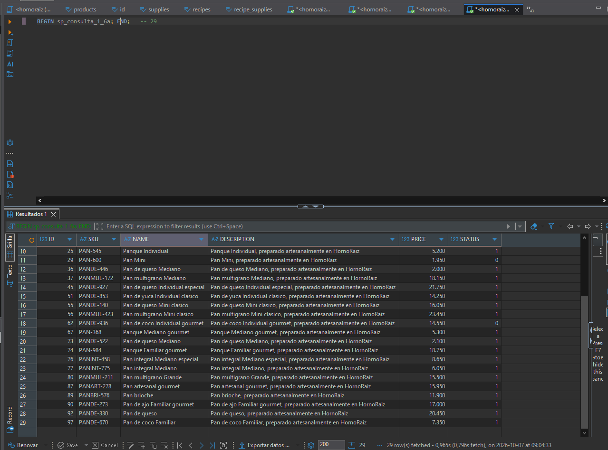

**Resultado:** 29 productos. El patrón incluye también Panettone y Panque, porque solo exige que el nombre comience por "Pan". Dos están inactivos: `PAN-600` y `PANDE-936`.

```sql
CREATE OR REPLACE PROCEDURE sp_consulta_1_6b AS
  c SYS_REFCURSOR;
BEGIN
  OPEN c FOR SELECT * FROM products P WHERE P.description LIKE CONCAT(CONCAT('%','chocolate'),'%');
  DBMS_SQL.RETURN_RESULT(c);
END;
```

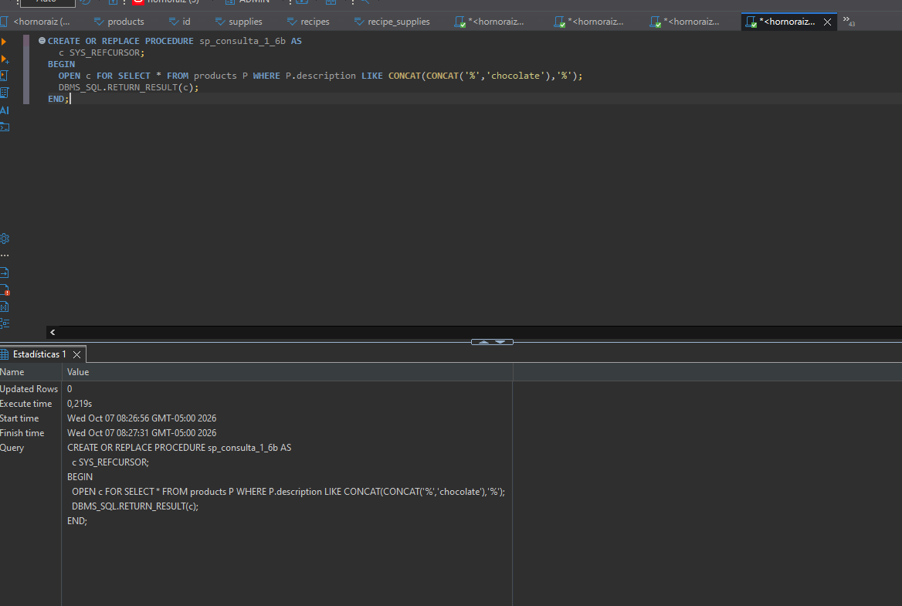

```sql
BEGIN sp_consulta_1_6b; END;
```

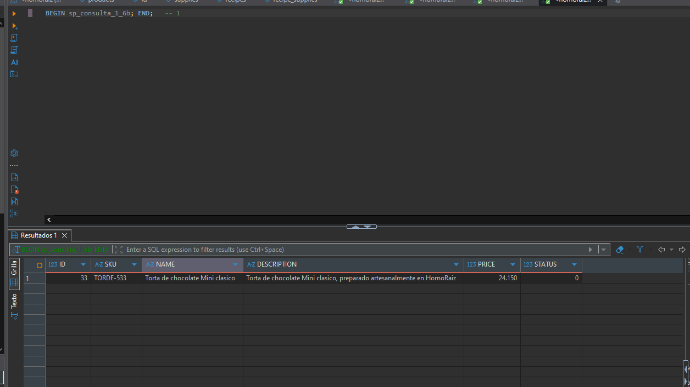

**Resultado:** un solo producto, `Torta de chocolate Mini clasico` (`TORDE-533`, $24.150), que además está inactivo. Como `CONCAT` solo acepta dos argumentos en Oracle, el patrón `%chocolate%` se arma con dos llamadas anidadas.

```sql
CREATE OR REPLACE PROCEDURE sp_consulta_1_6c AS
  c SYS_REFCURSOR;
BEGIN
  OPEN c FOR SELECT S."date", S.status, P.name
    FROM sales S
    JOIN sale_details SD ON (S.id = SD.header_id)
    JOIN products P ON (P.id = SD.item_id)
    WHERE S.status = 'cancelled' AND P.name LIKE 'Pan%';
  DBMS_SQL.RETURN_RESULT(c);
END;
```

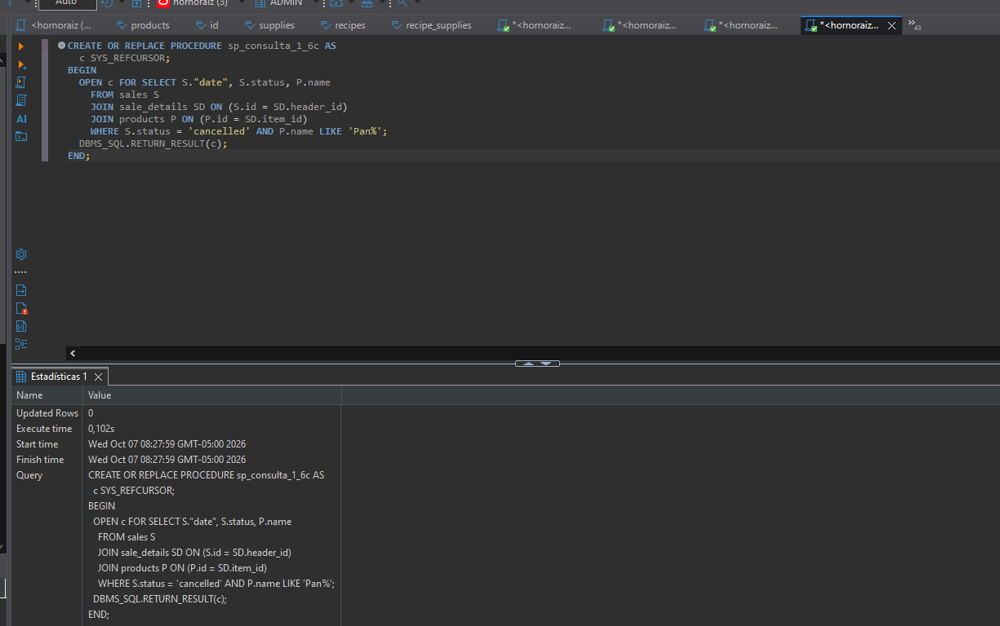

```sql
BEGIN sp_consulta_1_6c; END;
```

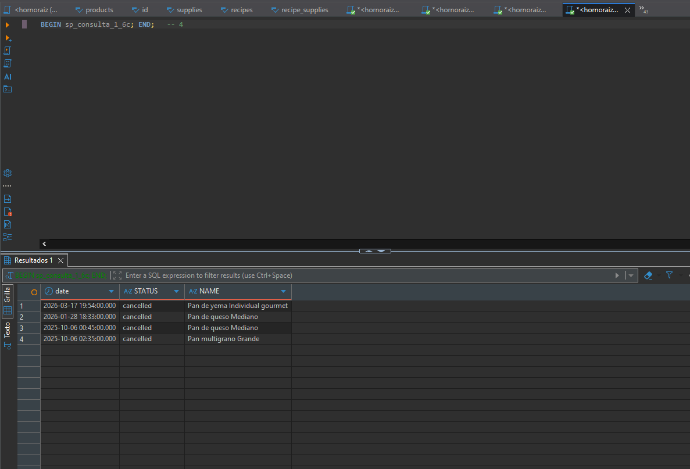

**Resultado:** 4 filas: `Pan de yema Individual gourmet`, dos de `Pan de queso Mediano` y `Pan multigrano Grande`. De las 10 líneas canceladas, 4 son panes.

#### 4.16.7 Filtro con `BETWEEN` sobre cuatro tablas

**Narrativa:** responde "¿qué productos se vendieron y cómo se pagaron entre el 1 de junio de 2025 y el 30 de marzo de 2026?". Encadena `products`, `sale_details`, `sales` y `payments`. Como `payments.reference_id` apunta a la venta, la unión exige también `reference_type = 'sale'`. `BETWEEN` acota la fecha del pago, con las dos fechas convertidas con `TO_DATE`.

```sql
CREATE OR REPLACE PROCEDURE sp_consulta_1_7 AS
  c SYS_REFCURSOR;
BEGIN
  OPEN c FOR SELECT P.name, P.sku, SD.quantity, SD.total, S."date", PAY.method
    FROM products P
    JOIN sale_details SD ON P.id = SD.item_id
    JOIN sales S ON SD.header_id = S.id
    JOIN payments PAY ON PAY.reference_id = S.id AND PAY.reference_type = 'sale'
    WHERE PAY."date" BETWEEN TO_DATE('2025-06-01','YYYY-MM-DD') AND TO_DATE('2026-03-30','YYYY-MM-DD')
    ORDER BY PAY."date" ASC;
  DBMS_SQL.RETURN_RESULT(c);
END;
```

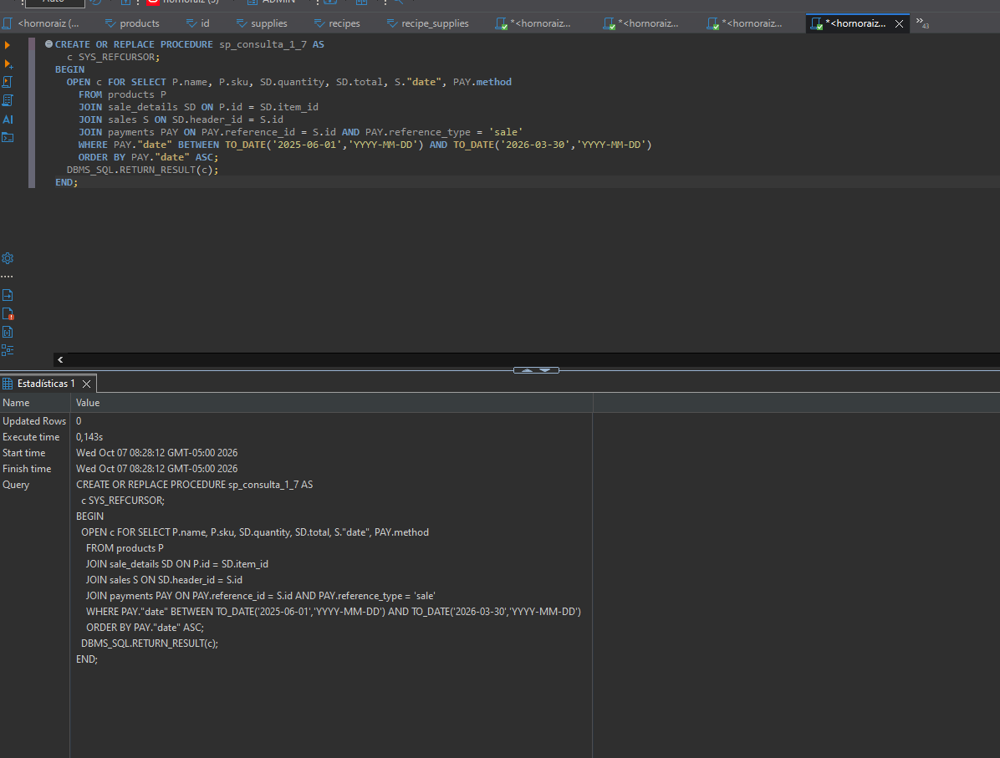

```sql
BEGIN sp_consulta_1_7; END;
```

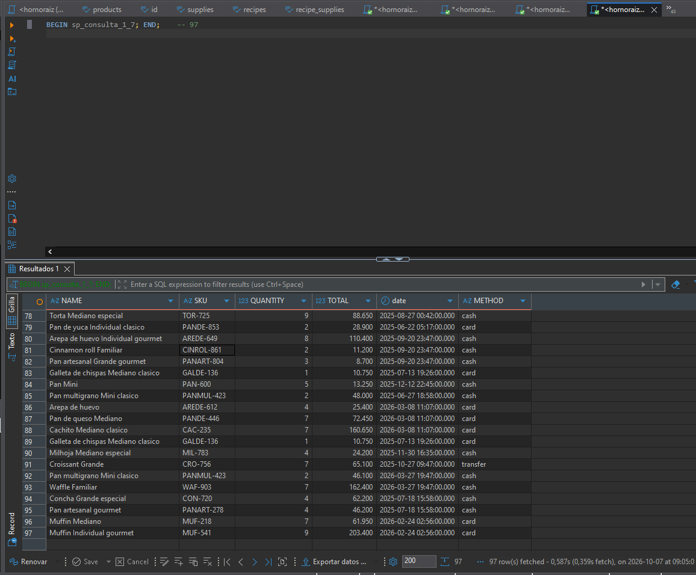

**Resultado:** 97 filas. Una misma línea de venta se repite cuando la venta tiene varios pagos, por ejemplo el `Pan de leche Mini` pagado en efectivo y con tarjeta. Es el resultado esperado de unir dos relaciones 1:N sobre la misma venta.

#### 4.16.8 Agrupamiento con `GROUP BY` y `HAVING`

**Narrativa:** tres resúmenes de pagos por venta con `SUM`, `COUNT` y `AVG`. Responden cuánto se pagó por cada venta, cuántos pagos fueron y cuál fue el promedio. Las dos primeras acotan las filas con `WHERE` antes de agrupar: la primera por rango de fechas y la segunda por estado y método de pago. La tercera filtra con `HAVING` después de agrupar, porque la condición depende de la suma ya calculada.

```sql
CREATE OR REPLACE PROCEDURE sp_consulta_1_8a AS
  c SYS_REFCURSOR;
BEGIN
  OPEN c FOR SELECT S.id, S."date", SUM(PAY.amount) AS total_paid, COUNT(PAY.id) AS payment_count, AVG(PAY.amount) AS avg_payment
    FROM sales S
    JOIN payments PAY ON PAY.reference_id = S.id AND PAY.reference_type = 'sale'
    WHERE PAY."date" BETWEEN TO_DATE('2025-06-01','YYYY-MM-DD') AND TO_DATE('2026-03-30','YYYY-MM-DD')
    GROUP BY S.id, S."date"
    ORDER BY total_paid DESC;
  DBMS_SQL.RETURN_RESULT(c);
END;
```

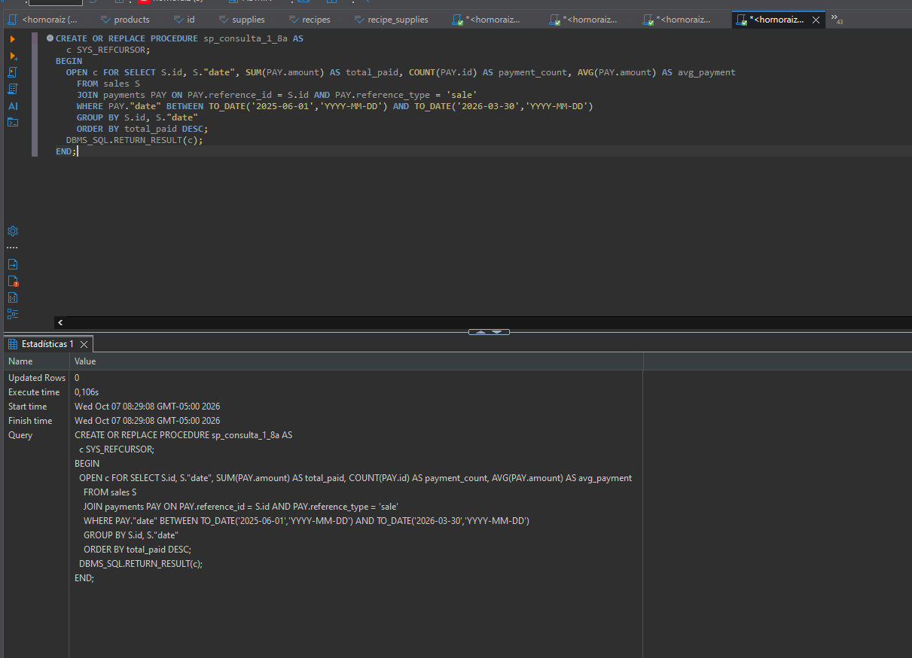

```sql
BEGIN sp_consulta_1_8a; END;
```

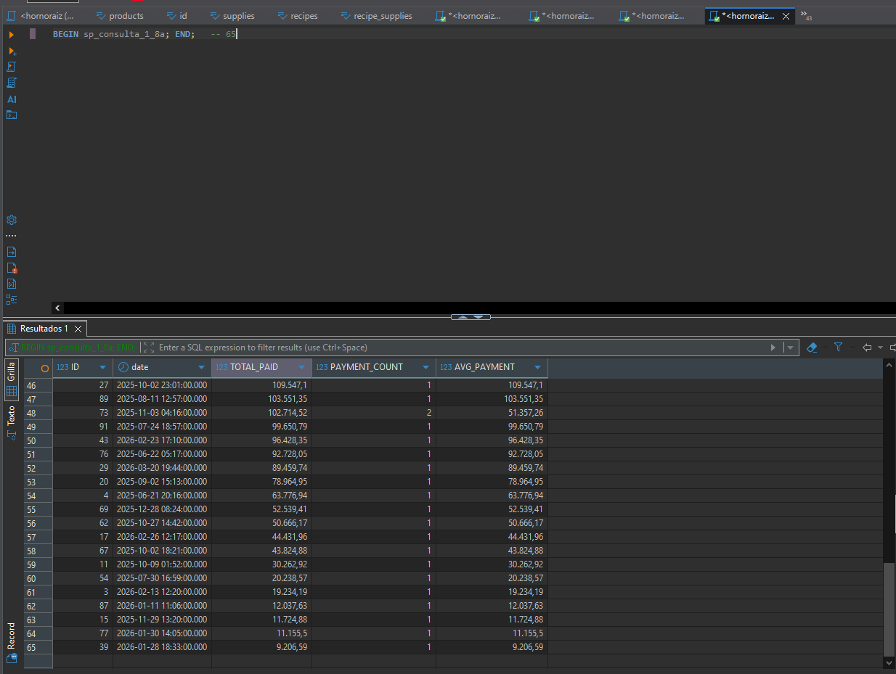

**Resultado:** 65 ventas con pagos en el rango. La venta 52 encabeza con $942.692,25 en 6 pagos. `AVG` sobre `NUMBER` en Oracle muestra muchos decimales cuando la división no es exacta.

```sql
CREATE OR REPLACE PROCEDURE sp_consulta_1_8b AS
  c SYS_REFCURSOR;
BEGIN
  OPEN c FOR SELECT S.id, S."date", SUM(PAY.amount) AS total_paid, COUNT(PAY.id) AS payment_count
    FROM sales S
    JOIN payments PAY ON PAY.reference_id = S.id AND PAY.reference_type = 'sale'
    WHERE PAY.status = 'completed' AND PAY.method = 'card'
    GROUP BY S.id, S."date"
    ORDER BY total_paid DESC;
  DBMS_SQL.RETURN_RESULT(c);
END;
```

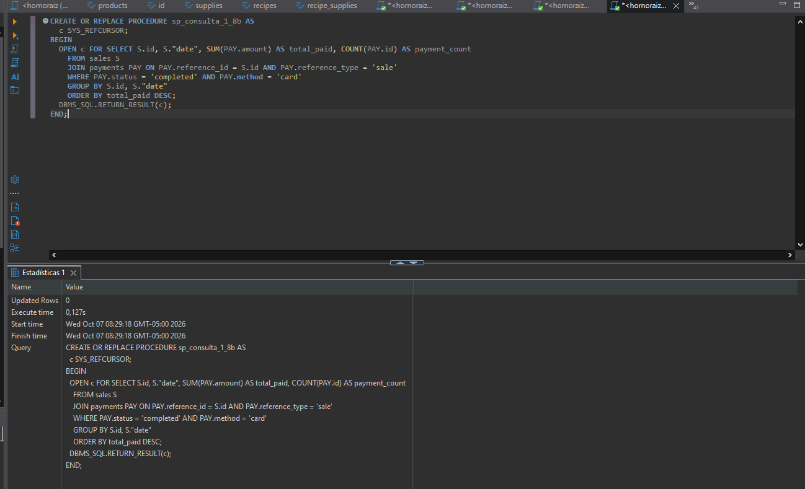

```sql
BEGIN sp_consulta_1_8b; END;
```

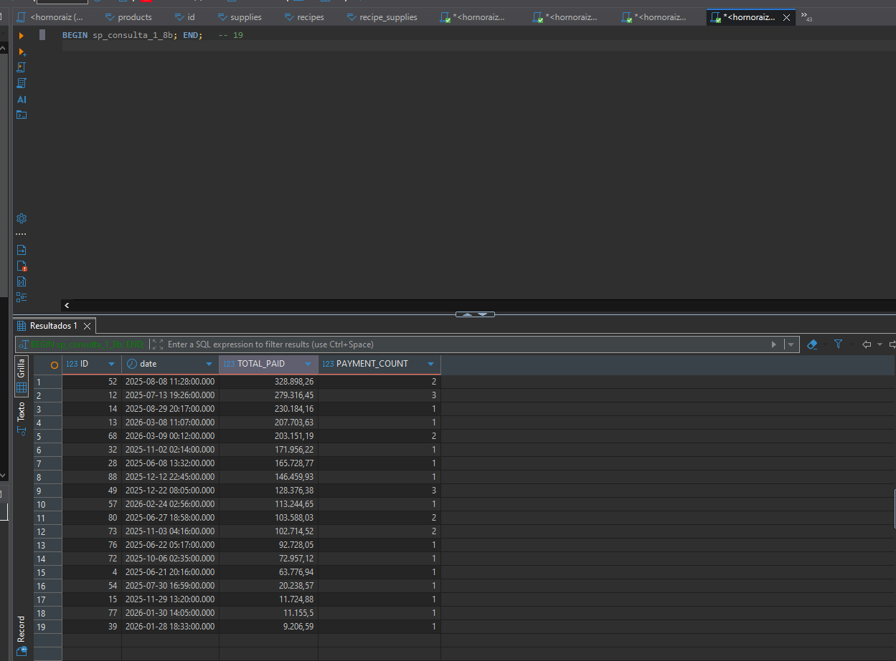

**Resultado:** 19 ventas tienen pagos con tarjeta ya completados. La venta 52 vuelve a encabezar, con $328.898,26 en 2 pagos.

```sql
CREATE OR REPLACE PROCEDURE sp_consulta_1_8c AS
  c SYS_REFCURSOR;
BEGIN
  OPEN c FOR SELECT S.id, S."date", SUM(PAY.amount) AS total_paid, COUNT(PAY.id) AS payment_count
    FROM sales S
    JOIN payments PAY ON PAY.reference_id = S.id AND PAY.reference_type = 'sale'
    GROUP BY S.id, S."date"
    HAVING SUM(PAY.amount) >= 100000
    ORDER BY total_paid DESC;
  DBMS_SQL.RETURN_RESULT(c);
END;
```

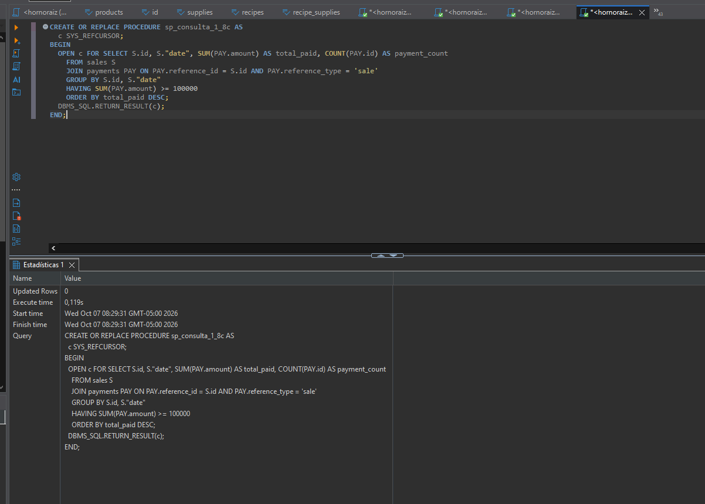

```sql
BEGIN sp_consulta_1_8c; END;
```

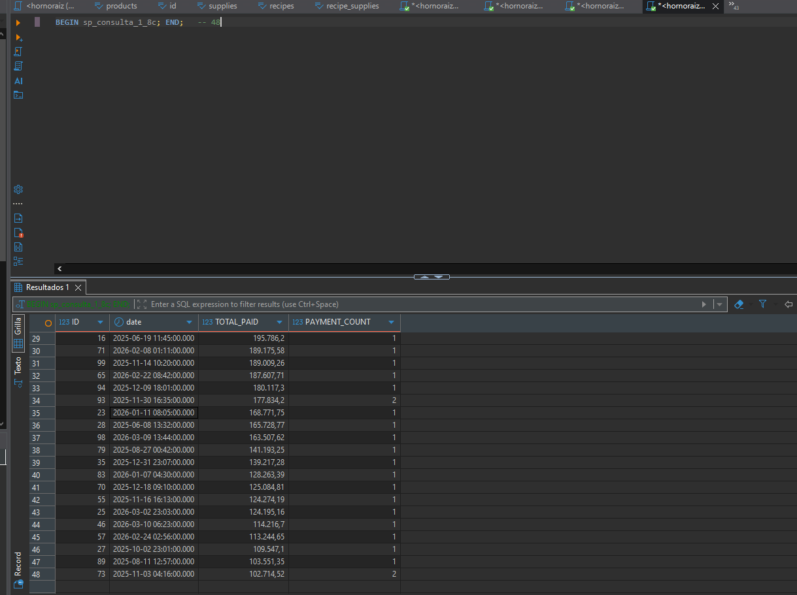

**Resultado:** 48 ventas acumulan $100.000 o más en pagos, y la venta 52 vuelve a ser la mayor, con $942.692,25. Esta consulta no lleva filtro de fechas, así que considera todos los pagos registrados.

#### 4.16.9 Subconsultas y teoría de conjuntos

**Narrativa:** responde "¿qué productos no se vendieron entre el 1 de junio de 2025 y el 30 de marzo de 2026?". Es una diferencia de conjuntos: todos los productos menos los que aparecen en alguna línea de venta del rango. La primera forma usa `NOT IN` con una subconsulta. La segunda usa `LEFT JOIN` con `WHERE S.id IS NULL`.

```sql
CREATE OR REPLACE PROCEDURE sp_consulta_1_9a AS
  c SYS_REFCURSOR;
BEGIN
  OPEN c FOR SELECT * FROM products P
    WHERE P.id NOT IN (
      SELECT SD.item_id FROM sale_details SD
      JOIN sales S ON SD.header_id = S.id
      WHERE S."date" BETWEEN TO_DATE('2025-06-01','YYYY-MM-DD') AND TO_DATE('2026-03-30','YYYY-MM-DD'));
  DBMS_SQL.RETURN_RESULT(c);
END;
```

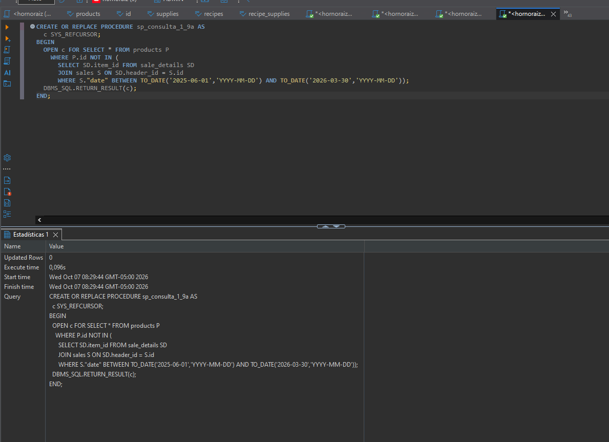

```sql
BEGIN sp_consulta_1_9a; END;
```

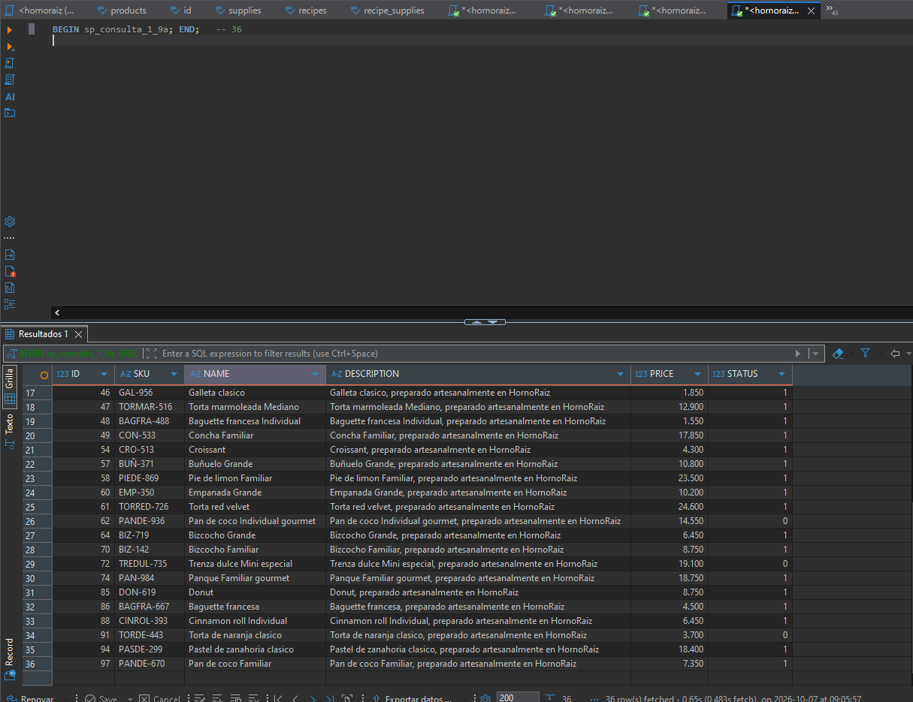

**Resultado:** 36 de los 100 productos no tuvieron ventas en el rango, y los otros 64 sí se vendieron al menos una vez.

```sql
CREATE OR REPLACE PROCEDURE sp_consulta_1_9b AS
  c SYS_REFCURSOR;
BEGIN
  OPEN c FOR SELECT * FROM products P
    LEFT JOIN sale_details SD ON (P.id = SD.item_id)
    LEFT JOIN sales S ON (SD.header_id = S.id AND S."date" BETWEEN TO_DATE('2025-06-01','YYYY-MM-DD') AND TO_DATE('2026-03-30','YYYY-MM-DD'))
    WHERE S.id IS NULL;
  DBMS_SQL.RETURN_RESULT(c);
END;
```

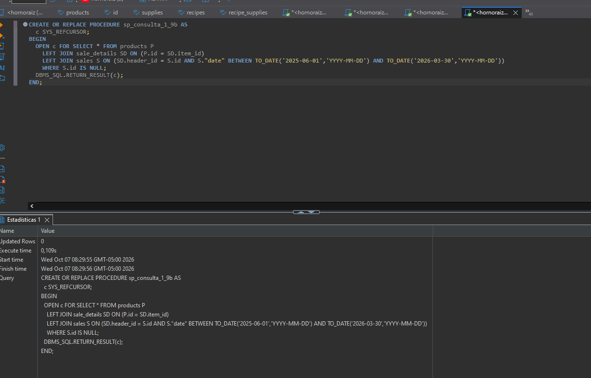

```sql
BEGIN sp_consulta_1_9b; END;
```

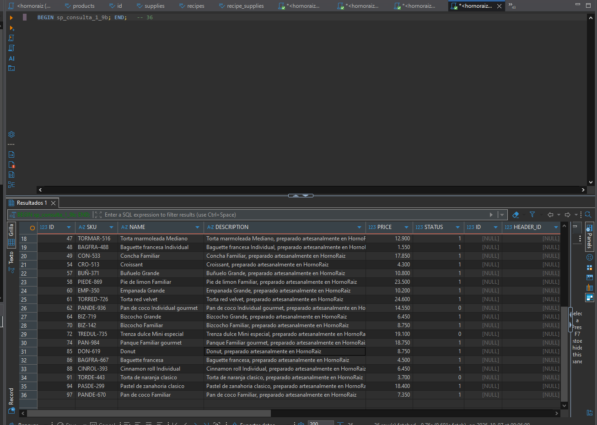

**Resultado:** los mismos 36 productos que la forma con `NOT IN`, lo que confirma que ambas expresiones de la diferencia de conjuntos son equivalentes.

### 4.17 Triggers de auditoría

Se crearon las tablas `products_audit` y `sales_audit`, que registran automáticamente cada inserción, actualización o eliminación sobre `products` y `sales`. Se eligieron estas dos tablas porque sus cambios pesan más en el negocio: el precio de un producto y el estado de una venta. Cada fila de auditoría guarda el estado anterior (`old_data`) y el posterior (`new_data`) en formato JSON, con la fecha del cambio.

Cada tabla de auditoría tiene tres protecciones: un trigger de registro sobre la tabla original, uno que bloquea cualquier `UPDATE` o `DELETE` sobre la tabla de auditoría y uno que rechaza un `INSERT` directo que no venga del trigger de registro.

**Diferencias con los otros motores.**

- Oracle sí tiene triggers `BEFORE`, como MySQL, y trabaja por fila (`FOR EACH ROW`) con los valores `:OLD` y `:NEW`.
- Un solo trigger cubre los tres eventos (`AFTER INSERT OR UPDATE OR DELETE`), y los predicados `INSERTING`, `UPDATING` y `DELETING` indican cuál ocurrió.
- El JSON se arma con la función nativa `JSON_OBJECT(... VALUE ...)` y se guarda en una columna `CLOB`. Se serializan las columnas principales de cada tabla (`id`, `sku`, `name`, `price` y `status` en productos; `id`, `client_id`, `date`, `total` y `status` en ventas), no la fila completa como en PostgreSQL.
- La marca que autoriza el `INSERT` es una variable de un paquete (`audit_ctx.from_trigger`). Se activa antes de insertar en la auditoría y se limpia después. Al ser una variable de paquete, su valor es propio de cada sesión.
- Los errores se lanzan con `RAISE_APPLICATION_ERROR` y códigos definidos por el usuario: `-20001` para el bloqueo de `UPDATE` y `DELETE`, y `-20003` para el `INSERT` directo.
- La columna `date` de `sales` se escribe entre comillas dobles (`:NEW."date"`), por ser `DATE` una palabra reservada (sección 4.2).

**Creación por terminal.** El script crea el paquete, las dos tablas y los seis triggers. Se ejecutó desde un archivo con `sqlplus` en la VPS, que interpreta el terminador `/` de cada bloque PL/SQL y corre todo de una vez.

```sql
CREATE OR REPLACE PACKAGE audit_ctx AS
  from_trigger NUMBER := 0;
END audit_ctx;
/
CREATE TABLE products_audit (
  id NUMBER GENERATED BY DEFAULT AS IDENTITY PRIMARY KEY,
  product_id NUMBER NOT NULL,
  action VARCHAR2(10) NOT NULL,
  old_data CLOB,
  new_data CLOB,
  changed_at TIMESTAMP DEFAULT SYSTIMESTAMP NOT NULL
);
CREATE TABLE sales_audit (
  id NUMBER GENERATED BY DEFAULT AS IDENTITY PRIMARY KEY,
  sale_id NUMBER NOT NULL,
  action VARCHAR2(10) NOT NULL,
  old_data CLOB,
  new_data CLOB,
  changed_at TIMESTAMP DEFAULT SYSTIMESTAMP NOT NULL
);
CREATE OR REPLACE TRIGGER trg_products_audit
AFTER INSERT OR UPDATE OR DELETE ON products
FOR EACH ROW
BEGIN
  audit_ctx.from_trigger := 1;
  IF INSERTING THEN
    INSERT INTO products_audit (product_id, action, old_data, new_data)
    VALUES (:NEW.id, 'INSERT', NULL, JSON_OBJECT('id' VALUE :NEW.id, 'sku' VALUE :NEW.sku, 'name' VALUE :NEW.name, 'price' VALUE :NEW.price, 'status' VALUE :NEW.status));
  ELSIF UPDATING THEN
    INSERT INTO products_audit (product_id, action, old_data, new_data)
    VALUES (:NEW.id, 'UPDATE',
      JSON_OBJECT('id' VALUE :OLD.id, 'sku' VALUE :OLD.sku, 'name' VALUE :OLD.name, 'price' VALUE :OLD.price, 'status' VALUE :OLD.status),
      JSON_OBJECT('id' VALUE :NEW.id, 'sku' VALUE :NEW.sku, 'name' VALUE :NEW.name, 'price' VALUE :NEW.price, 'status' VALUE :NEW.status));
  ELSE
    INSERT INTO products_audit (product_id, action, old_data, new_data)
    VALUES (:OLD.id, 'DELETE', JSON_OBJECT('id' VALUE :OLD.id, 'sku' VALUE :OLD.sku, 'name' VALUE :OLD.name, 'price' VALUE :OLD.price, 'status' VALUE :OLD.status), NULL);
  END IF;
  audit_ctx.from_trigger := 0;
END;
/
CREATE OR REPLACE TRIGGER trg_sales_audit
AFTER INSERT OR UPDATE OR DELETE ON sales
FOR EACH ROW
BEGIN
  audit_ctx.from_trigger := 1;
  IF INSERTING THEN
    INSERT INTO sales_audit (sale_id, action, old_data, new_data)
    VALUES (:NEW.id, 'INSERT', NULL, JSON_OBJECT('id' VALUE :NEW.id, 'client_id' VALUE :NEW.client_id, 'date' VALUE :NEW."date", 'total' VALUE :NEW.total, 'status' VALUE :NEW.status));
  ELSIF UPDATING THEN
    INSERT INTO sales_audit (sale_id, action, old_data, new_data)
    VALUES (:NEW.id, 'UPDATE',
      JSON_OBJECT('id' VALUE :OLD.id, 'client_id' VALUE :OLD.client_id, 'date' VALUE :OLD."date", 'total' VALUE :OLD.total, 'status' VALUE :OLD.status),
      JSON_OBJECT('id' VALUE :NEW.id, 'client_id' VALUE :NEW.client_id, 'date' VALUE :NEW."date", 'total' VALUE :NEW.total, 'status' VALUE :NEW.status));
  ELSE
    INSERT INTO sales_audit (sale_id, action, old_data, new_data)
    VALUES (:OLD.id, 'DELETE', JSON_OBJECT('id' VALUE :OLD.id, 'client_id' VALUE :OLD.client_id, 'date' VALUE :OLD."date", 'total' VALUE :OLD.total, 'status' VALUE :OLD.status), NULL);
  END IF;
  audit_ctx.from_trigger := 0;
END;
/
CREATE OR REPLACE TRIGGER trg_products_audit_block
BEFORE UPDATE OR DELETE ON products_audit
FOR EACH ROW
BEGIN
  RAISE_APPLICATION_ERROR(-20001, 'products_audit es inmutable: UPDATE/DELETE prohibido.');
END;
/
CREATE OR REPLACE TRIGGER trg_products_audit_guard
BEFORE INSERT ON products_audit
FOR EACH ROW
BEGIN
  IF audit_ctx.from_trigger <> 1 THEN
    RAISE_APPLICATION_ERROR(-20003, 'INSERT en products_audit solo permitido desde triggers de products.');
  END IF;
END;
/
CREATE OR REPLACE TRIGGER trg_sales_audit_block
BEFORE UPDATE OR DELETE ON sales_audit
FOR EACH ROW
BEGIN
  RAISE_APPLICATION_ERROR(-20001, 'sales_audit es inmutable: UPDATE/DELETE prohibido.');
END;
/
CREATE OR REPLACE TRIGGER trg_sales_audit_guard
BEFORE INSERT ON sales_audit
FOR EACH ROW
BEGIN
  IF audit_ctx.from_trigger <> 1 THEN
    RAISE_APPLICATION_ERROR(-20003, 'INSERT en sales_audit solo permitido desde triggers de sales.');
  END IF;
END;
/
```

```bash
docker exec -i oracle-server sqlplus -s admin/****@//localhost:1521/hornoraiz < ~/oracle-triggers.sql
```

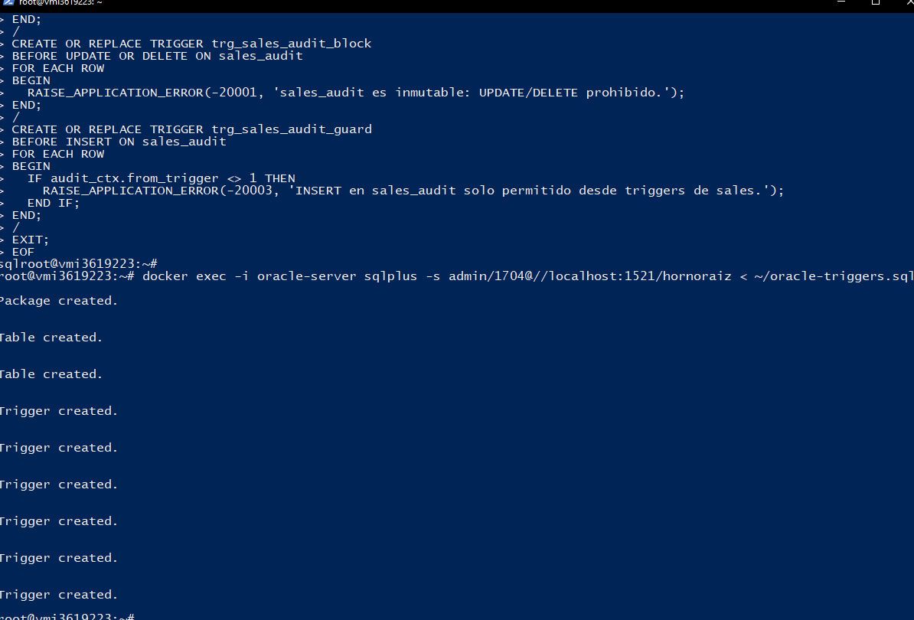

**Verificación.** Desde DBeaver se comprobó que los seis triggers quedaron habilitados y que el diccionario de errores de compilación está vacío:

```sql
SELECT trigger_name, table_name, status FROM user_triggers WHERE trigger_name LIKE '%AUDIT%' ORDER BY 2,1;
SELECT name, type, line, text FROM user_errors;
```

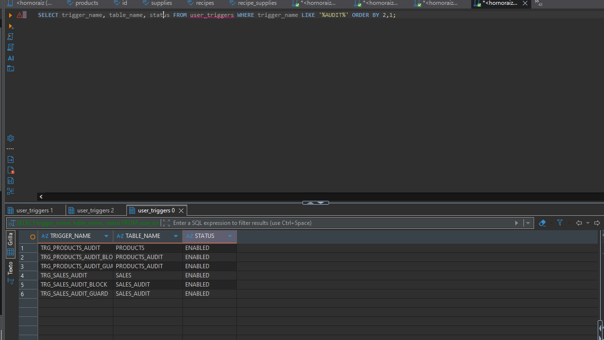

#### Prueba de `products_audit`

Los datos se cargaron con ids propios (1 a 100), por lo que las pruebas usan un `id` explícito (9001). Se insertó un producto de prueba, se le cambió el precio y se borró.

```sql
INSERT INTO products (id, sku, name, description, price, status) VALUES (9001,'TEST-001','Producto de prueba','Prueba de auditoria',1000,1);
UPDATE products SET price = 1500 WHERE id = 9001;
DELETE FROM products WHERE id = 9001;
SELECT id, product_id, action, old_data, new_data FROM products_audit ORDER BY id DESC FETCH FIRST 3 ROWS ONLY;
```

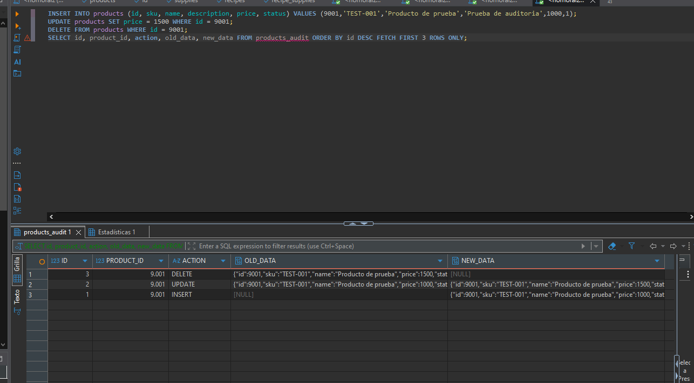

**Resultado:** se registraron las tres operaciones sobre el producto 9001: el `INSERT` con precio 1000, el `UPDATE` con `old_data` en 1000 y `new_data` en 1500, y el `DELETE` con el estado final (precio 1500).

#### Prueba de `sales_audit`

```sql
INSERT INTO sales (id, client_id, "date", subtotal, taxes, total, status) VALUES (9001, NULL, SYSTIMESTAMP, 1000, 190, 1190, 'pending');
UPDATE sales SET status = 'paid' WHERE id = 9001;
DELETE FROM sales WHERE id = 9001;
SELECT id, sale_id, action, old_data, new_data FROM sales_audit ORDER BY id DESC FETCH FIRST 3 ROWS ONLY;
```

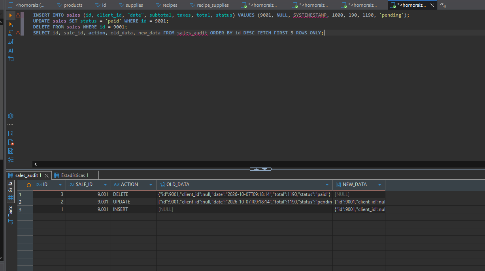

**Resultado:** para la venta 9001 quedaron el `INSERT` en `pending`, el `UPDATE` de `pending` a `paid` y el `DELETE` con el último estado. La auditoría capta el cambio de estado de la venta, que es el dato que más interesa.

#### Pruebas de inmutabilidad

Con las dos tablas de auditoría ya con filas, se intentó alterarlas. Las cuatro operaciones fueron rechazadas por los triggers de protección:

```sql
UPDATE products_audit SET action = 'X' WHERE id = 1;
DELETE FROM products_audit WHERE id = 1;
INSERT INTO products_audit (product_id, action, old_data, new_data) VALUES (999,'INSERT',NULL,NULL);
UPDATE sales_audit SET action = 'X' WHERE id = 1;
```

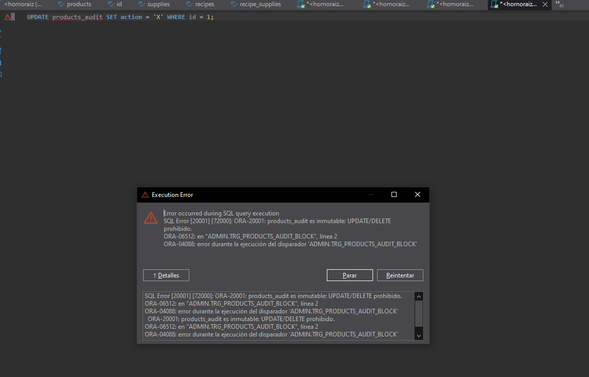

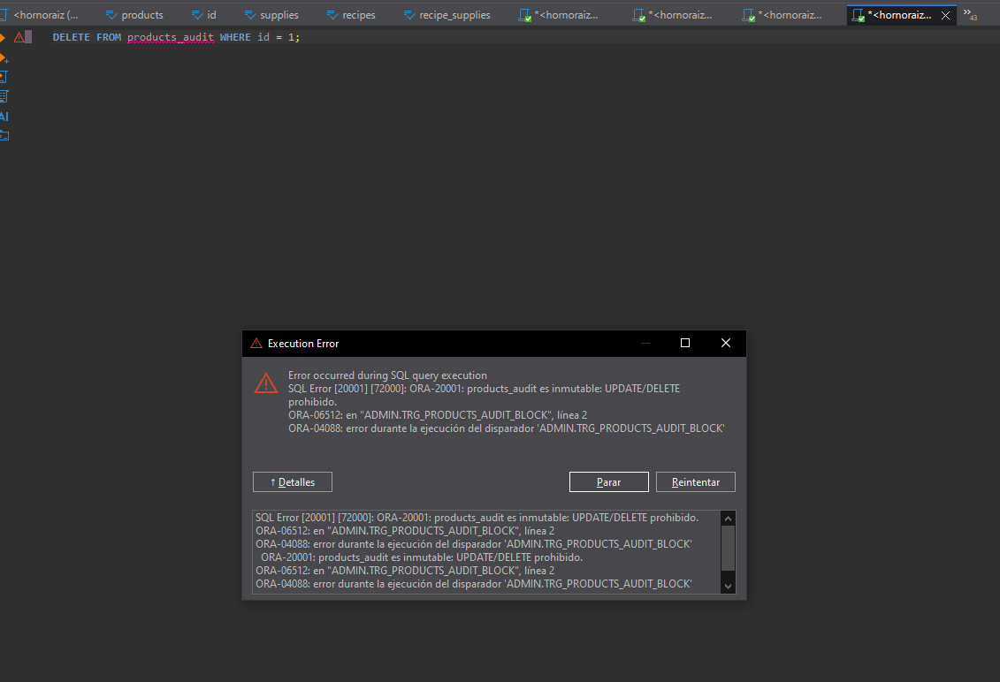

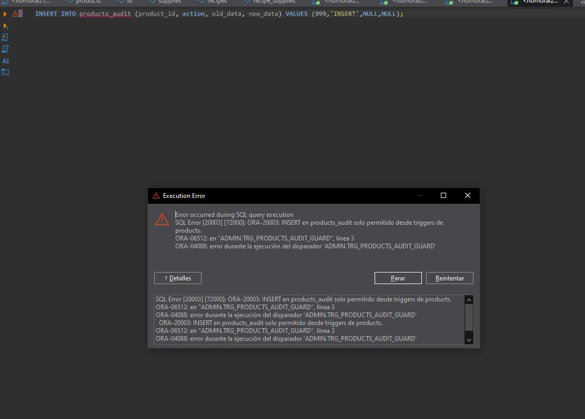

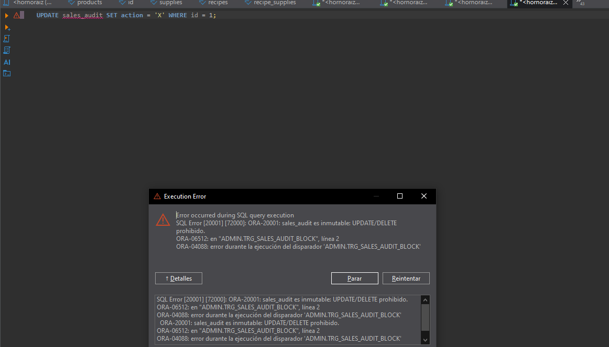

**Resultado:** los errores fueron `ORA-20001: products_audit es inmutable: UPDATE/DELETE prohibido.` (para el `UPDATE` y para el `DELETE`), `ORA-20003: INSERT en products_audit solo permitido desde triggers de products.` y `ORA-20001: sales_audit es inmutable: UPDATE/DELETE prohibido.`. Las pruebas de bloqueo se hicieron después de las de registro, porque el trigger actúa por fila: con la tabla de auditoría vacía, un `UPDATE` o `DELETE` no encuentra filas y no se dispara. Al final, `products` y `sales` quedaron con 100 filas cada una.

**Limitación.** La sentencia `TRUNCATE TABLE` es una instrucción de definición de datos y no dispara triggers de fila, así que no queda cubierta por esta protección. Puede ejecutarla el propietario de las tablas o cualquier usuario con el privilegio `DROP ANY TABLE`. Para cerrar ese hueco, las tablas de auditoría deberían pertenecer a un usuario distinto del que opera la aplicación.